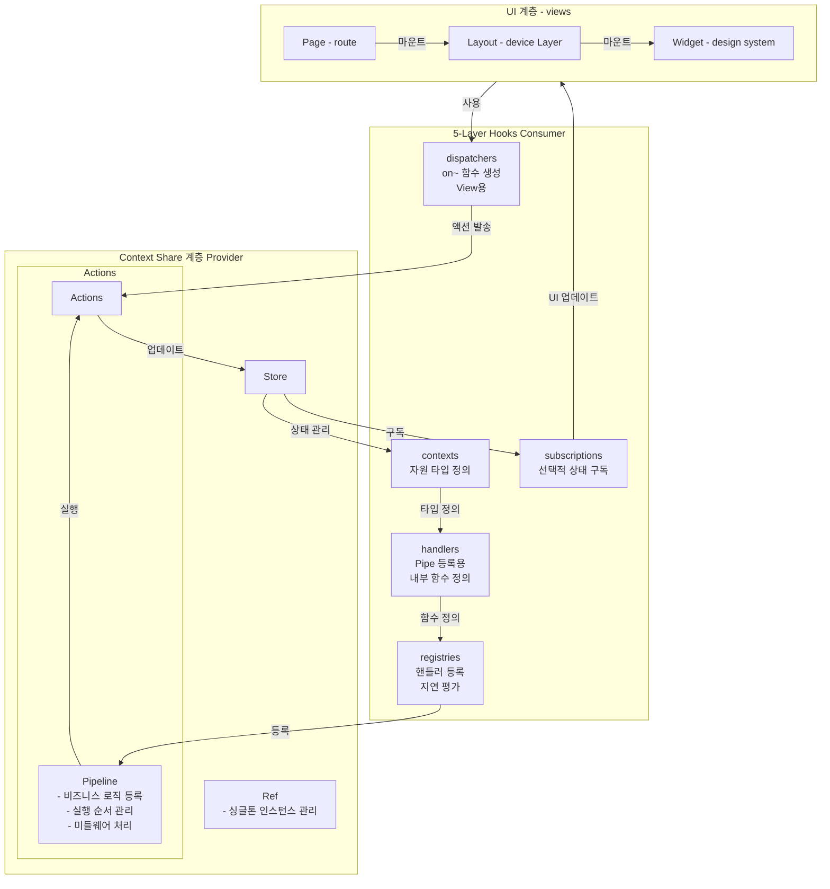
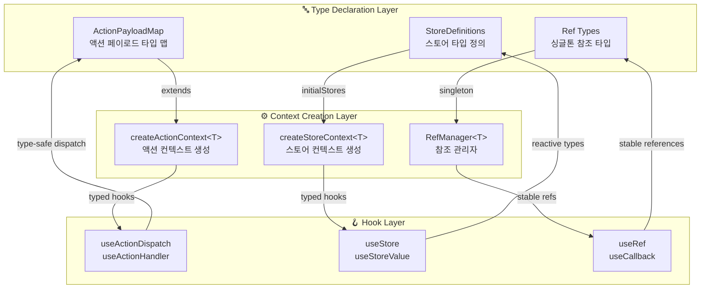

# Context-Action Framework

[](https://www.npmjs.com/package/@context-action/react)
[](https://www.typescriptlang.org/)
[](LICENSE)
[](https://github.com/mineclover/context-action/actions)

**Revolutionary TypeScript state management with document-centric context separation and MVVM architecture.**

**🎯 Perfect separation of concerns** • **🔒 Full type safety** • **⚡ Zero boilerplate** • **🏗️ Scalable architecture**

[📚 Documentation](https://mineclover.github.io/context-action/) • [🎮 Live Demo](https://mineclover.github.io/context-action/example/) • [🚀 Quick Start](#-quick-start)

---

## ⚡ Quick Start

### Installation
```bash
npm install @context-action/react
# or
npm install @context-action/core  # Pure TypeScript
```

### 30-Second Example
```typescript
import { createStoreContext, useStoreValue } from '@context-action/react';
import { useCallback } from 'react';

// 1. Create context
const { Provider, useStore } = createStoreContext('User', {
  profile: { name: 'John', email: 'john@example.com' }
});

// 2. Use in component  
function UserProfile() {
  const profileStore = useStore('profile');
  const profile = useStoreValue(profileStore);
  
  return <h1>Welcome, {profile.name}!</h1>;
}

// 3. Wrap with provider
function App() {
  return (
    <Provider>
      <UserProfile />
    </Provider>
  );
}
```

**That's it!** 🎉 Full type safety, reactive updates, and clean architecture.

---

## 🎯 Why Context-Action?

### ❌ Problems with Existing Libraries
- **High React Coupling** → Difficult component modularization
- **Binary State Approach** → Poor scope-based separation  
- **Complex Boilerplate** → Verbose setup and maintenance

### ✅ Context-Action's Solution
- **🎯 Document-Centric Design** → Context separation based on domain boundaries
- **🏗️ MVVM Architecture** → Perfect separation: Model, ViewModel, View layers
- **🔒 Type-First Approach** → Zero runtime errors with full TypeScript support
- **⚡ Zero Boilerplate** → Minimal code, maximum functionality

### 🚀 Key Benefits
```typescript
// Before: Complex setup with multiple libraries
const store = createStore(reducer);
const dispatch = useDispatch();
const selector = useSelector(state => state.user);
const actions = bindActionCreators(userActions, dispatch);

// After: One line with Context-Action
const { profile, updateProfile } = useUserPage(); // All logic in hook
```

---

## 🏗️ Core Patterns

### 🏪 Store Pattern
**Pure state management with reactive subscriptions**

```typescript
const { Provider: UserStoreProvider, useStore: useUserStore } = createStoreContext('User', {
  profile: { name: '', email: '' },
  settings: { theme: 'light' }
});

function UserComponent() {
  const profileStore = useUserStore('profile');
  const profile = useStoreValue(profileStore);

  return <div>{profile.name}</div>;
}
```

### 🎯 Action Pattern  
**Pure action dispatching with business logic separation**

```typescript
interface UserActions extends ActionPayloadMap {
  updateProfile: { name: string; email: string };
  logout: void;
}

const { Provider, useActionDispatch, useActionHandler } =
  createActionContext<UserActions>('UserActions');

function UserLogic() {
  const updateProfileHandler = useCallback(async (payload) => {
    // Business logic here
    await updateUserAPI(payload);
  }, []);

  useActionHandler('updateProfile', updateProfileHandler);
  
  return null; // Logic component
}
```

### 🔗 Pattern Composition
**Combine patterns for complex applications**

```typescript
// MVVM Architecture
function App() {
  return (
    <UserActionProvider>     {/* ViewModel */}
      <UserStoreProvider>    {/* Model */}
        <UserLogic>          {/* Business Logic */}
          <UserProfile />    {/* View */}
        </UserLogic>
      </UserStoreProvider>
    </UserActionProvider>
  );
}
```

### 🏗️ 5-Layer Hooks Architecture

**Context-Action implements a sophisticated 5-layer hooks architecture that provides perfect separation of concerns and optimal performance through delayed evaluation.**



#### 🔄 Data Flow Principles

1. **Context Share 계층 (Provider)**
   - **Store**: Centralized state management with reactive subscriptions
   - **Actions/Pipeline**: Business logic registration and execution order management
   - **Ref**: Singleton instance management for performance optimization

2. **5-Layer Hooks 구조 (Consumer)**
   - **contexts**: Resource type definitions and context access
   - **handlers**: Internal function definitions for pipeline registration
   - **subscriptions**: Selective state subscriptions for UI updates
   - **registries**: Handler registration with delayed evaluation
   - **dispatchers**: View-oriented action dispatchers (`on~` functions)

3. **UI 계층 (Views)**
   - **Page**: Route-level components
   - **Layout**: Device-specific layout components
   - **Widget**: Design system components

#### ⚡ Performance Benefits

- **Delayed Evaluation**: Handlers access latest state via `store.getValue()`
- **Selective Subscriptions**: Components subscribe only to needed state slices
- **Minimal Re-renders**: Optimized dependency tracking prevents unnecessary updates
- **Singleton Management**: Ref layer ensures efficient resource sharing

```typescript
// 5-Layer Implementation Example
function UserPage() {
  // Layer 1: contexts - Resource type definitions
  const userStore = useUserStore('profile');

  // Layer 2: handlers - Internal function definitions
  const updateUserHandler = useCallback(async (payload) => {
    const currentUser = userStore.getValue(); // Delayed evaluation
    const updatedUser = { ...currentUser, ...payload };
    userStore.setValue(updatedUser);
  }, [userStore]);

  // Layer 3: subscriptions - Selective state subscriptions
  const user = useStoreValue(userStore);

  // Layer 4: registries - Handler registration
  useActionHandler('updateUser', updateUserHandler);

  // Layer 5: dispatchers - View-oriented action dispatchers
  const onUpdateUser = useActionDispatch('updateUser');

  return (
    <div>
      <h1>{user.name}</h1>
      <button onClick={() => onUpdateUser({ name: 'New Name' })}>
        Update User
      </button>
    </div>
  );
}
```

---

## 🔗 Type System Guidelines

**Context-Action implements a sophisticated type system that provides full TypeScript safety across Action, Store, and Ref connections with zero runtime overhead.**

### 🎯 Type Declaration Architecture



### ⚡ Type Connection Patterns

#### 1. **Action Type Declaration & Connection**
```typescript
// 1️⃣ Define Action Payload Types
interface UserActions extends ActionPayloadMap {
  updateProfile: { name: string; email: string; avatar?: File };
  deleteAccount: { confirmPassword: string };
  logout: void; // No payload
}

// 2️⃣ Create Typed Action Context
const {
  Provider: UserActionProvider,
  useActionDispatch: useUserAction,
  useActionHandler: useUserActionHandler
} = createActionContext<UserActions>('UserActions');

// 3️⃣ Type-Safe Handler Registration
function UserLogic() {
  // ✅ Payload automatically typed as { name: string; email: string; avatar?: File }
  useUserActionHandler('updateProfile', useCallback(async (payload) => {
    // payload.name ✅ string
    // payload.email ✅ string
    // payload.avatar ✅ File | undefined
    await updateUserAPI(payload);
  }, []));

  // ✅ Payload automatically typed as void
  useUserActionHandler('logout', useCallback(async () => {
    await clearSession();
  }, []));
}

// 4️⃣ Type-Safe Action Dispatching
function UserComponent() {
  const dispatch = useUserAction();

  return (
    <button onClick={() =>
      dispatch('updateProfile', {
        name: 'John',
        email: 'john@example.com'
        // ✅ TypeScript enforces correct payload shape
      })
    }>
      Update Profile
    </button>
  );
}
```

#### 2. **Store Type Declaration & Connection**
```typescript
// 1️⃣ Define Store Types (Two Approaches)

// Approach A: Simple Object Types
const { Provider, useStore } = createStoreContext('User', {
  profile: { name: '', email: '', isOnline: false }, // ✅ Type inferred
  settings: { theme: 'light' as const, notifications: true }, // ✅ const assertions
  preferences: { language: 'en', timezone: 'UTC' }
});

// Approach B: Explicit Store Configuration
interface UserStoreConfig {
  profile: StoreConfig<UserProfile>;
  settings: StoreConfig<UserSettings>;
  cache: StoreConfig<CacheData>; // ✅ With strategy configuration
}

const { Provider, useStore } = createStoreContext('User', {
  profile: { initialValue: { name: '', email: '' } },
  settings: { initialValue: { theme: 'light' }, strategy: 'shallow' },
  cache: { initialValue: new Map(), strategy: 'reference' }
} satisfies UserStoreConfig);

// 2️⃣ Type-Safe Store Access & Subscription
function UserProfile() {
  const profileStore = useStore('profile'); // ✅ Store<UserProfile>
  const profile = useStoreValue(profileStore); // ✅ UserProfile type

  // ✅ Type-safe store operations
  profileStore.setValue({ name: 'John', email: 'john@example.com', isOnline: true });
  profileStore.update(prev => ({ ...prev, isOnline: !prev.isOnline }));

  return <div>{profile.name}</div>; // ✅ profile.name is string
}
```

#### 3. **Ref Type Declaration & Singleton Management**
```typescript
// 1️⃣ Ref Type Declarations for Singleton Resources
interface AppRefs {
  apiClient: ApiClient;
  eventBus: EventBus;
  cache: LRUCache<string, any>;
}

// 2️⃣ Context with Ref Management
const {
  Provider: AppProvider,
  useStore,
  useRef: useAppRef
} = createStoreContext('App', {
  user: { name: '', email: '' },
  // ✅ Ref types managed alongside stores
}, {
  refs: {
    apiClient: () => new ApiClient(),
    eventBus: () => new EventBus(),
    cache: () => new LRUCache(1000)
  } as AppRefs
});

// 3️⃣ Type-Safe Ref Access
function ApiComponent() {
  const apiClient = useAppRef('apiClient'); // ✅ ApiClient type
  const userStore = useStore('user');

  const fetchUser = useCallback(async (id: string) => {
    // ✅ apiClient.get is typed method
    const userData = await apiClient.get(`/users/${id}`);
    userStore.setValue(userData);
  }, [apiClient, userStore]);

  return <button onClick={() => fetchUser('123')}>Fetch User</button>;
}
```

### 🛡️ Type Safety Benefits

#### **Compile-Time Validation**
- ✅ **Action Payload Validation**: Incorrect payload shapes caught at compile time
- ✅ **Store Type Consistency**: Store value types enforced across components
- ✅ **Ref Type Stability**: Singleton reference types maintained across re-renders
- ✅ **Hook Return Types**: All hooks return properly typed values and functions

#### **IntelliSense & Developer Experience**
- 🔍 **Auto-completion**: Full IntelliSense for action names, payload properties, store keys
- 🏷️ **Type Hints**: Hover information shows exact payload and store types
- ⚠️ **Error Prevention**: TypeScript prevents runtime errors before they happen
- 🔄 **Refactoring Safety**: Type-safe refactoring across the entire codebase

#### **Zero Runtime Overhead**
- ⚡ **Compile-Time Only**: All type information removed in production builds
- 📦 **No Type Libraries**: No runtime type checking dependencies
- 🎯 **Direct Performance**: Types guide optimization without runtime cost

### 📚 **Detailed Type System Documentation**

For comprehensive type system coverage, see our dedicated guides:

#### **English Documentation**
- **[📖 TypeScript Type Inference Guide](https://mineclover.github.io/context-action/en/guide/type-inference)** - Complete type inference overview
- **[🎯 Action Type System](https://mineclover.github.io/context-action/en/guide/patterns/action/type-system)** - ActionPayloadMap, pipeline controllers, and handler types
- **[🔧 Advanced Type Features](https://mineclover.github.io/context-action/en/guide/type-inference/advanced)** - Branded types, conditional processing, and utilities
- **[🛡️ Type Safety Best Practices](https://mineclover.github.io/context-action/en/guide/type-inference/best-practices)** - Essential recommendations and patterns

#### **Korean Documentation**
- **[🎯 액션 타입 시스템](https://mineclover.github.io/context-action/ko/guide/patterns/action/type-system)** - ActionPayloadMap, 타입 안전성, TypeScript 통합

#### **Core Type System Features**
- **Action Type Safety**: Complete `ActionPayloadMap` interface with pipeline controller types
- **Store Type Inference**: Automatic type inference from initial values with strategy support
- **Handler Configuration**: Type-safe handler registration with comprehensive options
- **Integration Patterns**: Store integration, async handling, and error management
- **Advanced Features**: Conditional types, branded types, and generic utilities

---

## 📋 API Reference

### Core Functions

#### `createStoreContext(name, stores)`
Create typed store context with reactive subscriptions.
```typescript
const { Provider, useStore } = createStoreContext('App', {
  user: { name: '', email: '' },
  settings: { theme: 'light' }
});
```

#### `createActionContext<T>(name)`  
Create typed action context with pipeline processing.
```typescript
interface Actions extends ActionPayloadMap {
  update: { id: string };
}
const { Provider, useActionDispatch } = createActionContext<Actions>('App');
```

### Essential Hooks

#### `useStoreValue(store)`
Subscribe to store changes with automatic re-renders.
```typescript
const userStore = useStore('user');
const user = useStoreValue(userStore); // Reactive subscription
```

#### `useActionHandler(action, handler)`
Register business logic handlers for actions.
```typescript
const updateProfileHandler = useCallback(async (payload) => {
  // Business logic here
}, []);

useActionHandler('updateProfile', updateProfileHandler);
```

#### `useActionDispatch()`
Dispatch actions to the pipeline.
```typescript
const dispatch = useActionDispatch();
dispatch('updateProfile', { name: 'John', email: 'john@example.com' });
```

---

## 🎮 Examples & Demos

### 🚀 Live Interactive Examples
**[Explore 20+ working examples →](https://mineclover.github.io/context-action/example/)**

#### 🏪 **Store System**
- [Store Basics](https://mineclover.github.io/context-action/example/#/store-basic) - Fundamental operations
- [Store Full Demo](https://mineclover.github.io/context-action/example/#/store-full-demo) - Complex state management
- [Declarative Pattern](https://mineclover.github.io/context-action/example/#/store-declarative-pattern) - Type-safe patterns

#### 🎯 **Action System** 
- [Core Features](https://mineclover.github.io/context-action/example/#/action-core-features) - Pipeline fundamentals
- [Action Guards](https://mineclover.github.io/context-action/example/#/action-guard-search) - Advanced filtering
- [Priority System](https://mineclover.github.io/context-action/example/#/action-priority-performance) - Performance optimization

#### 🔗 **MVVM Architecture**
- [Unified Pattern](https://mineclover.github.io/context-action/example/#/unified-pattern-demo) - Complete MVVM demo
- [Enhanced Context](https://mineclover.github.io/context-action/example/#/enhanced-context-store) - Advanced patterns

### 📖 Real-World Examples
```typescript
// E-commerce Cart System
const CartStores = createStoreContext('Cart', {
  items: [] as CartItem[],
  total: 0,
  shipping: { method: 'standard', cost: 0 }
});

// User Management System  
interface UserActions extends ActionPayloadMap {
  login: { email: string; password: string };
  updateProfile: Partial<UserProfile>;
  logout: void;
}
```

### 🔍 **New in v0.7.0: Enhanced LogMonitor Documentation**
- **[📊 Logger System Demo](https://mineclover.github.io/context-action/example/#/logger-demo)** - Interactive LogMonitor showcase
- **Real-time log collection** - Live demo with practical examples
- **Integration patterns** - Parent/Child handler implementations
- **Dependency warnings** - Avoid infinite loops with best practices

---

## 📚 Documentation

### 📖 Complete Guides
- **[📚 Official Documentation](https://mineclover.github.io/context-action/)** - Complete API reference
- **[🚀 Getting Started Guide](https://mineclover.github.io/context-action/en/guide/getting-started)** - 5-minute setup
- **[🏗️ MVVM Core Architecture](https://mineclover.github.io/context-action/en/concept/mvvm-core-architecture)** - Practical MVVM implementation guide
- **[📋 Architecture Overview](https://mineclover.github.io/context-action/en/concept/architecture-guide)** - Framework concepts
- **[⚡ Best Practices](https://mineclover.github.io/context-action/en/guide/best-practices)** - Production patterns

### 🌏 Multi-Language Support
- **[🇺🇸 English Documentation](https://mineclover.github.io/context-action/en/)** - Complete English guides
- **[🇰🇷 한국어 문서](https://mineclover.github.io/context-action/ko/)** - 완전한 한국어 가이드

---

## 📦 Packages

### [@context-action/core](./packages/core)
**Pure TypeScript action pipeline** - Framework agnostic core
```bash
npm install @context-action/core
```
- 🔒 Full TypeScript support
- ⚡ Action pipeline system  
- 🛡️ Advanced action guards
- 🚫 Zero dependencies

### [@context-action/react](./packages/react)  
**React integration** - Complete MVVM architecture
```bash
npm install @context-action/react
```
- 🏪 Declarative store patterns
- 🎯 Action context integration
- 🪝 Advanced React hooks
- 🏗️ HOC support

---

## 🛠️ Development

### Quick Development Setup
```bash
git clone https://github.com/mineclover/context-action.git
cd context-action
pnpm install
pnpm dev  # Start example app
```

### Project Resources
- **[🤝 Contributing Guide](./CONTRIBUTING.md)** - How to contribute
- **[🌐 Ecosystem](./ECOSYSTEM.md)** - Tools and generators  
- **[🛠️ Development Guide](./DEVELOPMENT.md)** - Detailed development setup

---

## 📄 License

Apache-2.0 © [mineclover](https://github.com/mineclover)

---

<div align="center">

**Built with ❤️ for modern TypeScript applications**

[⭐ Star on GitHub](https://github.com/mineclover/context-action) • [🐛 Report Bug](https://github.com/mineclover/context-action/issues) • [💡 Request Feature](https://github.com/mineclover/context-action/discussions)

</div>