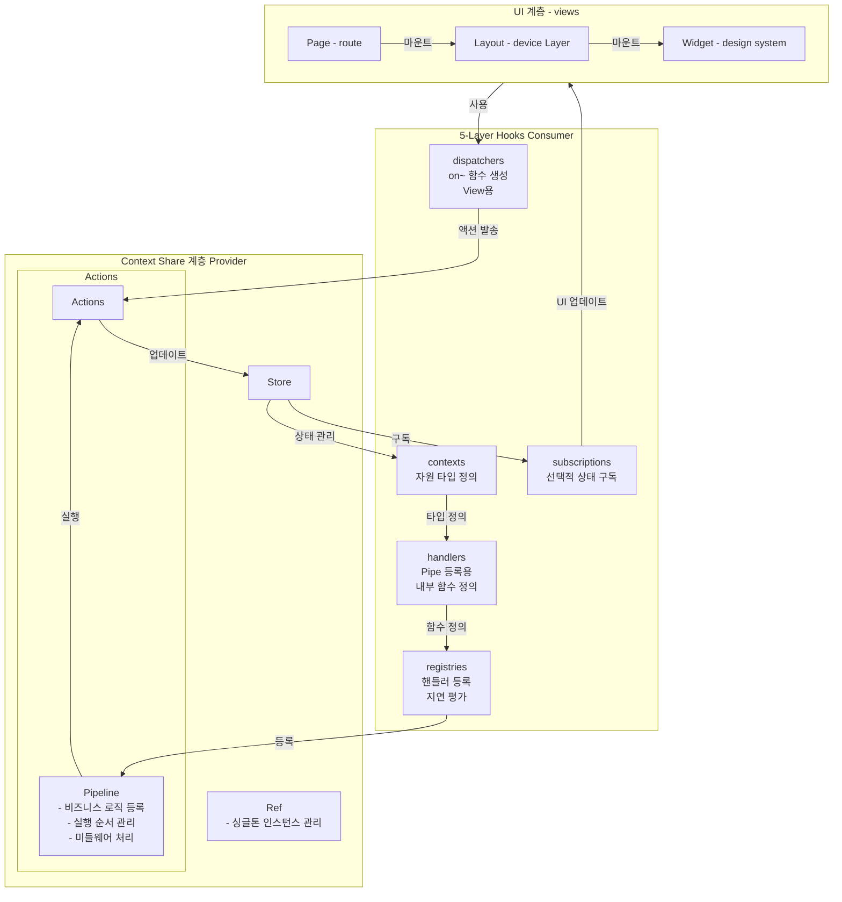
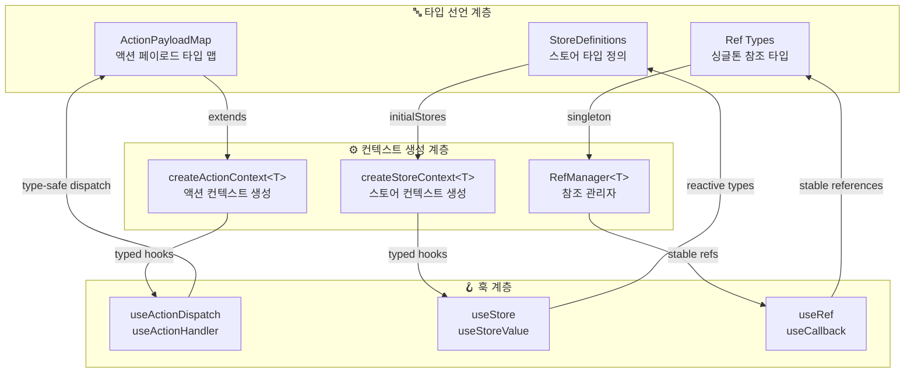

# Context-Action 프레임워크

[](https://www.npmjs.com/package/@context-action/react)
[](https://www.typescriptlang.org/)
[](LICENSE)
[](https://github.com/mineclover/context-action/actions)

**문서 중심의 컨텍스트 분리와 MVVM 아키텍처를 갖춘 혁신적인 TypeScript 상태 관리 라이브러리**

**🎯 완벽한 관심사 분리** • **🔒 완전한 타입 안전성** • **⚡ 제로 보일러플레이트** • **🏗️ 확장 가능한 아키텍처** • **🌐 바닐라 JS 지원**

[📚 문서](https://mineclover.github.io/context-action/ko/) • [🎮 라이브 데모](https://mineclover.github.io/context-action/example/) • [⚡ Web Coding Studio](https://mineclover.github.io/context-action/web-coding/) • [🚀 빠른 시작](#-빠른-시작) • [🌟 바닐라 JS](#-바닐라-자바스크립트)

---

## ⚡ 빠른 시작

### 설치

```bash
# React 애플리케이션
npm install @context-action/react

# 바닐라 JavaScript/TypeScript (프레임워크 불필요)
npm install @context-action/core

# CDN (빠른 프로토타이핑)
# <script type="module">
#   import { ActionRegister } from 'https://esm.sh/@context-action/core@latest';
# </script>
```

### 30초 예제 (React)

```typescript
import { createStoreContext, useStoreValue } from '@context-action/react';
import { useCallback } from 'react';

// 1. 컨텍스트 생성
const { Provider, useStore } = createStoreContext('User', {
  profile: { name: 'John', email: 'john@example.com' }
});

// 2. 컴포넌트에서 사용
function UserProfile() {
  const profileStore = useStore('profile');
  const profile = useStoreValue(profileStore);

  return <h1>환영합니다, {profile.name}님!</h1>;
}

// 3. 프로바이더로 감싸기
function App() {
  return (
    <Provider>
      <UserProfile />
    </Provider>
  );
}
```

**끝!** 🎉 완전한 타입 안전성, 반응형 업데이트, 깔끔한 아키텍처.

### 30초 예제 (바닐라 JS)

```html
<!DOCTYPE html>
<html>
<body>
  <div id="counter">0</div>
  <button id="increment">증가</button>

  <script type="module">
    import { ActionRegister } from 'https://esm.sh/@context-action/core@latest';

    // 간단한 스토어
    class Store {
      constructor(initialState) {
        this.state = initialState;
        this.listeners = new Set();
      }
      getValue() { return this.state; }
      setValue(newState) {
        this.state = newState;
        this.listeners.forEach(fn => fn(this.state));
      }
      subscribe(listener) {
        this.listeners.add(listener);
        return () => this.listeners.delete(listener);
      }
    }

    // 스토어와 액션 생성
    const store = new Store({ count: 0 });
    const actions = new ActionRegister({ name: 'Counter' });

    // 핸들러 등록
    actions.register('increment', () => {
      const current = store.getValue();
      store.setValue({ count: current.count + 1 });
    });

    // 구독 및 연결
    store.subscribe(state => {
      document.getElementById('counter').textContent = state.count;
    });
    document.getElementById('increment').onclick = () => {
      actions.dispatch('increment');
    };
  </script>
</body>
</html>
```

**📚 [완전한 바닐라 JS 가이드](./docs/ko/guide/vanilla-js-guide.md)** • **[인터랙티브 예제](./examples/vanilla-js/)**

---

## 🧭 첫 추천 학습 경로

개별 API를 따로 보기보다, 현재 저장소가 권장하는 표준을 한 번에 이해하고 싶다면 **Implementation Playbook 경로**부터 시작하는 것이 가장 좋습니다.

- **표준 컨벤션**: [Implementation Convention](https://mineclover.github.io/context-action/ko/context-layered/implementation-convention)
- **Tool-calling 컨벤션**: [Tool Calling Web Studio 컨벤션](https://mineclover.github.io/context-action/ko/context-layered/usecase-tool-calling-web-studio)
- **canonical example**: [Canonical Order Form](https://mineclover.github.io/context-action/ko/examples/canonical-order-form)
- **시나리오 라이브러리**: [Playbook 시나리오 라이브러리](https://mineclover.github.io/context-action/ko/examples/implementation-playbook-scenarios)
- **라이브 데모**:
  - [Canonical Order](https://mineclover.github.io/context-action/example/patterns/implementation-playbook)
  - [Access Request](https://mineclover.github.io/context-action/example/patterns/implementation-playbook/access-request)
  - [Incident Escalation](https://mineclover.github.io/context-action/example/patterns/implementation-playbook/incident-escalation)
  - [Renewal Risk Review](https://mineclover.github.io/context-action/example/patterns/implementation-playbook/renewal-risk-review)
- **Tool-calling 데모**:
  - [Realtime web-coding showcase](https://mineclover.github.io/context-action/example/integrations/live-web-coding)
  - [Standalone Web Coding Studio](https://mineclover.github.io/context-action/web-coding/)
- **repo-local skill**: `skills/context-action-implementation-playbook/SKILL.md`
- **검증 명령**:
  - `node scripts/verify-context-action-conventions.mjs`
  - `pnpm test:canonical-example`
  - `pnpm --dir packages/react test -- --runInBand __tests__/patterns/access-request-playbook.integration.test.tsx`
  - `pnpm --dir packages/react test -- --runInBand __tests__/patterns/incident-escalation-playbook.integration.test.tsx`
  - `pnpm --dir packages/react test -- --runInBand __tests__/patterns/renewal-risk-review-playbook.integration.test.tsx`

이 경로를 따라가면 Action, Store, Ref 경계뿐 아니라, 표준 컨벤션, skill, canonical example, 그리고 3개의 도메인 시나리오 데모까지 한 번에 확인할 수 있습니다.

---

## 🎯 왜 Context-Action인가?

### ❌ 기존 라이브러리의 문제점
- **높은 React 결합도** → 컴포넌트 모듈화 어려움
- **이진 상태 접근법** → 범위 기반 분리 부족
- **복잡한 보일러플레이트** → 장황한 설정과 유지보수

### ✅ Context-Action의 해결책
- **🎯 문서 중심 설계** → 도메인 경계를 기반으로 한 컨텍스트 분리
- **🏗️ MVVM 아키텍처** → 완벽한 분리: Model, ViewModel, View 레이어
- **🔒 타입 우선 접근법** → 완전한 TypeScript 지원으로 런타임 오류 제로
- **⚡ 제로 보일러플레이트** → 최소한의 코드, 최대한의 기능

### 🚀 주요 이점

```typescript
// 기존: 여러 라이브러리로 복잡한 설정
const store = createStore(reducer);
const dispatch = useDispatch();
const selector = useSelector(state => state.user);
const actions = bindActionCreators(userActions, dispatch);

// Context-Action: 한 줄로 모든 로직
const { profile, updateProfile } = useUserPage(); // 모든 로직이 훅 안에
```

---

## 🏗️ 핵심 패턴

### 🏪 스토어 패턴
**반응형 구독을 갖춘 순수 상태 관리**

```typescript
const { Provider: UserStoreProvider, useStore: useUserStore } = createStoreContext('User', {
  profile: { name: '', email: '' },
  settings: { theme: 'light' }
});

function UserComponent() {
  const profileStore = useUserStore('profile');
  const profile = useStoreValue(profileStore);

  return <div>{profile.name}</div>;
}
```

### 🎯 액션 패턴
**비즈니스 로직 분리를 갖춘 순수 액션 디스패칭**

```typescript
interface UserActions extends ActionPayloadMap {
  updateProfile: { name: string; email: string };
  logout: void;
}

const { Provider, useActionDispatch, useActionHandler } =
  createActionContext<UserActions>('UserActions');

function UserLogic() {
  const updateProfileHandler = useCallback(async (payload) => {
    // 비즈니스 로직
    await updateUserAPI(payload);
  }, []);

  useActionHandler('updateProfile', updateProfileHandler);

  return null; // 로직 컴포넌트
}
```

### 🔗 패턴 조합
**복잡한 애플리케이션을 위한 패턴 결합**

```typescript
// MVVM 아키텍처
function App() {
  return (
    <UserActionProvider>     {/* ViewModel */}
      <UserStoreProvider>    {/* Model */}
        <UserLogic>          {/* 비즈니스 로직 */}
          <UserProfile />    {/* View */}
        </UserLogic>
      </UserStoreProvider>
    </UserActionProvider>
  );
}
```

### 🏗️ 5계층 훅 아키텍처

**Context-Action은 관심사의 완벽한 분리와 지연 평가를 통한 최적의 성능을 제공하는 정교한 5계층 훅 아키텍처를 구현합니다.**



#### 🔄 데이터 플로우 원칙

1. **Context Share 계층 (Provider)**
   - **Store**: 반응형 구독을 갖춘 중앙집중식 상태 관리
   - **Actions/Pipeline**: 비즈니스 로직 등록 및 실행 순서 관리
   - **Ref**: 성능 최적화를 위한 싱글톤 인스턴스 관리

2. **5계층 훅 구조 (Consumer)**
   - **contexts**: 자원 타입 정의 및 컨텍스트 접근
   - **handlers**: 파이프라인 등록을 위한 내부 함수 정의
   - **subscriptions**: UI 업데이트를 위한 선택적 상태 구독
   - **registries**: 지연 평가를 갖춘 핸들러 등록
   - **dispatchers**: 뷰 지향 액션 디스패처 (`on~` 함수들)

3. **UI 계층 (Views)**
   - **Page**: 라우트 레벨 컴포넌트
   - **Layout**: 디바이스별 레이아웃 컴포넌트
   - **Widget**: 디자인 시스템 컴포넌트

#### ⚡ 성능 이점

- **지연 평가**: 핸들러가 `store.getValue()`를 통해 최신 상태에 접근
- **선택적 구독**: 컴포넌트가 필요한 상태 조각만 구독
- **최소 리렌더링**: 최적화된 의존성 추적으로 불필요한 업데이트 방지
- **싱글톤 관리**: Ref 레이어가 효율적인 리소스 공유 보장

```typescript
// 5계층 구현 예제
function UserPage() {
  // 1계층: contexts - 자원 타입 정의
  const userStore = useUserStore('profile');

  // 2계층: handlers - 내부 함수 정의
  const updateUserHandler = useCallback(async (payload) => {
    const currentUser = userStore.getValue(); // 지연 평가
    const updatedUser = { ...currentUser, ...payload };
    userStore.setValue(updatedUser);
  }, [userStore]);

  // 3계층: subscriptions - 선택적 상태 구독
  const user = useStoreValue(userStore);

  // 4계층: registries - 핸들러 등록
  useActionHandler('updateUser', updateUserHandler);

  // 5계층: dispatchers - 뷰 지향 액션 디스패처
  const onUpdateUser = useActionDispatch('updateUser');

  return (
    <div>
      <h1>{user.name}</h1>
      <button onClick={() => onUpdateUser({ name: '새 이름' })}>
        사용자 업데이트
      </button>
    </div>
  );
}
```

---

## 🔗 타입 시스템 가이드라인

**Context-Action은 Action, Store, Ref 연결 전반에 걸쳐 완전한 TypeScript 안전성을 제공하며 런타임 오버헤드가 없는 정교한 타입 시스템을 구현합니다.**

### 🎯 타입 선언 아키텍처



### ⚡ 타입 연결 패턴

#### 1. **액션 타입 선언 및 연결**

```typescript
// 1️⃣ 액션 페이로드 타입 정의
interface UserActions extends ActionPayloadMap {
  updateProfile: { name: string; email: string; avatar?: File };
  deleteAccount: { confirmPassword: string };
  logout: void; // 페이로드 없음
}

// 2️⃣ 타입화된 액션 컨텍스트 생성
const {
  Provider: UserActionProvider,
  useActionDispatch: useUserAction,
  useActionHandler: useUserActionHandler
} = createActionContext<UserActions>('UserActions');

// 3️⃣ 타입 안전 핸들러 등록
function UserLogic() {
  // ✅ 페이로드가 자동으로 { name: string; email: string; avatar?: File }로 타입화됨
  useUserActionHandler('updateProfile', useCallback(async (payload) => {
    // payload.name ✅ string
    // payload.email ✅ string
    // payload.avatar ✅ File | undefined
    await updateUserAPI(payload);
  }, []));

  // ✅ 페이로드가 자동으로 void로 타입화됨
  useUserActionHandler('logout', useCallback(async () => {
    await clearSession();
  }, []));
}

// 4️⃣ 타입 안전 액션 디스패칭
function UserComponent() {
  const dispatch = useUserAction();

  return (
    <button onClick={() =>
      dispatch('updateProfile', {
        name: 'John',
        email: 'john@example.com'
        // ✅ TypeScript가 올바른 페이로드 형태를 강제함
      })
    }>
      프로필 업데이트
    </button>
  );
}
```

#### 2. **스토어 타입 선언 및 연결**

```typescript
// 1️⃣ 스토어 타입 정의 (두 가지 접근법)

// 접근법 A: 단순 객체 타입
const { Provider, useStore } = createStoreContext('User', {
  profile: { name: '', email: '', isOnline: false }, // ✅ 타입 추론
  settings: { theme: 'light' as const, notifications: true }, // ✅ const 단언
  preferences: { language: 'ko', timezone: 'Asia/Seoul' }
});

// 접근법 B: 명시적 스토어 구성
interface UserStoreConfig {
  profile: StoreConfig<UserProfile>;
  settings: StoreConfig<UserSettings>;
  cache: StoreConfig<CacheData>; // ✅ 전략 구성 포함
}

const { Provider, useStore } = createStoreContext('User', {
  profile: { initialValue: { name: '', email: '' } },
  settings: { initialValue: { theme: 'light' }, strategy: 'shallow' },
  cache: { initialValue: new Map(), strategy: 'reference' }
} satisfies UserStoreConfig);

// 2️⃣ 타입 안전 스토어 접근 및 구독
function UserProfile() {
  const profileStore = useStore('profile'); // ✅ Store<UserProfile>
  const profile = useStoreValue(profileStore); // ✅ UserProfile 타입

  // ✅ 타입 안전 스토어 작업
  profileStore.setValue({ name: 'John', email: 'john@example.com', isOnline: true });
  profileStore.update(prev => ({ ...prev, isOnline: !prev.isOnline }));

  return <div>{profile.name}</div>; // ✅ profile.name은 string
}
```

#### 3. **Ref 타입 선언 및 싱글톤 관리**

```typescript
// 1️⃣ 싱글톤 리소스를 위한 Ref 타입 선언
interface AppRefs {
  apiClient: ApiClient;
  eventBus: EventBus;
  cache: LRUCache<string, any>;
}

// 2️⃣ Ref 관리를 갖춘 컨텍스트
const {
  Provider: AppProvider,
  useStore,
  useRef: useAppRef
} = createStoreContext('App', {
  user: { name: '', email: '' },
  // ✅ 스토어와 함께 관리되는 Ref 타입
}, {
  refs: {
    apiClient: () => new ApiClient(),
    eventBus: () => new EventBus(),
    cache: () => new LRUCache(1000)
  } as AppRefs
});

// 3️⃣ 타입 안전 Ref 접근
function ApiComponent() {
  const apiClient = useAppRef('apiClient'); // ✅ ApiClient 타입
  const userStore = useStore('user');

  const fetchUser = useCallback(async (id: string) => {
    // ✅ apiClient.get은 타입화된 메서드
    const userData = await apiClient.get(`/users/${id}`);
    userStore.setValue(userData);
  }, [apiClient, userStore]);

  return <button onClick={() => fetchUser('123')}>사용자 가져오기</button>;
}
```

### 🛡️ 타입 안전성 이점

#### **컴파일 타임 검증**
- ✅ **액션 페이로드 검증**: 잘못된 페이로드 형태를 컴파일 시점에 감지
- ✅ **스토어 타입 일관성**: 컴포넌트 전반에 걸쳐 스토어 값 타입 강제
- ✅ **Ref 타입 안정성**: 리렌더링에 걸쳐 싱글톤 참조 타입 유지
- ✅ **훅 반환 타입**: 모든 훅이 적절히 타입화된 값과 함수 반환

#### **IntelliSense 및 개발자 경험**
- 🔍 **자동 완성**: 액션명, 페이로드 속성, 스토어 키에 대한 완전한 IntelliSense
- 🏷️ **타입 힌트**: 호버 정보로 정확한 페이로드 및 스토어 타입 표시
- ⚠️ **오류 방지**: TypeScript가 런타임 오류를 사전에 방지
- 🔄 **리팩토링 안전성**: 전체 코드베이스에 걸친 타입 안전 리팩토링

#### **제로 런타임 오버헤드**
- ⚡ **컴파일 타임 전용**: 모든 타입 정보는 프로덕션 빌드에서 제거
- 📦 **타입 라이브러리 없음**: 런타임 타입 체킹 의존성 없음
- 🎯 **직접적인 성능**: 타입이 런타임 비용 없이 최적화 가이드

### 📚 **상세 타입 시스템 문서**

포괄적인 타입 시스템 커버리지는 전용 가이드를 참조하세요:

#### **한국어 문서**
- **[🎯 액션 타입 시스템](https://mineclover.github.io/context-action/ko/guide/patterns/action/type-system)** - ActionPayloadMap, 타입 안전성, TypeScript 통합

#### **영어 문서**
- **[📖 TypeScript Type Inference Guide](https://mineclover.github.io/context-action/en/guide/type-inference)** - 완전한 타입 추론 개요
- **[🎯 Action Type System](https://mineclover.github.io/context-action/en/guide/patterns/action/type-system)** - ActionPayloadMap, 파이프라인 컨트롤러, 핸들러 타입
- **[🔧 Advanced Type Features](https://mineclover.github.io/context-action/en/guide/type-inference/advanced)** - 브랜드 타입, 조건부 처리, 유틸리티
- **[🛡️ Type Safety Best Practices](https://mineclover.github.io/context-action/en/guide/type-inference/best-practices)** - 필수 권장사항과 패턴

#### **핵심 타입 시스템 기능**
- **액션 타입 안전성**: 파이프라인 컨트롤러 타입을 갖춘 완전한 `ActionPayloadMap` 인터페이스
- **스토어 타입 추론**: 전략 지원을 갖춘 초기값으로부터의 자동 타입 추론
- **핸들러 구성**: 포괄적인 옵션을 갖춘 타입 안전 핸들러 등록
- **통합 패턴**: 스토어 통합, 비동기 처리, 오류 관리
- **고급 기능**: 조건부 타입, 브랜드 타입, 제네릭 유틸리티

---

## 📋 API 참조

### 핵심 함수

#### `createStoreContext(name, stores)`
반응형 구독을 갖춘 타입화된 스토어 컨텍스트 생성.
```typescript
const { Provider, useStore } = createStoreContext('App', {
  user: { name: '', email: '' },
  settings: { theme: 'light' }
});
```

#### `createActionContext<T>(name)`
파이프라인 처리를 갖춘 타입화된 액션 컨텍스트 생성.
```typescript
interface Actions extends ActionPayloadMap {
  update: { id: string };
}
const { Provider, useActionDispatch } = createActionContext<Actions>('App');
```

### 필수 훅

#### `useStoreValue(store)`
자동 리렌더링과 함께 스토어 변경사항 구독.
```typescript
const userStore = useStore('user');
const user = useStoreValue(userStore); // 반응형 구독
```

#### `useActionHandler(action, handler)`
액션을 위한 비즈니스 로직 핸들러 등록.
```typescript
const updateProfileHandler = useCallback(async (payload) => {
  // 비즈니스 로직
}, []);

useActionHandler('updateProfile', updateProfileHandler);
```

#### `useActionDispatch()`
파이프라인에 액션 디스패치.
```typescript
const dispatch = useActionDispatch();
dispatch('updateProfile', { name: 'John', email: 'john@example.com' });
```

---

## 🎮 예제 및 데모

### 🌟 바닐라 자바스크립트

**[📁 인터랙티브 바닐라 JS 예제](./examples/vanilla-js/)** - 빌드 도구 불필요!

- **[기본 카운터](./examples/vanilla-js/basic-counter.html)** - 비동기 작업이 있는 간단한 카운터
- **[Todo 앱](./examples/vanilla-js/todo-app.html)** - 완전한 기능의 Todo 애플리케이션
- **[완전한 가이드](./docs/ko/guide/vanilla-js-guide.md)** - 5가지 실전 패턴과 예제

브라우저에서 HTML 파일을 바로 열거나 다음을 실행하세요:
```bash
npx serve examples/vanilla-js
# 그리고 방문: http://localhost:3000/basic-counter.html
```

### 🚀 React 라이브 예제
**[20개 이상의 실제 예제 탐색 →](https://mineclover.github.io/context-action/example/)**

#### 🏪 **스토어 시스템**
- [스토어 기초](https://mineclover.github.io/context-action/example/#/store-basic) - 기본 작업
- [스토어 전체 데모](https://mineclover.github.io/context-action/example/#/store-full-demo) - 복잡한 상태 관리
- [선언적 패턴](https://mineclover.github.io/context-action/example/#/store-declarative-pattern) - 타입 안전 패턴

#### 🎯 **액션 시스템**
- [핵심 기능](https://mineclover.github.io/context-action/example/#/action-core-features) - 파이프라인 기본
- [액션 가드](https://mineclover.github.io/context-action/example/#/action-guard-search) - 고급 필터링
- [우선순위 시스템](https://mineclover.github.io/context-action/example/#/action-priority-performance) - 성능 최적화

#### 🔗 **MVVM 아키텍처**
- [통합 패턴](https://mineclover.github.io/context-action/example/#/unified-pattern-demo) - 완전한 MVVM 데모
- [향상된 컨텍스트](https://mineclover.github.io/context-action/example/#/enhanced-context-store) - 고급 패턴

### 📖 실제 예제

```typescript
// 전자상거래 장바구니 시스템
const CartStores = createStoreContext('Cart', {
  items: [] as CartItem[],
  total: 0,
  shipping: { method: 'standard', cost: 0 }
});

// 사용자 관리 시스템
interface UserActions extends ActionPayloadMap {
  login: { email: string; password: string };
  updateProfile: Partial<UserProfile>;
  logout: void;
}
```

### 🔍 **v0.7.0 신기능: 향상된 LogMonitor 문서**
- **[📊 로거 시스템 데모](https://mineclover.github.io/context-action/example/#/logger-demo)** - 인터랙티브 LogMonitor 쇼케이스
- **실시간 로그 수집** - 실용적인 예제가 포함된 라이브 데모
- **통합 패턴** - 부모/자식 핸들러 구현
- **의존성 경고** - 모범 사례로 무한 루프 방지

---

## 📚 문서

### 📖 완전한 가이드
- **[📚 공식 문서](https://mineclover.github.io/context-action/ko/)** - 완전한 API 참조
- **[🚀 시작하기 가이드](https://mineclover.github.io/context-action/ko/guide/getting-started)** - 5분 설정
- **[🏗️ MVVM 핵심 아키텍처](https://mineclover.github.io/context-action/ko/concept/mvvm-core-architecture)** - 실용적인 MVVM 구현 가이드
- **[📋 아키텍처 개요](https://mineclover.github.io/context-action/ko/concept/architecture-guide)** - 프레임워크 개념
- **[⚡ 모범 사례](https://mineclover.github.io/context-action/ko/guide/best-practices)** - 프로덕션 패턴

### 🌏 다국어 지원
- **[🇰🇷 한국어 문서](https://mineclover.github.io/context-action/ko/)** - 완전한 한국어 가이드
- **[🇺🇸 English Documentation](https://mineclover.github.io/context-action/en/)** - Complete English guides

---

## 📦 패키지

### [@context-action/core](./packages/core)
**순수 TypeScript 액션 파이프라인** - ⭐ **프레임워크 독립적** (바닐라 JS, React, Vue, Svelte 등)
```bash
npm install @context-action/core
# 또는 CDN 사용
# https://esm.sh/@context-action/core@latest
```
- 🌐 **바닐라 JavaScript 지원** - 프레임워크 불필요!
- 🔒 완전한 TypeScript 지원
- ⚡ 우선순위 기반 실행을 갖춘 액션 파이프라인 시스템
- 🛡️ 고급 액션 가드 (디바운싱, 쓰로틀링, 필터링)
- 🚫 의존성 없음
- 📚 **[바닐라 JS 가이드](./docs/ko/guide/vanilla-js-guide.md)** | **[인터랙티브 예제](./examples/vanilla-js/)**

### [@context-action/react](./packages/react)
**React 통합** - 완전한 MVVM 아키텍처
```bash
npm install @context-action/react
```
- 🏪 선언적 스토어 패턴
- 🎯 액션 컨텍스트 통합
- 🪝 고급 React 훅
- 🏗️ HOC 지원

---

## 🛠️ 개발

### 빠른 개발 설정
```bash
git clone https://github.com/mineclover/context-action.git
cd context-action
pnpm install
pnpm dev  # 예제 앱 시작
```

### 프로젝트 리소스
- **[🤝 기여 가이드](./CONTRIBUTING.md)** - 기여 방법
- **[🌐 생태계](./ECOSYSTEM.md)** - 도구와 생성기
- **[🛠️ 개발 가이드](./DEVELOPMENT.md)** - 상세한 개발 설정

---

## 📄 라이선스

Apache-2.0 © [mineclover](https://github.com/mineclover)

---

<div align="center">

**현대적인 TypeScript 애플리케이션을 위해 ❤️으로 제작**

[⭐ GitHub에서 스타하기](https://github.com/mineclover/context-action) • [🐛 버그 신고](https://github.com/mineclover/context-action/issues) • [💡 기능 요청](https://github.com/mineclover/context-action/discussions)

</div>
