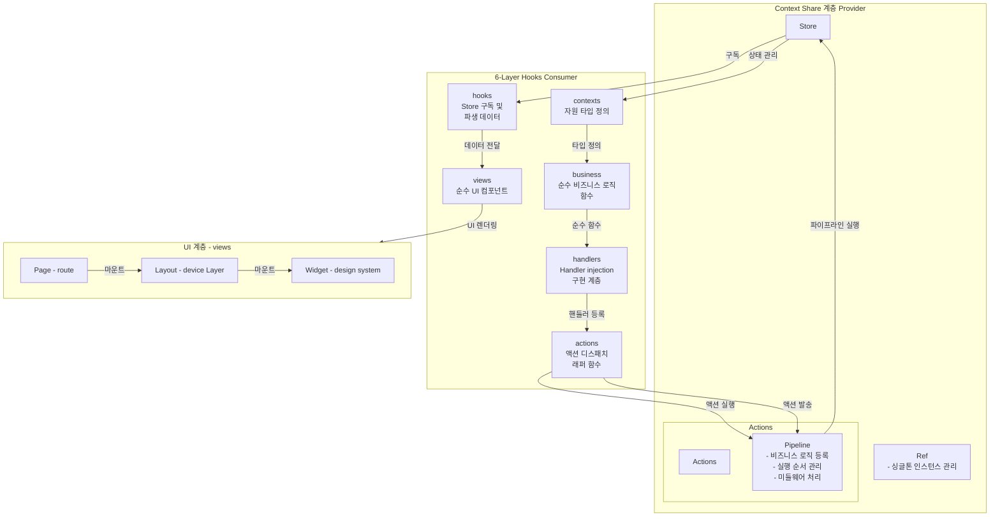
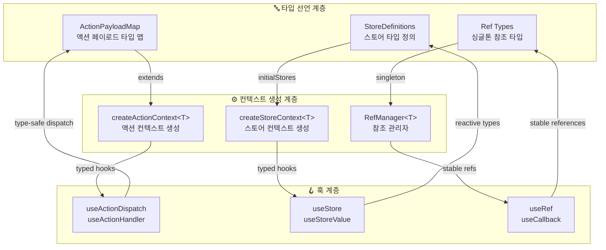

# Context-Action 프레임워크

[](https://www.npmjs.com/package/@context-action/react)
[](https://www.typescriptlang.org/)
[](LICENSE)
[](https://github.com/mineclover/context-action/actions)

**문서 중심의 컨텍스트 분리와 MVVM 아키텍처를 갖춘 혁신적인 TypeScript 상태 관리 라이브러리**

**🎯 완벽한 관심사 분리** • **🔒 완전한 타입 안전성** • **⚡ 제로 보일러플레이트** • **🏗️ 확장 가능한 아키텍처** • **🌐 바닐라 JS 지원**

[📚 문서](https://mineclover.github.io/context-action/ko/) • [🎮 라이브 데모](https://mineclover.github.io/context-action/example/) • [⚡ Web Coding Studio](https://mineclover.github.io/context-action/web-coding/) • [🚀 빠른 시작](#-빠른-시작) • [🌟 바닐라 JS](#-바닐라-자바스크립트)

---

## ⚡ 빠른 시작

### 설치

```bash
# React 애플리케이션
npm install @context-action/react

# 바닐라 JavaScript/TypeScript (프레임워크 불필요)
npm install @context-action/core

# CDN (빠른 프로토타이핑)
# <script type="module">
#   import { ActionRegister } from 'https://esm.sh/@context-action/core@latest';
# </script>
```

### 30초 예제 (React)

```typescript
import { createStoreContext, useStoreValue } from '@context-action/react';
import { useCallback } from 'react';

// 1. 컨텍스트 생성
const { Provider, useStore } = createStoreContext('User', {
  profile: { name: 'John', email: 'john@example.com' }
});

// 2. 컴포넌트에서 사용
function UserProfile() {
  const profileStore = useStore('profile');
  const profile = useStoreValue(profileStore);

  return <h1>환영합니다, {profile.name}님!</h1>;
}

// 3. 프로바이더로 감싸기
function App() {
  return (
    <Provider>
      <UserProfile />
    </Provider>
  );
}
```

**끝!** 🎉 완전한 타입 안전성, 반응형 업데이트, 깔끔한 아키텍처.

### 30초 예제 (바닐라 JS)

```html
<!DOCTYPE html>
<html>
<body>
  <div id="counter">0</div>
  <button id="increment">증가</button>

  <script type="module">
    import { ActionRegister } from 'https://esm.sh/@context-action/core@latest';

    // 간단한 스토어
    class Store {
      constructor(initialState) {
        this.state = initialState;
        this.listeners = new Set();
      }
      getValue() { return this.state; }
      setValue(newState) {
        this.state = newState;
        this.listeners.forEach(fn => fn(this.state));
      }
      subscribe(listener) {
        this.listeners.add(listener);
        return () => this.listeners.delete(listener);
      }
    }

    // 스토어와 액션 생성
    const store = new Store({ count: 0 });
    const actions = new ActionRegister({ name: 'Counter' });

    // 핸들러 등록
    actions.register('increment', () => {
      const current = store.getValue();
      store.setValue({ count: current.count + 1 });
    });

    // 구독 및 연결
    store.subscribe(state => {
      document.getElementById('counter').textContent = state.count;
    });
    document.getElementById('increment').onclick = () => {
      actions.dispatch('increment');
    };
  </script>
</body>
</html>
```

**📚 [완전한 바닐라 JS 가이드](./docs/ko/guide/vanilla-js-guide.md)** • **[인터랙티브 예제](./examples/vanilla-js/)**

---

## 🧭 첫 추천 학습 경로

개별 API를 따로 보기보다, 현재 저장소가 권장하는 표준을 한 번에 이해하고 싶다면 **Implementation Playbook 경로**부터 시작하는 것이 가장 좋습니다.

- **표준 컨벤션**: [Implementation Convention](https://mineclover.github.io/context-action/ko/context-layered/implementation-convention)
- **Tool-calling 컨벤션**: [Tool Calling Web Studio 컨벤션](https://mineclover.github.io/context-action/ko/context-layered/usecase-tool-calling-web-studio)
- **canonical example**: [Canonical Order Form](https://mineclover.github.io/context-action/ko/examples/canonical-order-form)
- **시나리오 라이브러리**: [Playbook 시나리오 라이브러리](https://mineclover.github.io/context-action/ko/examples/implementation-playbook-scenarios)
- **라이브 데모**:
  - [Canonical Order](https://mineclover.github.io/context-action/example/patterns/implementation-playbook)
  - [Access Request](https://mineclover.github.io/context-action/example/patterns/implementation-playbook/access-request)
  - [Incident Escalation](https://mineclover.github.io/context-action/example/patterns/implementation-playbook/incident-escalation)
  - [Renewal Risk Review](https://mineclover.github.io/context-action/example/patterns/implementation-playbook/renewal-risk-review)
- **Tool-calling 데모**:
  - [Standalone Web Coding Studio](https://mineclover.github.io/context-action/web-coding/)
- **repo-local skill**: `skills/context-action-implementation-playbook/SKILL.md`
- **검증 명령**:
  - `node scripts/verify-context-action-conventions.mjs`
  - `pnpm test:canonical-example`
  - `pnpm --dir packages/react test -- --runInBand __tests__/patterns/access-request-playbook.integration.test.tsx`
  - `pnpm --dir packages/react test -- --runInBand __tests__/patterns/incident-escalation-playbook.integration.test.tsx`
  - `pnpm --dir packages/react test -- --runInBand __tests__/patterns/renewal-risk-review-playbook.integration.test.tsx`

이 경로를 따라가면 Action, Store, Ref 경계뿐 아니라, 표준 컨벤션, skill, canonical example, 그리고 3개의 도메인 시나리오 데모까지 한 번에 확인할 수 있습니다.

---

## 🏛️ 4대 핵심 개발 표준

Context-Action 프레임워크는 마이크로 프론트엔드와 엔터프라이즈 환경에서 구현의 자율성을 보장하면서도 일관된 품질과 유지보수성을 확보하기 위해 **4대 핵심 개발 표준**을 확립합니다.

### 1. 📊 상태 관리 아키텍처 (State Management)
* **상태 3계층 모델 (3-Tier State Hierarchy)** ([CA-SPEC-EVIDENCE-001](./docs/ko/context-layered/decisions/CA-SPEC-EVIDENCE-001.md)):
  - **Tier 1 (지속 가능한 도메인 계약 — Durable Domain Contract)**: 장바구니, 유저 세션, 영속화/API DTO 및 핵심 상태 머신. Context-Action `ReadableStore` (`createStoreContext`, `@context-action/store-core`)와 TypeSpec SSOT 계약이 단일 진실 원천(SSOT).
  - **Tier 2 (일시적 애플리케이션 로직 — Transient Application Logic)**: 클라이언트 계산 결과(`*Result.ts`), 폼 컨트롤 고유 값(`@property()` + `ElementInternals.setFormValue()`), 도메인 활동 이벤트(`*Activity.ts`).
  - **Tier 3 (휘발성 프레젠테이션 상태 — Volatile Presentation State)**: 컴포넌트 내부 렌더링 전용 UI 상태(`isFocused`, `isOpen`, `activeTab`). 로컬 `useState`, `createRefContext`, Lit `@state()`, Preact `signal()`로 관리하며 TypeSpec/Evidence 추적 대상에서 명시적으로 면제.
* **선택적 프로젝션 (Selective Projection)**: 스토어 전체가 아닌 컴포넌트에 필요한 최소 슬라이스만 `selector` 함수로 추출.
* **Equality Guard (방어적 리렌더링)**: `equalityFn`(기본 `Object.is`) 비교로 파생 데이터가 같을 경우 `requestUpdate()`를 억제하여 120fps 고주파 이벤트에서도 렌더링 비용을 0으로 유지.
* **Coalesced Pending**: 액션 로딩 상태(`isPending`) 추적 시 0 ↔ >0 전환 시점에만 리렌더링 요청을 병합 실행.

### 2. 🔌 인터페이스 설계 표준 (Interface Design Standards)
* **속성(Attribute) vs 프로퍼티(Property) 엄격 분리**:
  - 문자열, 숫자, 불리언 등 프리미티브만 HTML 속성(`kebab-case`)과 1:1 양방향 리플렉션.
  - Store, ActionRegister, Model 객체, 함수 등 복합 객체는 **반드시 `attribute: false`로 선언**하여 HTML 어트리뷰트 문자열화(`[object Object]`)를 방지하고 순수 DOM 프로퍼티로만 수용.
* **표준 CustomEvent 디스패칭**:
  - 시맨틱 명칭(`quantity-change`, `cart-badge-click`)을 사용하며, **`{ bubbles: true, composed: true }`를 기본값으로 필수 지정**하여 Shadow DOM 경계를 자연스럽게 탈출.
  - 소비자의 완벽한 타입 안전성을 위해 `export interface XxxEventDetail { ... }` 규격을 필수로 함께 export.
* **명령형 인스턴스 메서드 (Imperative APIs)**:
  - `.focus()`, `.setValue()`, `.increment()`, `.checkValidity()` 등은 `public`으로 명확히 노출하며, 옵션 객체(`options?: { dispatchEvents?: boolean }`) 패턴으로 부수 효과를 제어.
* **React 18/19 호스트 연동 브리지**:
  - `createLitElementBridge` 및 `createCustomElementBridge`를 통해 복합 객체(`properties: ['store', 'register']`)의 DOM 프로퍼티 직할 할당과 React 카멜케이스 핸들러 ↔ DOM 이벤트 매핑을 자동화.

### 3. 🎨 디자인 시스템 적용 방법 (Design System Integration)
* **CSS Custom Properties 기반 디자인 토큰 주입**:
  - 컴포넌트 내부 스타일은 Fallback을 갖춘 전역 토큰(`var(--stepper-border-color, #cbd5e1)`)으로 참조하여 상위 호스트 문서에서 테마(색상, 타이포그래피, 간격)를 일괄 주입.
* **`::part()` 의사 요소 훅(Styling Hook) 노출**:
  - 외부에서 미세한 스타일 커스터마이징이 가능하도록 핵심 내부 노드에 `part="button"`, `part="input"` 훅을 명시적으로 노출.
* **Constructable Stylesheets & 테마 적응**:
  - `static override styles = css`...``를 사용하여 브라우저 메모리를 절약하고, 다크 모드(`:host-context([data-theme="dark"])` 또는 미디어 쿼리)에 즉각 반응.
* **Adobe React Aria 호환성**:
  - React Aria Components의 접근성 및 스타일 계약(`data-focus-visible`, `data-hovered`, `data-disabled`)과 완벽히 동기화.

### 4. 🧩 웹 컴포넌트 구현 컨벤션 (Web Component Conventions)
* **런타임 선택 기준**:
  - **Lit (`@context-action/lit`)**: Zero VDOM 초경량 렌더링, W3C 표준, 독립형 엔터프라이즈 디자인 시스템에 최적.
  - **Preact (`@context-action/preact`)**: Micro VDOM(3KB) + Preact Signals의 미세 반응성, React/JSX 친화적 마이크로 프론트엔드 위젯에 최적.
* **W3C Context Protocol (`@lit/context`) 지원**:
  - Shadow DOM 트리 경계를 넘어 상위 Provider로부터 스토어와 레지스터를 자동 주입(DI).
* **결정론적 수명주기 & Zero Memory Leak**:
  - `disconnectedCallback` 시점에 스토어 구독, DOM 이벤트, 진행 중인 비동기 요청(`AbortSignal`)이 동기적으로 완전 해제.
  - DOM에 재부착(`connectedCallback`)될 때 최신 상태 스냅샷으로 깨끗하게 재동기화.
* **Form-Associated Custom Elements (FACE) 준수**:
  - `ElementInternals`를 통해 네이티브 `<form>` 참여 및 `new FormData()` 수집을 보장하고, 폼 리셋 시 `onFormReset()` 콜백으로 초기 상태 복원.

---

## 🎯 왜 Context-Action인가?

### ❌ 기존 라이브러리의 문제점
- **높은 React 결합도** → 컴포넌트 모듈화 어려움
- **이진 상태 접근법** → 범위 기반 분리 부족
- **복잡한 보일러플레이트** → 장황한 설정과 유지보수

### ✅ Context-Action의 해결책
- **🎯 문서 중심 설계** → 도메인 경계를 기반으로 한 컨텍스트 분리
- **🏗️ MVVM 아키텍처** → 완벽한 분리: Model, ViewModel, View 레이어
- **🔒 타입 우선 접근법** → 완전한 TypeScript 지원으로 런타임 오류 제로
- **⚡ 제로 보일러플레이트** → 최소한의 코드, 최대한의 기능

### 🚀 주요 이점

```typescript
// 기존: 여러 라이브러리로 복잡한 설정
const store = createStore(reducer);
const dispatch = useDispatch();
const selector = useSelector(state => state.user);
const actions = bindActionCreators(userActions, dispatch);

// Context-Action: 한 줄로 모든 로직
const { profile, updateProfile } = useUserPage(); // 모든 로직이 훅 안에
```

---

## 🏗️ 핵심 패턴

### 🏪 스토어 패턴
**반응형 구독을 갖춘 순수 상태 관리**

```typescript
const { Provider: UserStoreProvider, useStore: useUserStore } = createStoreContext('User', {
  profile: { name: '', email: '' },
  settings: { theme: 'light' }
});

function UserComponent() {
  const profileStore = useUserStore('profile');
  const profile = useStoreValue(profileStore);

  return <div>{profile.name}</div>;
}
```

### 🎯 액션 패턴
**비즈니스 로직 분리를 갖춘 순수 액션 디스패칭**

```typescript
interface UserActions extends ActionPayloadMap {
  updateProfile: { name: string; email: string };
  logout: void;
}

const { Provider, useActionDispatch, useActionHandler } =
  createActionContext<UserActions>('UserActions');

function UserLogic() {
  const updateProfileHandler = useCallback(async (payload) => {
    // 비즈니스 로직
    await updateUserAPI(payload);
  }, []);

  useActionHandler('updateProfile', updateProfileHandler);

  return null; // 로직 컴포넌트
}
```

### 🔗 패턴 조합
**복잡한 애플리케이션을 위한 패턴 결합**

```typescript
// MVVM 아키텍처
function App() {
  return (
    <UserActionProvider>     {/* ViewModel */}
      <UserStoreProvider>    {/* Model */}
        <UserLogic>          {/* 비즈니스 로직 */}
          <UserProfile />    {/* View */}
        </UserLogic>
      </UserStoreProvider>
    </UserActionProvider>
  );
}
```

**📖 [Store별 선택 기준 및 사용법 가이드](./docs/ko/context-layered/store-selection-and-usage-guide.md)** - 패키지 전반 Store/상태 선택 기준:
- `createStoreContext` / `createStore` / `TimeTravelStore` (`@context-action/react`)
- 프레임워크 중립 `createStateStore` (`@context-action/store-core`) 및 헤드리스 백엔드 (`@context-action/react/backend`)
- 파생·로컬 스토어 (`@context-action/react/advanced`), `RefContext`, XState, Preact/Lit, Durable Operations

### 🏗️ 6계층 훅 아키텍처

**Context-Action은 `contexts / business / handlers / actions / hooks / views` 6계층 훅 아키텍처를 통해 관심사의 명확한 분리와 지연 평가 기반의 최적 성능을 제공합니다.**


```mermaid
graph TD
    %% Context Share 계층
    subgraph ContextShare["Context Share 계층 Provider"]
        Store[Store]
        subgraph ActionsContainer["Actions"]
            Actions[Actions]
            Pipeline[Pipeline<br/>- 비즈니스 로직 등록<br/>- 실행 순서 관리<br/>- 미들웨어 처리]
        end
        Ref[Ref<br/>- 싱글톤 인스턴스 관리]
    end

    %% 6-Layer Hooks 구조
    subgraph Hooks["6-Layer Hooks Consumer"]
        ContextDef[contexts<br/>자원 타입 정의]
        Business[business<br/>순수 비즈니스 로직<br/>함수]
        Handlers[handlers<br/>Handler injection<br/>구현 계층]
        ActionHelpers[actions<br/>액션 디스패치<br/>래퍼 함수]
        Subscriptions[hooks<br/>Store 구독 및<br/>파생 데이터]
        Views[views<br/>순수 UI 컴포넌트]
    end

    %% UI 계층
    subgraph UI["UI 계층 - views"]
        Page[Page - route]
        Layout[Layout - device Layer]
        Widget[Widget - design system]
    end

    %% 데이터 흐름
    Store -->|상태 관리| ContextDef
    ContextDef -->|타입 정의| Business
    Business -->|순수 함수| Handlers
    Handlers -->|핸들러 등록| ActionHelpers
    ActionHelpers -->|액션 실행| Pipeline
    Pipeline -->|파이프라인 실행| Store
    Store -->|구독| Subscriptions
    Subscriptions -->|데이터 전달| Views
    Views -->|UI 렌더링| UI
    ActionHelpers -->|액션 발송| Pipeline

    %% UI 마운트 순서
    Page -->|마운트| Layout
    Layout -->|마운트| Widget
```

#### 🔄 데이터 플로우 원칙

1. **Context Share 계층 (Provider)**
   - **Store**: 반응형 구독을 갖춘 중앙집중식 상태 관리
   - **Actions/Pipeline**: 비즈니스 로직 등록 및 실행 순서 관리
   - **Ref**: 성능 최적화를 위한 싱글톤 인스턴스 관리

2. **6계층 훅 구조 (Consumer)**
   - **contexts**: 자원 타입 정의 및 컨텍스트 접근
   - **business**: 사이드 이펙트와 분리된 순수 비즈니스 로직 함수
   - **handlers**: `store.getValue()` 지연 평가를 사용하는 핸들러 등록 계층
   - **actions**: 뷰 지향 액션 디스패치 함수 및 콜백 관리
   - **hooks**: UI 업데이트를 위한 선택적 상태 구독과 파생 값
   - **views**: 최소 결합을 유지하는 순수 UI 컴포넌트

3. **UI 계층 (Views)**
   - **Page**: 라우트 레벨 컴포넌트
   - **Layout**: 디바이스별 레이아웃 컴포넌트
   - **Widget**: 디자인 시스템 컴포넌트

#### ⚡ 성능 이점

- **지연 평가**: 핸들러가 `store.getValue()`를 통해 최신 상태에 접근
- **선택적 구독**: 컴포넌트가 필요한 상태 조각만 구독
- **최소 리렌더링**: 최적화된 의존성 추적으로 불필요한 업데이트 방지
- **싱글톤 관리**: Ref 레이어가 효율적인 리소스 공유 보장

```typescript
// 6계층 구현 예제 (contexts / business / handlers / actions / hooks / views)
// 1. business: 순수 도메인 변환
const applyProfilePatch = (current: UserProfile, patch: Partial<UserProfile>) => ({
  ...current,
  ...patch,
});

// 2. handlers: 지연 평가 store.getValue() 기반 핸들러 등록
function UserHandlers({ children }: { children: React.ReactNode }) {
  const userStore = useUserStore('profile');

  const updateUserHandler = useCallback(async (payload: Partial<UserProfile>) => {
    const currentUser = userStore.getValue();
    userStore.setValue(applyProfilePatch(currentUser, payload));
  }, [userStore]);

  useActionHandler('updateUser', updateUserHandler);
  return <>{children}</>;
}

// 3. hooks + views: 선택적 구독 및 액션 디스패치
function UserPage() {
  const user = useStoreValue(useUserStore('profile'));
  const dispatch = useUserActionDispatch();

  return (
    <div>
      <h1>{user.name}</h1>
      <button onClick={() => dispatch('updateUser', { name: '새 이름' })}>
        사용자 업데이트
      </button>
    </div>
  );
}
```

---

## 🔗 타입 시스템 가이드라인

**Context-Action은 Action, Store, Ref 연결 전반에 걸쳐 완전한 TypeScript 안전성을 제공하며 런타임 오버헤드가 없는 정교한 타입 시스템을 구현합니다.**

### 🎯 타입 선언 아키텍처


```mermaid
graph TB
    %% Type Declaration Layer
    subgraph TypeDeclarations["🔤 타입 선언 계층"]
        PayloadMap[ActionPayloadMap<br/>액션 페이로드 타입 맵]
        StoreTypes[StoreDefinitions<br/>스토어 타입 정의]
        RefTypes[Ref Types<br/>싱글톤 참조 타입]
    end

    %% Context Creation Layer
    subgraph ContextCreation["⚙️ 컨텍스트 생성 계층"]
        ActionContext[createActionContext&lt;T&gt;<br/>액션 컨텍스트 생성]
        StoreContext[createStoreContext&lt;T&gt;<br/>스토어 컨텍스트 생성]
        RefManager[RefManager&lt;T&gt;<br/>참조 관리자]
    end

    %% Hook Layer
    subgraph HookLayer["🪝 훅 계층"]
        ActionHooks[useActionDispatch<br/>useActionHandler]
        StoreHooks[useStore<br/>useStoreValue]
        RefHooks[useRef<br/>useCallback]
    end

    %% Type Flow Connections
    PayloadMap -->|extends| ActionContext
    StoreTypes -->|initialStores| StoreContext
    RefTypes -->|singleton| RefManager

    ActionContext -->|typed hooks| ActionHooks
    StoreContext -->|typed hooks| StoreHooks
    RefManager -->|stable refs| RefHooks

    %% Type Safety Flow
    ActionHooks -->|type-safe dispatch| PayloadMap
    StoreHooks -->|reactive types| StoreTypes
    RefHooks -->|stable references| RefTypes
```

### ⚡ 타입 연결 패턴

#### 1. **액션 타입 선언 및 연결**

```typescript
// 1️⃣ 액션 페이로드 타입 정의
interface UserActions extends ActionPayloadMap {
  updateProfile: { name: string; email: string; avatar?: File };
  deleteAccount: { confirmPassword: string };
  logout: void; // 페이로드 없음
}

// 2️⃣ 타입화된 액션 컨텍스트 생성
const {
  Provider: UserActionProvider,
  useActionDispatch: useUserAction,
  useActionHandler: useUserActionHandler
} = createActionContext<UserActions>('UserActions');

// 3️⃣ 타입 안전 핸들러 등록
function UserLogic() {
  // ✅ 페이로드가 자동으로 { name: string; email: string; avatar?: File }로 타입화됨
  useUserActionHandler('updateProfile', useCallback(async (payload) => {
    // payload.name ✅ string
    // payload.email ✅ string
    // payload.avatar ✅ File | undefined
    await updateUserAPI(payload);
  }, []));

  // ✅ 페이로드가 자동으로 void로 타입화됨
  useUserActionHandler('logout', useCallback(async () => {
    await clearSession();
  }, []));
}

// 4️⃣ 타입 안전 액션 디스패칭
function UserComponent() {
  const dispatch = useUserAction();

  return (
    <button onClick={() =>
      dispatch('updateProfile', {
        name: 'John',
        email: 'john@example.com'
        // ✅ TypeScript가 올바른 페이로드 형태를 강제함
      })
    }>
      프로필 업데이트
    </button>
  );
}
```

#### 2. **스토어 타입 선언 및 연결**

```typescript
// 1️⃣ 스토어 타입 정의 (두 가지 접근법)

// 접근법 A: 단순 객체 타입
const { Provider, useStore } = createStoreContext('User', {
  profile: { name: '', email: '', isOnline: false }, // ✅ 타입 추론
  settings: { theme: 'light' as const, notifications: true }, // ✅ const 단언
  preferences: { language: 'ko', timezone: 'Asia/Seoul' }
});

// 접근법 B: 명시적 스토어 구성
interface UserStoreConfig {
  profile: StoreConfig<UserProfile>;
  settings: StoreConfig<UserSettings>;
  cache: StoreConfig<CacheData>; // ✅ 전략 구성 포함
}

const { Provider, useStore } = createStoreContext('User', {
  profile: { initialValue: { name: '', email: '' } },
  settings: { initialValue: { theme: 'light' }, strategy: 'shallow' },
  cache: { initialValue: new Map(), strategy: 'reference' }
} satisfies UserStoreConfig);

// 2️⃣ 타입 안전 스토어 접근 및 구독
function UserProfile() {
  const profileStore = useStore('profile'); // ✅ Store<UserProfile>
  const profile = useStoreValue(profileStore); // ✅ UserProfile 타입

  // ✅ 타입 안전 스토어 작업
  profileStore.setValue({ name: 'John', email: 'john@example.com', isOnline: true });
  profileStore.update(prev => ({ ...prev, isOnline: !prev.isOnline }));

  return <div>{profile.name}</div>; // ✅ profile.name은 string
}
```

#### 3. **Ref 타입 선언 및 싱글톤 관리**

```typescript
import { createRefContext, createStoreContext } from '@context-action/react';

// 1️⃣ 가변 요소·명령형 핸들을 위한 Ref 타입 선언
interface AppRefs {
  editorInput: HTMLInputElement;
  apiClient: ApiClient;
}

// 2️⃣ StoreContext(상태)와 RefContext(참조) 분리 선언
const { Provider: AppStoreProvider, useStore } = createStoreContext('App', {
  user: { name: '', email: '' },
});

const { Provider: AppRefProvider, useRefHandler: useAppRef } =
  createRefContext<AppRefs>('AppRefs');

// 3️⃣ 타입 안전 Ref 접근
function ApiComponent() {
  const apiClientRef = useAppRef('apiClient'); // ✅ RefState<ApiClient>
  const userStore = useStore('user');

  const fetchUser = useCallback(async (id: string) => {
    const client = apiClientRef.target;
    if (!client) return;
    const userData = await client.get(`/users/${id}`);
    userStore.setValue(userData);
  }, [apiClientRef, userStore]);

  return <button onClick={() => fetchUser('123')}>사용자 가져오기</button>;
}
```

### 🛡️ 타입 안전성 이점

#### **컴파일 타임 검증**
- ✅ **액션 페이로드 검증**: 잘못된 페이로드 형태를 컴파일 시점에 감지
- ✅ **스토어 타입 일관성**: 컴포넌트 전반에 걸쳐 스토어 값 타입 강제
- ✅ **Ref 타입 안정성**: 리렌더링에 걸쳐 싱글톤 참조 타입 유지
- ✅ **훅 반환 타입**: 모든 훅이 적절히 타입화된 값과 함수 반환

#### **IntelliSense 및 개발자 경험**
- 🔍 **자동 완성**: 액션명, 페이로드 속성, 스토어 키에 대한 완전한 IntelliSense
- 🏷️ **타입 힌트**: 호버 정보로 정확한 페이로드 및 스토어 타입 표시
- ⚠️ **오류 방지**: TypeScript가 런타임 오류를 사전에 방지
- 🔄 **리팩토링 안전성**: 전체 코드베이스에 걸친 타입 안전 리팩토링

#### **제로 런타임 오버헤드**
- ⚡ **컴파일 타임 전용**: 모든 타입 정보는 프로덕션 빌드에서 제거
- 📦 **타입 라이브러리 없음**: 런타임 타입 체킹 의존성 없음
- 🎯 **직접적인 성능**: 타입이 런타임 비용 없이 최적화 가이드

### 📚 **상세 타입 시스템 문서**

포괄적인 타입 시스템 커버리지는 전용 가이드를 참조하세요:

#### **한국어 문서**
- **[🎯 액션 타입 시스템](https://mineclover.github.io/context-action/ko/guide/patterns/action/type-system)** - ActionPayloadMap, 타입 안전성, TypeScript 통합
- **[🏪 Store별 선택 기준 및 사용법 가이드](https://mineclover.github.io/context-action/ko/context-layered/store-selection-and-usage-guide)** - 패키지 전반의 타입 안전 Store 선택 매트릭스

#### **영어 문서**
- **[📖 TypeScript Type Inference Guide](https://mineclover.github.io/context-action/en/guide/type-inference)** - 완전한 타입 추론 개요
- **[🎯 Action Type System](https://mineclover.github.io/context-action/en/guide/patterns/action/type-system)** - ActionPayloadMap, 파이프라인 컨트롤러, 핸들러 타입

#### **핵심 타입 시스템 기능**
- **액션 타입 안전성**: 파이프라인 컨트롤러 타입을 갖춘 완전한 `ActionPayloadMap` 인터페이스
- **스토어 타입 추론**: 전략 지원을 갖춘 초기값으로부터의 자동 타입 추론
- **핸들러 구성**: 포괄적인 옵션을 갖춘 타입 안전 핸들러 등록
- **통합 패턴**: 스토어 통합, 비동기 처리, 오류 관리
- **고급 기능**: 조건부 타입, 브랜드 타입, 제네릭 유틸리티

---

## 📋 API 참조

### 핵심 함수

#### `createStoreContext(name, stores)`
반응형 구독을 갖춘 타입화된 스토어 컨텍스트 생성.
```typescript
const { Provider, useStore } = createStoreContext('App', {
  user: { name: '', email: '' },
  settings: { theme: 'light' }
});
```

#### `createActionContext<T>(name)`
파이프라인 처리를 갖춘 타입화된 액션 컨텍스트 생성.
```typescript
interface Actions extends ActionPayloadMap {
  update: { id: string };
}
const { Provider, useActionDispatch } = createActionContext<Actions>('App');
```

### 필수 훅

#### `useStoreValue(store)`
자동 리렌더링과 함께 스토어 변경사항 구독.
```typescript
const userStore = useStore('user');
const user = useStoreValue(userStore); // 반응형 구독
```

#### `useActionHandler(action, handler)`
액션을 위한 비즈니스 로직 핸들러 등록.
```typescript
const updateProfileHandler = useCallback(async (payload) => {
  // 비즈니스 로직
}, []);

useActionHandler('updateProfile', updateProfileHandler);
```

#### `useActionDispatch()`
파이프라인에 액션 디스패치.
```typescript
const dispatch = useActionDispatch();
dispatch('updateProfile', { name: 'John', email: 'john@example.com' });
```

---

## 🎮 예제 및 데모

### 🌟 바닐라 자바스크립트

**[📁 인터랙티브 바닐라 JS 예제](./examples/vanilla-js/)** - 빌드 도구 불필요!

- **[기본 카운터](./examples/vanilla-js/basic-counter.html)** - 비동기 작업이 있는 간단한 카운터
- **[Todo 앱](./examples/vanilla-js/todo-app.html)** - 완전한 기능의 Todo 애플리케이션
- **[완전한 가이드](./docs/ko/guide/vanilla-js-guide.md)** - 5가지 실전 패턴과 예제

브라우저에서 HTML 파일을 바로 열거나 다음을 실행하세요:
```bash
npx serve examples/vanilla-js
# 그리고 방문: http://localhost:3000/basic-counter.html
```

### 🚀 React 라이브 예제
**[76개 정식 예제 라우트 탐색 →](https://mineclover.github.io/context-action/example/)** ([카탈로그 명세](./catalog/repository-surface/example-surface.v1.json))

#### 🏪 **스토어 시스템**
- [스토어 기초](https://mineclover.github.io/context-action/example/foundations/store/basics) - 스토어 생성, 갱신, 구독 기본
- [Time Travel Store](https://mineclover.github.io/context-action/example/foundations/store/time-travel) - undo/redo 히스토리 및 타임라인 탐색
- [React Provider 및 훅](https://mineclover.github.io/context-action/example/foundations/react/provider) - 선언적 Action/Store Provider 분리

#### 🎯 **액션 시스템**
- [코어 액션 기초](https://mineclover.github.io/context-action/example/foundations/core/basics) - 프레임워크 중립 ActionRegister 파이프라인 기본
- [ActionGuard 검색](https://mineclover.github.io/context-action/example/performance/action-guard/search) - 디바운싱·중단 가능 검색 파이프라인
- [우선순위 시스템](https://mineclover.github.io/context-action/example/performance/priority/demo) - 우선순위 스케줄링 및 실행 추적

#### 🔗 **Context-Layered 및 Playbook 예제**
- [Canonical Order Form](https://mineclover.github.io/context-action/example/patterns/implementation-playbook) - 6계층 표준 기준 워크플로
- [레이어드 아키텍처](https://mineclover.github.io/context-action/example/patterns/layered-architecture) - contexts, handlers, hooks, views 분리 구조

### 📖 실제 예제

```typescript
// 전자상거래 장바구니 시스템
const CartStores = createStoreContext('Cart', {
  items: [] as CartItem[],
  total: 0,
  shipping: { method: 'standard', cost: 0 }
});

// 사용자 관리 시스템
interface UserActions extends ActionPayloadMap {
  login: { email: string; password: string };
  updateProfile: Partial<UserProfile>;
  logout: void;
}
```

### 🔍 **관측성 및 개발자 도구**
- **[📊 Action Lifecycle Workbench](https://mineclover.github.io/context-action/example/integrations/action-lifecycle)** - 디스패치 트레이스, 핸들러 실행 단계, 중단 상태 점검
- **[📋 로거 시스템 데모](https://mineclover.github.io/context-action/example/utilities/dev-tools/logger)** - 인터랙티브 LogMonitor 쇼케이스
- **[⚠️ 경고 및 스토어 시나리오](https://mineclover.github.io/context-action/example/utilities/dev-tools/warning-demo)** - 의존성 경고 방지 및 스토어 전략 비교

---

## 📚 문서

### 📖 완전한 가이드
- **[📚 공식 문서](https://mineclover.github.io/context-action/ko/)** - 전체 가이드 및 API 포털
- **[🚀 시작하기 가이드](https://mineclover.github.io/context-action/ko/guide/getting-started)** - 5분 설정
- **[🏗️ Context-Layered 아키텍처](https://mineclover.github.io/context-action/ko/context-layered/context-layered-guide)** - 실전 6계층 구현 가이드
- **[🧭 개발 컨벤션 인덱스](https://mineclover.github.io/context-action/ko/context-layered/convention-index)** - 작업별 표준·게이트 중심 인덱스
- **[📦 저장소 표면 카탈로그](https://mineclover.github.io/context-action/ko/context-layered/repository-surface-catalog)** - 20개 패키지·76개 정식 라우트·관리 문서 전체 목록 (`CA-SURFACE-CATALOG-001`)
- **[🏪 Store별 선택 기준 및 사용법 가이드](https://mineclover.github.io/context-action/ko/context-layered/store-selection-and-usage-guide)** - 패키지 전반 Store 선택 매트릭스
- **[📋 아키텍처 개요](https://mineclover.github.io/context-action/ko/concept/architecture-guide)** - 프레임워크 개념
- **[⚡ 모범 사례](https://mineclover.github.io/context-action/ko/guide/best-practices)** - 프로덕션 패턴
- **[📜 문서 및 개발 관리 컨벤션](https://mineclover.github.io/context-action/ko/concept/documentation-development-conventions)** - 문서 작성 기준 및 검증 게이트

### 🌏 다국어 지원
- **[🇰🇷 한국어 문서](https://mineclover.github.io/context-action/ko/)** - 완전한 한국어 가이드
- **[🇺🇸 English Documentation](https://mineclover.github.io/context-action/en/)** - Complete English guides

---

## 📦 패키지

모노레포는 **6개 레이어에 걸친 20개 워크스페이스 패키지**(공개 16개, 내부 워크스페이스 도구 4개)로 구성됩니다. 전체 패키지 목록, export subpath, 검증 게이트는 [저장소 표면 카탈로그](./docs/ko/context-layered/repository-surface-catalog.md) 및 [`api-surface.v1.json`](./catalog/repository-surface/api-surface.v1.json)을 참고하세요.

- **[@context-action/core](./packages/core)** — 무의존성 프레임워크 중립 액션 파이프라인 (`ActionRegister`, 가드, 우선순위, 취소, `./element` 호스트 바인딩)
- **[@context-action/store-core](./packages/store-core)** — 프레임워크 중립 `StateBackend`, `TimelineBackend`, `TransactionBackend` 및 `createStateStore` 계약
- **[@context-action/mutative-core](./packages/mutative-core)** & **[@context-action/mutative](./packages/mutative)** — Upstream 호환 불변 엔진(`mutative@1.3.0` 계보)과 `StateBackend` / 타임트래블 어댑터
- **[@context-action/react](./packages/react)** — React 18/19 MVVM Context 바인딩 (`createActionContext`, `createStoreContext`, `createTimeTravelStoreContext`, `createRefContext`, `./backend`, `./advanced`, `./utils`, `./webmcp`)
- **[@context-action/xstate](./packages/xstate)** — XState v5/v6(`.`) 및 Effect(`./effect`) 선택형 어댑터
- **[@context-action/lit](./packages/lit)** & **[@context-action/lit-ui](./packages/lit-ui)** — Lit ReactiveController, W3C `@lit/context`, FACE 컨트롤, SSR/하이드레이션, React 브리지
- **[@context-action/preact](./packages/preact)** & **[@context-action/preact-ui](./packages/preact-ui)** — Preact Context + Signals 어댑터, mount/hydrate 루트, 커스텀 엘리먼트 브리지, React 브리지
- **[@context-action/tool-protocol](./packages/tool-protocol)**, **[@context-action/tool-durable-operations](./packages/tool-durable-operations)**, **[@context-action/ai-sdk](./packages/ai-sdk)** & **[@context-action/webmcp](./packages/webmcp)** — Zod 기반 액션 스키마, MCP/provider 도구 계약, lease/fence 기반 내구적 mutation 복구, AI SDK 및 브라우저 WebMCP 어댑터

---

## 🛠️ 개발

### 빠른 개발 설정
```bash
git clone https://github.com/mineclover/context-action.git
cd context-action
pnpm install
pnpm dev  # 예제 앱 시작
```

### 프로젝트 리소스
- **[📋 Local-First 검증 정책](./docs/LOCAL_FIRST_VERIFICATION_POLICY.md)** - 로컬 우선 검증 및 서명 영수증 규약 (`pnpm verify:quick` / `pnpm verify`)
- **[🤝 기여 가이드](./CONTRIBUTING.md)** - 기여 방법
- **[🌐 생태계](./ECOSYSTEM.md)** - 도구와 생성기
- **[🛠️ 개발 가이드](./DEVELOPMENT.md)** - 상세한 개발 설정

---

## 📄 라이선스

Apache-2.0 © [mineclover](https://github.com/mineclover)

---

<div align="center">

**현대적인 TypeScript 애플리케이션을 위해 ❤️으로 제작**

[⭐ GitHub에서 스타하기](https://github.com/mineclover/context-action) • [🐛 버그 신고](https://github.com/mineclover/context-action/issues) • [💡 기능 요청](https://github.com/mineclover/context-action/discussions)

</div>
