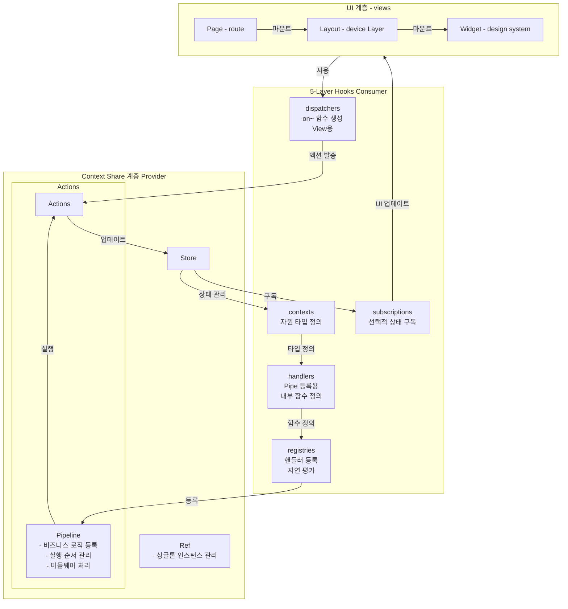

# Context-Driven Architecture

Architectural principles and philosophy for document-centric state management based on the **Context-Action Framework**.

> **For implementation details, folder structures, and coding guidelines, see [Context-Action Complete Guide](context-action-complete-guide.md)**

## Core Philosophy

> **"The document is the architecture."** - Each context exists as a unit for managing the documents and deliverables of its domain.

Context-Driven Architecture is an innovative architectural approach that overcomes the fundamental limitations of complex state management through **document-centric context separation** and **effective artifact management**.

## 🏗️ 5-Layer Hooks Architecture

**Context-Action implements a sophisticated 5-layer hooks architecture that provides perfect separation of concerns and optimal performance through delayed evaluation.**



### 🔄 Architectural Layers Explained

#### **Layer 1: Context Share (Provider)**
The foundation layer that provides shared resources across the application:

- **Store**: Centralized state management with reactive subscriptions
- **Actions/Pipeline**: Business logic registration and execution order management
- **Ref**: Singleton instance management for performance optimization

#### **Layer 2: 5-Layer Hooks (Consumer)**
The consumption layer implementing the sophisticated hooks architecture:

1. **contexts** - Resource type definitions and context access
2. **handlers** - Internal function definitions for pipeline registration
3. **subscriptions** - Selective state subscriptions for UI updates
4. **registries** - Handler registration with delayed evaluation
5. **dispatchers** - View-oriented action dispatchers (`on~` functions)

#### **Layer 3: UI (Views)**
The presentation layer with clear hierarchical structure:

- **Page** - Route-level components handling navigation concerns
- **Layout** - Device-specific layout components for responsive design
- **Widget** - Design system components for consistent UI patterns

### ⚡ Architectural Benefits

#### **Performance Optimization**
- **Delayed Evaluation**: Handlers access latest state via `store.getValue()` preventing stale closures
- **Selective Subscriptions**: Components subscribe only to needed state slices reducing unnecessary re-renders
- **Singleton Management**: Ref layer ensures efficient resource sharing across components
- **Minimal Re-renders**: Optimized dependency tracking prevents unnecessary updates

#### **Developer Experience**
- **Perfect Separation of Concerns**: Each layer has a single, well-defined responsibility
- **Type Safety**: Full TypeScript support across all architectural layers
- **Predictable Data Flow**: Unidirectional data flow with clear update patterns
- **Scalable Structure**: Easy to add new features without architectural changes

#### **Architectural Integrity**
- **Document-Centric Design**: Each context represents a document domain boundary
- **Clear Boundaries**: No coupling between different architectural layers
- **Testable Structure**: Each layer can be tested independently
- **Maintainable Code**: Clear separation makes refactoring safe and predictable

### 💡 Implementation Pattern

```typescript
// 5-Layer Architecture Implementation
function UserPage() {
  // Layer 1: contexts - Resource type definitions
  const userStore = useUserStore('profile');
  const settingsStore = useUserStore('settings');

  // Layer 2: handlers - Internal function definitions
  const updateUserHandler = useCallback(async (payload) => {
    // Delayed evaluation - always gets latest state
    const currentUser = userStore.getValue();
    const updatedUser = { ...currentUser, ...payload };
    userStore.setValue(updatedUser);
  }, [userStore]);

  const updateSettingsHandler = useCallback(async (payload) => {
    const currentSettings = settingsStore.getValue();
    settingsStore.setValue({ ...currentSettings, ...payload });
  }, [settingsStore]);

  // Layer 3: subscriptions - Selective state subscriptions
  const user = useStoreValue(userStore);
  const settings = useStoreValue(settingsStore);

  // Layer 4: registries - Handler registration
  useActionHandler('updateUser', updateUserHandler);
  useActionHandler('updateSettings', updateSettingsHandler);

  // Layer 5: dispatchers - View-oriented action dispatchers
  const onUpdateUser = useActionDispatch('updateUser');
  const onUpdateSettings = useActionDispatch('updateSettings');

  // UI Layer - Pure presentation logic
  return (
    <div>
      <h1>{user.name}</h1>
      <p>Theme: {settings.theme}</p>
      <button onClick={() => onUpdateUser({ name: 'New Name' })}>
        Update User
      </button>
      <button onClick={() => onUpdateSettings({ theme: 'dark' })}>
        Toggle Theme
      </button>
    </div>
  );
}
```

### Fundamental Problems Addressed

#### Problems with Existing Libraries
- **High React Coupling**: Tight integration makes component modularization and props handling difficult
- **Heavy Props Dependency**: Complex object props create tight coupling between components
- **Binary State Approach**: Simple global/local state dichotomy fails to handle specific scope-based separation
- **Inadequate Handler/Trigger Management**: Poor support for complex interactions and business logic processing

#### Context-Action's Solution
- **Document-Artifact Centered Design**: Context separation based on document themes and deliverable management
- **Minimal Props Coupling**: Components use only ComponentId or string-level coupling for lightweight data flow
- **Perfect Separation of Concerns**: 5-layer hook architecture with specialized responsibilities
- **Delayed Evaluation Pattern**: Handlers access latest state through `store.getValue()` for optimal performance
- **Selective Subscription Model**: UI-focused selective state subscriptions
- **Effective Document-Artifact Management**: State management library that actively supports the relationship between documentation and deliverables

## Context Definition and Separation Principles

### Unit of Context Definition

A context signifies a **unit for defining concepts**. Based on this standard, the visual UI is composed of components, and business logic is structured as an Action Pipeline.

#### Atomic Context Types

**1. Domain Context** - Business Domain Entities
- **Purpose**: Core business domain entities and their essential logic
- **Characteristics**: Contains fundamental business rules, reusable across multiple pages
- **Examples**: User, Product, Order, Payment, Authentication, Search

**2. Page Context** - Page-specific State
- **Purpose**: UI state and logic specific to a particular page
- **Characteristics**: Used only within specific pages, isolated from other pages
- **Examples**: User Dashboard Page, Product List Page, Checkout Flow Page

> **Note**: For detailed folder structures and implementation patterns, see [Context-Action Complete Guide](context-action-complete-guide.md)

#### Context Evolution Philosophy

**Domain Evolution**: When business logic becomes complex enough to warrant its own domain, it evolves from a sub-feature to an independent domain context.

**Page Isolation**: Page contexts remain isolated and their sub-features never become independent domains.

**Atomic Independence**: Each context operates as a completely independent unit, following the principle that each context is responsible for managing its own documents and deliverables.

> **Implementation Details**: See [Context-Action Complete Guide](context-action-complete-guide.md) for folder structures and evolution patterns.

### Context Separation Principles

#### 1. Separation of Concerns
- A parent context does not perform the functions of a child context
- A child context does not directly use the data of a parent context
- Each context has a clear, single responsibility

#### 2. Dependency Direction

**Domain to Domain Dependencies:**
```
Domain (Child) → Domain (Parent) (Allowed)
Domain (Parent) → Domain (Child) (Forbidden)
```

**Page to Domain Dependencies:**
```
Page → Domain (Allowed)
Domain → Page (Forbidden)
```

**Page to Page Dependencies:**
```
Page ↔ Page (Forbidden - Complete Isolation)
```

- **Allowed**: Child domain using parent domain data, pages using any domain data
- **Forbidden**: Parent domain accessing child domain data, domains accessing page data, pages accessing other pages
- **Evolution**: When domain features become complex, they evolve into independent child domains that depend on their parent

#### 3. Hook-Based Delegation Pattern

**5-Layer Hook Architecture** enables sophisticated delegation patterns:

```typescript
// Parent Context: Defines dispatcher and subscriptions
const {
  Provider: ParentActionProvider,
  useActionDispatch: useParentAction
} = createActionContext<ParentActions>('ParentContext');

// Child Context: Uses parent hooks with selective access
function useChildDispatchers() {
  const parentDispatch = useParentAction(); // Use parent dispatcher

  return {
    onChildAction: useCallback((data, options) => {
      // Child can trigger parent events with execution options
      parentDispatch('parentEvent', data, options);
    }, [parentDispatch])
  };
}

// Child subscription accessing parent state
function useChildSubscriptions() {
  const { parentData } = useParentSubscriptions(); // Access parent subscriptions

  return {
    parentData,
    derivedChildData: parentData?.map(item => ({ ...item, childProperty: true }))
  };
}
```

## Implementation with Context-Action Framework

### 1. Action Pipeline System (ActionRegister)

The core of Context-Action, `ActionRegister`, provides priority-based handler execution.

#### Key Features
- **Priority-Based Execution**: Handlers are sorted and executed by `priority`
- **Multiple Execution Modes**: Supports `sequential`, `parallel`, and `race` modes
- **Advanced Control**: Supports `throttle`, `debounce`, and `abort`
- **Memory Safety**: Automatic cleanup and management of `unregister` functions

#### Core Concept Example

```typescript
// 1. Define Action Types (Business Logic)
interface UserActions {
  updateProfile: { name: string; email: string };
  deleteUser: { userId: string };
  logout: void;
}

// 2. Create Action Context (Business Logic Layer)
const {
  Provider: UserActionProvider,
  useActionDispatch: useUserAction,
  useActionHandler: useUserActionHandler
} = createActionContext<UserActions>('UserActions');

// 3. Implement Business Logic (Handler Layer)
function UserBusinessLogic({ children }) {
  const userStore = useUserStore('profile');

  // High-priority handler (Security validation)
  useUserActionHandler('updateProfile', useCallback(async (payload) => {
    // Step 1: Read current state
    const currentProfile = userStore.getValue();

    // Step 2: Execute business logic
    if (!validateProfile(payload)) {
      throw new Error('Invalid profile data');
    }

    // Step 3: Update state
    userStore.setValue({
      ...currentProfile,
      ...payload,
      lastUpdated: Date.now()
    });

    // API call
    await saveProfile(payload);
  }, [userStore]), { priority: 100 });

  return children;
}
```

> **Complete Implementation Guide**: See [Context-Action Complete Guide](context-action-complete-guide.md) for detailed action pipeline implementation, store patterns, and handler registration.

### 2. Store Pattern System

#### Declarative Store Pattern
Context-Action's `createStoreContext` provides type-safe and declarative store management with immutable state updates using Immer internally.

**Core Principles:**
- **Store Integration 3-Step Process**: Read current state → Execute business logic → Update stores
- **Immutability**: All state updates are immutable using Immer
- **Type Safety**: Full TypeScript support with strict type checking

> **Detailed Store Patterns**: See [Context-Action Complete Guide](context-action-complete-guide.md) for complete store implementation patterns, update conventions, and performance optimization.

### 3. 5-Layer Hook Architecture Philosophy

Context-Driven Architecture integrates with the Context-Action Framework's **5-Layer Hook Architecture** to maintain clear separation of concerns:

**Core Hook Layers**:
- **contexts/**: Context resource type definitions and provider creation
- **handlers/**: Internal function definitions for pipe registration with delayed evaluation
- **subscriptions/**: Selective state subscriptions and parent context access
- **registries/**: Handler registration with context lifecycle management
- **dispatchers/**: on~ function generation with execution options for views
- **views/**: UI components consuming dispatchers and subscriptions

**Hook Layer Responsibilities**:
- Each hook layer has a single, specialized responsibility
- **Delayed Evaluation**: Handlers use `store.getValue()` for latest state access
- **Selective Access**: Child contexts can access parent subscription hooks
- **Execution Options**: Dispatchers provide configurable execution parameters
- **Observable State**: Advanced patterns with useRef + useState + currying

**Data Flow Pattern**:
```
Views → Dispatchers (on~) → Contexts → Registries → Handlers (delayed eval)
  ↑                                                        ↓
Subscriptions ←──────────── Store Updates ←──────────────┘
```

> **Complete Implementation Guide**: See [Context-Action Complete Guide](context-action-complete-guide.md) for detailed 5-layer hook architecture implementation, atomic folder structures, and coding patterns.

## Lightweight Props Architecture

### Minimal Coupling Principles

Context-Driven Architecture enforces **minimal props coupling** as a core architectural value for maintainable, scalable component systems.

#### Props Coupling Restrictions

**✅ Allowed Props (Lightweight Coupling):**
- **ComponentId**: Unique string identifiers for component targeting
- **String primitives**: Simple string values, enums, or basic configuration
- **Primitive values**: Numbers, booleans, simple data types
- **Event handlers**: Callback functions for interaction delegation

**❌ Forbidden Props (Heavy Coupling):**
- **Complex objects**: Rich data structures passed between components
- **Store instances**: Direct store passing creates tight coupling
- **Business logic functions**: Complex functions with business rules
- **Nested object hierarchies**: Deep object structures

#### Lightweight Data Flow Pattern

```typescript
// ✅ CORRECT: Minimal props with ComponentId coupling
interface UserCardProps {
  userId: string;           // Simple identifier
  variant?: 'compact' | 'detailed'; // String enum
  onSelect?: (id: string) => void;   // Simple callback
}

function UserCard({ userId, variant = 'compact', onSelect }: UserCardProps) {
  // Component accesses data through hooks, not props
  const { user } = useUserSubscriptions(userId);
  const { onUserUpdate } = useUserDispatchers();

  return (
    <div onClick={() => onSelect?.(userId)}>
      <h3>{user.name}</h3>
      {variant === 'detailed' && <p>{user.email}</p>}
    </div>
  );
}

// ❌ WRONG: Heavy props coupling
interface UserCardProps {
  user: User;               // Complex object coupling
  userActions: UserActions; // Business logic coupling
  settings: UserSettings;   // Nested object hierarchy
  onUpdate: (user: User) => Promise<void>; // Complex function
}
```

#### Component ID-Based Architecture

**Core Principle**: Components receive only identifiers and access data through hooks.

```typescript
// Parent Component: Passes only IDs
function UserList({ userIds }: { userIds: string[] }) {
  return (
    <div>
      {userIds.map(id => (
        <UserCard key={id} userId={id} variant="compact" />
      ))}
    </div>
  );
}

// Child Component: Accesses data via hooks
function UserCard({ userId }: { userId: string }) {
  const { user, loading } = useUserSubscriptions(userId);
  const { onUserSelect, onUserEdit } = useUserDispatchers();

  if (loading) return <Skeleton />;

  return (
    <Card>
      <h3>{user.name}</h3>
      <Button onClick={() => onUserSelect(userId)}>Select</Button>
      <Button onClick={() => onUserEdit(userId)}>Edit</Button>
    </Card>
  );
}
```

#### Benefits of Minimal Props Coupling

**1. Component Independence**
- Components can be moved, reused, and tested independently
- No complex props drilling or dependency chains
- Clear component boundaries and responsibilities

**2. Type Safety with Simplicity**
- Simple props are easier to type and validate
- Reduced TypeScript complexity and compilation overhead
- Clear interface contracts between components

**3. Testing Simplification**
- Components can be tested with simple mock props
- No need to create complex object mocks
- Isolated testing of component logic

**4. Performance Optimization**
- Reduced props comparison overhead
- Simpler React reconciliation process
- Cleaner dependency tracking

### Component ID Strategy

#### ID-Based Component Targeting

```typescript
// Component Registration with IDs
function ProductGrid() {
  const { productIds } = useProductSubscriptions();

  return (
    <Grid>
      {productIds.map(id => (
        <ProductCard
          key={id}
          productId={id}
          layout="grid"
        />
      ))}
    </Grid>
  );
}

// Component accesses data via ID
function ProductCard({ productId, layout }: {
  productId: string;
  layout: 'grid' | 'list';
}) {
  const { product, loading } = useProductSubscriptions(productId);
  const { onProductSelect } = useProductDispatchers();

  return (
    <Card className={cn('product-card', `layout-${layout}`)}>
      <Image src={product.image} alt={product.name} />
      <h3>{product.name}</h3>
      <Button onClick={() => onProductSelect(productId)}>
        Select Product
      </Button>
    </Card>
  );
}
```

#### Dynamic Component Configuration

```typescript
// String-based configuration
interface ComponentConfig {
  componentId: string;
  theme: 'light' | 'dark';
  size: 'sm' | 'md' | 'lg';
  variant: 'primary' | 'secondary';
}

function DynamicComponent({ componentId, theme, size, variant }: ComponentConfig) {
  const { data } = useComponentSubscriptions(componentId);
  const { onComponentAction } = useComponentDispatchers();

  return (
    <div className={cn('dynamic-component', `theme-${theme}`, `size-${size}`, `variant-${variant}`)}>
      {/* Component renders based on simple string configurations */}
    </div>
  );
}
```

## Design System Integration

### CVA-Based Component Styling

Context-Driven Architecture integrates with design systems through **Class Variance Authority (CVA)** for consistent, maintainable styling while maintaining minimal props coupling.

#### Implementation Principles

**Separation of Style and Interaction:**
- Style parameters are controlled through simple string props
- Interaction logic remains in the business logic layer
- Style changes are triggered by business state changes

```typescript
// Style parameters through simple string props
const cardVariants = cva('card', {
  variants: {
    variant: {
      primary: 'card-primary',
      secondary: 'card-secondary',
    },
    size: {
      sm: 'card-sm',
      md: 'card-md',
      lg: 'card-lg',
    }
  }
});

interface CardProps {
  cardId: string;                    // Component ID
  variant?: 'primary' | 'secondary'; // Simple string variant
  size?: 'sm' | 'md' | 'lg';        // Simple string size
}

function Card({ cardId, variant = 'primary', size = 'md' }: CardProps) {
  const { data } = useCardSubscriptions(cardId);

  return (
    <div className={cardVariants({ variant, size })}>
      {/* Component content based on data from hooks */}
    </div>
  );
}
```

> **Design System Implementation**: See [Context-Action Complete Guide](context-action-complete-guide.md) for CVA integration patterns and design token systems.

## Architectural Advantages

### 1. Minimal Props Coupling Benefits
- **Component Independence**: Components can be moved, reused, and tested independently
- **Lightweight Data Flow**: Only ComponentId and string-level coupling for maximum flexibility
- **Type Safety Simplification**: Simple props reduce TypeScript complexity and compilation overhead
- **Testing Simplification**: Components tested with simple mock props, no complex object mocks
- **Performance Optimization**: Reduced props comparison overhead and simpler React reconciliation

### 2. Hook-Based Component Observability
- **Clear State Flow**: All state changes flow through specialized hook layers
- **Delayed Evaluation**: Handlers always access latest state via `store.getValue()`
- **Selective Subscriptions**: Components subscribe only to needed state changes
- **Observable Execution**: Advanced patterns track handler execution state
- **Debugging Support**: Hook layer separation provides clear audit trail

### 3. Clear Hook-Driven Architecture
- **Hook-Centric Design**: All business logic triggered through specialized hook layers
- **Decoupled Components**: UI components use dispatchers and subscriptions only
- **Testable Logic**: Handler definitions can be tested independently from UI
- **Execution Options**: Dispatcher hooks provide configurable execution parameters

### 4. Update Isolation and Performance Control
- **Context Boundaries**: Changes within one context don't affect others
- **Controlled Dependencies**: Hook-level access patterns prevent unintended coupling
- **Atomic Updates**: Each context manages its own state atomically with delayed evaluation
- **Performance Optimization**: Selective subscriptions reduce unnecessary re-renders

### 5. Logic Transparency and Observability
- **Handler Registration**: All business logic explicitly registered through registry hooks
- **Priority System**: Clear execution order for complex workflows
- **State Management**: Transparent state updates through hook pipeline
- **Execution State**: Observable handler execution with useRef + useState patterns

### 6. Implementation Simplification
- **Hook Pattern Consistency**: Same hook patterns apply across all contexts
- **Type Safety**: Full TypeScript support with hook-specific type definitions
- **Delayed Evaluation**: Automatic latest state access in handlers
- **Boilerplate Reduction**: Specialized hooks handle common patterns automatically

### 7. Scalable Hook Development
- **Context Evolution**: Start simple, grow complex hook definitions into independent contexts
- **Independent Development**: Different contexts with their hook layers can be developed independently
- **Hook Complexity Management**: Use features/ namespace when hook definitions exceed 10+ per layer
- **Gradual Migration**: Existing code can be migrated to hook architecture context by context

## Implementation Guidelines

### 1. Minimal Props Design
- **Enforce ComponentId pattern**: Components receive only string identifiers
- **Restrict complex props**: Forbid complex objects, store instances, and business logic functions
- **Use simple primitives**: Allow only strings, numbers, booleans, and simple callbacks
- **Access data via hooks**: Components use subscription hooks instead of props for data
- **Maintain type safety**: Simple props reduce TypeScript complexity while maintaining safety

### 2. Context Design
- Start with clear context boundaries based on business domains
- Define atomic contexts that are completely independent
- Use page contexts for UI-specific state, domain contexts for business logic
- Document context specifications and dependencies

### 3. Hook-Based Handler Pattern
- Define handler functions in handlers/ layer with delayed evaluation
- Register handlers through registries/ layer hooks
- Implement 3-step store integration pattern (read latest → logic → update)
- Use `useCallback` for proper memoization of handler definitions
- Handle errors appropriately with observable execution state

### 4. Selective Subscription Pattern
- Use subscriptions/ layer for selective state observation
- Access parent context subscriptions when needed in child contexts
- Implement proper comparison strategies (reference/shallow/deep)
- Follow immutability rules with delayed evaluation for latest state
- Optimize subscription granularity for performance

### 5. Dispatcher and Execution Pattern
- Generate on~ functions in dispatchers/ layer with execution options
- Provide configurable execution parameters for different use cases
- Use observable execution state for advanced debugging
- Implement proper error boundaries for each hook layer
- Log errors appropriately with execution state context

> **Complete Implementation Examples**: See [Context-Action Complete Guide](context-action-complete-guide.md) for detailed implementation patterns, code examples, and best practices.

## Conclusion

Context-Driven Architecture provides a comprehensive approach to building maintainable, scalable applications through:

1. **Minimal Props Coupling**: ComponentId and string-level coupling only for lightweight, flexible components
2. **Document-Centric Design**: Architecture follows documentation structure with atomic context units
3. **5-Layer Hook Architecture**: Specialized hook layers with single responsibilities and delayed evaluation
4. **Atomic Context Isolation**: Each context is completely independent with its own hook layers
5. **Delayed Evaluation Pattern**: Handlers always access latest state for optimal performance
6. **Selective Subscription Model**: UI-focused selective state subscriptions for performance
7. **Observable Execution State**: Advanced debugging patterns with execution state tracking
8. **Hook-Based Scalability**: Start simple, evolve hook complexity naturally with features/ namespace
9. **Type-Safe Hook Implementation**: Full TypeScript support throughout hook architecture

This architectural approach enables teams to build applications that remain maintainable as they scale, with **minimal component coupling**, clear hook boundaries, predictable state flow, optimal performance characteristics, and excellent developer experience.

**Next Steps**: Explore the [Context-Action Complete Guide](context-action-complete-guide.md) for hands-on hook implementation patterns, detailed 5-layer folder structures, and comprehensive coding examples with delayed evaluation and selective subscription patterns.