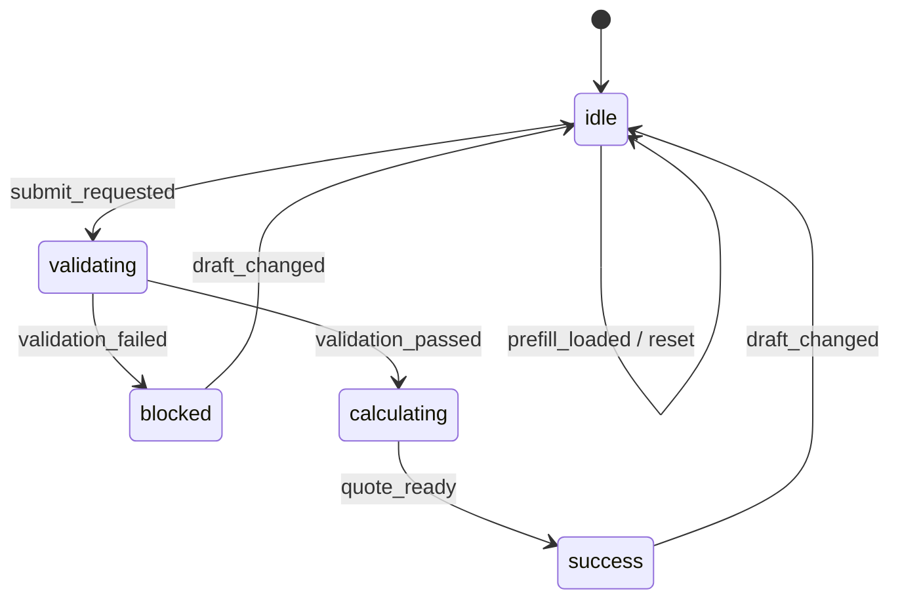

# Explicit State Machine

An explicit state machine is a pattern that fixes an async workflow as `state + event + transition`. In Context-Layered Architecture, it becomes especially useful once handlers need to coordinate business rules and side effects at the same time.

Instead of growing ad-hoc `if` branches and boolean flags, define which events can move the workflow from one state to another. That makes the flow easier to extend horizontally and reduces invalid state combinations.

## When to Use It

- Async flows with clear stages such as validation, submission, saving, or syncing
- Workflows that include success, failure, retry, and reset behavior
- Screens where activity logs, analytics, and UI feedback should all derive from the same transition model
- Any handler that is starting to feel too large to explain with plain control flow

## Core Concepts

### State

Represents the current step of the workflow.

Example:

```ts
type SubmissionPhase =
  | 'idle'
  | 'validating'
  | 'blocked'
  | 'calculating'
  | 'success';
```

### Event

Represents the cause that moves the workflow.

Example:

```ts
type SubmissionEvent =
  | { type: 'draft_changed' }
  | { type: 'submit_requested' }
  | { type: 'validation_failed' }
  | { type: 'validation_passed' }
  | { type: 'quote_ready'; total: number };
```

### Transition

A pure function that receives the current state and an event, then returns the next state.

```ts
function transition(current: SubmissionState, event: SubmissionEvent) {
  switch (event.type) {
    case 'submit_requested':
      return current.phase === 'idle'
        ? { phase: 'validating' }
        : current;
    case 'validation_failed':
      return current.phase === 'validating'
        ? { phase: 'blocked' }
        : current;
    case 'validation_passed':
      return current.phase === 'validating'
        ? { phase: 'calculating' }
        : current;
    case 'quote_ready':
      return current.phase === 'calculating'
        ? { phase: 'success', total: event.total }
        : current;
    default:
      return current;
  }
}
```

## Responsibility Split in Context-Layered Architecture

- `business/`
  - state types
  - event types
  - transition function
- `handlers/`
  - read the latest store values
  - call the transition function
  - orchestrate side effects such as validation, ref focus, or API calls
- `hooks/`
  - convert machine state into view-friendly data
- `views/`
  - render the final message and UI only

The important shift is that handlers no longer mutate workflow state ad hoc. They call a predefined transition.

## How the implementation-playbook Example Uses It

The canonical example applies this pattern to its submission flow.



Relevant files:

- `/Users/junwoobang/workflow/context-action/example/src/pages/patterns/implementation-playbook/business/submissionStateMachine.ts`
- `/Users/junwoobang/workflow/context-action/example/src/pages/patterns/implementation-playbook/handlers/useCanonicalOrderSubmissionHandlers.tsx`
- `/Users/junwoobang/workflow/context-action/example/src/pages/patterns/implementation-playbook/handlers/orderHandlerSupport.ts`

## Why It Improves Stability

### 1. It reduces invalid combinations

You can avoid contradictions such as `phase: 'success'` with `quote: null`.

### 2. It scales horizontally

If you need an approval step later, add an `approved` state and `approval_requested`, `approval_granted` events instead of reworking the whole screen.

### 3. Activity logs and UI feedback can derive from the same events

The log and the screen no longer drift from different sources of truth.

### 4. It fits functional patterns well

The transition function is pure, so it is easy to test and compose alongside pure validation and quote calculation.

## Practical Checklist

- Name states after workflow phases, not UI wording
- Name events after user intent or system outcome
- Keep the transition function pure whenever possible
- Execute side effects outside the transition function in handlers
- Derive view messages by interpreting state
- Test the transition before and after each important event

## Related Reading

- `/Users/junwoobang/workflow/context-action/docs/en/examples/canonical-order-form.md`
- `/Users/junwoobang/workflow/context-action/docs/en/context-layered/stability-test-cycle.md`
- `/Users/junwoobang/workflow/context-action/docs/en/concept/business-logic-separation-guide.md`
