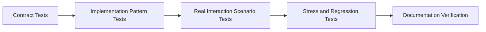

# Stability Test Cycle for Context-Layered Architecture

This guide describes a test cycle designed to turn an intentionally layered architecture into a visible product advantage. The goal is not only to prove correctness, but to show that extra structure results in predictable behavior under change, stress, and maintenance.

## Why This Matters

Context-Layered Architecture can feel heavier than a minimal React setup. The payoff should therefore be demonstrated, not merely claimed.

The recommended message is:

- The architecture is more structured than a simple component-local approach.
- That extra structure creates strong runtime boundaries.
- Those boundaries are continuously verified by a layered test cycle.

## The Stability-Oriented Test Cycle

If you want to evaluate whether the architecture earns its complexity, read this guide together with:

- [Canonical Order Form Example](/en/examples/canonical-order-form)
- [Context-Layered Architecture Guide](/en/context-layered/context-layered-guide)

### 1. Contract Tests

Contract tests protect the guarantees of each core factory and boundary.

- `createActionContext(contextName, config?)` must provide stable dispatch and safe handler registration.
- `createStoreContext(contextName, initialStores)` must create isolated typed stores with predictable subscriptions.
- `createRefContext()` must manage mount state, imperative access, and cleanup safely.

These tests answer the question: "What does the architecture promise?"

### 2. Implementation Pattern Tests

Implementation pattern tests verify the recommended architecture itself.

- `views` dispatch actions instead of embedding business logic.
- `handlers` orchestrate state changes and side effects.
- `business` remains pure and deterministic.
- `hooks` subscribe and derive view-friendly values.
- `refs` remain dedicated to imperative targets.

These tests answer the question: "Does the code follow the intended design?"

### 3. Real Interaction Scenario Tests

Scenario tests should behave like product stories, not utility checks.

- invalid form submission should surface field errors
- the first invalid field should receive focus through `RefContext`
- valid submission should pass through action, handler, business, and store layers
- reactive UI should update from store subscriptions instead of ad hoc local state

These tests answer the question: "Does the architecture hold during real user flows?"

### 4. Stress and Regression Tests

This layer is where the architecture proves its value.

- high-frequency updates
- repeated handler execution
- cleanup after rapid mount/unmount cycles
- cross-context isolation
- memory leak prevention
- patch-based subscription efficiency

These tests answer the question: "Does the design remain stable under pressure?"

### 5. Documentation Verification

Documentation must stay executable in spirit.

- example code in docs should match the current API
- canonical example structure should map to real files
- migration guides should reflect current implementation patterns

These checks answer the question: "Can users trust the architecture story?"

## CI Recommendation

Use multiple lanes instead of one monolithic pipeline.

### Fast PR Lane

- contract tests
- critical pattern tests
- type checks

### Extended PR Lane

- integration scenarios
- migration workflows
- canonical example flow tests

### Nightly Lane

- high-frequency performance suites
- cleanup and lifecycle stress tests
- long-running regression scenarios

### Release Lane

- full React package test suite
- example app type check and build
- documentation build and link validation

For the 0.8/0.9 stabilization release lane, the following are required:

- `pnpm build` and `pnpm type-check`
- `pnpm verify:package-exports` and `pnpm verify:package-tarballs`
- `pnpm convention:check` and the active package-boundary checks
- a clean package version/changelog set and published-consumer smoke tests for
  `@context-action/sem-doc`, `@context-action/tool-protocol`, and
  `@context-action/tool-durable-operations`
- no removed legacy documentation package or generator reference in the active workspace/release graph

## Recommended Assertions

Prefer assertions that reinforce architectural trust.

- handler side effects occur in the expected layer
- store updates are observable through subscriptions
- ref-driven focus or scroll behavior occurs without hidden local state
- business logic produces deterministic output from explicit inputs
- resetting a flow restores all participating stores to a known baseline

## Canonical Example Strategy

Each major architectural guide should have one canonical example that is:

- small enough to read in a single sitting
- realistic enough to resemble product code
- structured with `contexts`, `business`, `handlers`, `actions`, `hooks`, and `views`
- covered by tests that validate the actual example component

For this repository, the recommended canonical example is an implementation-first order form:

- draft state in stores
- validation as pure business logic
- submission orchestration in handlers
- field focus through refs
- subscription-based summary panels in hooks and views

## Success Criteria

The architecture is being communicated well when a new contributor can:

1. open one canonical example
2. trace the data flow from view to action to handler to store to view
3. run one focused test file
4. understand why the extra layers improve reliability

That is the point where "over-engineered" starts reading as "operationally stable."
