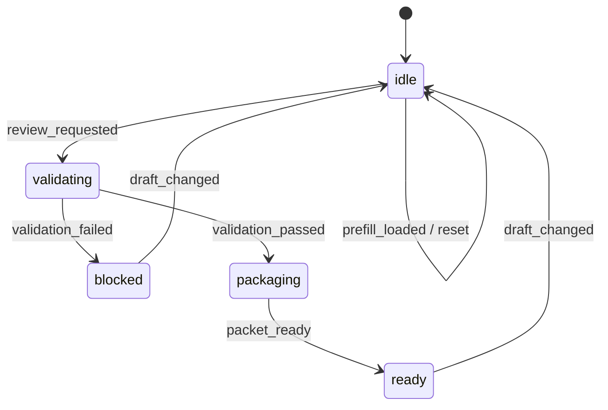

# Access Request Playbook Example

This document explains the `Workspace Access Request` example built with the implementation-playbook skill. It keeps the same layer split as the canonical order form, but replaces quote generation with a review-packet workflow to prove that the same convention also fits approval-oriented scenarios.

## What It Demonstrates

- separate `draft / validation / review / activity` stores
- an explicit state machine for an approval workflow
- separation between validation issues and UI wording
- activity logs derived from domain events
- invalidating a stale review result when the draft changes after success

## Route

```text
/patterns/implementation-playbook/access-request
```

## Key Files

```text
example/src/pages/patterns/implementation-playbook/access-request/
├── AccessRequestExample.tsx
├── AccessRequestExamplePage.tsx
├── contexts/
│   └── AccessRequestContexts.tsx
├── business/
│   ├── accessDraft.ts
│   ├── accessValidation.ts
│   ├── accessReviewPacket.ts
│   ├── accessActivity.ts
│   ├── accessStateMachine.ts
│   └── accessBusiness.ts
├── handlers/
│   ├── AccessRequestHandlers.tsx
│   ├── accessHandlerSupport.ts
│   ├── useAccessDraftHandlers.tsx
│   └── useAccessSubmissionHandlers.tsx
├── actions/
│   └── useAccessRequestActions.ts
├── hooks/
│   └── useAccessRequestData.ts
└── views/
    └── AccessRequestView.tsx
```

## State Machine



## Why This Example Matters

The canonical order form is centered on quote calculation. This example shows that the same skill also works for approval and review workflows.

- review-packet creation instead of quote creation
- reviewer/checklist/priority calculation instead of pricing
- review-state transitions instead of submission-state transitions

The domain changes, but the architecture stays reusable.

## Verification Focus

- short justification blocks submission
- production access without admin scope blocks review
- valid submission produces a review packet
- changing scope after success returns the workflow to idle
- reset restores the baseline state

## Related Reading

- [Implementation Playbook Standard Convention](/en/context-layered/implementation-convention)
- [Explicit State Machine](/en/context-layered/patterns/explicit-state-machine)
- [Playbook Scenario Library](/en/examples/implementation-playbook-scenarios)
