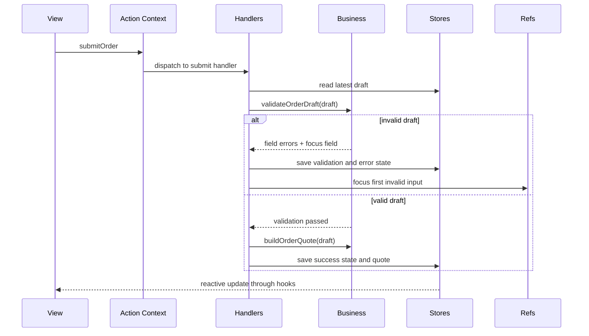

# Canonical Order Form Example

This example is the recommended implementation-first walkthrough for the repository. It is intentionally small, but complete enough to demonstrate why Context-Layered Architecture improves reliability.

If you only read one example to understand the architecture, start with this one.

## What It Demonstrates

- `Store Context` for persistent draft, validation, submission, and activity state
- `Action Context` for user intent and orchestration
- `Ref Context` for imperative focus management after validation failure
- pure `business` functions for deterministic validation and quote calculation
- reactive `hooks` and `views` for rendering without hidden local business logic

## Route

The live example is exposed in the example application at:

```text
/patterns/implementation-playbook
```

## File Structure

```text
example/src/pages/patterns/implementation-playbook/
├── CanonicalOrderExample.tsx
├── CanonicalOrderExamplePage.tsx
├── contexts/
│   └── CanonicalOrderContexts.tsx
├── business/
│   └── orderBusiness.ts
├── handlers/
│   └── CanonicalOrderHandlers.tsx
├── actions/
│   └── useCanonicalOrderActions.ts
├── hooks/
│   └── useCanonicalOrderData.ts
└── views/
    └── CanonicalOrderView.tsx
```

## Runtime Flow



## Why This Example Is Canonical

It is designed to answer five practical questions quickly.

### Where does state live

State lives in stores, not in view-local business state.

- draft values
- validation result
- submission status
- activity timeline

### Where does business logic live

Pure decision logic lives in `business/orderBusiness.ts`.

- field validation
- quote calculation
- default state generation

### Where do side effects live

Orchestration and imperative work live in handlers.

- reading the latest store values
- transitioning submission status
- focusing the first invalid field
- appending activity log entries

### What do views do

Views render state and emit user intent.

- they subscribe through hooks
- they call action dispatch helpers
- they do not embed pricing rules or validation rules

### How is it tested

The example is verified by an integration test that imports the real example component and checks:

- validation errors render for invalid input
- focus moves to the invalid field through refs
- valid submission produces a quote and success state
- reset restores baseline state

## Recommended Reading Order

1. `contexts/CanonicalOrderContexts.tsx`
2. `business/orderBusiness.ts`
3. `handlers/CanonicalOrderHandlers.tsx`
4. `actions/useCanonicalOrderActions.ts`
5. `hooks/useCanonicalOrderData.ts`
6. `views/CanonicalOrderView.tsx`
7. `CanonicalOrderExample.tsx`

This order mirrors the intended architectural understanding: boundaries first, implementation next, UI last.
