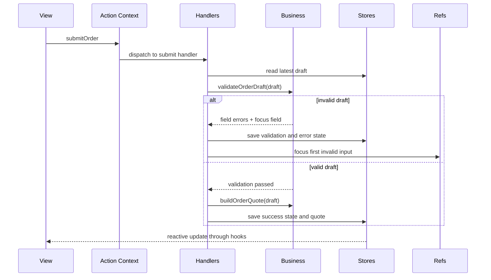

# Canonical Order Form Example

This example is the recommended implementation-first walkthrough for the repository. It is intentionally small, but complete enough to demonstrate why Context-Layered Architecture improves reliability.

If you only read one example to understand the architecture, start with this one.

## What It Demonstrates

- `Store Context` for persistent draft, validation, submission, and activity state
- `Action Context` for user intent and orchestration
- `Ref Context` for imperative focus management after validation failure
- pure `business` functions for deterministic validation and quote calculation
- reactive `hooks` and `views` for rendering without hidden local business logic

## Route

The live example is exposed in the example application at:

```text
/patterns/implementation-playbook
```

## File Structure

```text
example/src/pages/patterns/implementation-playbook/
├── CanonicalOrderExample.tsx
├── CanonicalOrderExamplePage.tsx
├── contexts/
│   └── CanonicalOrderContexts.tsx
├── business/
│   └── orderBusiness.ts
├── handlers/
│   └── CanonicalOrderHandlers.tsx
├── actions/
│   └── useCanonicalOrderActions.ts
├── hooks/
│   └── useCanonicalOrderData.ts
└── views/
    └── CanonicalOrderView.tsx
```

## Runtime Flow



## Specification Example

If you want to move from architecture explanation to execution planning, define the example as a compact specification first and then implement against that contract.

```markdown
# Spec: Canonical Order Form Example

## Overview
Provide a canonical example that demonstrates the recommended Context-Layered development style in one place. A developer should be able to understand Action, Store, Ref boundaries and the test cycle through a single example.

## Goals
- Provide one realistic example where Action, Store, and Ref work together.
- Keep the example implementation-first, with a clear file reading order.
- Verify invalid submission, focus movement, valid quote generation, and reset behavior.
- Connect the docs, implementation files, and the integration test.

## Quality Gates
- `pnpm test:canonical-example`
- `pnpm docs:build`
- `pnpm --dir example build:fast`

## User Stories

### US-001: Editable order draft flow
**Description:** As a developer, I want a realistic order draft flow so that I can understand how Store Context owns user-editable state.

**Acceptance Criteria:**
- [ ] Customer name, email, quantity, plan, onboarding option, and notes are stored in the draft store.
- [ ] The view sends changes through action helpers instead of local business state.
- [ ] Hooks expose draft, validation, and submission state in a view-friendly form.

### US-002: Invalid submission blocking with focus handoff
**Description:** As a developer, I want invalid submissions to stop at the handler layer so that validation and RefContext responsibilities are visible.

**Acceptance Criteria:**
- [ ] Invalid email or missing required fields render validation errors.
- [ ] Focus moves to the first invalid field.
- [ ] Submission state does not transition to success.

### US-003: Quote generation for valid submission
**Description:** As a developer, I want a valid submission to produce a quote so that I can trace business logic and side effects through the architecture.

**Acceptance Criteria:**
- [ ] A valid draft submission calculates a quote in the business layer.
- [ ] The submission store saves success state and quote data.
- [ ] The activity timeline records validation and submission steps.

### US-004: Reset to known baseline
**Description:** As a developer, I want the example to reset to a known baseline so that repeated learning and automated verification remain reliable.

**Acceptance Criteria:**
- [ ] Reset restores the draft, validation, and submission stores to their initial state.
- [ ] Focus can return to the customer name field after reset.
- [ ] The integration test validates post-reset behavior.

## Functional Requirements
- FR-1: The system must provide an example that uses Action, Store, and Ref boundaries together.
- FR-2: The system must isolate validation and quote calculation in pure business functions.
- FR-3: The system must read the latest draft and drive state transitions in the handler layer.
- FR-4: The system must expose source links and a test link from the example page.
- FR-5: The documentation must explain file reading order and the verification loop.

## Non-Goals
- Real backend API integration
- Multi-page checkout workflows
- Payment processing or persistence implementation

## Success Metrics
- A new contributor can explain the architecture from this single example.
- The canonical example test runs independently as a PR-quality gate.
- The docs, example app, and test all point to the same implementation contract.
```

This approach keeps documentation, implementation, and test expectations aligned before the code grows.

## Why This Example Is Canonical

It is designed to answer five practical questions quickly.

### Where does state live

State lives in stores, not in view-local business state.

- draft values
- validation result
- submission status
- activity timeline

### Where does business logic live

Pure decision logic lives in `business/orderBusiness.ts`.

- field validation
- quote calculation
- default state generation

### Where do side effects live

Orchestration and imperative work live in handlers.

- reading the latest store values
- transitioning submission status
- focusing the first invalid field
- appending activity log entries

### What do views do

Views render state and emit user intent.

- they subscribe through hooks
- they call action dispatch helpers
- they do not embed pricing rules or validation rules

### How is it tested

The example is verified by an integration test that imports the real example component and checks:

- validation errors render for invalid input
- focus moves to the invalid field through refs
- valid submission produces a quote and success state
- reset restores baseline state

## Recommended Reading Order

1. `contexts/CanonicalOrderContexts.tsx`
2. `business/orderBusiness.ts`
3. `handlers/CanonicalOrderHandlers.tsx`
4. `actions/useCanonicalOrderActions.ts`
5. `hooks/useCanonicalOrderData.ts`
6. `views/CanonicalOrderView.tsx`
7. `CanonicalOrderExample.tsx`

This order mirrors the intended architectural understanding: boundaries first, implementation next, UI last.
