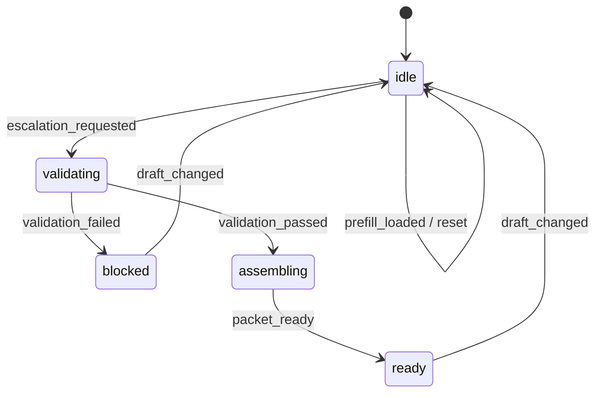

# Incident Escalation Playbook Example

This document explains the `Incident Escalation` example built with the implementation-playbook skill. Unlike the approval-oriented access-request example, this one focuses on an operations workflow that assembles an escalation packet based on severity and impact.

## What It Demonstrates

- separate `draft / validation / escalation / activity` stores
- an explicit state machine with severity-driven rules
- separation between validation issues and UI wording
- activity logs derived from domain events
- invalidating a stale escalation result when severity changes after success

## Route

```text
/patterns/implementation-playbook/incident-escalation
```

## Key Files

```text
example/src/pages/patterns/implementation-playbook/incident-escalation/
├── IncidentEscalationExample.tsx
├── IncidentEscalationExamplePage.tsx
├── contexts/
│   └── IncidentEscalationContexts.tsx
├── business/
│   ├── incidentDraft.ts
│   ├── incidentValidation.ts
│   ├── incidentEscalationPacket.ts
│   ├── incidentActivity.ts
│   ├── incidentStateMachine.ts
│   └── incidentBusiness.ts
├── handlers/
│   ├── IncidentEscalationHandlers.tsx
│   ├── incidentHandlerSupport.ts
│   ├── useIncidentDraftHandlers.tsx
│   └── useIncidentSubmissionHandlers.tsx
├── actions/
│   └── useIncidentEscalationActions.ts
├── hooks/
│   └── useIncidentEscalationData.ts
└── views/
    └── IncidentEscalationView.tsx
```

## State Machine



## Why This Example Matters

This example proves that the implementation-playbook also works for operations and incident response workflows.

- escalation-packet creation instead of quote generation
- severity, affected-user, and channel rules instead of pricing
- operational checklist and escalation target computation

The skill is not limited to form-processing examples.

## Verification Focus

- sev1 incidents without statuspage block submission
- valid incidents assemble an escalation packet
- changing severity after success returns the workflow to idle
- reset restores the baseline state

## Related Reading

- [Implementation Playbook Standard Convention](/en/context-layered/implementation-convention)
- [Explicit State Machine](/en/context-layered/patterns/explicit-state-machine)
- [Playbook Scenario Library](/en/examples/implementation-playbook-scenarios)
