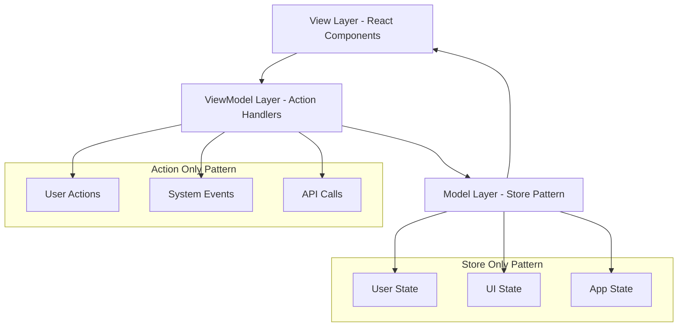

# Pattern Composition Example

This example demonstrates how to combine **Action Only** and **Store Only** patterns for complex applications with complete separation of concerns following MVVM architecture.

## Architecture Overview



## Complete Application Example

### 1. Action Type Definitions

```typescript
// types/AppActions.ts
import type { ActionPayloadMap } from '@context-action/core';

export interface UserActions extends ActionPayloadMap {
  // Authentication actions
  login: { username: string; password: string };
  logout: void;
  register: { username: string; email: string; password: string };
  
  // Profile actions
  updateProfile: { name: string; email: string; bio?: string };
  uploadAvatar: { file: File };
  deleteAccount: void;
  
  // Data actions
  loadUserData: { userId: string };
  saveUserData: void;
  refreshData: void;
  
  // UI actions
  showModal: { type: string; data?: any };
  hideModal: void;
  showNotification: { message: string; type: 'success' | 'error' | 'warning' | 'info' };
  clearNotification: void;
  
  // System actions
  trackEvent: { event: string; category: string; data?: any };
  reportError: { error: string; context: any };
  systemHealthCheck: void;
}

export interface SystemActions extends ActionPayloadMap {
  // App lifecycle
  appStartup: void;
  appShutdown: void;
  
  // Performance monitoring
  measurePerformance: { metric: string; value: number; context?: any };
  
  // Error handling
  handleGlobalError: { error: Error; context: any };
  
  // Background tasks
  syncWithServer: void;
  cleanupOldData: void;
}
```

### 2. Store Configuration

```typescript
// stores/AppStoreConfig.ts
export const appStoreConfig = {
  // User domain state
  user: {
    id: '',
    username: '',
    email: '',
    name: '',
    bio: '',
    avatar: '',
    isAuthenticated: false,
    roles: [] as string[],
    lastLogin: null as Date | null,
    createdAt: null as Date | null
  },
  
  // UI domain state
  ui: {
    initialValue: {
      loading: {
        global: false,
        auth: false,
        profile: false,
        data: false
      },
      modals: {
        active: null as string | null,
        data: null as any,
        stack: [] as Array<{ type: string; data: any }>
      },
      notifications: [] as Array<{
        id: string;
        message: string;
        type: 'success' | 'error' | 'warning' | 'info';
        timestamp: number;
        dismissed: boolean;
      }>,
      sidebar: {
        collapsed: false,
        activeSection: 'dashboard'
      }
    },
    derived: {
      hasActiveModals: (ui) => ui.modals.active !== null,
      modalStackSize: (ui) => ui.modals.stack.length,
      unreadNotifications: (ui) => ui.notifications.filter(n => !n.dismissed).length,
      isLoading: (ui) => Object.values(ui.loading).some(Boolean)
    }
  },
  
  // Application domain state
  app: {
    initialValue: {
      settings: {
        theme: 'light' as 'light' | 'dark',
        language: 'en' as 'en' | 'es' | 'fr' | 'de',
        autoSave: true,
        syncInterval: 30000
      },
      features: {
        analytics: true,
        notifications: true,
        darkMode: true,
        experimentalFeatures: false
      },
      system: {
        version: '1.0.0',
        buildDate: new Date().toISOString(),
        environment: process.env.NODE_ENV || 'development'
      }
    },
    validator: (value) => {
      return typeof value === 'object' &&
             value !== null &&
             'settings' in value &&
             'features' in value &&
             'system' in value;
    }
  },
  
  // Data cache domain
  cache: {
    initialValue: {
      userData: {} as Record<string, any>,
      apiResponses: {} as Record<string, { data: any; timestamp: number }>,
      analytics: {
        events: [] as Array<{ type: string; data: any; timestamp: number }>,
        sessions: [] as Array<{ id: string; startTime: number; endTime?: number }>
      }
    },
    derived: {
      cacheSize: (cache) => Object.keys(cache.userData).length + Object.keys(cache.apiResponses).length,
      recentEvents: (cache) => cache.analytics.events.filter(e => 
        Date.now() - e.timestamp < 300000 // Last 5 minutes
      ),
      activeSessions: (cache) => cache.analytics.sessions.filter(s => !s.endTime)
    }
  }
} as const;
```

### 3. Create Contexts

```typescript
// contexts/AppContexts.tsx
import { createActionContext } from '@context-action/react';
import { createDeclarativeStorePattern } from '@context-action/react';
import type { UserActions, SystemActions } from '../types/AppActions';
import { appStoreConfig } from '../stores/AppStoreConfig';

// Action contexts
export const {
  Provider: UserActionProvider,
  useActionDispatch: useUserAction,
  useActionHandler: useUserActionHandler
} = createActionContext<UserActions>('UserActions');

export const {
  Provider: SystemActionProvider,
  useActionDispatch: useSystemAction,
  useActionHandler: useSystemActionHandler
} = createActionContext<SystemActions>('SystemActions');

// Store pattern
export const {
  Provider: AppStoreProvider,
  useStore: useAppStore,
  useStoreManager: useAppStoreManager,
  withProvider: withAppStoreProvider
} = createDeclarativeStorePattern('App', appStoreConfig);

export type AppStores = typeof appStoreConfig;
```

### 4. Action Handler Components

```typescript
// components/handlers/UserActionHandlers.tsx
import React, { useCallback } from 'react';
import { useUserAction, useUserActionHandler } from '../../contexts/AppContexts';
import { useAppStore } from '../../contexts/AppContexts';

export function UserActionHandlers() {
  const userDispatch = useUserAction();
  const userStore = useAppStore('user');
  const uiStore = useAppStore('ui');
  const cacheStore = useAppStore('cache');
  
  // Login handler
  useUserActionHandler('login', useCallback(async (payload, controller) => {
    try {
      // Set loading state
      uiStore.update(current => ({
        ...current,
        loading: { ...current.loading, auth: true }
      }));
      
      // Clear any existing errors
      uiStore.update(current => ({
        ...current,
        notifications: current.notifications.filter(n => n.type !== 'error')
      }));
      
      // Validate credentials
      if (!payload.username || !payload.password) {
        controller.abort('Username and password are required');
        return;
      }
      
      // Simulate API call
      const response = await fetch('/api/auth/login', {
        method: 'POST',
        headers: { 'Content-Type': 'application/json' },
        body: JSON.stringify(payload)
      });
      
      if (!response.ok) {
        throw new Error('Authentication failed');
      }
      
      const userData = await response.json();
      
      // Update user store
      userStore.setValue({
        id: userData.id,
        username: userData.username,
        email: userData.email,
        name: userData.name,
        bio: userData.bio || '',
        avatar: userData.avatar || '',
        isAuthenticated: true,
        roles: userData.roles || [],
        lastLogin: new Date(),
        createdAt: new Date(userData.createdAt)
      });
      
      // Cache user data
      cacheStore.update(current => ({
        ...current,
        userData: {
          ...current.userData,
          [userData.id]: userData
        }
      }));
      
      // Show success notification
      userDispatch('showNotification', {
        message: `Welcome back, ${userData.name}!`,
        type: 'success'
      });
      
      // Track login event
      userDispatch('trackEvent', {
        event: 'user_login',
        category: 'authentication',
        data: { userId: userData.id, timestamp: Date.now() }
      });
      
      controller.setResult({ step: 'login', success: true, user: userData });
      return { success: true, user: userData };
      
    } catch (error) {
      // Show error notification
      userDispatch('showNotification', {
        message: 'Login failed. Please check your credentials.',
        type: 'error'
      });
      
      // Report error
      userDispatch('reportError', {
        error: (error as Error).message,
        context: { action: 'login', username: payload.username }
      });
      
      controller.abort(`Login failed: ${(error as Error).message}`);
      
    } finally {
      // Clear loading state
      uiStore.update(current => ({
        ...current,
        loading: { ...current.loading, auth: false }
      }));
    }
  }, [userDispatch, userStore, uiStore, cacheStore]), { priority: 100, id: 'login-handler' });
  
  // Profile update handler
  useUserActionHandler('updateProfile', useCallback(async (payload, controller) => {
    try {
      uiStore.update(current => ({
        ...current,
        loading: { ...current.loading, profile: true }
      }));
      
      // Validate profile data
      const validation = validateProfileData(payload);
      if (!validation.isValid) {
        controller.abort(`Validation failed: ${validation.errors.join(', ')}`);
        return;
      }
      
      // Get current user
      const currentUser = userStore.getValue();
      if (!currentUser.isAuthenticated) {
        controller.abort('User not authenticated');
        return;
      }
      
      // Simulate API call
      const response = await fetch(`/api/users/${currentUser.id}`, {
        method: 'PUT',
        headers: { 'Content-Type': 'application/json' },
        body: JSON.stringify(payload)
      });
      
      if (!response.ok) {
        throw new Error('Profile update failed');
      }
      
      const updatedUser = await response.json();
      
      // Update user store
      userStore.update(current => ({
        ...current,
        name: updatedUser.name,
        email: updatedUser.email,
        bio: updatedUser.bio
      }));
      
      // Update cache
      cacheStore.update(current => ({
        ...current,
        userData: {
          ...current.userData,
          [currentUser.id]: updatedUser
        }
      }));
      
      // Show success notification
      userDispatch('showNotification', {
        message: 'Profile updated successfully!',
        type: 'success'
      });
      
      // Track update event
      userDispatch('trackEvent', {
        event: 'profile_update',
        category: 'user-management',
        data: { userId: currentUser.id, fields: Object.keys(payload) }
      });
      
      return { success: true, user: updatedUser };
      
    } catch (error) {
      userDispatch('showNotification', {
        message: 'Failed to update profile. Please try again.',
        type: 'error'
      });
      
      controller.abort(`Profile update failed: ${(error as Error).message}`);
      
    } finally {
      uiStore.update(current => ({
        ...current,
        loading: { ...current.loading, profile: false }
      }));
    }
  }, [userDispatch, userStore, uiStore, cacheStore]), { priority: 100, id: 'profile-updater' });
  
  // Notification handler
  useUserActionHandler('showNotification', useCallback((payload) => {
    const notificationId = `notification-${Date.now()}-${Math.random()}`;
    
    uiStore.update(current => ({
      ...current,
      notifications: [
        ...current.notifications,
        {
          id: notificationId,
          message: payload.message,
          type: payload.type,
          timestamp: Date.now(),
          dismissed: false
        }
      ]
    }));
    
    // Auto-dismiss after 5 seconds
    setTimeout(() => {
      uiStore.update(current => ({
        ...current,
        notifications: current.notifications.map(n =>
          n.id === notificationId ? { ...n, dismissed: true } : n
        )
      }));
    }, 5000);
    
  }, [uiStore]), { priority: 90, id: 'notification-handler' });
  
  return null;
}

function validateProfileData(data: any): { isValid: boolean; errors: string[] } {
  const errors: string[] = [];
  
  if (!data.name?.trim()) errors.push('Name is required');
  if (data.name?.length > 100) errors.push('Name too long');
  
  if (!data.email?.trim()) {
    errors.push('Email is required');
  } else if (!/^[^\s@]+@[^\s@]+\.[^\s@]+$/.test(data.email)) {
    errors.push('Invalid email format');
  }
  
  if (data.bio && data.bio.length > 500) {
    errors.push('Bio too long (max 500 characters)');
  }
  
  return { isValid: errors.length === 0, errors };
}
```

### 5. System Action Handlers

```typescript
// components/handlers/SystemActionHandlers.tsx
import React, { useCallback, useEffect } from 'react';
import { useSystemAction, useSystemActionHandler } from '../../contexts/AppContexts';
import { useAppStore } from '../../contexts/AppContexts';

export function SystemActionHandlers() {
  const systemDispatch = useSystemAction();
  const cacheStore = useAppStore('cache');
  const appStore = useAppStore('app');
  
  // App startup handler
  useSystemActionHandler('appStartup', useCallback(async (payload, controller) => {
    try {
      // Initialize application
      console.log('Application starting up...');
      
      // Load cached data
      const cachedData = localStorage.getItem('app-cache');
      if (cachedData) {
        const cache = JSON.parse(cachedData);
        cacheStore.setValue(cache);
      }
      
      // Load app settings
      const settings = localStorage.getItem('app-settings');
      if (settings) {
        const parsedSettings = JSON.parse(settings);
        appStore.update(current => ({
          ...current,
          settings: { ...current.settings, ...parsedSettings }
        }));
      }
      
      // Start health check
      systemDispatch('systemHealthCheck');
      
      controller.setResult({ step: 'startup', success: true });
      return { startup: true, timestamp: Date.now() };
      
    } catch (error) {
      console.error('Startup failed:', error);
      systemDispatch('handleGlobalError', {
        error: error as Error,
        context: { action: 'appStartup' }
      });
      
      controller.abort(`Startup failed: ${(error as Error).message}`);
    }
  }, [systemDispatch, cacheStore, appStore]), { priority: 100, id: 'startup-handler' });
  
  // Server sync handler
  useSystemActionHandler('syncWithServer', useCallback(async () => {
    try {
      const currentCache = cacheStore.getValue();
      
      // Send current state to server
      const response = await fetch('/api/sync', {
        method: 'POST',
        headers: { 'Content-Type': 'application/json' },
        body: JSON.stringify({
          userData: currentCache.userData,
          timestamp: Date.now()
        })
      });
      
      if (response.ok) {
        const serverData = await response.json();
        
        // Update cache with server data
        cacheStore.update(current => ({
          ...current,
          userData: { ...current.userData, ...serverData.userData },
          apiResponses: {
            ...current.apiResponses,
            sync: { data: serverData, timestamp: Date.now() }
          }
        }));
        
        return { synced: true, timestamp: Date.now() };
      }
      
    } catch (error) {
      console.error('Sync failed:', error);
      return { synced: false, error: (error as Error).message };
    }
  }, [cacheStore]), { priority: 80, id: 'sync-handler' });
  
  // Performance monitoring
  useSystemActionHandler('measurePerformance', useCallback((payload) => {
    cacheStore.update(current => ({
      ...current,
      analytics: {
        ...current.analytics,
        events: [
          ...current.analytics.events,
          {
            type: 'performance',
            data: {
              metric: payload.metric,
              value: payload.value,
              context: payload.context
            },
            timestamp: Date.now()
          }
        ]
      }
    }));
    
    // Log performance metrics
    console.log(`Performance metric: ${payload.metric} = ${payload.value}`);
    
    return { recorded: true, metric: payload.metric, value: payload.value };
  }, [cacheStore]), { priority: 70, id: 'performance-monitor' });
  
  // Auto-sync with server
  useEffect(() => {
    const app = appStore.getValue();
    const syncInterval = setInterval(() => {
      systemDispatch('syncWithServer');
    }, app.settings.syncInterval);
    
    return () => clearInterval(syncInterval);
  }, [systemDispatch, appStore]);
  
  // Initialize app on mount
  useEffect(() => {
    systemDispatch('appStartup');
    
    return () => {
      systemDispatch('appShutdown');
    };
  }, [systemDispatch]);
  
  return null;
}
```

### 6. Main Application Component

```typescript
// components/App.tsx
import React from 'react';
import { 
  UserActionProvider, 
  SystemActionProvider, 
  withAppStoreProvider 
} from '../contexts/AppContexts';
import { UserActionHandlers } from './handlers/UserActionHandlers';
import { SystemActionHandlers } from './handlers/SystemActionHandlers';
import { UserDashboard } from './UserDashboard';
import { AppNavigation } from './AppNavigation';
import { NotificationSystem } from './NotificationSystem';
import { ModalSystem } from './ModalSystem';
import { PerformanceMonitor } from './PerformanceMonitor';

// Compose all providers using HOC pattern
const App = withAppStoreProvider(() => {
  return (
    <UserActionProvider>
      <SystemActionProvider>
        {/* Handler registration components */}
        <UserActionHandlers />
        <SystemActionHandlers />
        <PerformanceMonitor />
        
        {/* UI components */}
        <div className="app">
          <AppNavigation />
          <main className="app-main">
            <UserDashboard />
          </main>
          
          {/* System components */}
          <NotificationSystem />
          <ModalSystem />
        </div>
      </SystemActionProvider>
    </UserActionProvider>
  );
});

export default App;
```

### 7. Dashboard Component

```typescript
// components/UserDashboard.tsx
import React from 'react';
import { useStoreValue } from '@context-action/react';
import { useUserAction } from '../contexts/AppContexts';
import { useAppStore } from '../contexts/AppContexts';

export function UserDashboard() {
  const userDispatch = useUserAction();
  const userStore = useAppStore('user');
  const uiStore = useAppStore('ui');
  const cacheStore = useAppStore('cache');
  
  const user = useStoreValue(userStore);
  const ui = useStoreValue(uiStore);
  const cache = useStoreValue(cacheStore);
  
  const handleLogin = () => {
    userDispatch('login', {
      username: 'demo@example.com',
      password: 'password123'
    });
  };
  
  const handleLogout = () => {
    userDispatch('logout');
  };
  
  const handleProfileUpdate = () => {
    userDispatch('updateProfile', {
      name: 'Updated Name',
      email: user.email,
      bio: 'Updated bio with new information'
    });
  };
  
  const showProfileModal = () => {
    userDispatch('showModal', {
      type: 'profile-edit',
      data: { user }
    });
  };
  
  const refreshData = () => {
    userDispatch('refreshData');
  };
  
  if (!user.isAuthenticated) {
    return (
      <div className="login-section">
        <h2>Please Login</h2>
        <button 
          onClick={handleLogin}
          disabled={ui.loading.auth}
          className="login-button"
        >
          {ui.loading.auth ? 'Logging in...' : 'Login as Demo User'}
        </button>
      </div>
    );
  }
  
  return (
    <div className="user-dashboard">
      <div className="dashboard-header">
        <div className="user-info">
          <h1>Welcome, {user.name}</h1>
          <p>{user.email}</p>
          {user.lastLogin && (
            <p className="last-login">
              Last login: {user.lastLogin.toLocaleString()}
            </p>
          )}
        </div>
        <div className="header-actions">
          <button onClick={showProfileModal}>Edit Profile</button>
          <button onClick={handleLogout}>Logout</button>
        </div>
      </div>
      
      {/* Loading indicators */}
      {ui.isLoading && (
        <div className="loading-banner">
          Loading... 
          {ui.loading.profile && ' Profile'}
          {ui.loading.data && ' Data'}
        </div>
      )}
      
      {/* Dashboard content */}
      <div className="dashboard-grid">
        {/* User Stats */}
        <div className="dashboard-card">
          <h3>User Statistics</h3>
          <div className="stats">
            <div className="stat">
              <label>Account Age:</label>
              <span>
                {user.createdAt 
                  ? Math.floor((Date.now() - user.createdAt.getTime()) / (1000 * 60 * 60 * 24)) + ' days'
                  : 'Unknown'
                }
              </span>
            </div>
            <div className="stat">
              <label>Roles:</label>
              <span>{user.roles.join(', ') || 'No roles'}</span>
            </div>
          </div>
        </div>
        
        {/* Analytics Data */}
        <div className="dashboard-card">
          <h3>Analytics</h3>
          <div className="analytics-stats">
            <div className="stat">
              <label>Recent Events:</label>
              <span>{cache.recentEvents.length}</span>
            </div>
            <div className="stat">
              <label>Active Sessions:</label>
              <span>{cache.activeSessions.length}</span>
            </div>
            <div className="stat">
              <label>Cache Size:</label>
              <span>{cache.cacheSize} items</span>
            </div>
          </div>
        </div>
        
        {/* Quick Actions */}
        <div className="dashboard-card">
          <h3>Quick Actions</h3>
          <div className="quick-actions">
            <button onClick={handleProfileUpdate}>Update Profile</button>
            <button onClick={refreshData}>Refresh Data</button>
            <button onClick={() => userDispatch('saveUserData')}>Save Data</button>
          </div>
        </div>
        
        {/* Recent Activity */}
        <div className="dashboard-card recent-activity">
          <h3>Recent Activity</h3>
          <div className="activity-list">
            {cache.recentEvents.slice(-5).reverse().map((event, index) => (
              <div key={index} className="activity-item">
                <div className="activity-type">{event.type}</div>
                <div className="activity-time">
                  {new Date(event.timestamp).toLocaleTimeString()}
                </div>
              </div>
            ))}
          </div>
        </div>
      </div>
    </div>
  );
}
```

### 8. Modal System

```typescript
// components/ModalSystem.tsx
import React from 'react';
import { useStoreValue } from '@context-action/react';
import { useUserAction } from '../contexts/AppContexts';
import { useAppStore } from '../contexts/AppContexts';

export function ModalSystem() {
  const userDispatch = useUserAction();
  const uiStore = useAppStore('ui');
  const ui = useStoreValue(uiStore);
  
  const closeModal = () => {
    userDispatch('hideModal');
  };
  
  const closeOnBackdrop = (e: React.MouseEvent) => {
    if (e.target === e.currentTarget) {
      closeModal();
    }
  };
  
  if (!ui.hasActiveModals) {
    return null;
  }
  
  const renderModalContent = () => {
    switch (ui.modals.active) {
      case 'profile-edit':
        return <ProfileEditModal data={ui.modals.data} onClose={closeModal} />;
      case 'confirm-delete':
        return <ConfirmDeleteModal data={ui.modals.data} onClose={closeModal} />;
      case 'settings':
        return <SettingsModal onClose={closeModal} />;
      default:
        return <div>Unknown modal type: {ui.modals.active}</div>;
    }
  };
  
  return (
    <div className="modal-overlay" onClick={closeOnBackdrop}>
      <div className="modal-content">
        <div className="modal-header">
          <button onClick={closeModal} className="modal-close">×</button>
        </div>
        <div className="modal-body">
          {renderModalContent()}
        </div>
      </div>
    </div>
  );
}

function ProfileEditModal({ data, onClose }: { data: any; onClose: () => void }) {
  const userDispatch = useUserAction();
  const userStore = useAppStore('user');
  const user = useStoreValue(userStore);
  
  const handleSave = () => {
    userDispatch('updateProfile', {
      name: 'Updated from Modal',
      email: user.email,
      bio: 'Updated bio from modal'
    });
    onClose();
  };
  
  return (
    <div className="profile-edit-modal">
      <h2>Edit Profile</h2>
      <p>Current user: {user.name}</p>
      <div className="modal-actions">
        <button onClick={handleSave}>Save Changes</button>
        <button onClick={onClose}>Cancel</button>
      </div>
    </div>
  );
}

function ConfirmDeleteModal({ data, onClose }: { data: any; onClose: () => void }) {
  const userDispatch = useUserAction();
  
  const handleConfirm = () => {
    userDispatch('deleteAccount');
    onClose();
  };
  
  return (
    <div className="confirm-delete-modal">
      <h2>Confirm Account Deletion</h2>
      <p>Are you sure you want to delete your account? This action cannot be undone.</p>
      <div className="modal-actions">
        <button onClick={handleConfirm} className="danger-button">
          Delete Account
        </button>
        <button onClick={onClose}>Cancel</button>
      </div>
    </div>
  );
}

function SettingsModal({ onClose }: { onClose: () => void }) {
  const appStore = useAppStore('app');
  const app = useStoreValue(appStore);
  
  const updateTheme = (theme: 'light' | 'dark') => {
    appStore.update(current => ({
      ...current,
      settings: { ...current.settings, theme }
    }));
  };
  
  const toggleFeature = (feature: keyof typeof app.features) => {
    appStore.update(current => ({
      ...current,
      features: {
        ...current.features,
        [feature]: !current.features[feature]
      }
    }));
  };
  
  return (
    <div className="settings-modal">
      <h2>Application Settings</h2>
      
      <div className="settings-section">
        <h3>Theme</h3>
        <div className="theme-options">
          <label>
            <input
              type="radio"
              checked={app.settings.theme === 'light'}
              onChange={() => updateTheme('light')}
            />
            Light Theme
          </label>
          <label>
            <input
              type="radio"
              checked={app.settings.theme === 'dark'}
              onChange={() => updateTheme('dark')}
            />
            Dark Theme
          </label>
        </div>
      </div>
      
      <div className="settings-section">
        <h3>Features</h3>
        <div className="feature-toggles">
          {Object.entries(app.features).map(([feature, enabled]) => (
            <label key={feature}>
              <input
                type="checkbox"
                checked={enabled}
                onChange={() => toggleFeature(feature as keyof typeof app.features)}
              />
              {feature.charAt(0).toUpperCase() + feature.slice(1)}
            </label>
          ))}
        </div>
      </div>
      
      <div className="modal-actions">
        <button onClick={onClose}>Close</button>
      </div>
    </div>
  );
}
```

### 9. Performance Monitor

```typescript
// components/PerformanceMonitor.tsx
import React, { useEffect } from 'react';
import { useSystemAction } from '../contexts/AppContexts';

export function PerformanceMonitor() {
  const systemDispatch = useSystemAction();
  
  useEffect(() => {
    // Monitor React rendering performance
    if (React.Profiler) {
      const onRenderCallback = (
        id: string,
        phase: 'mount' | 'update',
        actualDuration: number,
        baseDuration: number,
        startTime: number,
        commitTime: number
      ) => {
        systemDispatch('measurePerformance', {
          metric: 'react-render-time',
          value: actualDuration,
          context: { id, phase, baseDuration, startTime, commitTime }
        });
      };
      
      // Note: This would wrap the entire app in a real implementation
    }
    
    // Monitor page performance
    const observer = new PerformanceObserver((list) => {
      for (const entry of list.getEntries()) {
        systemDispatch('measurePerformance', {
          metric: entry.name,
          value: entry.duration,
          context: { entryType: entry.entryType }
        });
      }
    });
    
    observer.observe({ entryTypes: ['measure', 'navigation'] });
    
    // Monitor memory usage
    const memoryInterval = setInterval(() => {
      if ((performance as any).memory) {
        const memory = (performance as any).memory;
        systemDispatch('measurePerformance', {
          metric: 'memory-usage',
          value: memory.usedJSHeapSize,
          context: {
            total: memory.totalJSHeapSize,
            limit: memory.jsHeapSizeLimit
          }
        });
      }
    }, 10000); // Every 10 seconds
    
    return () => {
      observer.disconnect();
      clearInterval(memoryInterval);
    };
  }, [systemDispatch]);
  
  return null;
}
```

### 10. Navigation Component

```typescript
// components/AppNavigation.tsx
import React from 'react';
import { useStoreValue } from '@context-action/react';
import { useUserAction } from '../contexts/AppContexts';
import { useAppStore } from '../contexts/AppContexts';

export function AppNavigation() {
  const userDispatch = useUserAction();
  const userStore = useAppStore('user');
  const uiStore = useAppStore('ui');
  const appStore = useAppStore('app');
  
  const user = useStoreValue(userStore);
  const ui = useStoreValue(uiStore);
  const app = useStoreValue(appStore);
  
  const toggleSidebar = () => {
    uiStore.update(current => ({
      ...current,
      sidebar: {
        ...current.sidebar,
        collapsed: !current.sidebar.collapsed
      }
    }));
  };
  
  const changeSection = (section: string) => {
    uiStore.update(current => ({
      ...current,
      sidebar: {
        ...current.sidebar,
        activeSection: section
      }
    }));
  };
  
  const openSettings = () => {
    userDispatch('showModal', { type: 'settings' });
  };
  
  return (
    <nav className={`app-navigation ${ui.sidebar.collapsed ? 'collapsed' : ''} theme-${app.settings.theme}`}>
      <div className="nav-header">
        <button onClick={toggleSidebar} className="toggle-button">
          {ui.sidebar.collapsed ? '→' : '←'}
        </button>
        {!ui.sidebar.collapsed && <h2>Navigation</h2>}
      </div>
      
      {!ui.sidebar.collapsed && (
        <>
          <div className="nav-user">
            {user.isAuthenticated ? (
              <div className="user-summary">
                <div className="user-avatar">
                  {user.avatar ? (
                    
                  ) : (
                    <div className="avatar-placeholder">
                      {user.name.charAt(0).toUpperCase()}
                    </div>
                  )}
                </div>
                <div className="user-details">
                  <div className="user-name">{user.name}</div>
                  <div className="user-email">{user.email}</div>
                </div>
              </div>
            ) : (
              <div className="not-authenticated">Not logged in</div>
            )}
          </div>
          
          <div className="nav-menu">
            <div className="nav-sections">
              {['dashboard', 'profile', 'analytics', 'settings'].map(section => (
                <button
                  key={section}
                  onClick={() => changeSection(section)}
                  className={`nav-section ${ui.sidebar.activeSection === section ? 'active' : ''}`}
                >
                  {section.charAt(0).toUpperCase() + section.slice(1)}
                </button>
              ))}
            </div>
          </div>
          
          <div className="nav-footer">
            <button onClick={openSettings} className="settings-button">
              App Settings
            </button>
            {ui.unreadNotifications > 0 && (
              <div className="notification-badge">
                {ui.unreadNotifications} unread
              </div>
            )}
          </div>
        </>
      )}
    </nav>
  );
}
```

## Key Architecture Benefits

### Perfect Separation of Concerns

1. **View Layer**: Components focus purely on UI rendering and user interaction
2. **ViewModel Layer**: Action handlers contain all business logic and coordination
3. **Model Layer**: Stores manage data with reactive updates and computed state

### Pattern Composition Benefits

- **Action Pattern**: Handles complex business logic, API calls, and cross-cutting concerns
- **Store Pattern**: Manages reactive state with type safety and computed values  
- **Clean Integration**: Both patterns work together without conflicts or coupling

### Type Safety Throughout

```typescript
// Compile-time type checking across entire application
userDispatch('login', { username: 'test', password: '123' }); // ✅ Valid
userDispatch('login', { user: 'test' }); // ❌ TypeScript error

const profileStore = useAppStore('profile'); // ✅ Type inferred
const invalidStore = useAppStore('invalid'); // ❌ TypeScript error
```

## Best Practices Demonstrated

1. **Handler Organization**: Separate handler components for different domains
2. **Error Boundaries**: Comprehensive error handling with user feedback
3. **Performance Monitoring**: Built-in performance tracking and optimization
4. **State Persistence**: Automatic saving and loading of application state
5. **Modal Management**: Centralized modal system with type-safe data passing
6. **Loading States**: Granular loading indicators for different operations

## Related

- **[Action Only Pattern](./action-only)** - Pure action dispatching examples
- **[Store Only Pattern](./store-only)** - Pure state management examples
- **[Main Patterns Guide](../guide/patterns)** - Pattern selection and architecture
- **[MVVM Architecture Guide](../guide/mvvm-architecture)** - Architectural principles