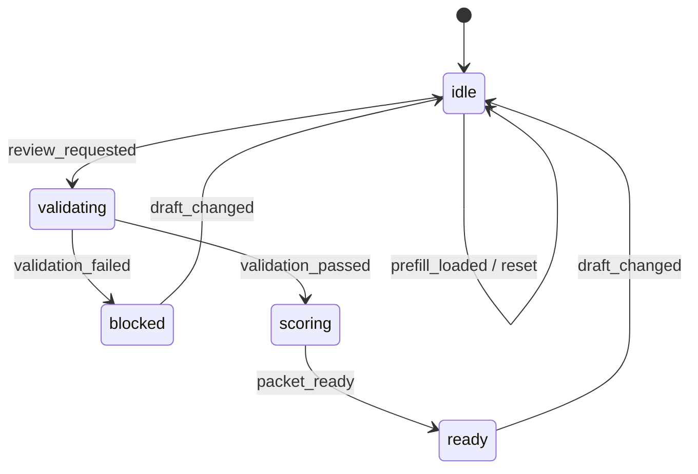

# Renewal Risk Review Playbook Example

This document explains the `Renewal Risk Review` example built with the implementation-playbook skill. It focuses on a customer-success workflow that assembles a renewal review packet from usage score, renewal window, and sponsor status.

## What It Demonstrates

- separate `draft / validation / review / activity` stores
- a scoring-oriented explicit state machine
- separation between validation issues and UI wording
- activity logs derived from domain events
- invalidating stale review output when inputs change after success

## Route

```text
/patterns/implementation-playbook/renewal-risk-review
```

## Key Files

```text
example/src/pages/patterns/implementation-playbook/renewal-risk-review/
├── RenewalRiskReviewExample.tsx
├── RenewalRiskReviewExamplePage.tsx
├── contexts/
│   └── RenewalRiskReviewContexts.tsx
├── business/
│   ├── renewalDraft.ts
│   ├── renewalValidation.ts
│   ├── renewalRiskPacket.ts
│   ├── renewalActivity.ts
│   ├── renewalStateMachine.ts
│   └── renewalBusiness.ts
├── handlers/
│   ├── RenewalRiskReviewHandlers.tsx
│   ├── renewalHandlerSupport.ts
│   ├── useRenewalDraftHandlers.tsx
│   └── useRenewalSubmissionHandlers.tsx
├── actions/
│   └── useRenewalRiskReviewActions.ts
├── hooks/
│   └── useRenewalRiskReviewData.ts
└── views/
    └── RenewalRiskReviewView.tsx
```

## State Machine



## Why This Example Matters

This example proves that the implementation-playbook also applies to renewal and customer-success workflows.

- renewal review packet creation instead of quote generation
- usage and sponsor-based risk logic instead of pricing or approval scopes
- risk band and next action calculation based on renewal timing

The same skill now spans approval, incident, and renewal workflows.

## Verification Focus

- 30-day renewals without sponsor block submission
- valid reviews generate a renewal packet
- changing usage score after success returns the workflow to idle
- reset restores the baseline state

## Related Reading

- [Implementation Playbook Standard Convention](/en/context-layered/implementation-convention)
- [Explicit State Machine](/en/context-layered/patterns/explicit-state-machine)
- [Playbook Scenario Library](/en/examples/implementation-playbook-scenarios)
