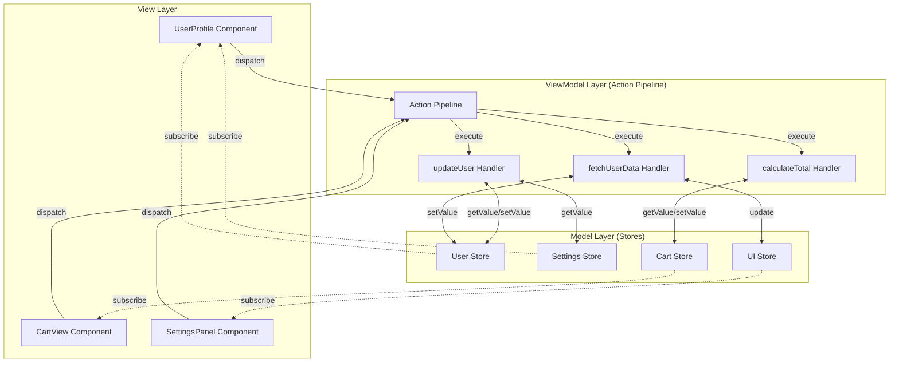
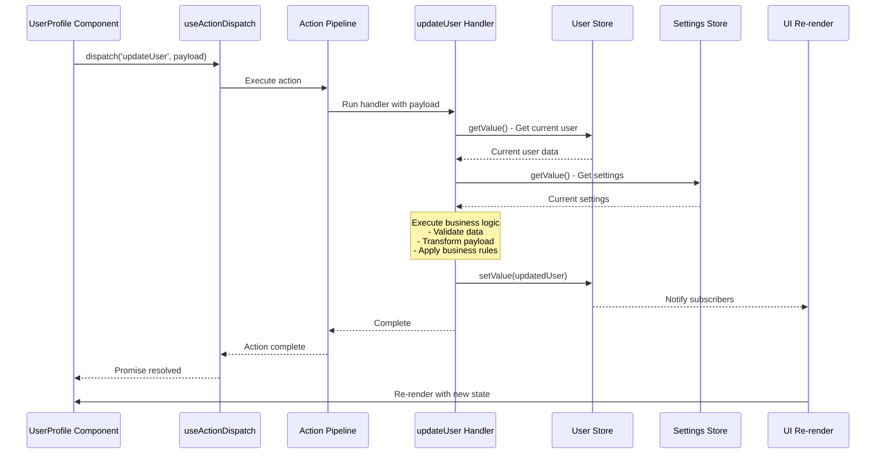
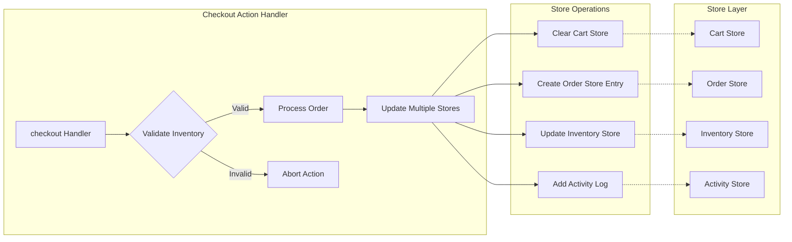
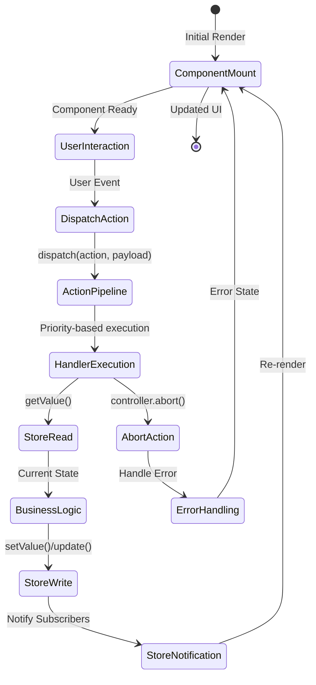
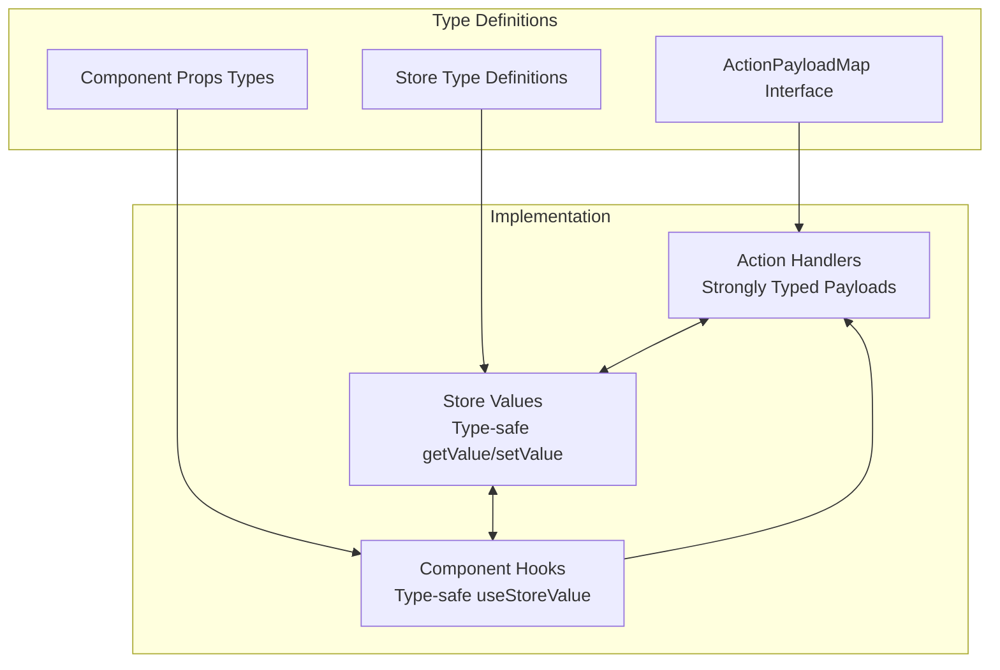
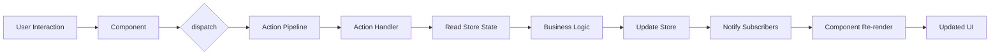
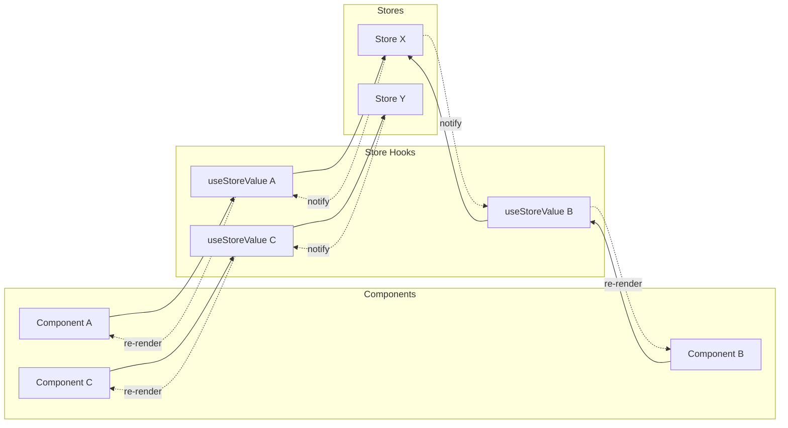

# Architecture Diagrams

This document provides comprehensive visual diagrams of the Context-Action framework architecture, showing how components, actions, and stores interact in various scenarios.

## 1. Overall Architecture Overview



This diagram shows the complete architecture with three distinct layers:
- **View Layer**: React components that render UI and dispatch actions
- **ViewModel Layer**: Action handlers that contain business logic
- **Model Layer**: Stores that manage application state

## 2. Action Execution Flow Sequence



This sequence diagram illustrates the complete flow from user interaction to UI update, showing how lazy evaluation ensures fresh state values.

## 3. Cross-Store Coordination Pattern



This diagram demonstrates how a single action can coordinate updates across multiple stores, maintaining data consistency and business rules.

## 4. Component-Store-Action Lifecycle



This state diagram shows the complete lifecycle of a component interaction, including both successful execution and error handling paths.

## 5. Type Safety Flow



This diagram illustrates how TypeScript types flow through the entire architecture, ensuring compile-time safety and better developer experience.

## 6. Data Flow Pattern



This flowchart shows the unidirectional data flow that ensures predictable state updates and easier debugging.

## 7. Error Handling Flow

```mermaid
graph TD
    ActionStart[Action Handler Starts] --> TryCatch{Try Block}
    TryCatch -->|Success| BusinessLogic[Execute Business Logic]
    TryCatch -->|Error| CatchBlock[Catch Block]
    
    BusinessLogic --> Validation{Validation}
    Validation -->|Valid| UpdateStores[Update Stores]
    Validation -->|Invalid| ControllerAbort[controller.abort()]
    
    UpdateStores --> ActionComplete[Action Complete]
    
    CatchBlock --> ErrorLogging[Log Error]
    ErrorLogging --> ErrorState[Set Error State]
    ErrorState --> ControllerAbort
    
    ControllerAbort --> ActionAborted[Action Aborted]
    ActionComplete --> ComponentReRender[Component Re-render]
    ActionAborted --> ComponentReRender
```

This diagram shows how errors are handled gracefully in the action pipeline, ensuring the application remains stable.

## 8. Store Subscription Pattern



This diagram demonstrates how multiple components can subscribe to stores and receive updates only when relevant data changes.

## Usage

These diagrams can be used to:

1. **Understand Architecture**: Get a visual overview of how the framework components interact
2. **Design New Features**: Plan how new actions and stores will fit into the existing architecture
3. **Debug Issues**: Trace the flow of data and identify potential problem areas
4. **Documentation**: Include in technical documentation and architectural decision records
5. **Team Communication**: Share with team members to explain the system design

## Related Documentation

- [Architecture Overview](./architecture.md) - Comprehensive architecture guide
- [MVVM Architecture](./mvvm-architecture.md) - Detailed MVVM pattern explanation
- [Store Integration](./store-integration.md) - Advanced store integration patterns
- [Action Pipeline](./action-pipeline.md) - Action execution system details