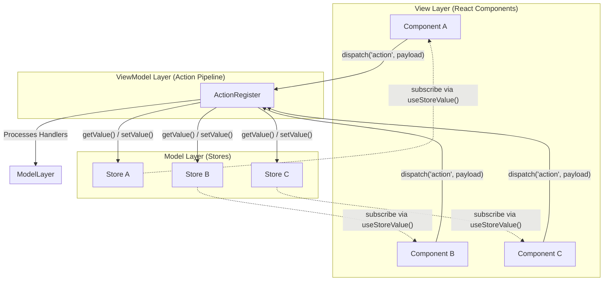
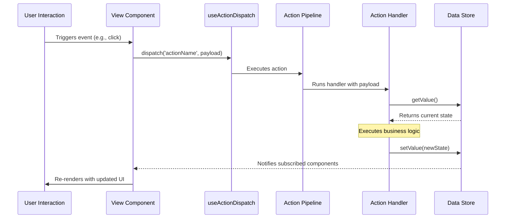
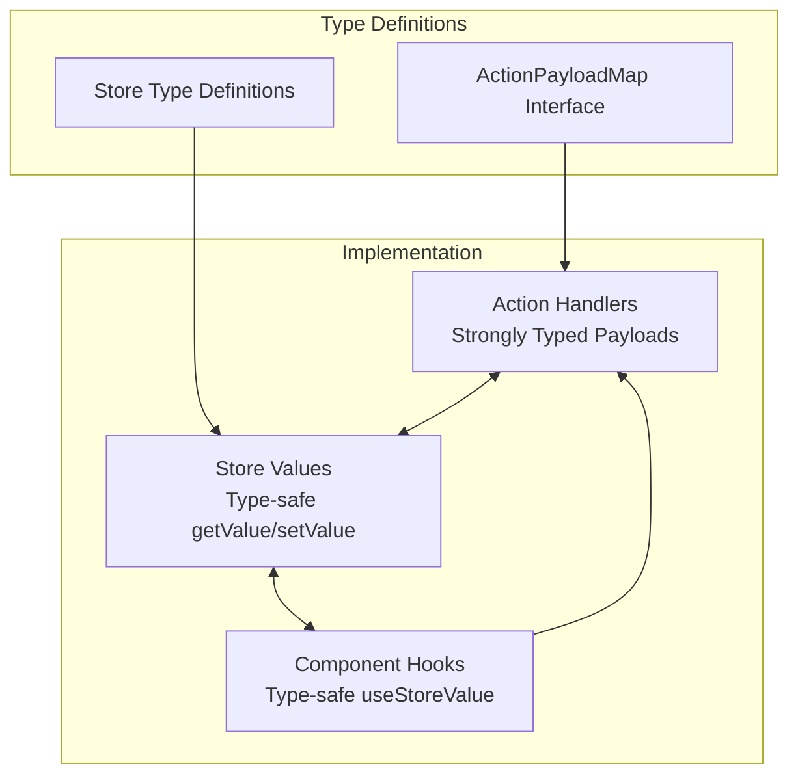
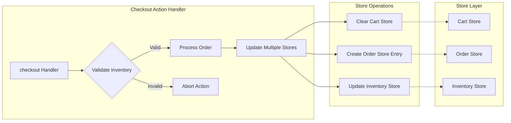

# System Architecture: MVVM and Store Integration

## Overview

The Context-Action framework implements a clean, [MVVM-inspired pattern][mvvm-pattern] optimized for modern web applications. It establishes a clear separation of concerns:

- **View Layer (Components)**: Renders UI and captures user interactions.
- **ViewModel Layer (Action Pipeline)**: Contains all business logic, processing actions and orchestrating data flow.
- **Model Layer (Stores)**: Manages application state and data persistence.

This architecture ensures a maintainable, testable, and scalable application with clear boundaries.

### High-Level Architecture Diagram



---

## Core Systems

### 1. [Action Pipeline System][action-pipeline-system]

All [actions][action-handler] are registered to a central pipeline that processes dispatched events based on priority.

```typescript
// Define action types and payloads
interface AppActions extends [ActionPayloadMap][action-payload-map] {
  updateUser: { id: string; name: string };
  calculateTotal: { items: CartItem[] };
}

// Register a handler for the 'updateUser' action
[actionRegister][actionregister].register('updateUser', async (payload, [controller][pipeline-controller]) => {
  // Business logic for updating a user resides here
});
```

### 2. [Store Integration Pattern][store-integration-pattern]

[Action handlers][action-handler] are designed to interact with stores in a decoupled manner:
1.  Read the current state from one or more stores using `store.getValue()`.
2.  Execute [business logic][business-logic] using the action's payload and the current state.
3.  Update the stores with new state using `store.setValue()` or `store.update()`.

```typescript
// An action handler demonstrating store integration
actionRegister.register('updateUser', async (payload, controller) => {
  // 1. Read current state from multiple stores
  const currentUser = userStore.getValue();
  const settings = settingsStore.getValue();
  
  // 2. Execute business logic
  const updatedUser = {
    ...currentUser,
    ...payload,
    lastModified: Date.now(),
    theme: settings.theme // Example of cross-store logic
  };
  
  // 3. Update stores
  userStore.setValue(updatedUser);
  activityStore.update(activities => [...activities, {
    type: 'user_updated',
    timestamp: Date.now(),
    userId: payload.id
  }]);
});
```

---

## Data Flow

The data flow is unidirectional and predictable, making it easy to trace and debug.

### Data Flow Sequence Diagram



### Execution Flow Steps:

1.  **Component Dispatch**: A component calls `dispatch('actionName', payload)` in response to a user interaction.
2.  **Pipeline Processing**: The action pipeline finds and executes the registered handlers for the action in priority order.
3.  **Store Access**: The handler reads the current state from stores using `getValue()`.
4.  **Business Logic**: The handler processes the payload along with the current state.
5.  **Store Updates**: The handler calls `setValue()` or `update()` to modify the state in the stores.
6.  **Component Re-render**: Components subscribed to the changed stores automatically re-render to reflect the new state.

---

## Key Design Principles

### 1. [Lazy Evaluation][lazy-evaluation]
Store getters (`getValue()`) are called at the moment of execution, not registration. This ensures that handlers always operate on the most recent state, eliminating stale closure issues.

### 2. [Decoupled Architecture][decoupled-architecture]
-   **Actions** are unaware of the components that trigger them.
-   **Stores** are unaware of the actions that modify them.
-   **Components** only need to know action names and payloads, not the underlying business logic.

### 3. [Type Safety][type-safety]
The framework is built with TypeScript from the ground up. Actions, payloads, and store values are all strongly typed, providing compile-time safety and improved developer experience.



### 4. Testability
Each layer of the architecture can be tested in isolation:
-   **Actions** can be tested with mock stores, independent of the UI.
-   **Stores** can be tested as standalone state containers.
-   **Components** can be tested with a mock `dispatch` function.

---

## Advanced Patterns & Examples

### 1. [Cross-Store Coordination][cross-store-coordination]
A single action can orchestrate updates across multiple stores, ensuring data consistency.



### 2. [Async Operations][async-operations] with State Updates
Handlers can easily manage loading states for asynchronous operations like API calls.

```typescript
actionRegister.register('fetchUserData', async (payload, controller) => {
  uiStore.update(ui => ({ ...ui, loading: true }));
  
  try {
    const user = await api.getUser(payload.userId);
    userStore.setValue(user);
  } catch (error) {
    errorStore.setValue({ message: 'Failed to fetch user', error });
    controller.abort('API error');
  } finally {
    uiStore.update(ui => ({ ...ui, loading: false }));
  }
});
```

---

## Comparison with Traditional MVVM

| Aspect | Traditional MVVM | Context-Action MVVM |
|---|---|---|
| Data Binding | Often two-way binding | Unidirectional flow via actions |
| ViewModel | Typically class instances | Functional, composable handlers |
| Commands | Command objects (e.g., `ICommand`) | Simple `dispatch('action', payload)` calls |
| State Updates | Direct property setters | Decoupled store setters |
| Type Safety | Can be runtime-dependent | Compile-time safety is central |
| Debugging | Can involve complex binding chains | Linear, traceable action flow |

## See Also

- [Store Integration](./store-integration.md) - Advanced store integration patterns
- [Action Pipeline](./action-pipeline.md) - Understanding the action execution system
- [Best Practices](./best-practices.md) - Development best practices and guidelines

<!-- Glossary Reference Links -->
[mvvm-pattern]: ../glossary/architecture-terms.md#mvvm-pattern
[action-handler]: ../glossary/core-concepts.md#action-handler
[viewmodel-layer]: ../glossary/architecture-terms.md#viewmodel-layer
[model-layer]: ../glossary/architecture-terms.md#model-layer
[view-layer]: ../glossary/architecture-terms.md#view-layer
[action-pipeline-system]: ../glossary/core-concepts.md#action-pipeline-system
[action-payload-map]: ../glossary/core-concepts.md#action-payload-map
[actionregister]: ../glossary/api-terms.md#actionregister
[pipeline-controller]: ../glossary/core-concepts.md#pipeline-controller
[store-integration-pattern]: ../glossary/core-concepts.md#store-integration-pattern
[lazy-evaluation]: ../glossary/architecture-terms.md#lazy-evaluation
[business-logic]: ../glossary/architecture-terms.md#business-logic
[decoupled-architecture]: ../glossary/architecture-terms.md#decoupled-architecture
[type-safety]: ../glossary/architecture-terms.md#type-safety
[storeprovider]: ../glossary/api-terms.md#storeprovider
[actionprovider]: ../glossary/api-terms.md#actionprovider
[action-dispatcher]: ../glossary/api-terms.md#action-dispatcher
[store-hooks]: ../glossary/api-terms.md#store-hooks
[cross-store-coordination]: ../glossary/api-terms.md#cross-store-coordination
[async-operations]: ../glossary/api-terms.md#async-operations
