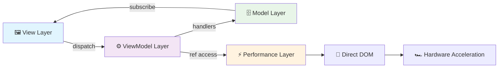
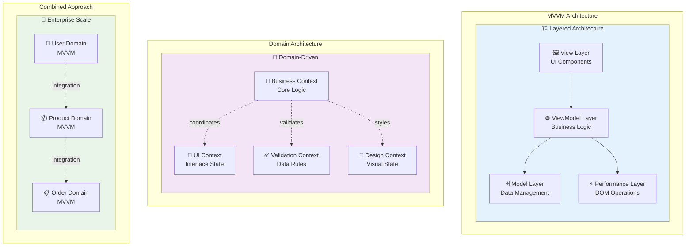

# MVVM Architecture

The Context-Action framework implements a modern MVVM (Model-View-ViewModel) architecture using the three core patterns. This is the **recommended approach** for complex applications requiring perfect separation of concerns.

**Key Difference from Domain Architecture**: 
- **MVVM**: Focuses on **architectural layers** (Model, View, ViewModel, Performance)
- **Domain Architecture**: Focuses on **business domains** (User, Product, Order, etc.)

Both can be used together - MVVM provides the architectural structure while Domain Architecture provides business separation.

## 📋 Table of Contents

### 🏗️ Architecture Foundation
1. [Architecture Overview](#architecture-overview) - MVVM 레이어 구조와 흐름
2. [Implementation Patterns](#implementation-patterns) - 각 레이어별 구현 패턴

### 🔧 Context & Action System
3. [Context Definition](#context-definition-types--context-creation) - 타입과 컨텍스트 생성
4. [Data Subscription Hooks](#data-subscription-hooks-모듈화된-데이터-구독) - 모듈화된 데이터 구독
5. [Action Hooks](#action-hooks-지연-평가-및-핸들러-정의) - 지연 평가 및 핸들러 정의

### 📁 File Convention System  
6. [Action-Based File Convention](#action-based-file-convention-system) - 선언적 스펙 기반 관리
   - [Folder Structure Convention](#폴더-구조-컨벤션)
   - [Action Hook Implementation](#액션별-훅-구현-패턴-선택적-구독--지연-평가)
   - [Component Usage Patterns](#핸들러-id-전략-및-다중-등록-패턴)

### 🔑 Handler ID Management
7. [HandlerId Core Benefits](#handlerid-기반-관리의-핵심-장점) - 함수 고유성과 생명주기 관리
8. [ActionRegister Direct Usage](#actionregister-직접-사용-패턴) - 수동 등록과 ID 주입 전략
9. [Override Patterns](#오버라이드가-필요한-경우---명시적-언마운트-패턴) - 명시적 언마운트를 통한 핸들러 교체

### 🚀 Advanced Patterns
10. [Multi-Domain MVVM](#advanced-mvvm-patterns) - 다중 도메인 아키텍처
11. [Cross-Domain Communication](#cross-domain-viewmodel-communication) - 도메인 간 통신
12. [Auto-Registration System](#자동-등록-시스템-선택사항) - 자동 훅 등록 시스템

### 📖 Best Practices & Guidelines
13. [Best Practices](#best-practices) - 레이어 분리와 통신 패턴
14. [Architecture Comparison](#when-to-use-mvvm-vs-domain-architecture) - MVVM vs Domain 선택 가이드

---

## Architecture Overview

### MVVM Layer Structure

```mermaid
graph TB
    subgraph "MVVM Architecture Layers"
        subgraph Model["🗄️ Model Layer (Store Only Pattern)"]
            M1["📊 Reactive State Management"]
            M2["🏪 Store definitions and data"]
            M3["🔒 Type-safe state containers"]
            M4["🔄 Reactive subscriptions"]
            M5["📋 Domain-specific data models"]
        end
        
        subgraph ViewModel["⚙️ ViewModel Layer (Action Only Pattern)"]
            VM1["🚀 Action Pipeline System"]
            VM2["🧠 Business logic handlers"]
            VM3["🔗 Side effects coordination"]
            VM4["📡 Cross-domain communication"]
            VM5["🎯 Event handling and orchestration"]
        end
        
        subgraph Performance["⚡ Performance Layer (RefContext Pattern)"]
            P1["🎨 Direct DOM Manipulation"]
            P2["🚫 Zero React re-renders"]
            P3["🏎️ Hardware acceleration"]
            P4["⚡ High-performance interactions"]
            P5["📺 Real-time visual updates"]
        end
        
        subgraph View["🖼️ View Layer (React Components)"]
            V1["⚛️ React Component Tree"]
            V2["🎭 UI presentation and structure"]
            V3["🔘 Event binding and dispatching"]
            V4["🔌 Provider composition"]
            V5["♻️ Component lifecycle management"]
        end
    end
    
    View --> ViewModel
    ViewModel --> Model
    Model --> View
    ViewModel --> Performance
```



### Core Architecture Flow



## Implementation Patterns

### Context Definition (Types & Context Creation)

```typescript
// contexts/UserContext.ts
// 1. Store Types Definition
export interface UserStores {
  profile: { id: string; name: string; role: 'admin' | 'user' };
  session: { isAuthenticated: boolean; permissions: string[] };
}

// 2. Action Types Definition
export interface UserActions {
  login: { email: string; password: string };
  logout: void;
  updateProfile: { name: string; role: string };
}

// 3. Context Creation
export const {
  Provider: UserModelProvider,
  useStore: useUserStore,
  useStoreManager: useUserStoreManager
} = createStoreContext<UserStores>('User', {
  profile: {
    initialValue: { id: '', name: '', role: 'user' },
    strategy: 'shallow'
  },
  session: {
    initialValue: { isAuthenticated: false, permissions: [] },
    strategy: 'shallow'
  }
});

export const {
  Provider: UserActionProvider,
  useActionDispatch: useUserActionDispatch,
  useActionHandler: useUserActionHandler
} = createActionContext<UserActions>('User');
```

### Data Subscription Hooks (모듈화된 데이터 구독)

```typescript
// hooks/useUserData.ts
// 컴포넌트들이 사용할 데이터를 구독해서 전달
export function useUserProfile() {
  const profileStore = useUserStore('profile');
  const profile = useStoreValue(profileStore);
  
  return {
    profile,
    isGuest: profile.role === 'user' && !profile.id,
    displayName: profile.name || 'Guest User',
    roleLabel: profile.role.toUpperCase()
  };
}

export function useUserSession() {
  const sessionStore = useUserStore('session');
  const session = useStoreValue(sessionStore);
  
  return {
    session,
    isAuthenticated: session.isAuthenticated,
    canAccess: (permission: string) => session.permissions.includes(permission)
  };
}

export function useUserAuthState() {
  const { profile } = useUserProfile();
  const { session } = useUserSession();
  
  return {
    isLoggedIn: session.isAuthenticated && !!profile.id,
    userInfo: { ...profile, ...session },
    authStatus: session.isAuthenticated ? 'authenticated' : 'guest'
  };
}
```

### Action Hooks (지연 평가 및 핸들러 정의)

```typescript
// hooks/useUserActions.ts
// 액션들은 필요한 데이터를 지연 평가하고 핸들러를 통해 데이터 업데이트
export function useUserAuthActions() {
  const storeManager = useUserStoreManager();
  const dispatch = useUserActionDispatch();
  
  // 로그인 핸들러 - 지연 평가로 필요한 데이터 처리
  const loginHandler = useCallback(async (payload, controller) => {
    try {
      const response = await authAPI.login(payload.email, payload.password);
      
      // 지연 평가: 로그인 성공 시점에 스토어 업데이트
      const profileStore = storeManager.getStore('profile');
      const sessionStore = storeManager.getStore('session');
      
      profileStore.setValue({
        id: response.user.id,
        name: response.user.name,
        role: response.user.role
      });
      
      sessionStore.setValue({
        isAuthenticated: true,
        permissions: response.permissions
      });
      
      return { success: true };
    } catch (error) {
      controller.abort('Login failed', error);
    }
  }, [storeManager]);
  
  useUserActionHandler('login', loginHandler);
  
  // View에서 사용할 액션 함수 반환
  const login = useCallback((email: string, password: string) => 
    dispatch('login', { email, password }), [dispatch]);
  
  return { login };
}

export function useUserDataActions() {
  const storeManager = useUserStoreManager();
  const dispatch = useUserActionDispatch();
  
  const logoutHandler = useCallback(async (payload, controller) => {
    await authAPI.logout();
    
    // 지연 평가: 로그아웃 시점에 데이터 초기화
    const profileStore = storeManager.getStore('profile');
    const sessionStore = storeManager.getStore('session');
    
    profileStore.setValue({ id: '', name: '', role: 'user' });
    sessionStore.setValue({ isAuthenticated: false, permissions: [] });
  }, [storeManager]);
  
  useUserActionHandler('logout', logoutHandler);
  
  const logout = useCallback(() => dispatch('logout', undefined), [dispatch]);
  const updateProfile = useCallback((name: string, role: string) => 
    dispatch('updateProfile', { name, role }), [dispatch]);
  
  return { logout, updateProfile };
}
```

### Performance Layer Implementation

```typescript
// performance/UserPerformanceLayer.ts
export type UserPerformanceRefs = {
  profileCard: HTMLDivElement;
};

export const {
  Provider: UserPerformanceProvider,
  useRefHandler: useUserPerformanceRef
} = createRefContext<UserPerformanceRefs>('UserPerformance');

export function useUserPerformanceActions() {
  const profileCard = useUserPerformanceRef('profileCard');
  
  const animateLoginHandler = useCallback(async (payload, controller) => {
    if (profileCard.target) {
      profileCard.target.style.transform = 'scale(1.05)';
      profileCard.target.style.transition = 'transform 300ms ease-out';
      
      setTimeout(() => {
        if (profileCard.target) {
          profileCard.target.style.transform = 'scale(1)';
        }
      }, 300);
    }
  }, [profileCard]);
  
  useUserActionHandler('login', animateLoginHandler, { priority: 50 });
  
  return { profileCardRef: profileCard };
}
```

### Pure View Layer (순수하게 데이터와 함수를 받아서 렌더링)

```typescript
// views/UserProfileView.tsx
export function UserProfileView() {
  // 데이터 구독 훅들 (모듈화된 데이터 전달)
  const { displayName, roleLabel } = useUserProfile();
  const { isAuthenticated } = useUserSession();
  const { authStatus } = useUserAuthState();
  
  // 액션 훅들 (필요한 함수들 전달)
  const { login } = useUserAuthActions();
  const { logout } = useUserDataActions();
  const { profileCardRef } = useUserPerformanceActions();
  
  // View는 순수하게 받은 데이터와 함수를 적절히 마운트
  const handleLogin = useCallback(() => {
    login('user@example.com', 'password123');
  }, [login]);
  
  return (
    <div ref={profileCardRef.setRef} className="user-profile-card">
      <div className="profile-info">
        <h2>{displayName}</h2>
        <span className={`role role-${authStatus}`}>
          {roleLabel}
        </span>
      </div>
      
      <div className="actions">
        {isAuthenticated ? (
          <button onClick={logout}>
            Logout
          </button>
        ) : (
          <button onClick={handleLogin}>
            Login
          </button>
        )}
      </div>
    </div>
  );
}
```

## Complete MVVM Application Setup

```tsx
// App.tsx - Complete MVVM architecture
function UserApp() {
  return (
    // Model Layer (Foundation)
    <UserModelProvider>
      
      {/* ViewModel Layer (Business Logic) */}
      <UserViewModelProvider>
        
        {/* Performance Layer (Zero Re-renders) */}
        <UserPerformanceProvider>
          
          {/* Handler Setup */}
          <UserMVVMHandlers />
          
          {/* View Layer (React Components) */}
          <UserProfileView />
          <UserDashboard />
          <UserSettings />
          
        </UserPerformanceProvider>
      </UserViewModelProvider>
    </UserModelProvider>
  );
}

// 각 컴포넌트가 필요한 영역만 초기화하고 고유 값 전달
function UserLoginComponent() {
  // 로그인 컴포넌트는 인증 액션만 초기화하고 고유 설정 전달
  useUserAuthActions({ 
    redirectPath: '/dashboard',
    rememberMe: true,
    loginProvider: 'oauth'
  });
  
  const { login } = useUserAuthActions();
  const { displayName, isGuest } = useUserProfile();
  
  return (
    <div className="login-form">
      {/* 로그인 폼 UI */}
    </div>
  );
}

function UserProfileComponent() {
  // 프로필 컴포넌트는 데이터 액션과 퍼포먼스 액션 초기화
  useUserDataActions({ 
    autoSave: true,
    validationRules: ['email', 'name']
  });
  useUserPerformanceActions({
    animationDuration: 300,
    enableHoverEffects: true
  });
  
  const { logout, updateProfile } = useUserDataActions();
  const { profileCardRef } = useUserPerformanceActions();
  const { displayName, roleLabel } = useUserProfile();
  
  return (
    <div ref={profileCardRef.setRef} className="user-profile">
      {/* 프로필 UI */}
    </div>
  );
}
```

## Action-Based File Convention System

### 선언적 스펙 기반 관리 시나리오

```typescript
// contexts/UserContext.ts - 스펙 선언
export interface UserActions {
  login: { email: string; password: string };          // Priority 100
  logout: void;                                        // Priority 90
  updateProfile: { name: string; role: string };      // Priority 80
  deleteAccount: { confirmToken: string };            // Priority 70
}
```

### 폴더 구조 컨벤션

```
src/
├── contexts/
│   └── UserContext.ts                    # 타입 스펙 선언
├── actions/
│   └── user/                            # 컨텍스트별 폴더
│       ├── useLogin-100.tsx             # login 액션, priority 100
│       ├── useLogin-50.tsx              # login 액션, priority 50 (성능 핸들러)
│       ├── useLogout-90.tsx             # logout 액션, priority 90
│       ├── useUpdateProfile-80.tsx      # updateProfile 액션, priority 80
│       └── useDeleteAccount-70.tsx      # deleteAccount 액션, priority 70
├── hooks/
│   └── user/
│       ├── useUserProfile.ts            # 데이터 구독 훅
│       ├── useUserSession.ts            # 세션 구독 훅
│       └── useUserAuthState.ts          # 통합 상태 훅
└── components/
    └── user/
        ├── UserLoginComponent.tsx
        └── UserProfileComponent.tsx
```

### 액션별 훅 구현 패턴 (선택적 구독 & 지연 평가)

```typescript
// actions/user/useLogin-100.tsx - 비즈니스 로직 (높은 우선순위)
export function useLogin100(options?: { 
  subscribeToProfile?: boolean;
  subscribeToSession?: boolean; 
  handlerId?: string;
}) {
  const { 
    subscribeToProfile = false, 
    subscribeToSession = false,
    handlerId = 'default-login-100'
  } = options || {};
  
  const storeManager = useUserStoreManager();
  const dispatch = useUserActionDispatch();
  
  // 선택적 구독 - 훅 내부에서 구독 여부 결정
  const profileStore = useUserStore('profile');
  const sessionStore = useUserStore('session');
  
  // useStoreValue의 condition 옵션을 활용한 조건부 구독
  const currentProfile = useStoreValue(profileStore, { 
    condition: () => subscribeToProfile 
  });
  const currentSession = useStoreValue(sessionStore, { 
    condition: () => subscribeToSession 
  });
  
  const loginHandler = useCallback(async (payload: UserActions['login'], controller) => {
    try {
      // action 내에서 store 데이터를 지연 평가
      const currentProfileData = storeManager.getStore('profile').getValue();
      const currentSessionData = storeManager.getStore('session').getValue();
      
      // 기존 상태 체크 (지연 평가로 필요한 시점에만)
      if (currentSessionData.isAuthenticated) {
        controller.abort('Already logged in');
        return;
      }
      
      const response = await authAPI.login(payload.email, payload.password);
      
      // 지연 평가로 store 업데이트
      storeManager.getStore('profile').setValue({
        id: response.user.id,
        name: response.user.name,
        role: response.user.role
      });
      
      storeManager.getStore('session').setValue({
        isAuthenticated: true,
        permissions: response.permissions
      });
      
      return { 
        success: true, 
        redirectTo: '/dashboard',
        previousProfile: currentProfileData  // 이전 상태도 반환 가능
      };
    } catch (error) {
      controller.abort('Login failed', error);
    }
  }, [storeManager]);
  
  // 마운트 단위에서 고유하게 관리 - handlerId로 구분
  useUserActionHandler('login', loginHandler, { 
    priority: 100,
    id: handlerId  // 같은 ID면 중복 등록 방지, 다른 ID면 여러개 등록 가능
  });
  
  const login = useCallback((email: string, password: string) => 
    dispatch('login', { email, password }), [dispatch]);
  
  return { 
    login,
    // 구독한 경우에만 reactive 데이터 제공 (undefined일 수 있음)
    ...(subscribeToProfile && currentProfile && { profileData: currentProfile }),
    ...(subscribeToSession && currentSession && { sessionData: currentSession })
  };
}

// actions/user/useLogin-50.tsx - 퍼포먼스/애니메이션 (낮은 우선순위)
export function useLogin50(options?: { animationDuration?: number }) {
  const profileCardRef = useUserPerformanceRef('profileCard');
  const { animationDuration = 300 } = options || {};
  
  const performanceHandler = useCallback(async (payload: UserActions['login'], controller) => {
    const result = controller.getResult(); // 이전 핸들러 결과
    
    if (result?.success && profileCardRef.target) {
      profileCardRef.target.style.transform = 'scale(1.05)';
      profileCardRef.target.style.transition = `transform ${animationDuration}ms ease-out`;
      
      setTimeout(() => {
        if (profileCardRef.target) {
          profileCardRef.target.style.transform = 'scale(1)';
        }
      }, animationDuration);
    }
  }, [profileCardRef, animationDuration]);
  
  useUserActionHandler('login', performanceHandler, { priority: 50 });
  
  return { profileCardRef };
}

// actions/user/useLogout-90.tsx
export function useLogout90(options?: {
  clearProfileData?: boolean;  // 실제 가능한 옵션으로 수정
  handlerId?: string;
  subscribeToSession?: boolean;
}) {
  const { 
    clearProfileData = true,   // 프로필 데이터도 함께 정리할지 여부
    handlerId = 'default-logout-90',
    subscribeToSession = false 
  } = options || {};
  
  const storeManager = useUserStoreManager();
  const dispatch = useUserActionDispatch();
  
  // useStoreValue의 condition 옵션을 활용한 조건부 구독
  const sessionStore = useUserStore('session');
  const currentSession = useStoreValue(sessionStore, { 
    condition: () => subscribeToSession 
  });
  
  const logoutHandler = useCallback(async (payload: UserActions['logout'], controller) => {
    // action 내에서 현재 상태 지연 평가
    const currentSessionData = storeManager.getStore('session').getValue();
    const currentProfileData = storeManager.getStore('profile').getValue();
    
    // 이미 로그아웃 상태인지 체크
    if (!currentSessionData.isAuthenticated) {
      return { success: true, message: 'Already logged out' };
    }
    
    await authAPI.logout();
    
    // 선택적으로 store 정리
    if (clearProfileData) {
      storeManager.getStore('profile').setValue({ id: '', name: '', role: 'user' });
      storeManager.getStore('session').setValue({ isAuthenticated: false, permissions: [] });
    } else {
      // 세션만 정리
      storeManager.getStore('session').setValue({ isAuthenticated: false, permissions: [] });
    }
    
    return { 
      success: true, 
      clearedProfile: clearProfileData ? currentProfileData : null 
    };
  }, [storeManager, clearProfileData]);
  
  // 마운트 단위 고유 관리
  useUserActionHandler('logout', logoutHandler, { 
    priority: 90,
    id: handlerId  // 같은 ID면 중복 등록 방지
  });
  
  const logout = useCallback(() => dispatch('logout', undefined), [dispatch]);
  
  return { 
    logout,
    // 구독한 경우에만 reactive 데이터 제공 (undefined일 수 있음)
    ...(subscribeToSession && currentSession && { sessionData: currentSession })
  };
}
```

### 핸들러 ID 전략 및 다중 등록 패턴

```typescript
// components/user/UserLoginComponent.tsx - 단일 핸들러 케이스
function UserLoginComponent() {
  // 단일 핸들러 예상 시: 순수 문자열 ID 사용
  const { login, sessionData } = useLogin100({
    subscribeToSession: true,
    subscribeToProfile: false,
    handlerId: 'login-business-logic'  // 단순 문자열 (액션당 1개 예상)
  });
  
  const { profileCardRef } = useLogin50({ 
    animationDuration: 250,
    handlerId: 'login-animation'       // 단순 문자열 (액션당 1개 예상)
  });
  
  const { displayName, isGuest } = useUserProfile();
  
  const handleLogin = useCallback(() => {
    login('user@example.com', 'password123');
  }, [login]);
  
  return (
    <div ref={profileCardRef.setRef} className="login-form">
      <h2>Welcome {displayName}</h2>
      {!sessionData?.isAuthenticated && (
        <button onClick={handleLogin}>Login</button>
      )}
    </div>
  );
}

// components/user/UserListComponent.tsx - 다중 핸들러 케이스
function UserListComponent({ users }: { users: Array<{ id: string; name: string; role: string }> }) {
  const componentId = useId(); // React useId로 컴포넌트 고유 ID
  
  return (
    <div>
      {users.map(user => (
        <UserListItem 
          key={user.id} 
          user={user} 
          componentId={componentId}  // 컴포넌트 ID 전달
        />
      ))}
    </div>
  );
}

function UserListItem({ user, componentId }: { 
  user: { id: string; name: string; role: string };
  componentId: string;
}) {
  // 데이터 기반 식별자: 사용자별로 다른 핸들러 등록
  const { updateProfile } = useUpdateProfile80({
    handlerId: `update-profile-${user.id}`, // 데이터 기반 고유 ID
    subscribeToProfile: true
  });
  
  // 컴포넌트 ID + 데이터 ID 조합
  const { logout } = useLogout90({
    handlerId: `${componentId}-logout-${user.id}`, // 컴포넌트ID + 데이터ID
    subscribeToSession: true
  });
  
  return (
    <div className="user-item">
      <span>{user.name} ({user.role})</span>
      <button onClick={() => updateProfile(user.name, user.role)}>
        Update
      </button>
      <button onClick={logout}>
        Logout This User
      </button>
    </div>
  );
}

// components/user/UserProfileComponent.tsx - 다중 용도별 핸들러
function UserProfileComponent({ userId }: { userId: string }) {
  const componentId = useId(); // React 컴포넌트 고유 ID
  
  // 의도별로 다른 핸들러 등록 (같은 액션, 다른 용도)
  const { logout: primaryLogout, sessionData } = useLogout90({
    clearProfileData: true,
    subscribeToSession: true,
    handlerId: `${componentId}-primary-logout`  // useId 기반 고유성
  });
  
  const { logout: securityLogout } = useLogout90({
    clearProfileData: false,  
    subscribeToSession: false,
    handlerId: `${componentId}-security-logout`  // useId 기반 고유성
  });
  
  // 데이터 기반 식별자 (사용자별 프로필 업데이트)
  const { updateProfile } = useUpdateProfile80({
    handlerId: `update-profile-${userId}`,  // 데이터 기반 고유 ID
    subscribeToProfile: true
  });
  
  const { displayName, roleLabel } = useUserProfile();
  
  const handleSecurityLogout = useCallback(() => {
    securityLogout();
  }, [securityLogout]);
  
  const handleFullLogout = useCallback(() => {
    primaryLogout();
  }, [primaryLogout]);
  
  return (
    <div className="user-profile">
      <h2>{displayName} ({roleLabel})</h2>
      {sessionData?.isAuthenticated && (
        <div className="actions">
          <button onClick={() => updateProfile('New Name', 'admin')}>
            Update Profile
          </button>
          <button onClick={handleFullLogout}>
            Full Logout (Clear All)
          </button>
          <button onClick={handleSecurityLogout}>
            Security Logout (Keep Profile)
          </button>
        </div>
      )}
    </div>
  );
}

// components/user/UserModalComponent.tsx - 모달별 핸들러 격리
function UserModalComponent({ modalId, user }: { 
  modalId: string; 
  user: { id: string; name: string }; 
}) {
  const componentId = useId();
  
  // 모달별 + 사용자별 고유 핸들러
  const { updateProfile } = useUpdateProfile80({
    handlerId: `${modalId}-${componentId}-update-${user.id}`, // 모달ID + 컴포넌트ID + 데이터ID
    subscribeToProfile: true
  });
  
  // 모달별 독립적인 로그아웃 동작
  const { logout } = useLogout90({
    handlerId: `${modalId}-logout-${user.id}`, // 모달ID + 데이터ID  
    clearProfileData: false // 모달에서는 세션만 정리
  });
  
  return (
    <div className="user-modal">
      <h3>Edit {user.name}</h3>
      <button onClick={() => updateProfile(user.name, 'admin')}>
        Update in Modal
      </button>
      <button onClick={logout}>
        Logout from Modal
      </button>
    </div>
  );
}
```

### HandlerId 기반 관리의 핵심 장점

#### 1. **함수 고유성 보장 및 생명주기 관리**
```typescript
// 같은 액션에 대해 서로 다른 목적의 핸들러들이 독립적으로 관리됨
const { logout: businessLogout } = useLogout90({
  handlerId: 'business-logout',     // 비즈니스 로직용
  clearProfileData: true
});

const { logout: auditLogout } = useLogout90({
  handlerId: 'audit-logout',        // 감사 로그용  
  clearProfileData: false,
  subscribeToSession: false
});

// 각각 독립적인 핸들러로 등록되어 서로 영향 없음
// handlerId가 다르면 동시에 실행되고, 같으면 중복 등록 방지됨
```

#### 2. **컴포넌트 마운트/언마운트 시 안정적 정리**
```typescript
function UserComponent({ userId }: { userId: string }) {
  // userId가 변경되어도 이전 핸들러는 자동으로 정리되고 새로 등록됨
  const { updateProfile } = useUpdateProfile80({
    handlerId: `profile-update-${userId}`,  // userId 변경 시 핸들러도 교체
    subscribeToProfile: true
  });
  
  // 컴포넌트 언마운트 시 해당 handlerId 핸들러들이 자동 정리됨
  return <div>User: {userId}</div>;
}
```

#### 3. **리렌더링 최적화 및 중복 등록 방지**
```typescript
function OptimizedComponent() {
  const [count, setCount] = useState(0);
  
  // 리렌더링이 발생해도 같은 handlerId면 핸들러 재등록 없음
  const { login } = useLogin100({
    handlerId: 'stable-login',  // 고정 ID로 안정적 관리
    subscribeToSession: true
  });
  
  // count가 변경되어도 login 핸들러는 재등록되지 않음
  return (
    <div>
      <span>Count: {count}</span>
      <button onClick={() => setCount(c => c + 1)}>Increment</button>
      <button onClick={() => login('user@test.com', 'pass')}>Login</button>
    </div>
  );
}
```

### ActionRegister 직접 사용 패턴

#### useActionHandler vs useActionRegister
```typescript
// 1. useActionHandler 방식 (권장) - 자동 ID 관리
function ComponentWithHook() {
  const loginHandler = useCallback(async (payload, controller) => {
    // 로직
  }, []);
  
  // handlerId가 자동으로 관리됨
  useUserActionHandler('login', loginHandler, {
    priority: 100,
    id: 'auto-managed-id'  // 옵션으로 직접 지정 가능
  });
}

// 2. useActionRegister 직접 사용 - 수동 ID 주입 필요
function ComponentWithRegister() {
  const actionRegister = useActionRegister(); // ActionRegister 직접 접근
  const componentId = useId();
  
  const loginHandler = useCallback(async (payload, controller) => {
    // 로직
  }, []);
  
  useEffect(() => {
    // 직접 등록 시 실제 사용 가능한 옵션들만 사용
    const unregister = actionRegister.register('login', loginHandler, {
      priority: 100,
      id: `${componentId}-direct-login`,  // ID 직접 주입 필수!
      blocking: true,
      tags: ['authentication', 'user'],   // 실제 지원되는 옵션
      category: 'auth',                    // 실제 지원되는 옵션  
      description: 'User login handler',   // 실제 지원되는 옵션
      timeout: 5000,                       // 실제 지원되는 옵션 (5초 타임아웃)
      retries: 1                          // 실제 지원되는 옵션 (1회 재시도)
    });
    
    return unregister; // 정리 함수 반환
  }, [actionRegister, loginHandler, componentId]);
}
```

#### ActionRegister 직접 사용이 필요한 경우

**동적 액션 등록과 고급 핸들러 옵션 활용:**

```typescript
// 고급 핸들러 옵션을 활용한 동적 액션 등록
function AdvancedHandlerComponent() {
  const actionRegister = useActionRegister();
  const componentId = useId();
  
  useEffect(() => {
    // 실제 ActionRegister 스펙에 맞는 고급 옵션 활용
    const unregister = actionRegister.register('advancedAction', 
      async (payload, controller) => {
        // 핸들러 로직
        return { success: true, data: payload };
      }, 
      {
        priority: 100,
        id: `${componentId}-advanced-handler`,
        blocking: true,                      // 비동기 대기
        once: false,                         // 반복 실행 허용
        debounce: 300,                       // 300ms 디바운스
        throttle: 1000                       // 1초 스로틀
      }
    );
    
    return unregister;
  }, [actionRegister, componentId]);
  
  return <div>Advanced Handler Component</div>;
}

// 간단한 핸들러 등록 예제
function SimpleHandlerComponent() {
  const actionRegister = useActionRegister();
  const componentId = useId();
  
  useEffect(() => {
    const unregisterFunctions: Array<() => void> = [];
    
    // 개발 환경에서만 디버그 핸들러 등록 (조건문으로 제어)
    if (process.env.NODE_ENV === 'development') {
      const debugUnregister = actionRegister.register('debugAction', 
        async (payload, controller) => {
          console.log('Debug action:', payload);
          return payload;
        }, 
        {
          priority: 50,
          id: `${componentId}-debug-handler`
        }
      );
      unregisterFunctions.push(debugUnregister);
    }
    
    // 분석 핸들러 (스로틀링 적용)
    const analyticsUnregister = actionRegister.register('analyticsAction', 
      async (payload, controller) => {
        await sendAnalytics(payload);
        return { tracked: true };
      }, 
      {
        priority: 90,
        id: `${componentId}-analytics-handler`,
        throttle: 5000               // 5초 스로틀링
      }
    );
    unregisterFunctions.push(analyticsUnregister);
    
    return () => {
      unregisterFunctions.forEach(unregister => unregister());
    };
  }, [actionRegister, componentId]);
  
  return <div>Simple handlers registered</div>;
}

// 조건부 핸들러 등록
function ConditionalActionComponent({ isAdmin }: { isAdmin: boolean }) {
  const actionRegister = useActionRegister();
  const componentId = useId();
  
  useEffect(() => {
    if (!isAdmin) return; // 관리자가 아니면 핸들러 등록 안함
    
    const adminHandler = async (payload: any, controller: any) => {
      // 관리자 전용 로직
      console.log('Admin action executed');
    };
    
    const unregister = actionRegister.register('adminAction', adminHandler, {
      priority: 200,
      id: `${componentId}-admin-handler`, // 컴포넌트별 고유 관리자 핸들러
      blocking: true
    });
    
    return unregister;
  }, [actionRegister, isAdmin, componentId]);
  
  return <div>Conditional Admin Actions</div>;
}
```

#### 중복 ID 처리 동작 (중요!)

**실제 ActionRegister 동작**: 
```typescript
// ActionRegister.ts 내부 로직
const existingIndex = pipeline.findIndex(reg => reg.id === handlerId);
if (existingIndex !== -1) {
  // ❌ 중복 ID 발견 시: 등록하지 않고 no-op 함수 반환
  return () => {}; // 아무것도 하지 않는 함수
}
```

**핵심**: 같은 ID로 재등록 시도하면 **무시되고 기존 핸들러 유지**됩니다!

> ⚠️ **주의**: 같은 ID로 핸들러 등록 시 조용히 무시됩니다. 예상과 다른 동작이 발생할 수 있으니 고유한 ID 사용을 권장합니다.

```typescript
// ⚠️ 경고 상황: 중복 ID로 인한 등록 무시
const unregister1 = actionRegister.register('login', handler1, { 
  id: 'duplicate-id' 
}); // ✅ 정상 등록

const unregister2 = actionRegister.register('login', handler2, { 
  id: 'duplicate-id' 
}); // ❌ 무시됨! handler1이 계속 실행

// 실제로는 handler1만 실행되고 handler2는 호출되지 않음
dispatch('login', payload); // handler1만 실행
```

#### HandlerId 주입의 중요성
```typescript
// ❌ 잘못된 예시 - ID 없이 직접 등록
function BadExample() {
  const actionRegister = useActionRegister();
  
  useEffect(() => {
    const handler = async (payload: any, controller: any) => {
      // 로직
    };
    
    // ID 없이 등록 - 충돌 위험, 불안정한 관리
    const unregister = actionRegister.register('login', handler, {
      priority: 100
      // id 없음 - 위험!
    });
    
    return unregister;
  }, [actionRegister]);
}

// ✅ 올바른 예시 - 고유 ID로 안정적 등록
function GoodExample() {
  const actionRegister = useActionRegister();
  const componentId = useId();
  
  useEffect(() => {
    const handler = async (payload: any, controller: any) => {
      // 로직
    };
    
    const unregister = actionRegister.register('login', handler, {
      priority: 100,
      id: `${componentId}-safe-login`, // 고유 ID로 안전한 관리
      blocking: true
    });
    
    return unregister;
  }, [actionRegister, componentId]);
}
```

#### 오버라이드가 필요한 경우 - 명시적 언마운트 패턴

```typescript
// 🔄 오버라이드 패턴 - 이전 핸들러를 명시적으로 제거하고 새로 등록
function OverrideExample({ mode }: { mode: 'basic' | 'advanced' }) {
  const actionRegister = useActionRegister();
  const componentId = useId();
  
  useEffect(() => {
    // ✅ 올바른 방법: mode별로 다른 ID 사용하여 등록 충돌 방지
    const handlerId = `${componentId}-${mode}-login`; // mode 포함하여 고유성 보장
    
    // 모드에 따라 다른 핸들러 등록
    const handler = mode === 'basic' 
      ? async (payload: any, controller: any) => {
          console.log('Basic login logic');
        }
      : async (payload: any, controller: any) => {
          console.log('Advanced login logic with validation');
        };
    
    const unregister = actionRegister.register('login', handler, {
      priority: 100,
      id: handlerId, // ✅ mode별 고유 ID로 충돌 없음
      blocking: true
    });
    
    return unregister; // mode 변경 시 이전 핸들러 자동 정리
  }, [actionRegister, componentId, mode]); // mode 변경 시 재등록
}

// 🔄 액션별 핸들러 교체 패턴 
function HandlerReplacementExample({ userId }: { userId: string }) {
  const actionRegister = useActionRegister();
  const componentId = useId();
  
  // userId가 변경될 때마다 핸들러 교체
  useEffect(() => {
    // ✅ userId 포함하여 고유성 보장
    const handlerId = `${componentId}-user-${userId}-handler`;
    
    // 사용자별 맞춤 핸들러 생성
    const userSpecificHandler = async (payload: any, controller: any) => {
      console.log(`User ${userId} specific logic`);
      // userId에 따른 특별한 로직
    };
    
    const unregister = actionRegister.register('updateProfile', userSpecificHandler, {
      priority: 100,
      id: handlerId, // ✅ userId 포함한 고유 ID
      blocking: true
    });
    
    return () => {
      // 명시적 정리
      unregister();
      console.log(`Handler for user ${userId} unregistered`);
    };
  }, [actionRegister, componentId, userId]); // userId 변경 시 effect 재실행
  
  return <div>User Profile Handler for: {userId}</div>;
}

// 🔄 조건부 핸들러 교체 패턴
function ConditionalHandlerReplacement({ isAdmin, userRole }: { 
  isAdmin: boolean; 
  userRole: string; 
}) {
  const actionRegister = useActionRegister();
  const componentId = useId();
  
  useEffect(() => {
    const baseHandlerId = `${componentId}-role-handler`;
    
    // 역할별로 다른 핸들러 등록
    if (isAdmin) {
      const adminHandler = async (payload: any, controller: any) => {
        console.log('Admin-level action processing');
      };
      
      const unregister = actionRegister.register('performAction', adminHandler, {
        priority: 200, // 높은 우선순위
        id: `${baseHandlerId}-admin`,
        blocking: true
      });
      
      return unregister;
    } else {
      const userHandler = async (payload: any, controller: any) => {
        console.log(`${userRole} level action processing`);
      };
      
      const unregister = actionRegister.register('performAction', userHandler, {
        priority: 100,
        id: `${baseHandlerId}-user`,
        blocking: true
      });
      
      return unregister;
    }
  }, [actionRegister, componentId, isAdmin, userRole]); // 조건 변경 시 재등록
  
  return <div>Role-based Handler Active</div>;
}
```

### 자동 등록 시스템 (선택사항)

```typescript
// utils/autoRegisterActions.ts - 자동 훅 등록 유틸리티
export function useAutoRegisterUserActions() {
  // 파일 컨벤션에 따라 자동으로 모든 액션 훅 등록
  useLogin100();
  useLogin50();
  useLogout90();
  useUpdateProfile80();
  useDeleteAccount70();
}

// App.tsx에서 사용
function UserApp() {
  return (
    <UserModelProvider>
      <UserActionProvider>
        <UserPerformanceProvider>
          <AutoRegisterActions />
          <UserComponents />
        </UserPerformanceProvider>
      </UserActionProvider>
    </UserModelProvider>
  );
}

function AutoRegisterActions() {
  useAutoRegisterUserActions(); // 모든 액션 자동 등록
  return null;
}
```

## Advanced MVVM Patterns

### Multi-Domain MVVM

```tsx
// Multiple domain MVVMs composed together
function MultiDomainApp() {
  return (
    <UserModelProvider>
      <UserViewModelProvider>
        <UserPerformanceProvider>
          <ProductModelProvider>
            <ProductViewModelProvider>
              <ECommerceApp />
            </ProductViewModelProvider>
          </ProductModelProvider>
        </UserPerformanceProvider>
      </UserViewModelProvider>
    </UserModelProvider>
  );
}
```

### Cross-Domain ViewModel Communication

```tsx
export function useIntegrationViewModel() {
  const userManager = useUserModelManager();
  const cartManager = useCartModelManager();
  
  const processCheckoutHandler = useCallback(async (payload, controller) => {
    const user = userManager.getStore('profile').getValue();
    const items = cartManager.getStore('items').getValue();
    
    const order = await orderAPI.create({
      userId: user.id,
      items: items,
      paymentMethod: payload.paymentMethod
    });
    
    cartManager.getStore('items').setValue([]);
    return order;
  }, [userManager, cartManager]);
  
  useIntegrationViewModelHandler('processCheckout', processCheckoutHandler);
}
```


## Best Practices

### 1. Layer Separation
- **Model**: Pure data and state management
- **ViewModel**: Pure business logic and coordination
- **Performance**: Pure DOM manipulation and animations
- **View**: Pure UI presentation and event binding

### 2. Communication Patterns
- **View → ViewModel**: Action dispatch for business logic
- **ViewModel → Model**: Store updates for state changes
- **Performance**: Direct DOM manipulation for immediate feedback
- **Model → View**: Reactive subscriptions for UI updates

### 3. Handler Registration (Critical)
- **Always use useCallback**: Wrap all handler functions with `useCallback` to prevent infinite re-registration
- **Proper Dependencies**: Include only necessary dependencies in useCallback dependency array
- **Avoid Inline Functions**: Never pass inline arrow functions directly to `useActionHandler`
- **Memory Management**: Proper memoization prevents memory leaks and infinite loops

> **Important**: For detailed handler registration patterns, see the [Handler Registration Guide](../conventions.md#handler-registration)

### 4. Type Safety
- **Domain Models**: Define clear interfaces for each domain
- **Action Interfaces**: Type-safe action definitions
- **Ref Types**: Strongly typed DOM element references
- **Cross-Domain**: Type-safe integration patterns

### 5. Performance Optimization
- **Model**: Use appropriate comparison strategies
- **ViewModel**: Keep handlers lightweight and focused
- **Performance**: Use hardware acceleration for animations
- **View**: Minimize re-renders through selective subscriptions

## When to Use MVVM vs Domain Architecture

### Architecture Comparison



### Selection Guide

| Pattern | Best For | Structure |
|---------|----------|----------|
| **MVVM Architecture** | Complex single-domain apps, clear architectural layers | Model → ViewModel → Performance → View |
| **Domain Architecture** | Multi-domain apps, team boundaries, microservice alignment | Business → UI → Validation → Design contexts |
| **Combined Approach** | Enterprise applications | MVVM layers within each business domain |

The MVVM architecture provides perfect separation of concerns while maintaining type safety and optimal performance characteristics.

## Related Code Patterns

For complete implementation examples and detailed code patterns, see:

- **[MVVM Pattern Guide](../patterns/architecture/mvvm.md)** - Complete MVVM implementation patterns with detailed examples
- **[Store Only Pattern](../patterns/store/basic-usage.md)** - Model Layer implementation patterns
- **[Action Only Pattern](../patterns/action/basic-usage.md)** - ViewModel Layer implementation patterns  
- **[RefContext Pattern](../patterns/ref/basic-usage.md)** - Performance Layer implementation patterns
- **[Domain Context Architecture](../patterns/architecture/domain-context.md)** - Alternative for multi-domain applications
- **[Pattern Composition](../patterns/architecture/composition.md)** - Advanced architectural composition strategies
- **[Context Splitting Patterns](../patterns/architecture/context-splitting.md)** - Managing and splitting large contexts when applications grow complex