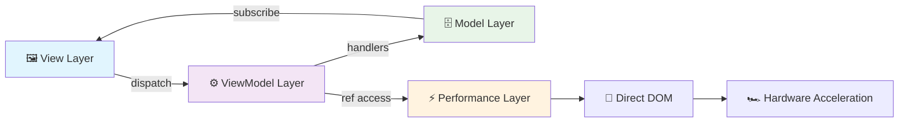
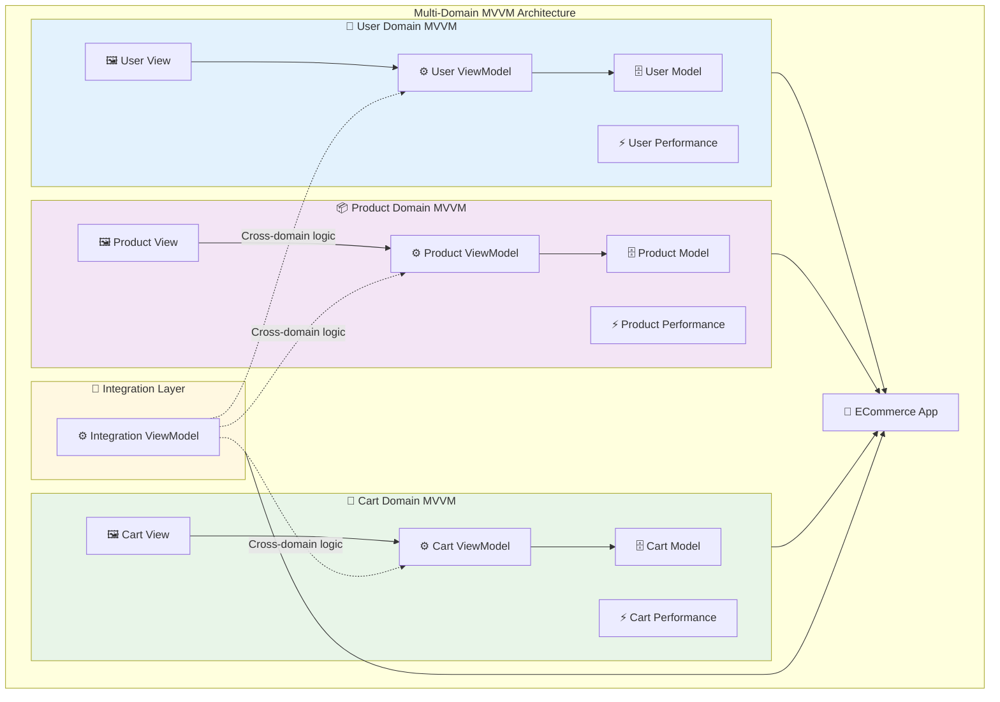
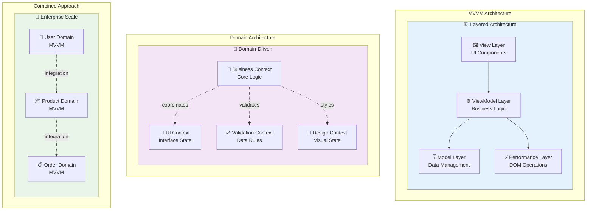

# MVVM Architecture

The Context-Action framework implements a modern MVVM (Model-View-ViewModel) architecture using the three core patterns. This is the **recommended approach** for complex applications requiring perfect separation of concerns.

**Key Difference from Domain Architecture**: 
- **MVVM**: Focuses on **architectural layers** (Model, View, ViewModel, Performance)
- **Domain Architecture**: Focuses on **business domains** (User, Product, Order, etc.)

Both can be used together - MVVM provides the architectural structure while Domain Architecture provides business separation.

## Architecture Overview

### MVVM Layer Structure

```mermaid
graph TB
    subgraph "MVVM Architecture Layers"
        subgraph Model["🗄️ Model Layer (Store Only Pattern)"]
            M1["📊 Reactive State Management"]
            M2["🏪 Store definitions and data"]
            M3["🔒 Type-safe state containers"]
            M4["🔄 Reactive subscriptions"]
            M5["📋 Domain-specific data models"]
        end
        
        subgraph ViewModel["⚙️ ViewModel Layer (Action Only Pattern)"]
            VM1["🚀 Action Pipeline System"]
            VM2["🧠 Business logic handlers"]
            VM3["🔗 Side effects coordination"]
            VM4["📡 Cross-domain communication"]
            VM5["🎯 Event handling and orchestration"]
        end
        
        subgraph Performance["⚡ Performance Layer (RefContext Pattern)"]
            P1["🎨 Direct DOM Manipulation"]
            P2["🚫 Zero React re-renders"]
            P3["🏎️ Hardware acceleration"]
            P4["⚡ High-performance interactions"]
            P5["📺 Real-time visual updates"]
        end
        
        subgraph View["🖼️ View Layer (React Components)"]
            V1["⚛️ React Component Tree"]
            V2["🎭 UI presentation and structure"]
            V3["🔘 Event binding and dispatching"]
            V4["🔌 Provider composition"]
            V5["♻️ Component lifecycle management"]
        end
    end
    
    View --> ViewModel
    ViewModel --> Model
    Model --> View
    ViewModel --> Performance
```



### Core Architecture Flow



## Implementation Patterns

### Model Layer Implementation

```typescript
// models/UserModel.ts
export interface UserModel {
  // Business data
  profile: {
    id: string;
    name: string;
    email: string;
    role: 'admin' | 'user' | 'guest';
  };
  
  // Application state
  session: {
    isAuthenticated: boolean;
    lastActivity: number;
    permissions: string[];
  };
  
  // UI state
  preferences: {
    theme: 'light' | 'dark';
    language: string;
    notifications: boolean;
  };
}

// Create Model Layer with domain-specific stores
export const {
  Provider: UserModelProvider,
  useStore: useUserModel,
  useStoreManager: useUserModelManager
} = createDeclarativeStorePattern<UserModel>('UserModel', {
  profile: {
    initialValue: { id: '', name: '', email: '', role: 'guest' },
    strategy: 'shallow', // Shallow comparison for objects
    tags: ['user', 'profile'],
    description: 'User profile information'
  },
  
  session: {
    initialValue: { isAuthenticated: false, lastActivity: 0, permissions: [] },
    strategy: 'shallow',
    tags: ['user', 'session'],
    description: 'User session state'
  },
  
  preferences: {
    initialValue: { theme: 'light', language: 'en', notifications: true },
    strategy: 'shallow',
    tags: ['user', 'preferences'],
    description: 'User preferences and settings'
  }
});
```

### ViewModel Layer Implementation

```typescript
// viewModels/UserViewModel.ts
export interface UserViewModelActions {
  // Authentication actions
  login: { email: string; password: string };
  logout: void;
  refreshSession: void;
  
  // Profile management
  updateProfile: { data: Partial<UserModel['profile']> };
  uploadAvatar: { file: File };
  
  // Preferences
  updatePreferences: { preferences: Partial<UserModel['preferences']> };
  toggleTheme: void;
  
  // Business logic
  calculateUserScore: { criteria: string[] };
  generateReport: { reportType: string; dateRange: any };
}

// Create ViewModel Layer
export const {
  Provider: UserViewModelProvider,
  useActionDispatch: useUserViewModel,
  useActionHandler: useUserViewModelHandler,
  useActionDispatchWithResult: useUserViewModelWithResult
} = createActionContext<UserViewModelActions>('UserViewModel');

// ViewModel business logic handlers
export function useUserViewModelHandlers() {
  const modelManager = useUserModelManager();
  
  // Login handler with business logic
  const loginHandler = useCallback(async (payload, controller) => {
    const profileStore = modelManager.getStore('profile');
    const sessionStore = modelManager.getStore('session');
    
    try {
      // Business logic - validation
      if (!isValidEmail(payload.email)) {
        controller.abort('Invalid email format');
        return;
      }
      
      // Business logic - API call
      const response = await authAPI.login(payload.email, payload.password);
      
      // Update Model layer
      profileStore.setValue({
        id: response.user.id,
        name: response.user.name,
        email: response.user.email,
        role: response.user.role
      });
      
      sessionStore.setValue({
        isAuthenticated: true,
        lastActivity: Date.now(),
        permissions: response.permissions
      });
      
      // Return result for View layer
      return { success: true, userId: response.user.id };
      
    } catch (error) {
      controller.abort('Login failed', error);
      return { success: false, error: error.message };
    }
  }, [modelManager]);
  
  // Register handler with ViewModel
  useUserViewModelHandler('login', loginHandler, {
    priority: 100,
    blocking: true,
    id: 'user-login-handler',
    tags: ['authentication', 'business-logic']
  });
  
  // Theme toggle handler
  const toggleThemeHandler = useCallback(async (payload, controller) => {
    const preferencesStore = modelManager.getStore('preferences');
    const currentPreferences = preferencesStore.getValue();
    
    const newTheme = currentPreferences.theme === 'light' ? 'dark' : 'light';
    
    preferencesStore.setValue({
      ...currentPreferences,
      theme: newTheme
    });
    
    return { theme: newTheme };
  }, [modelManager]);
  
  useUserViewModelHandler('toggleTheme', toggleThemeHandler, {
    priority: 90,
    blocking: true,
    id: 'toggle-theme-handler',
    tags: ['preferences', 'ui']
  });
}
```

### Performance Layer Implementation

```typescript
// performance/UserPerformanceLayer.ts
export type UserPerformanceRefs = {
  // Theme transition elements
  themeRoot: HTMLDivElement;
  themeOverlay: HTMLDivElement;
  
  // Interactive elements
  avatar: HTMLImageElement;
  profileCard: HTMLDivElement;
  
  // Notification system
  notificationContainer: HTMLDivElement;
  toastElements: HTMLDivElement;
};

// Create Performance Layer
export const {
  Provider: UserPerformanceProvider,
  useRefHandler: useUserPerformanceRef
} = createRefContext<UserPerformanceRefs>('UserPerformance');

// Performance handlers for zero re-render updates
export function useUserPerformanceHandlers() {
  const themeRoot = useUserPerformanceRef('themeRoot');
  const themeOverlay = useUserPerformanceRef('themeOverlay');
  const notificationContainer = useUserPerformanceRef('notificationContainer');
  
  // Handle theme changes with hardware acceleration
  const themeTransitionHandler = useCallback(async (payload, controller) => {
    const result = controller.getResult(); // Get result from previous handlers
    
    if (result?.theme && themeRoot.target && themeOverlay.target) {
      // Hardware-accelerated theme transition
      themeOverlay.target.style.background = result.theme === 'dark' 
        ? 'linear-gradient(135deg, #1a1a1a, #2d2d2d)' 
        : 'linear-gradient(135deg, #ffffff, #f8f9fa)';
      
      themeOverlay.target.style.opacity = '0';
      themeOverlay.target.style.transition = 'opacity 300ms ease-in-out';
      
      // Apply theme to root
      themeRoot.target.setAttribute('data-theme', result.theme);
      
      // Fade in new theme
      requestAnimationFrame(() => {
        if (themeOverlay.target) {
          themeOverlay.target.style.opacity = '1';
        }
      });
    }
  }, [themeRoot, themeOverlay]);

  useUserViewModelHandler('toggleTheme', themeTransitionHandler, {
    priority: 50, // After business logic
    blocking: false, // Non-blocking performance update
    id: 'theme-performance-handler',
    tags: ['performance', 'theme', 'animation']
  });
  
  // Show notifications without React re-renders
  const showNotificationHandler = useCallback((message: string, type: 'success' | 'error') => {
    if (!notificationContainer.target) return;
    
    const toast = document.createElement('div');
    toast.className = `toast toast-${type}`;
    toast.textContent = message;
    toast.style.transform = 'translateX(100%)';
    toast.style.transition = 'transform 300ms ease-out';
    
    notificationContainer.target.appendChild(toast);
    
    // Hardware-accelerated slide-in animation
    requestAnimationFrame(() => {
      toast.style.transform = 'translateX(0)';
    });
    
    // Auto-remove after 3 seconds
    setTimeout(() => {
      toast.style.transform = 'translateX(100%)';
      setTimeout(() => {
        if (toast.parentNode) {
          toast.parentNode.removeChild(toast);
        }
      }, 300);
    }, 3000);
  }, [notificationContainer]);
  
  return { showNotificationHandler };
}
```

### View Layer Implementation

```typescript
// views/UserProfileView.tsx
export function UserProfileView() {
  // Model Layer - reactive data subscriptions
  const profileStore = useUserModel('profile');
  const sessionStore = useUserModel('session');
  const preferencesStore = useUserModel('preferences');
  
  const profile = useStoreValue(profileStore);
  const session = useStoreValue(sessionStore);
  const preferences = useStoreValue(preferencesStore);
  
  // ViewModel Layer - business logic dispatch
  const dispatch = useUserViewModel();
  const { dispatchWithResult } = useUserViewModelWithResult();
  
  // Performance Layer - direct DOM manipulation
  const avatarRef = useUserPerformanceRef('avatar');
  const profileCardRef = useUserPerformanceRef('profileCard');
  const { showNotificationHandler } = useUserPerformanceHandlers();
  
  // View-specific event handlers
  const handleLogin = useCallback(async () => {
    try {
      const result = await dispatchWithResult('login', {
        email: 'user@example.com',
        password: 'password123'
      });
      
      if (result?.success) {
        showNotificationHandler('Login successful!', 'success');
        
        // Animate profile card appearance
        if (profileCardRef.target) {
          profileCardRef.target.style.transform = 'scale(0.9)';
          profileCardRef.target.style.opacity = '0';
          profileCardRef.target.style.transition = 'all 300ms ease-out';
          
          requestAnimationFrame(() => {
            if (profileCardRef.target) {
              profileCardRef.target.style.transform = 'scale(1)';
              profileCardRef.target.style.opacity = '1';
            }
          });
        }
      }
    } catch (error) {
      showNotificationHandler('Login failed', 'error');
    }
  }, [dispatchWithResult, showNotificationHandler, profileCardRef]);
  
  const handleToggleTheme = useCallback(() => {
    dispatch('toggleTheme', undefined); // ViewModel handles business logic and Performance handles animation
  }, [dispatch]);
  
  const handleAvatarClick = useCallback(() => {
    // Direct DOM manipulation for immediate feedback
    if (avatarRef.target) {
      avatarRef.target.style.transform = 'scale(1.1)';
      avatarRef.target.style.transition = 'transform 150ms ease-out';
      
      setTimeout(() => {
        if (avatarRef.target) {
          avatarRef.target.style.transform = 'scale(1)';
        }
      }, 150);
    }
    
    // Then dispatch business logic
    dispatch('uploadAvatar', { file: null }); // Would open file picker
  }, [avatarRef, dispatch]);
  
  return (
    <div 
      ref={profileCardRef.setRef}
      className="user-profile-card"
      data-theme={preferences.theme}
    >
      
      
      <div className="profile-info">
        <h2>{profile.name || 'Guest User'}</h2>
        <p>{profile.email}</p>
        <span className={`role role-${profile.role}`}>
          {profile.role.toUpperCase()}
        </span>
      </div>
      
      <div className="actions">
        {session.isAuthenticated ? (
          <>
            <button onClick={handleToggleTheme}>
              Toggle Theme ({preferences.theme})
            </button>
            <button onClick={() => dispatch('logout', undefined)}>
              Logout
            </button>
          </>
        ) : (
          <button onClick={handleLogin}>
            Login
          </button>
        )}
      </div>
    </div>
  );
}
```

## Complete MVVM Application Setup

```tsx
// App.tsx - Complete MVVM architecture
function UserApp() {
  return (
    // Model Layer (Foundation)
    <UserModelProvider>
      
      {/* ViewModel Layer (Business Logic) */}
      <UserViewModelProvider>
        
        {/* Performance Layer (Zero Re-renders) */}
        <UserPerformanceProvider>
          
          {/* Handler Setup */}
          <UserMVVMHandlers />
          
          {/* View Layer (React Components) */}
          <UserProfileView />
          <UserDashboard />
          <UserSettings />
          
        </UserPerformanceProvider>
      </UserViewModelProvider>
    </UserModelProvider>
  );
}

// Handler setup component
function UserMVVMHandlers() {
  useUserViewModelHandlers(); // Business logic handlers
  useUserPerformanceHandlers(); // Performance handlers
  return null;
}
```

## Advanced MVVM Patterns

### Multi-Domain MVVM

#### Architecture Diagram



#### Implementation

```tsx
// Multiple domain MVVMs composed together
function MultiDomainApp() {
  return (
    // User Domain MVVM
    <UserModelProvider>
      <UserViewModelProvider>
        <UserPerformanceProvider>
          
          {/* Product Domain MVVM */}
          <ProductModelProvider>
            <ProductViewModelProvider>
              <ProductPerformanceProvider>
                
                {/* Shopping Cart Domain MVVM */}
                <CartModelProvider>
                  <CartViewModelProvider>
                    <CartPerformanceProvider>
                      
                      <ECommerceApp />
                      
                    </CartPerformanceProvider>
                  </CartViewModelProvider>
                </CartModelProvider>
                
              </ProductPerformanceProvider>
            </ProductViewModelProvider>
          </ProductModelProvider>
          
        </UserPerformanceProvider>
      </UserViewModelProvider>
    </UserModelProvider>
  );
}
```

### Cross-Domain ViewModel Communication

```tsx
// Integration ViewModels for cross-domain logic
export interface IntegrationViewModelActions {
  syncUserAndCart: { userId: string };
  processCheckout: { cartId: string; paymentMethod: any };
  updateUserFromOrder: { orderId: string };
}

export function useIntegrationViewModel() {
  // Access multiple domain models
  const userManager = useUserModelManager();
  const cartManager = useCartModelManager();
  
  // Cross-domain business logic
  useIntegrationViewModelHandler('processCheckout', async (payload, controller) => {
    const userProfileStore = userManager.getStore('profile');
    const cartItemsStore = cartManager.getStore('items');
    
    const user = userProfileStore.getValue();
    const items = cartItemsStore.getValue();
    
    // Cross-domain business logic
    const order = await orderAPI.create({
      userId: user.id,
      items: items,
      paymentMethod: payload.paymentMethod
    });
    
    // Update multiple domains
    cartItemsStore.setValue([]); // Clear cart
    
    return order;
  });
}
```

## Testing MVVM Architecture

### Model Layer Testing

```typescript
// __tests__/models/UserModel.test.ts
describe('User Model Layer', () => {
  it('should update profile store', () => {
    const { result } = renderHook(() => useUserModel('profile'));
    
    act(() => {
      result.current.setValue({
        id: '123',
        name: 'John Doe',
        email: 'john@example.com',
        role: 'user'
      });
    });
    
    expect(result.current.getValue().name).toBe('John Doe');
  });
});
```

### ViewModel Layer Testing

```typescript
// __tests__/viewModels/UserViewModel.test.ts
describe('User ViewModel Layer', () => {
  it('should handle login action', async () => {
    const mockController = createMockController();
    const mockModelManager = createMockModelManager();
    
    const loginHandler = createLoginHandler(mockModelManager);
    
    const result = await loginHandler({
      email: 'test@example.com',
      password: 'password123'
    }, mockController);
    
    expect(result.success).toBe(true);
    expect(mockModelManager.getStore).toHaveBeenCalledWith('profile');
  });
});
```

## Best Practices

### 1. Layer Separation
- **Model**: Pure data and state management
- **ViewModel**: Pure business logic and coordination
- **Performance**: Pure DOM manipulation and animations
- **View**: Pure UI presentation and event binding

### 2. Communication Patterns
- **View → ViewModel**: Action dispatch for business logic
- **ViewModel → Model**: Store updates for state changes
- **Performance**: Direct DOM manipulation for immediate feedback
- **Model → View**: Reactive subscriptions for UI updates

### 3. Handler Registration (Critical)
- **Always use useCallback**: Wrap all handler functions with `useCallback` to prevent infinite re-registration
- **Proper Dependencies**: Include only necessary dependencies in useCallback dependency array
- **Avoid Inline Functions**: Never pass inline arrow functions directly to `useActionHandler`
- **Memory Management**: Proper memoization prevents memory leaks and infinite loops

> **Important**: For detailed handler registration patterns, see the [Handler Registration Guide](../conventions.md#handler-registration)

### 4. Type Safety
- **Domain Models**: Define clear interfaces for each domain
- **Action Interfaces**: Type-safe action definitions
- **Ref Types**: Strongly typed DOM element references
- **Cross-Domain**: Type-safe integration patterns

### 5. Performance Optimization
- **Model**: Use appropriate comparison strategies
- **ViewModel**: Keep handlers lightweight and focused
- **Performance**: Use hardware acceleration for animations
- **View**: Minimize re-renders through selective subscriptions

## When to Use MVVM vs Domain Architecture

### Architecture Comparison



### Selection Guide

| Pattern | Best For | Structure |
|---------|----------|----------|
| **MVVM Architecture** | Complex single-domain apps, clear architectural layers | Model → ViewModel → Performance → View |
| **Domain Architecture** | Multi-domain apps, team boundaries, microservice alignment | Business → UI → Validation → Design contexts |
| **Combined Approach** | Enterprise applications | MVVM layers within each business domain |

The MVVM architecture provides perfect separation of concerns while maintaining type safety and optimal performance characteristics.