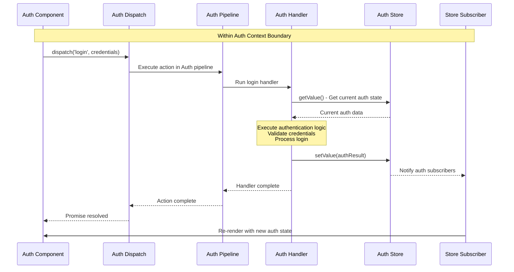
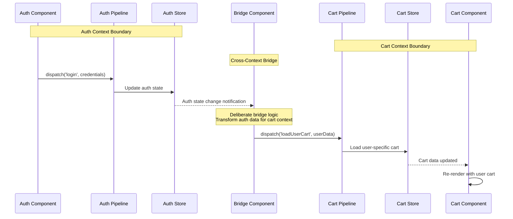
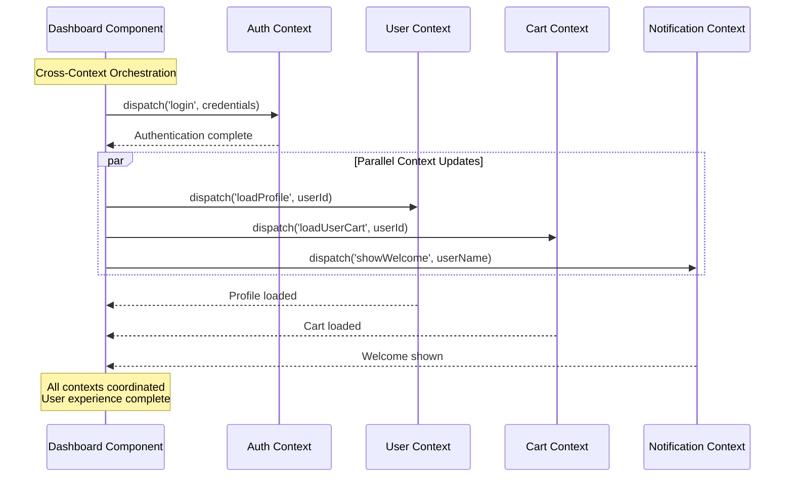

# Context-Based Data Flow

## Overview

The Context-Action framework's data flow is organized around **context boundaries**, ensuring that data moves predictably within domain boundaries while allowing controlled cross-context communication when needed.

## Context-Based Data Flow

### Intra-Context Data Flow (Single Context)



### Cross-Context Communication



### Multi-Context Coordination Flow



## Context-Scoped Execution Flow

### 1. Context-Scoped Dispatch
Component calls `contextDispatch('actionName', payload)` within its context boundary

### 2. Domain Pipeline Processing  
Context-specific ActionRegister executes registered handlers in priority order

### 3. Context Store Access
Handlers access stores within the same context boundary

### 4. Domain Business Logic
Handlers process payload with context-specific state values

### 5. Context Store Updates
Handlers update stores within their domain boundary

### 6. Context Component Re-render
Only components within the same context that subscribe to updated stores re-render

### 7. Cross-Context Communication
If needed, explicit bridges handle communication between contexts

## Detailed Flow Examples

### Single Context Flow

```typescript
// Within UserContext
function UserProfile() {
  const dispatch = UserContext.useAction();
  const user = useStoreValue(userStore);

  const handleUpdateName = (newName: string) => {
    // 1. Component dispatches action within context
    dispatch('updateUser', { id: user.id, name: newName });
  };

  // 6. Component re-renders when userStore updates
  return <div>{user.name}</div>;
}

// Handler within same context
UserContext.useActionHandler('updateUser', async (payload, controller) => {
  // 3. Handler accesses context stores
  const currentUser = userStore.getValue();
  
  // 4. Business logic with context data
  const updatedUser = { ...currentUser, ...payload };
  
  // 5. Update context stores
  userStore.setValue(updatedUser);
});
```

### Cross-Context Flow

```typescript
// Cross-context coordination
function useLoginFlow() {
  const authDispatch = AuthContext.useAction();
  const userDispatch = UserContext.useAction();
  const notificationDispatch = NotificationContext.useAction();

  const handleLogin = async (credentials) => {
    try {
      // Step 1: Authenticate in AuthContext
      await authDispatch('login', credentials);
      
      // Step 2: Load user data in UserContext
      await userDispatch('loadUserProfile', { userId: credentials.userId });
      
      // Step 3: Show success notification
      await notificationDispatch('showSuccess', { message: 'Login successful' });
      
    } catch (error) {
      // Error handling across contexts
      await notificationDispatch('showError', { message: 'Login failed' });
    }
  };

  return handleLogin;
}
```

## Data Flow Patterns

### 1. Intra-Context Pattern
- All data flows within a single context boundary
- Components → Actions → Stores → Components (within same context)
- Fast and isolated execution
- No external dependencies

### 2. Cross-Context Coordination Pattern
- Explicit coordination between multiple contexts
- Higher-level component orchestrates multiple context actions
- Clear ownership and responsibility
- Controlled complexity

### 3. Context Bridge Pattern
- Dedicated bridge components handle cross-context communication
- Event-driven or callback-based communication
- Decoupled context interactions
- Reusable communication patterns

```typescript
// Context Bridge Example
function useContextBridge() {
  const authDispatch = AuthContext.useAction();
  const userDispatch = UserContext.useAction();

  // Bridge function
  const bridgeAuthToUser = async (authData) => {
    // Transform data between contexts
    const userData = transformAuthToUser(authData);
    await userDispatch('setUserData', userData);
  };

  // Listen for auth events
  AuthContext.useActionHandler('loginSuccess', async (authData, controller) => {
    await bridgeAuthToUser(authData);
  });
}
```

## Flow Control Mechanisms

### 1. Pipeline Controller
Each action handler receives a controller for flow management:

```typescript
UserContext.useActionHandler('complexOperation', async (payload, controller) => {
  // Continue to next handler
  controller.next();
  
  // Abort pipeline execution
  controller.abort('Validation failed');
  
  // Modify payload for subsequent handlers
  controller.modifyPayload(data => ({ ...data, processed: true }));
  
  // Get current payload
  const currentData = controller.getPayload();
  
  // Jump to specific priority level
  controller.jumpToPriority(10);
});
```

### 2. Execution Modes
Different execution patterns within context:

```typescript
// Sequential execution (default)
await dispatch('action1', data);
await dispatch('action2', data);

// Parallel execution
await Promise.all([
  dispatch('action1', data),
  dispatch('action2', data)
]);

// Race execution (first completed wins)
await Promise.race([
  dispatch('fastAction', data),
  dispatch('slowAction', data)
]);
```

## Performance Considerations

### 1. Context Scope Optimization
- Only components within affected context re-render
- Store subscriptions are context-scoped by default
- Minimal cross-context re-render impact

### 2. Lazy Context Loading
```typescript
// Load contexts only when needed
const LazyAuthContext = lazy(() => import('./AuthContext'));

function App() {
  return (
    <Suspense fallback={<Loading />}>
      <LazyAuthContext.Provider>
        <AuthSection />
      </LazyAuthContext.Provider>
    </Suspense>
  );
}
```

### 3. Context Memory Management
```typescript
// Proper cleanup on unmount
function useContextCleanup() {
  useEffect(() => {
    return () => {
      // Cleanup context resources
      contextStore.clear();
      eventListeners.removeAll();
    };
  }, []);
}
```

## Next Steps

- **React Integration**: Learn how to implement these flows in React components in [integration.md](./integration.md)
- **Advanced Patterns**: Explore complex flow scenarios in [patterns.md](./patterns.md)
- **Best Practices**: See optimization guidelines in [best-practices.md](./best-practices.md)