# Context-Action Architectural Diagrams

## Overview

This document contains visual representations of the Context-Action framework's architecture, data flow patterns, and integration models. These diagrams help illustrate the context-based domain isolation concepts and implementation patterns.

## Overall Architecture Overview

### Context-Based Domain Architecture

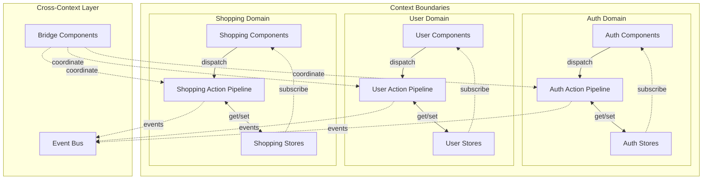

### MVVM Pattern with Context Isolation

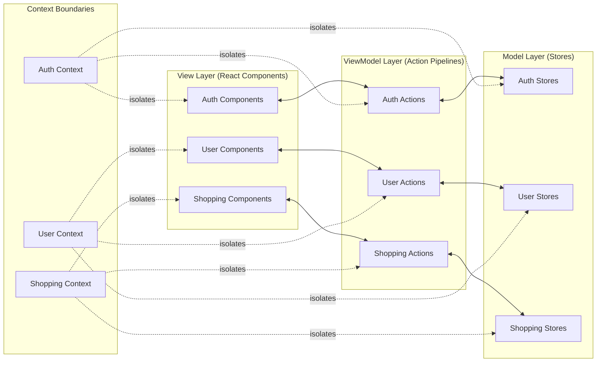

## Action Execution Flow Sequence

### Single Context Execution

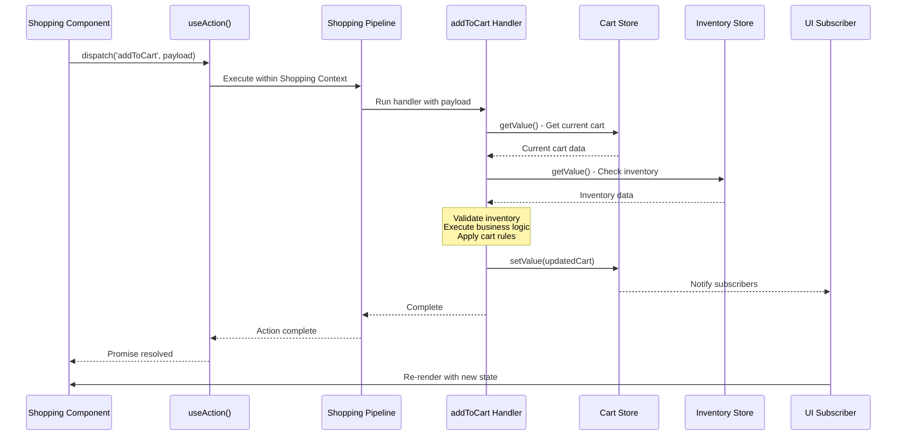

### Cross-Context Coordination Sequence

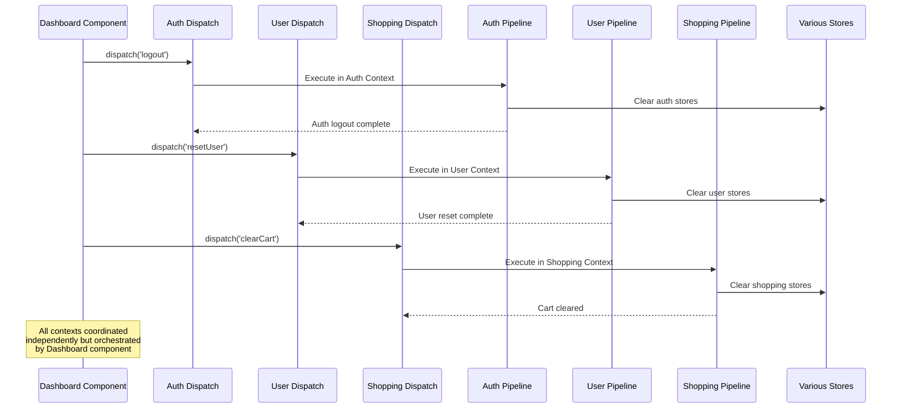

## Data Flow Patterns

### Intra-Context Data Flow

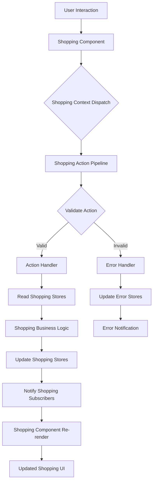

### Cross-Context Data Flow

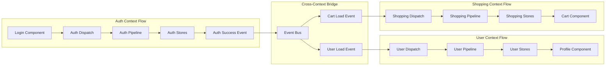

## Context Integration Patterns

### Provider Hierarchy Pattern

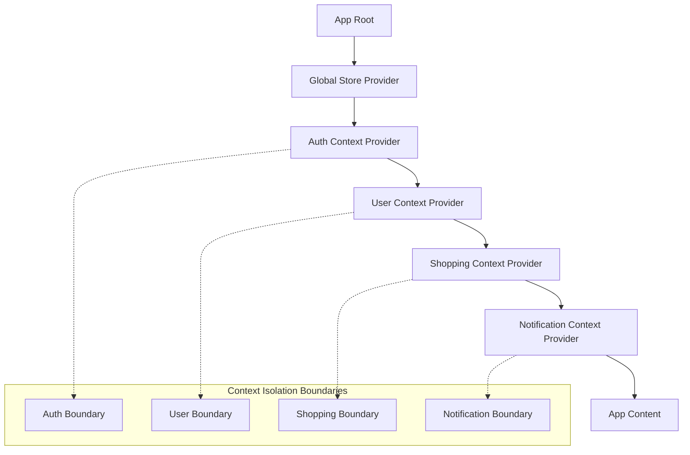

### Parallel Context Pattern

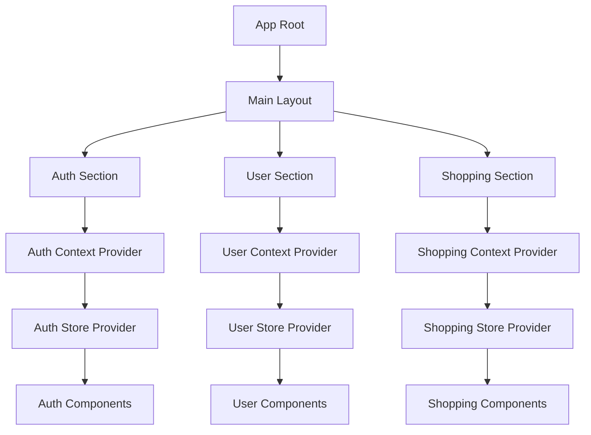

## Complex Coordination Patterns

### Multi-Domain Checkout Flow

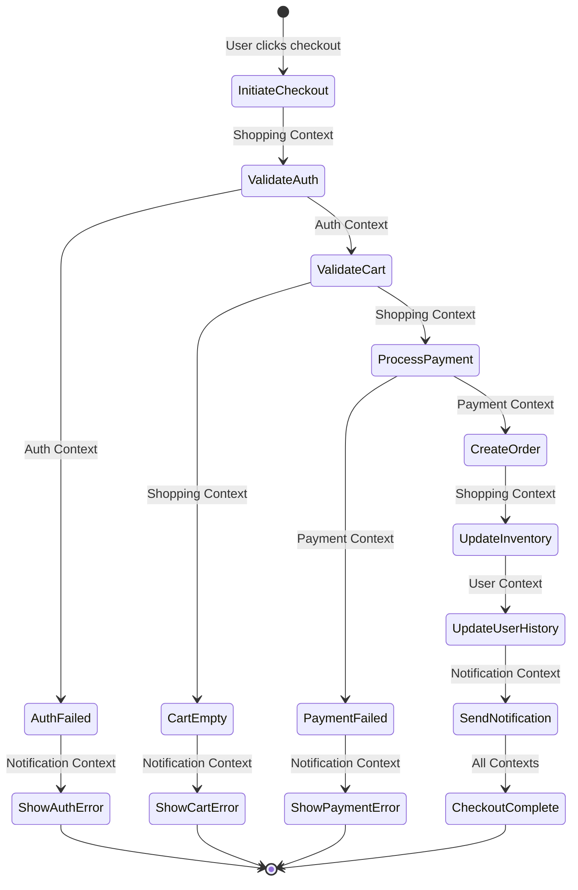

### Event-Driven Cross-Context Communication

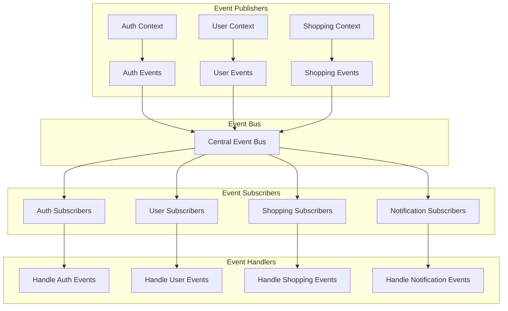

## Performance Optimization Patterns

### Context Splitting for Performance

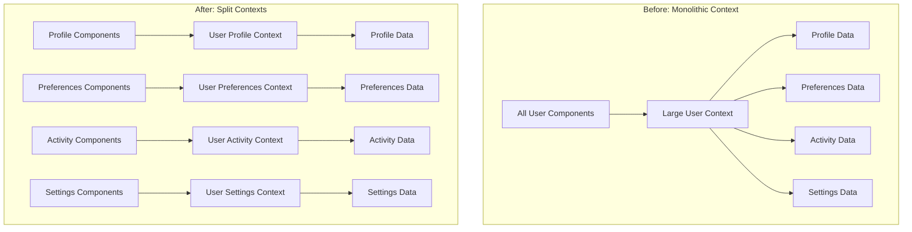

### Lazy Context Loading

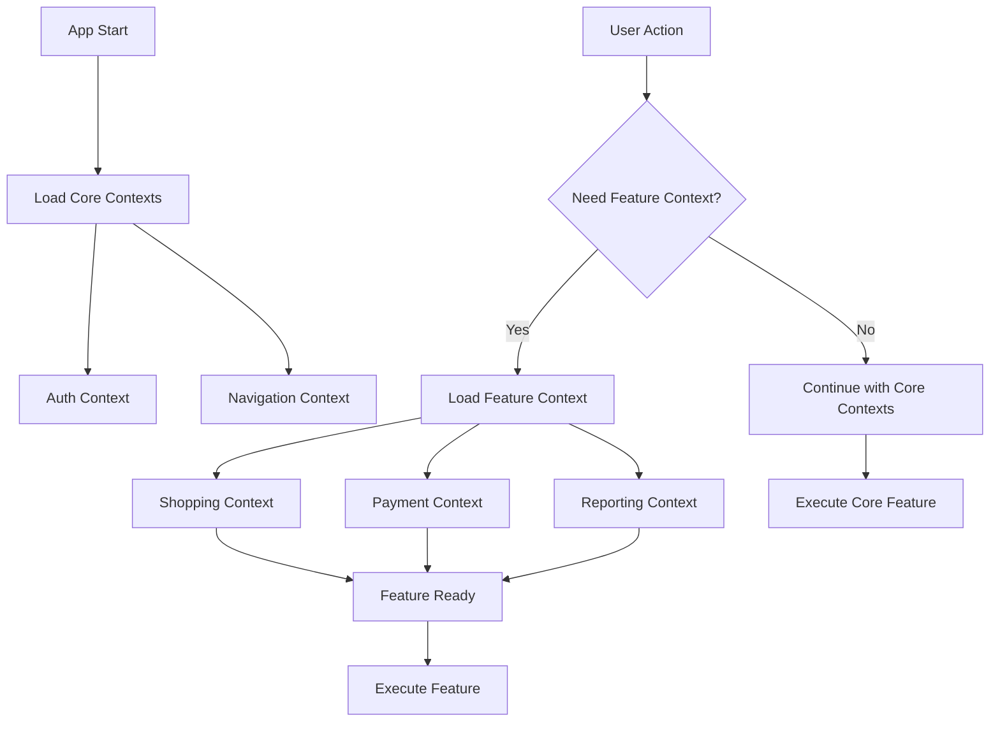

## Testing Architecture

### Context Isolation Testing

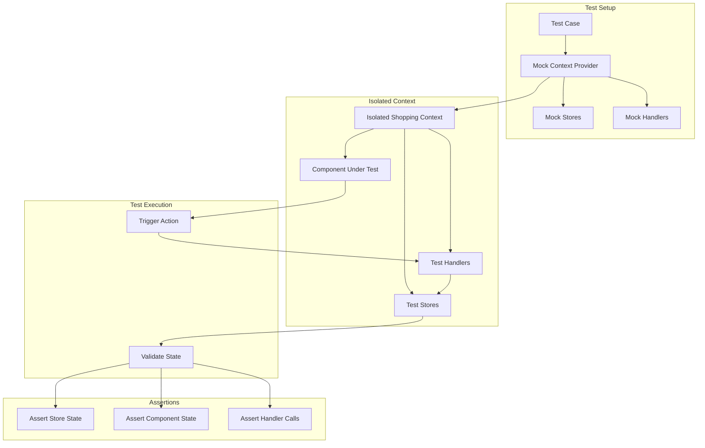

### Cross-Context Integration Testing

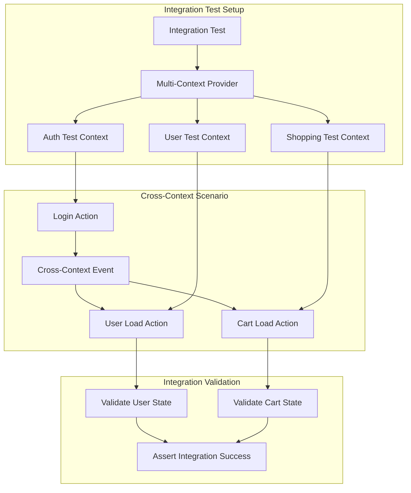

## Type Safety Flow

### Context-Scoped Type Safety

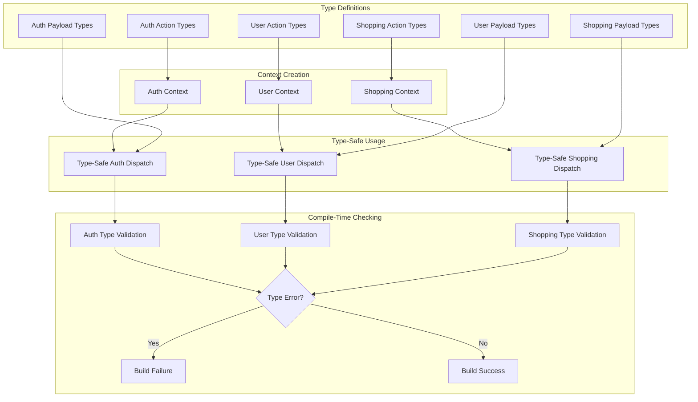

## Next Steps

- **Implementation**: Use these diagrams as reference while implementing patterns from [patterns.md](./patterns.md)
- **Architecture Planning**: Reference these diagrams when designing context boundaries in [architecture.md](./architecture.md)
- **Integration**: Apply these visual patterns when following [integration.md](./integration.md) guidelines