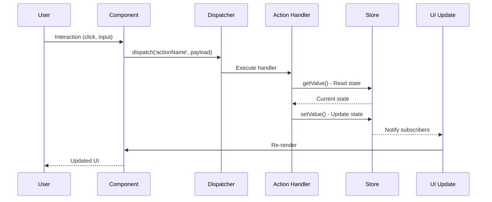

# Data Flow Patterns

## Overview

Data flow patterns in the Context-Action framework define how information moves through your application, from user interactions to state updates and back to the UI. Understanding these patterns is crucial for building maintainable, predictable, and performant applications.

### Core Flow Principles

- **🔄 Unidirectional Flow**: Data flows in one direction through the system
- **📡 Event-Driven**: User interactions trigger events that flow through the system
- **🎯 Centralized Logic**: Business logic is centralized in action handlers
- **⚡ Reactive Updates**: UI automatically reacts to state changes
- **🛡️ Predictable State**: State changes are predictable and traceable

## Basic Data Flow Patterns

### 1. Simple Action Flow

The most basic pattern: user interaction → action → store update → UI update.



#### Implementation Example

```typescript
// 1. Component dispatches action
function Counter() {
  const count = useStoreValue(counterStore);
  const dispatch = useActionDispatch();
  
  return (
    <div>
      <span>{count}</span>
      <button onClick={() => dispatch('increment', { amount: 1 })}>+</button>
    </div>
  );
}

// 2. Action handler processes the flow
actionRegister.register('increment', async (payload: { amount: number }, controller) => {
  // Read current state
  const currentCount = counterStore.getValue();
  
  // Apply business logic
  const newCount = currentCount + payload.amount;
  
  // Validate if needed
  if (newCount > 100) {
    controller.abort('Count cannot exceed 100');
    return;
  }
  
  // Update store
  counterStore.setValue(newCount);
});

// 3. Component automatically re-renders with new value
```

### 2. Multi-Step Flow with Validation

More complex flows involve multiple validation steps and conditional logic.

```typescript
interface UserRegistration {
  email: string;
  password: string;
  confirmPassword: string;
  acceptTerms: boolean;
}

actionRegister.register('registerUser', async (payload: UserRegistration, controller) => {
  // Step 1: Input validation
  if (!payload.email || !isValidEmail(payload.email)) {
    controller.abort('Valid email is required');
    return;
  }
  
  if (payload.password !== payload.confirmPassword) {
    controller.abort('Passwords do not match');
    return;
  }
  
  if (!payload.acceptTerms) {
    controller.abort('You must accept the terms of service');
    return;
  }
  
  // Step 2: Check existing users
  const existingUsers = userListStore.getValue();
  if (existingUsers.some(user => user.email === payload.email)) {
    controller.abort('Email already registered');
    return;
  }
  
  // Step 3: Set loading state
  uiStore.update(ui => ({ ...ui, loading: true, error: null }));
  
  try {
    // Step 4: Create user account
    const newUser = await api.createUser({
      email: payload.email,
      password: payload.password
    });
    
    // Step 5: Update stores
    userListStore.update(users => [...users, newUser]);
    currentUserStore.setValue(newUser);
    
    // Step 6: Success feedback
    uiStore.update(ui => ({ 
      ...ui, 
      loading: false,
      message: 'Registration successful!'
    }));
    
  } catch (error) {
    // Step 7: Error handling
    uiStore.update(ui => ({ 
      ...ui, 
      loading: false,
      error: error.message
    }));
    controller.abort('Registration failed');
  }
});
```

## Advanced Flow Patterns

### 1. Cascade Flow Pattern

When one action triggers subsequent actions, creating a cascade of operations.

```typescript
// Primary action triggers cascade
actionRegister.register('completeOrder', async (payload: { orderId: string }, controller) => {
  const order = orderStore.getValue();
  
  if (!order || order.id !== payload.orderId) {
    controller.abort('Order not found');
    return;
  }
  
  // Update order status
  orderStore.update(order => ({ ...order, status: 'completed' }));
  
  // Trigger cascade of related actions
  dispatch('updateInventory', { items: order.items });
  dispatch('sendCompletionEmail', { orderId: order.id, email: order.customerEmail });
  dispatch('updateCustomerStats', { customerId: order.customerId });
  dispatch('generateInvoice', { orderId: order.id });
});

// Cascaded actions
actionRegister.register('updateInventory', async (payload: { items: OrderItem[] }, controller) => {
  const inventory = inventoryStore.getValue();
  
  const updatedInventory = { ...inventory };
  payload.items.forEach(item => {
    if (updatedInventory[item.productId]) {
      updatedInventory[item.productId].sold += item.quantity;
    }
  });
  
  inventoryStore.setValue(updatedInventory);
});

actionRegister.register('updateCustomerStats', async (payload: { customerId: string }, controller) => {
  const stats = customerStatsStore.getValue();
  const customer = customersStore.getValue().find(c => c.id === payload.customerId);
  
  if (customer) {
    customerStatsStore.update(stats => ({
      ...stats,
      [payload.customerId]: {
        ...stats[payload.customerId],
        totalOrders: (stats[payload.customerId]?.totalOrders || 0) + 1,
        lastOrderDate: Date.now()
      }
    }));
  }
});
```

### 2. Pipeline Flow Pattern

Sequential processing where each step depends on the previous step's output.

```typescript
interface ProcessingPipeline {
  step: number;
  data: any;
  result: any;
  error?: string;
}

actionRegister.register('processDataPipeline', async (payload: { inputData: any }, controller) => {
  const pipeline = createStore<ProcessingPipeline>({
    step: 0,
    data: payload.inputData,
    result: null
  });
  
  try {
    // Step 1: Data validation
    pipeline.update(p => ({ ...p, step: 1 }));
    const validatedData = await validateData(pipeline.getValue().data);
    pipeline.update(p => ({ ...p, data: validatedData }));
    
    // Step 2: Data transformation
    pipeline.update(p => ({ ...p, step: 2 }));
    const transformedData = await transformData(pipeline.getValue().data);
    pipeline.update(p => ({ ...p, data: transformedData }));
    
    // Step 3: Data enrichment
    pipeline.update(p => ({ ...p, step: 3 }));
    const enrichedData = await enrichData(pipeline.getValue().data);
    pipeline.update(p => ({ ...p, data: enrichedData }));
    
    // Step 4: Final processing
    pipeline.update(p => ({ ...p, step: 4 }));
    const result = await finalProcessing(pipeline.getValue().data);
    pipeline.update(p => ({ ...p, result, step: 5 }));
    
    // Update final stores
    processedDataStore.setValue(result);
    
  } catch (error) {
    pipeline.update(p => ({ ...p, error: error.message }));
    controller.abort(`Pipeline failed at step ${pipeline.getValue().step}: ${error.message}`);
  }
});
```

### 3. Fan-Out/Fan-In Pattern

One action triggers multiple parallel operations that eventually converge.

```typescript
actionRegister.register('aggregateUserData', async (payload: { userId: string }, controller) => {
  const userId = payload.userId;
  
  // Set loading states
  userProfileStore.update(profile => ({ ...profile, loading: true }));
  userOrdersStore.update(orders => ({ ...orders, loading: true }));
  userPreferencesStore.update(prefs => ({ ...prefs, loading: true }));
  
  try {
    // Fan-out: Trigger multiple parallel operations
    const [profile, orders, preferences] = await Promise.all([
      api.getUserProfile(userId),
      api.getUserOrders(userId),
      api.getUserPreferences(userId)
    ]);
    
    // Fan-in: Combine results
    const aggregatedData = {
      profile,
      orders,
      preferences,
      summary: {
        totalOrders: orders.length,
        totalSpent: orders.reduce((sum, order) => sum + order.total, 0),
        favoriteCategory: calculateFavoriteCategory(orders),
        memberSince: profile.createdAt
      }
    };
    
    // Update all stores
    userProfileStore.setValue({ ...profile, loading: false });
    userOrdersStore.setValue({ items: orders, loading: false });
    userPreferencesStore.setValue({ ...preferences, loading: false });
    userSummaryStore.setValue(aggregatedData.summary);
    
  } catch (error) {
    // Handle errors across all stores
    const errorState = { error: error.message, loading: false };
    userProfileStore.update(profile => ({ ...profile, ...errorState }));
    userOrdersStore.update(orders => ({ ...orders, ...errorState }));
    userPreferencesStore.update(prefs => ({ ...prefs, ...errorState }));
    
    controller.abort('Failed to aggregate user data');
  }
});
```

## Real-Time Data Flow Patterns

### 1. WebSocket Integration Flow

Handling real-time data updates through WebSocket connections.

```typescript
interface WebSocketMessage {
  type: string;
  payload: any;
  timestamp: number;
}

const wsConnectionStore = createStore<{
  connected: boolean;
  lastMessage: WebSocketMessage | null;
  error: string | null;
}>({
  connected: false,
  lastMessage: null,
  error: null
});

actionRegister.register('initializeWebSocket', async (payload: { url: string }, controller) => {
  try {
    const ws = new WebSocket(payload.url);
    
    ws.onopen = () => {
      wsConnectionStore.update(state => ({ 
        ...state, 
        connected: true, 
        error: null 
      }));
      dispatch('webSocketConnected', {});
    };
    
    ws.onmessage = (event) => {
      const message: WebSocketMessage = JSON.parse(event.data);
      wsConnectionStore.update(state => ({ 
        ...state, 
        lastMessage: message 
      }));
      
      // Route message to appropriate handler
      dispatch('processWebSocketMessage', message);
    };
    
    ws.onerror = (error) => {
      wsConnectionStore.update(state => ({ 
        ...state, 
        error: 'WebSocket error',
        connected: false
      }));
    };
    
    ws.onclose = () => {
      wsConnectionStore.update(state => ({ 
        ...state, 
        connected: false
      }));
      dispatch('webSocketDisconnected', {});
    };
    
  } catch (error) {
    controller.abort('Failed to initialize WebSocket');
  }
});

actionRegister.register('processWebSocketMessage', async (message: WebSocketMessage, controller) => {
  switch (message.type) {
    case 'USER_UPDATE':
      userStore.update(user => ({ ...user, ...message.payload }));
      break;
      
    case 'ORDER_STATUS_CHANGE':
      orderStore.update(order => 
        order.id === message.payload.orderId 
          ? { ...order, status: message.payload.status }
          : order
      );
      break;
      
    case 'INVENTORY_UPDATE':
      inventoryStore.update(inventory => ({
        ...inventory,
        [message.payload.productId]: {
          ...inventory[message.payload.productId],
          stock: message.payload.newStock
        }
      }));
      break;
      
    default:
      console.warn('Unknown WebSocket message type:', message.type);
  }
});
```

### 2. Polling Flow Pattern

Regular data synchronization through polling mechanisms.

```typescript
interface PollingConfig {
  interval: number;
  maxRetries: number;
  backoffMultiplier: number;
}

const pollingStateStore = createStore<{
  active: boolean;
  interval: number;
  lastSync: number;
  errorCount: number;
}>({
  active: false,
  interval: 30000, // 30 seconds
  lastSync: 0,
  errorCount: 0
});

actionRegister.register('startPolling', async (payload: PollingConfig, controller) => {
  const intervalId = setInterval(async () => {
    const state = pollingStateStore.getValue();
    
    if (!state.active) {
      clearInterval(intervalId);
      return;
    }
    
    try {
      await dispatch('syncData', {});
      pollingStateStore.update(state => ({ 
        ...state, 
        lastSync: Date.now(),
        errorCount: 0
      }));
      
    } catch (error) {
      pollingStateStore.update(state => {
        const newErrorCount = state.errorCount + 1;
        
        if (newErrorCount >= payload.maxRetries) {
          // Stop polling after max retries
          return { ...state, active: false, errorCount: newErrorCount };
        }
        
        // Increase interval on errors (exponential backoff)
        const newInterval = state.interval * payload.backoffMultiplier;
        clearInterval(intervalId);
        setTimeout(() => dispatch('startPolling', payload), newInterval);
        
        return { ...state, interval: newInterval, errorCount: newErrorCount };
      });
    }
  }, payload.interval);
  
  pollingStateStore.update(state => ({ 
    ...state, 
    active: true,
    interval: payload.interval
  }));
});

actionRegister.register('syncData', async (payload, controller) => {
  const lastSync = pollingStateStore.getValue().lastSync;
  
  const updates = await api.getUpdates({ since: lastSync });
  
  // Apply updates to relevant stores
  if (updates.users) {
    userListStore.setValue(updates.users);
  }
  
  if (updates.orders) {
    orderListStore.setValue(updates.orders);
  }
  
  if (updates.inventory) {
    inventoryStore.setValue(updates.inventory);
  }
});
```

## Performance Optimization Patterns

### 1. Debounced Action Flow

Prevent excessive action executions with debouncing.

```typescript
const searchStateStore = createStore<{
  query: string;
  results: any[];
  loading: boolean;
  debounceTimer: number | null;
}>({
  query: '',
  results: [],
  loading: false,
  debounceTimer: null
});

actionRegister.register('searchInput', async (payload: { query: string }, controller) => {
  const currentState = searchStateStore.getValue();
  
  // Clear existing timer
  if (currentState.debounceTimer) {
    clearTimeout(currentState.debounceTimer);
  }
  
  // Update query immediately for UI responsiveness
  searchStateStore.update(state => ({ ...state, query: payload.query }));
  
  // Set new debounced timer
  const timerId = setTimeout(() => {
    dispatch('performSearch', { query: payload.query });
  }, 300); // 300ms debounce
  
  searchStateStore.update(state => ({ ...state, debounceTimer: timerId }));
});

actionRegister.register('performSearch', async (payload: { query: string }, controller) => {
  if (!payload.query.trim()) {
    searchStateStore.update(state => ({ ...state, results: [], loading: false }));
    return;
  }
  
  searchStateStore.update(state => ({ ...state, loading: true }));
  
  try {
    const results = await api.search(payload.query);
    searchStateStore.update(state => ({ 
      ...state, 
      results, 
      loading: false,
      debounceTimer: null
    }));
  } catch (error) {
    searchStateStore.update(state => ({ 
      ...state, 
      loading: false,
      debounceTimer: null
    }));
    controller.abort('Search failed');
  }
});
```

### 2. Batched Update Pattern

Combine multiple small updates into batched operations.

```typescript
interface BatchOperation {
  id: string;
  type: 'create' | 'update' | 'delete';
  data: any;
}

const batchStateStore = createStore<{
  operations: BatchOperation[];
  processing: boolean;
  lastFlush: number;
}>({
  operations: [],
  processing: false,
  lastFlush: 0
});

actionRegister.register('addToBatch', async (payload: BatchOperation, controller) => {
  batchStateStore.update(state => ({
    ...state,
    operations: [...state.operations, payload]
  }));
  
  // Auto-flush if batch is getting large
  const currentOperations = batchStateStore.getValue().operations;
  if (currentOperations.length >= 10) {
    dispatch('flushBatch', {});
  }
});

actionRegister.register('flushBatch', async (payload, controller) => {
  const state = batchStateStore.getValue();
  
  if (state.operations.length === 0 || state.processing) {
    return;
  }
  
  batchStateStore.update(state => ({ ...state, processing: true }));
  
  try {
    // Group operations by type
    const creates = state.operations.filter(op => op.type === 'create');
    const updates = state.operations.filter(op => op.type === 'update');
    const deletes = state.operations.filter(op => op.type === 'delete');
    
    // Execute batched operations
    await Promise.all([
      creates.length > 0 ? api.batchCreate(creates.map(op => op.data)) : Promise.resolve(),
      updates.length > 0 ? api.batchUpdate(updates.map(op => op.data)) : Promise.resolve(),
      deletes.length > 0 ? api.batchDelete(deletes.map(op => op.id)) : Promise.resolve()
    ]);
    
    // Clear batch and update timestamp
    batchStateStore.update(state => ({
      operations: [],
      processing: false,
      lastFlush: Date.now()
    }));
    
    // Refresh data after batch operations
    dispatch('refreshData', {});
    
  } catch (error) {
    batchStateStore.update(state => ({ ...state, processing: false }));
    controller.abort('Batch operation failed');
  }
});

// Auto-flush timer
setInterval(() => {
  const state = batchStateStore.getValue();
  const timeSinceLastFlush = Date.now() - state.lastFlush;
  
  // Flush if operations exist and 5 seconds have passed
  if (state.operations.length > 0 && timeSinceLastFlush > 5000) {
    dispatch('flushBatch', {});
  }
}, 1000);
```

## Error Handling Flow Patterns

### 1. Retry Flow Pattern

Automatic retry mechanism with exponential backoff.

```typescript
interface RetryConfig {
  maxRetries: number;
  baseDelay: number;
  maxDelay: number;
  backoffMultiplier: number;
}

const retryStateStore = createStore<Record<string, {
  attempts: number;
  lastAttempt: number;
  nextRetry: number;
  error: string | null;
}>>({});

actionRegister.register('executeWithRetry', async (
  payload: { actionName: string; actionPayload: any; retryConfig: RetryConfig },
  controller
) => {
  const { actionName, actionPayload, retryConfig } = payload;
  const retryKey = `${actionName}_${JSON.stringify(actionPayload)}`;
  
  const executeAttempt = async (attemptNumber: number): Promise<void> => {
    try {
      // Update retry state
      retryStateStore.update(state => ({
        ...state,
        [retryKey]: {
          attempts: attemptNumber,
          lastAttempt: Date.now(),
          nextRetry: 0,
          error: null
        }
      }));
      
      // Execute the actual action
      await dispatch(actionName, actionPayload);
      
      // Clear retry state on success
      retryStateStore.update(state => {
        const newState = { ...state };
        delete newState[retryKey];
        return newState;
      });
      
    } catch (error) {
      const shouldRetry = attemptNumber < retryConfig.maxRetries;
      
      if (shouldRetry) {
        // Calculate next retry delay
        const delay = Math.min(
          retryConfig.baseDelay * Math.pow(retryConfig.backoffMultiplier, attemptNumber - 1),
          retryConfig.maxDelay
        );
        
        const nextRetry = Date.now() + delay;
        
        // Update retry state
        retryStateStore.update(state => ({
          ...state,
          [retryKey]: {
            attempts: attemptNumber,
            lastAttempt: Date.now(),
            nextRetry,
            error: error.message
          }
        }));
        
        // Schedule next attempt
        setTimeout(() => {
          executeAttempt(attemptNumber + 1);
        }, delay);
        
      } else {
        // Max retries reached, update final error state
        retryStateStore.update(state => ({
          ...state,
          [retryKey]: {
            attempts: attemptNumber,
            lastAttempt: Date.now(),
            nextRetry: 0,
            error: `Failed after ${retryConfig.maxRetries} attempts: ${error.message}`
          }
        }));
        
        controller.abort(`Action ${actionName} failed after ${retryConfig.maxRetries} retries`);
      }
    }
  };
  
  await executeAttempt(1);
});
```

### 2. Circuit Breaker Pattern

Prevent cascading failures by temporarily disabling failing operations.

```typescript
interface CircuitBreakerState {
  status: 'CLOSED' | 'OPEN' | 'HALF_OPEN';
  failureCount: number;
  lastFailureTime: number;
  nextAttemptTime: number;
}

const circuitBreakerStore = createStore<Record<string, CircuitBreakerState>>({});

actionRegister.register('executeWithCircuitBreaker', async (
  payload: { 
    actionName: string; 
    actionPayload: any; 
    failureThreshold: number;
    timeout: number;
  },
  controller
) => {
  const { actionName, actionPayload, failureThreshold, timeout } = payload;
  const breakerKey = actionName;
  
  const currentState = circuitBreakerStore.getValue()[breakerKey] || {
    status: 'CLOSED',
    failureCount: 0,
    lastFailureTime: 0,
    nextAttemptTime: 0
  };
  
  const now = Date.now();
  
  // Check circuit breaker state
  if (currentState.status === 'OPEN') {
    if (now < currentState.nextAttemptTime) {
      controller.abort(`Circuit breaker is OPEN for ${actionName}`);
      return;
    } else {
      // Transition to HALF_OPEN
      circuitBreakerStore.update(state => ({
        ...state,
        [breakerKey]: { ...currentState, status: 'HALF_OPEN' }
      }));
    }
  }
  
  try {
    // Execute the action
    await dispatch(actionName, actionPayload);
    
    // Success: Reset or close circuit breaker
    circuitBreakerStore.update(state => ({
      ...state,
      [breakerKey]: {
        status: 'CLOSED',
        failureCount: 0,
        lastFailureTime: 0,
        nextAttemptTime: 0
      }
    }));
    
  } catch (error) {
    const newFailureCount = currentState.failureCount + 1;
    
    if (newFailureCount >= failureThreshold) {
      // Open the circuit breaker
      circuitBreakerStore.update(state => ({
        ...state,
        [breakerKey]: {
          status: 'OPEN',
          failureCount: newFailureCount,
          lastFailureTime: now,
          nextAttemptTime: now + timeout
        }
      }));
    } else {
      // Increment failure count but keep closed
      circuitBreakerStore.update(state => ({
        ...state,
        [breakerKey]: {
          ...currentState,
          failureCount: newFailureCount,
          lastFailureTime: now
        }
      }));
    }
    
    controller.abort(`Action ${actionName} failed: ${error.message}`);
  }
});
```

## Testing Data Flow Patterns

### 1. Flow Testing with Mock Stores

```typescript
describe('User Registration Flow', () => {
  let mockUserListStore: jest.Mocked<Store<User[]>>;
  let mockCurrentUserStore: jest.Mocked<Store<User | null>>;
  let mockUIStore: jest.Mocked<Store<UIState>>;
  let mockAPI: jest.Mocked<typeof api>;
  
  beforeEach(() => {
    mockUserListStore = createMockStore([]);
    mockCurrentUserStore = createMockStore(null);
    mockUIStore = createMockStore({ loading: false, error: null });
    mockAPI = createMockAPI();
  });
  
  it('should complete registration flow successfully', async () => {
    // Arrange
    const registrationData = {
      email: 'test@example.com',
      password: 'password123',
      confirmPassword: 'password123',
      acceptTerms: true
    };
    
    const newUser = { id: '1', email: 'test@example.com', name: 'Test User' };
    mockAPI.createUser.mockResolvedValue(newUser);
    
    // Act
    await registerUserHandler(registrationData, { abort: jest.fn() });
    
    // Assert - verify the complete flow
    expect(mockUIStore.update).toHaveBeenCalledWith(
      expect.objectContaining({ loading: true })
    );
    expect(mockAPI.createUser).toHaveBeenCalledWith({
      email: 'test@example.com',
      password: 'password123'
    });
    expect(mockUserListStore.update).toHaveBeenCalledWith(
      expect.any(Function)
    );
    expect(mockCurrentUserStore.setValue).toHaveBeenCalledWith(newUser);
    expect(mockUIStore.update).toHaveBeenLastCalledWith(
      expect.objectContaining({ 
        loading: false,
        message: 'Registration successful!'
      })
    );
  });
});
```

### 2. Integration Flow Testing

```typescript
describe('Shopping Cart Flow Integration', () => {
  let cartStore: Store<{ items: CartItem[] }>;
  let inventoryStore: Store<Record<string, Product>>;
  let orderStore: Store<Order | null>;
  
  beforeEach(() => {
    cartStore = createStore({ items: [] });
    inventoryStore = createStore({
      'prod1': { id: 'prod1', name: 'Product 1', stock: 10, price: 99.99 }
    });
    orderStore = createStore(null);
  });
  
  it('should handle complete checkout flow', async () => {
    // Setup initial state
    await dispatch('addToCart', { productId: 'prod1', quantity: 2 });
    
    // Execute checkout flow
    await dispatch('processCheckout', { paymentMethod: 'card' });
    
    // Verify end state
    const finalCart = cartStore.getValue();
    const finalInventory = inventoryStore.getValue();
    const finalOrder = orderStore.getValue();
    
    expect(finalCart.items).toHaveLength(0);
    expect(finalInventory['prod1'].stock).toBe(8);
    expect(finalOrder).toBeTruthy();
    expect(finalOrder?.status).toBe('confirmed');
  });
});
```

## Best Practices

### ✅ Data Flow Do's

1. **Keep Flows Predictable**: Ensure data flows in a consistent, traceable manner
2. **Handle All States**: Account for loading, success, and error states
3. **Use Type Safety**: Leverage TypeScript for payload and state typing
4. **Test Complete Flows**: Test entire user journeys, not just individual actions
5. **Document Complex Flows**: Use diagrams and comments for complex patterns
6. **Implement Error Recovery**: Provide graceful error handling and recovery
7. **Monitor Performance**: Track flow performance and optimize bottlenecks

### ❌ Data Flow Don'ts

1. **Don't Create Circular Dependencies**: Avoid actions that create infinite loops
2. **Don't Skip Validation**: Always validate inputs and state transitions
3. **Don't Ignore Errors**: Handle all potential failure scenarios
4. **Don't Block UI Thread**: Use async operations for heavy computations
5. **Don't Leak Memory**: Clean up timers, subscriptions, and resources
6. **Don't Bypass the Flow**: Maintain consistent data flow patterns
7. **Don't Over-complicate**: Start simple and add complexity gradually

## Flow Pattern Summary

| Pattern | Use Case | Complexity | Benefits | Considerations |
|---------|----------|------------|----------|----------------|
| Simple Action Flow | Basic CRUD operations | Low | Easy to understand | Limited functionality |
| Multi-Step Flow | Complex operations | Medium | Comprehensive validation | More error handling needed |
| Cascade Flow | Dependent operations | Medium | Automatic coordination | Can be hard to debug |
| Pipeline Flow | Sequential processing | High | Clear step separation | Complex error recovery |
| Fan-Out/Fan-In | Parallel operations | High | Performance optimization | Synchronization complexity |
| Real-Time Flow | Live data updates | High | Immediate updates | Resource intensive |
| Retry Flow | Unreliable operations | Medium | Fault tolerance | Can delay operations |
| Circuit Breaker | System protection | High | Prevents cascading failures | Requires careful tuning |

## Related Resources

- [MVVM Architecture Guide](./mvvm-architecture.md) - Overall architecture patterns
- [Store Integration Guide](./store-integration.md) - Store coordination patterns
- [Best Practices](./best-practices.md) - Development best practices
- [API Reference - Core](/api/core/) - Core API documentation
- [Examples - Advanced Patterns](/examples/advanced-patterns/) - Complex flow examples