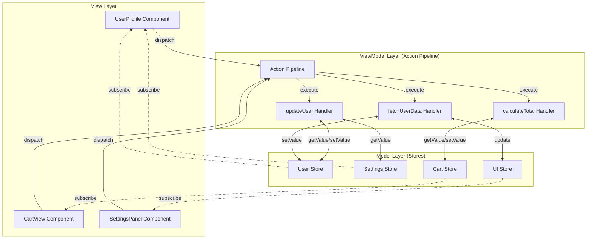
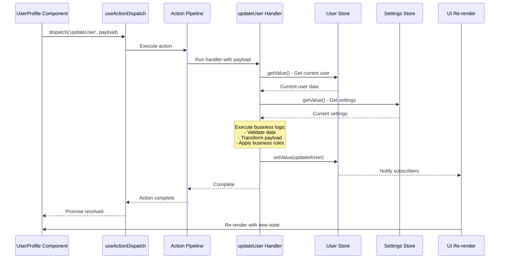
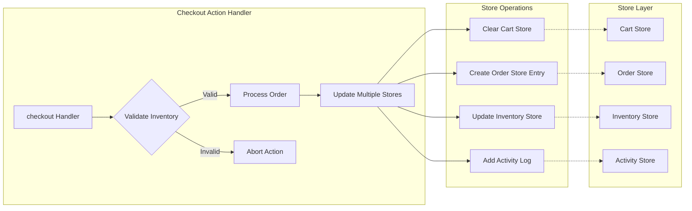
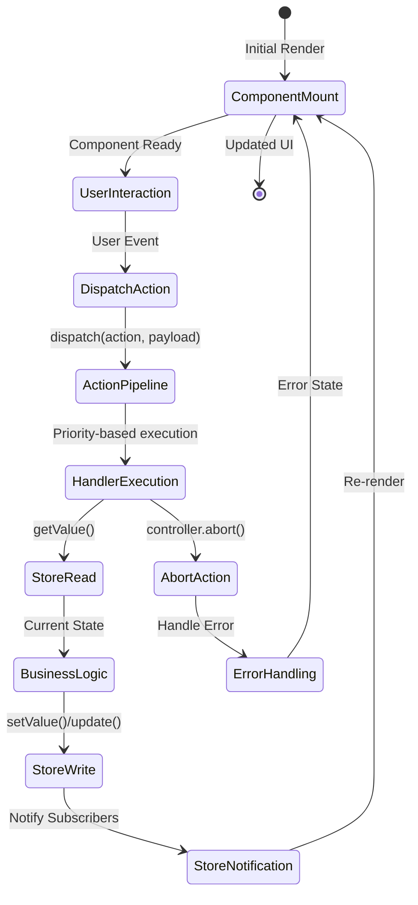
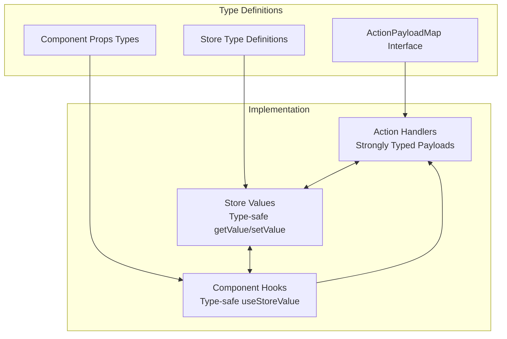
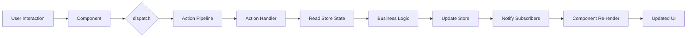

# Context-Action Store Integration Architecture

## Overview

The Context-Action framework implements a clean separation of concerns through an MVVM-inspired pattern combined with **Context-based Domain Isolation**. This architecture provides:

- **Actions** handle business logic (ViewModel layer)
- **Stores** manage state (Model layer) 
- **Components** render UI (View layer)
- **Context Boundaries** isolate functional domains and enable modular architecture

## Context-Based Domain Isolation

### 1. Core Principle: Domain Separation

The framework uses React Context to create **isolated functional domains**, where each domain has its own:

- **ActionRegister instance** - Independent action pipeline
- **Store registry** - Domain-specific state management
- **Component tree** - UI components within the domain boundary

```typescript
// Each domain gets its own isolated context with all necessary components
const AuthContext = createActionContext<AuthActions>({ name: 'AuthDomain' });
const CartContext = createActionContext<CartActions>({ name: 'CartDomain' });
const UserContext = createActionContext<UserActions>({ name: 'UserDomain' });

// createActionContext returns everything needed for a context domain:
// - Provider: React component to wrap the domain
// - useAction: Hook to get dispatch function
// - useActionHandler: Hook to register handlers
// - useActionContext: Hook to access the full context
// - useActionRegister: Hook to get ActionRegister instance for direct registration
// - useActionWithResult: Hook to get dispatchWithResult function for result collection
```

### 2. Context Boundary Benefits

**Isolation**: Actions and stores within one context cannot directly interfere with another context
**Modularity**: Each domain can be developed, tested, and deployed independently
**Type Safety**: Domain-specific action types are enforced within their context boundaries
**Scalability**: New domains can be added without affecting existing functionality

## Core Architecture

### 1. Context-Scoped Action Pipeline System

Each context maintains its own ActionRegister instance with an isolated action pipeline:

```typescript
// Domain-specific action definitions
interface AuthActions extends ActionPayloadMap {
  login: { username: string; password: string };
  logout: void;
  refreshToken: { token: string };
}

interface CartActions extends ActionPayloadMap {
  addItem: { productId: string; quantity: number };
  removeItem: { itemId: string };
  calculateTotal: { items: CartItem[] };
}

// Context creation returns all components for domain implementation
const {
  Provider: AuthProvider,
  useAction: useAuthAction,
  useActionHandler: useAuthHandler,
  useActionContext: useAuthContext,
  useActionRegister: useAuthRegister,
  useActionWithResult: useAuthActionWithResult
} = createActionContext<AuthActions>({ 
  name: 'AuthDomain' 
});

const {
  Provider: CartProvider,
  useAction: useCartAction,
  useActionHandler: useCartHandler,
  useActionContext: useCartContext,
  useActionRegister: useCartRegister,
  useActionWithResult: useCartActionWithResult
} = createActionContext<CartActions>({ 
  name: 'CartDomain' 
});

// Using the Provider from createActionContext
function App() {
  return (
    <AuthProvider>
      <CartProvider>
        {children}
      </CartProvider>
    </AuthProvider>
  );
}
```

### 2. Context-Aware Handler Registration

Action handlers are registered within their specific context boundaries:

```typescript
function useAuthHandlers() {
  // Using the hooks returned from createActionContext
  // IMPORTANT: Wrap handlers with useCallback to prevent infinite loops
  
  const loginHandler = useCallback(async (payload, controller) => {
    // This handler only exists within AuthContext
    const authState = authStore.getValue();
    // Business logic here
  }, []); // Add dependencies as needed
  
  const logoutHandler = useCallback(async (payload, controller) => {
    // Completely isolated from other contexts
    authStore.setValue(null);
    sessionStore.clear();
  }, []);
  
  useAuthHandler('login', loginHandler);
  useAuthHandler('logout', logoutHandler);
}

// Alternative pattern 1: Using ActionRegister directly in useEffect (old way)
function useAuthHandlersAlt() {
  const { actionRegisterRef } = useAuthContext();
  
  useEffect(() => {
    const register = actionRegisterRef.current;
    if (!register) return;
    
    // Register handlers directly
    const unregisterLogin = register.register('login', async (payload, controller) => {
      const authState = authStore.getValue();
      // Business logic here
    });
    
    const unregisterLogout = register.register('logout', async (payload, controller) => {
      authStore.setValue(null);
      sessionStore.clear();
    });
    
    // Cleanup
    return () => {
      unregisterLogin();
      unregisterLogout();
    };
  }, []); // Dependencies here
}

// Alternative pattern 2: Using useActionRegister (recommended)
function useAuthHandlersSimple() {
  const register = useAuthRegister();
  
  useEffect(() => {
    if (!register) return;
    
    // Direct registration using the dedicated hook
    const unregisterLogin = register.register('login', async (payload, controller) => {
      const authState = authStore.getValue();
      // Business logic here
    });
    
    const unregisterLogout = register.register('logout', async (payload, controller) => {
      authStore.setValue(null);
      sessionStore.clear();
    });
    
    // Cleanup
    return () => {
      unregisterLogin();
      unregisterLogout();
    };
  }, [register]); // Dependencies here
}
```

### 3. Action Result Collection and Processing

The Context-Action framework provides powerful result collection capabilities through the `useActionWithResult` hook and expanded dispatch options:

```typescript
// Using result collection with filtering and processing
function useAdvancedCart() {
  const cartDispatch = useCartActionWithResult();
  
  const processCartAction = async (items: CartItem[]) => {
    // Dispatch with result collection and handler filtering
    const result = await cartDispatch('calculateTotal', { items }, {
      // Result collection options
      result: {
        collect: true,          // Enable result collection
        strategy: 'all',        // Collect all handler results
        timeout: 5000,          // 5 second timeout
        maxResults: 10          // Limit to 10 results
      },
      
      // Handler filtering options
      filter: {
        tags: ['calculation', 'validation'],  // Only run handlers with these tags
        excludeTags: ['logging'],             // Exclude logging handlers
        environment: 'production',            // Only production handlers
        category: 'business-logic'            // Only business logic handlers
      },
      
      // Execution options
      executionMode: 'sequential',            // Override execution mode
      throttle: 1000                         // Throttle to once per second
    });
    
    // Access detailed execution information
    console.log('Execution success:', result.success);
    console.log('Handler results:', result.results);
    console.log('Execution duration:', result.execution.duration);
    console.log('Handlers executed:', result.execution.handlersExecuted);
    
    if (result.terminated) {
      console.log('Pipeline terminated early with result:', result.result);
    }
    
    if (result.errors.length > 0) {
      console.log('Execution errors:', result.errors);
    }
    
    return result.result;
  };
}

// Handler with result return
function useCartHandlers() {
  const calculateTotalHandler = useCallback(async (payload, controller) => {
    const { items } = payload;
    
    // Perform calculation
    const subtotal = items.reduce((sum, item) => sum + (item.price * item.quantity), 0);
    const tax = subtotal * 0.1;
    const total = subtotal + tax;
    
    // Return structured result
    const calculationResult = {
      subtotal,
      tax,
      total,
      itemCount: items.length,
      timestamp: Date.now()
    };
    
    // Option 1: Set result and continue pipeline
    controller.setResult(calculationResult);
    
    // Option 2: Return result and terminate pipeline early
    // controller.return(calculationResult);
    
    return calculationResult; // This will be collected automatically
    
  }, []);
  
  useCartHandler('calculateTotal', calculateTotalHandler, {
    priority: 10,
    tags: ['calculation', 'business-logic'],
    category: 'cart-operations',
    returnType: 'value'
  });
}

// Multiple result strategies
function useResultStrategies() {
  const dispatchWithResult = useCartActionWithResult();
  
  const demonstrateStrategies = async () => {
    // Strategy 1: Collect first result only
    const firstResult = await dispatchWithResult('validateCart', cart, {
      result: { collect: true, strategy: 'first' }
    });
    
    // Strategy 2: Collect last result only
    const lastResult = await dispatchWithResult('processCart', cart, {
      result: { collect: true, strategy: 'last' }
    });
    
    // Strategy 3: Collect all results
    const allResults = await dispatchWithResult('enrichCart', cart, {
      result: { collect: true, strategy: 'all' }
    });
    
    // Strategy 4: Merge results with custom merger
    const mergedResult = await dispatchWithResult('aggregateCart', cart, {
      result: { 
        collect: true, 
        strategy: 'merge',
        merger: (results) => {
          // Custom merge logic
          return results.reduce((acc, result) => ({
            ...acc,
            ...result,
            totalProcessed: acc.totalProcessed + 1
          }), { totalProcessed: 0 });
        }
      }
    });
  };
}
```

### 4. Context-Scoped Store Integration

Action handlers within each context interact with domain-specific stores:

```typescript
// Context-scoped store integration using hooks from createActionContext
function useUserHandlers() {
  const dispatch = useUserAction();
  const registry = useStoreRegistry();
  
  // Wrap handler with useCallback to prevent re-registration
  const updateUserHandler = useCallback(async (payload, controller) => {
    // Get stores from registry within handler
    const userStore = registry.getStore('user');
    const userActivityStore = registry.getStore('userActivity');
    const userSettingsStore = registry.getStore('userSettings');
    
    // Stores are accessed within context boundary
    const currentUser = userStore.getValue();
    const userSettings = userSettingsStore.getValue();
    
    // Domain-specific business logic
    const updatedUser = {
      ...currentUser,
      ...payload,
      lastModified: Date.now(),
      theme: userSettings.theme
    };
    
    // Update domain stores
    userStore.setValue(updatedUser);
    userActivityStore.update(activities => [...activities, {
      type: 'user_updated',
      timestamp: Date.now(),
      userId: payload.id
    }]);
  }, [registry]); // Include registry in dependencies
  
  useUserHandler('updateUser', updateUserHandler);
}

// Alternative: Using useActionRegister for direct registration
function useUserHandlersWithRegister() {
  const register = useUserRegister();
  const registry = useStoreRegistry();
  
  useEffect(() => {
    if (!register) return;
    
    // Direct registration without useCallback
    const unregisterUpdateUser = register.register('updateUser', async (payload, controller) => {
      // Get stores from registry within handler
      const userStore = registry.getStore('user');
      const userActivityStore = registry.getStore('userActivity');
      const userSettingsStore = registry.getStore('userSettings');
      
      // Stores are accessed within context boundary
      const currentUser = userStore.getValue();
      const userSettings = userSettingsStore.getValue();
      
      // Domain-specific business logic
      const updatedUser = {
        ...currentUser,
        ...payload,
        lastModified: Date.now(),
        theme: userSettings.theme
      };
      
      // Update domain stores
      userStore.setValue(updatedUser);
      userActivityStore.update(activities => [...activities, {
        type: 'user_updated',
        timestamp: Date.now(),
        userId: payload.id
      }]);
    });
    
    // Cleanup
    return () => {
      unregisterUpdateUser();
    };
  }, [register, registry]); // Dependencies for useEffect
}

// Cross-context communication (when needed)
function useCrossContextIntegration() {
  // Each context provides its own dispatch function
  const authDispatch = useAuthAction();
  const userDispatch = useUserAction();
  
  // Explicit cross-context communication
  const handleUserProfileUpdate = async (data) => {
    await userDispatch('updateUser', data);
    await authDispatch('refreshToken', { token: data.authToken });
  };
}
```

## Context-Based Data Flow

```
Context Boundary A (Auth Domain):
┌─────────────────────────────────────────────────────────────┐
│ ┌──────────────┐ dispatch ┌──────────────┐ get/set ┌──────┐ │
│ │ Auth         │ -------> │ Auth Action  │ ------> │ Auth │ │
│ │ Component    │ <------- │ Pipeline     │ <------ │Store │ │
│ └──────────────┘ subscribe └──────────────┘         └──────┘ │
└─────────────────────────────────────────────────────────────┘

Context Boundary B (Cart Domain):
┌─────────────────────────────────────────────────────────────┐
│ ┌──────────────┐ dispatch ┌──────────────┐ get/set ┌──────┐ │
│ │ Cart         │ -------> │ Cart Action  │ ------> │ Cart │ │
│ │ Component    │ <------- │ Pipeline     │ <------ │Store │ │
│ └──────────────┘ subscribe └──────────────┘         └──────┘ │
└─────────────────────────────────────────────────────────────┘

Cross-Context Communication (Explicit):
Context A ···················> Context B
         (deliberate bridge)
```

### Context-Scoped Execution Flow:

1. **Context-Scoped Dispatch**: Component calls `contextDispatch('actionName', payload)` within its context boundary
2. **Domain Pipeline Processing**: Context-specific ActionRegister executes registered handlers in priority order
3. **Context Store Access**: Handlers access stores within the same context boundary
4. **Domain Business Logic**: Handlers process payload with context-specific state values
5. **Context Store Updates**: Handlers update stores within their domain boundary
6. **Context Component Re-render**: Only components within the same context that subscribe to updated stores re-render
7. **Cross-Context Communication**: If needed, explicit bridges handle communication between contexts

## Key Design Principles

### 1. Context Isolation

- Each context maintains independent ActionRegister instances
- Actions within one context cannot directly access another context's stores
- Context boundaries prevent unintended side effects between domains
- Type safety is enforced within each context boundary

### 2. Lazy Evaluation

- Store getters are called at execution time within context scope
- No stale closure issues - handlers always get current context state
- Context-scoped stores ensure data freshness within domain boundaries

### 3. Modular Decoupled Architecture

- Actions don't know about components or other contexts
- Stores are scoped to their context domain
- Components only know their context's action names and payloads
- Cross-context communication requires explicit bridging

### 4. Domain-Specific Type Safety

- Full TypeScript support within each context
- Context-specific action types and payloads are strongly typed
- Store values maintain type integrity within domain boundaries
- Compile-time checking prevents cross-context type errors

### 5. Isolated Testability

- Each context can be tested independently with domain-specific mock stores
- Context stores can be tested without affecting other domains
- Components can be tested with context-scoped mock dispatch
- Cross-context integration can be tested at the bridge level

## Integration with React

### Context-Based Provider Setup

```typescript
// Multiple contexts for different domains
function App() {
  return (
    <StoreProvider>
      {/* Authentication Domain */}
      <AuthProvider>
        {/* Cart Domain nested within */}
        <CartProvider>
          {/* User Profile Domain */}
          <UserProvider>
            <Application />
          </UserProvider>
        </CartProvider>
      </AuthProvider>
    </StoreProvider>
  );
}

// Alternative: Separate domain boundaries
function App() {
  return (
    <div>
      {/* Auth section with its own context */}
      <AuthProvider>
        <StoreProvider registryId="auth">
          <AuthSection />
        </StoreProvider>
      </AuthProvider>
      
      {/* Shopping section with its own context */}
      <CartProvider>
        <StoreProvider registryId="cart">
          <ShoppingSection />
        </StoreProvider>
      </CartProvider>
    </div>
  );
}
```

### Context-Scoped Component Usage

```typescript
// Component within Auth context
function LoginComponent() {
  // Uses auth context's dispatch - type-safe and scoped
  const dispatch = useAuthAction();
  const authState = useStoreValue(authStore);

  const handleLogin = (username: string, password: string) => {
    // Only 'login' actions available in AuthContext
    dispatch('login', { username, password });
  };

  return (
    <div>
      <h1>Authentication Status: {authState.status}</h1>
      <button onClick={() => handleLogin('user', 'pass')}>
        Login
      </button>
    </div>
  );
}

// Component within User context
function UserProfile() {
  // Uses user context's dispatch - different from AuthContext
  const dispatch = useUserAction();
  const user = useStoreValue(userStore);

  const updateName = (name: string) => {
    // Only 'updateUser' actions available in UserContext
    dispatch('updateUser', { id: user.id, name });
  };

  return (
    <div>
      <h1>{user.name}</h1>
      <button onClick={() => updateName('New Name')}>
        Update Name
      </button>
    </div>
  );
}

// Component using multiple contexts (explicit cross-context access)
function DashboardComponent() {
  const authDispatch = useAuthAction();
  const userDispatch = useUserAction();
  const cartDispatch = useCartAction();
  
  const handleLogout = async () => {
    // Coordinate across multiple contexts
    await cartDispatch('clearCart', undefined);
    await userDispatch('resetUser', undefined);
    await authDispatch('logout', undefined);
  };

  return (
    <button onClick={handleLogout}>
      Complete Logout
    </button>
  );
}
```

### Context-Scoped Action Handler Registration

```typescript
// Handler registration within specific context
function useUserActions() {
  const registry = useStoreRegistry();

  // Create handler with useCallback to prevent infinite loops
  const updateUserHandler = useCallback(
    async (payload, controller) => {
      // Access stores within UserContext boundary
      const userStore = registry.getStore('user');
      const settingsStore = registry.getStore('settings');
      
      const user = userStore.getValue();
      const settings = settingsStore.getValue();

      // Domain-specific business logic
      if (settings.validateNames && !isValidName(payload.name)) {
        controller.abort('Invalid name');
        return;
      }

      userStore.setValue({
        ...user,
        ...payload,
        updatedAt: Date.now()
      });
    },
    [registry] // Dependencies for useCallback
  );

  // Register handler with options
  useUserHandler('updateUser', updateUserHandler, { priority: 10, blocking: true });
}

// Cross-context handler coordination
function useCrossContextHandlers() {
  // Get dispatch functions from each context
  const userDispatch = useUserAction();
  const registry = useStoreRegistry();
  
  // Register handlers in different contexts that coordinate
  
  // Auth context handler - wrapped with useCallback
  const loginHandler = useCallback(async (payload, controller) => {
    const authStore = registry.getStore('auth');
    const authResult = await authenticateUser(payload);
    authStore.setValue(authResult);
    
    // Signal to other contexts (via event or direct call)
    window.dispatchEvent(new CustomEvent('auth:login', { 
      detail: { userId: authResult.userId } 
    }));
  }, [registry]);

  // User context handler responding to auth events - wrapped with useCallback
  const loadUserDataHandler = useCallback(async (payload, controller) => {
    const userStore = registry.getStore('user');
    const userData = await fetchUserData(payload.userId);
    userStore.setValue(userData);
  }, [registry]);

  // Register handlers
  useAuthHandler('login', loginHandler);
  useUserHandler('loadUserData', loadUserDataHandler);

  // Listen for cross-context events
  useEffect(() => {
    const handleAuthLogin = (event) => {
      userDispatch('loadUserData', { userId: event.detail.userId });
    };

    window.addEventListener('auth:login', handleAuthLogin);
    return () => window.removeEventListener('auth:login', handleAuthLogin);
  }, [userDispatch]);
}
```

## Advanced Context Patterns

### 1. Intra-Context Store Coordination

```typescript
// Create checkout context
const {
  Provider: CheckoutProvider,
  useAction: useCheckoutAction,
  useActionHandler: useCheckoutHandler,
  useActionContext: useCheckoutContext
} = createActionContext<CheckoutActions>({ name: 'CheckoutDomain' });

// Within a single context, coordinate multiple stores
function useCheckoutHandlers() {
  const registry = useStoreRegistry();
  
  // Wrap handler to prevent re-registration
  const processCheckoutHandler = useCallback(async (payload, controller) => {
    // All stores are within CheckoutContext boundary
    const cartStore = registry.getStore('cart');
    const inventoryStore = registry.getStore('inventory');
    const orderStore = registry.getStore('order');
    
    const cart = cartStore.getValue();
    const inventory = inventoryStore.getValue();

    // Validate inventory within context
    const unavailable = cart.items.filter(item =>
      inventory[item.id] < item.quantity
    );

    if (unavailable.length > 0) {
      controller.abort('Items unavailable');
      return;
    }

    // Atomic updates within context boundary
    orderStore.setValue({ ...payload, status: 'processing' });
    cartStore.setValue({ items: [] });
    inventoryStore.update(inv => updateInventory(inv, cart.items));
  }, [registry]); // Dependencies for useCallback
  
  // Register the handler
  useCheckoutHandler('processCheckout', processCheckoutHandler);
}
```

### 2. Cross-Context Coordination

```typescript
// Create payment context
const {
  Provider: PaymentProvider,
  useAction: usePaymentAction,
  useActionHandler: usePaymentHandler
} = createActionContext<PaymentActions>({ name: 'PaymentDomain' });

// Coordinate actions across different contexts
function useMultiDomainCheckout() {
  const checkoutDispatch = useCheckoutAction();
  const paymentDispatch = usePaymentAction();
  const userDispatch = useUserAction();
  
  const handleCompleteCheckout = async (checkoutData) => {
    try {
      // Step 1: Process checkout in CheckoutContext
      await checkoutDispatch('processCheckout', checkoutData);
      
      // Step 2: Process payment in PaymentContext  
      await paymentDispatch('processPayment', {
        amount: checkoutData.total,
        method: checkoutData.paymentMethod
      });
      
      // Step 3: Update user activity in UserContext
      await userDispatch('addPurchaseHistory', {
        orderId: checkoutData.orderId,
        timestamp: Date.now()
      });
      
    } catch (error) {
      // Rollback across contexts if needed
      console.error('Checkout failed:', error);
    }
  };
  
  return handleCompleteCheckout;
}
```

### 3. Context-Scoped Computed Values

```typescript
// Create calculation context
const {
  Provider: CalculationProvider,
  useAction: useCalculationAction,
  useActionHandler: useCalculationHandler
} = createActionContext<CalculationActions>({ name: 'CalculationDomain' });

// Computed values within context boundary
function useCalculationHandlers() {
  const registry = useStoreRegistry();
  
  const calculateTotalsHandler = useCallback(async (payload, controller) => {
    // All stores are within CalculationContext
    const cartStore = registry.getStore('cart');
    const promoStore = registry.getStore('promos');
    const taxStore = registry.getStore('tax');
    const totalsStore = registry.getStore('totals');
    
    const cart = cartStore.getValue();
    const promos = promoStore.getValue();
    const taxRules = taxStore.getValue();

    // Complex calculation within context scope
    const subtotal = calculateSubtotal(cart.items);
    const discount = calculateDiscount(promos, subtotal);
    const tax = calculateTax(taxRules, subtotal - discount);

    // Update context-scoped totals store
    totalsStore.setValue({
      subtotal,
      discount,
      tax,
      total: subtotal - discount + tax
    });
  }, [registry]); // Dependencies
  
  // Register the handler
  useCalculationHandler('calculateTotals', calculateTotalsHandler);
}

// Cross-context computed values
function useCrossContextCalculations() {
  const calculationDispatch = useCalculationAction();
  const userDispatch = useUserAction();
  
  const handleUserSpecificCalculation = async () => {
    // Get user data from UserContext
    const userData = await new Promise(resolve => {
      userDispatch('getUserData', { callback: resolve });
    });
    
    // Use user data for calculation in CalculationContext
    await calculationDispatch('calculateTotals', { 
      userLocation: userData.location,
      membershipLevel: userData.membership 
    });
  };
}
```

### 4. Context-Scoped Async Operations

```typescript
// Create data context
const {
  Provider: DataProvider,
  useAction: useDataAction,
  useActionHandler: useDataHandler
} = createActionContext<DataActions>({ name: 'DataDomain' });

// Async operations within context boundary
function useDataFetchingHandlers() {
  const registry = useStoreRegistry();
  
  const fetchUserDataHandler = useCallback(async (payload, controller) => {
    // All state updates are scoped to DataContext
    const uiStore = registry.getStore('ui');
    const userStore = registry.getStore('user');
    const preferencesStore = registry.getStore('preferences');
    const errorStore = registry.getStore('error');

    // Set loading state within context
    uiStore.update(ui => ({ ...ui, loading: true }));

    try {
      const response = await api.getUser(payload.userId);

      // Update stores within context boundary
      userStore.setValue(response.user);
      
      if (response.preferences) {
        preferencesStore.setValue(response.preferences);
      }

      // Clear any previous errors
      errorStore.setValue(null);

    } catch (error) {
      // Error handling within context
      errorStore.setValue({
        message: 'Failed to fetch user',
        error,
        context: 'DataContext'
      });
      controller.abort('API error');

    } finally {
      // Always clear loading state
      uiStore.update(ui => ({ ...ui, loading: false }));
    }
  }, [registry]); // Dependencies
  
  // Register the handler
  useDataHandler('fetchUserData', fetchUserDataHandler);
}

// Create notification context
const {
  Provider: NotificationProvider,
  useAction: useNotificationAction,
  useActionHandler: useNotificationHandler
} = createActionContext<NotificationActions>({ name: 'NotificationDomain' });

// Cross-context async coordination
function useCrossContextAsyncFlow() {
  const authDispatch = useAuthAction();
  const dataDispatch = useDataAction();
  const notificationDispatch = useNotificationAction();
  
  const handleCompleteUserLoad = async (userId: string) => {
    try {
      // Step 1: Authenticate in AuthContext
      await authDispatch('validateSession', { userId });
      
      // Step 2: Fetch data in DataContext
      await dataDispatch('fetchUserData', { userId });
      
      // Step 3: Show success notification in NotificationContext
      await notificationDispatch('showNotification', {
        type: 'success',
        message: 'User data loaded successfully'
      });
      
    } catch (error) {
      // Handle cross-context error
      await notificationDispatch('showNotification', {
        type: 'error',
        message: 'Failed to load user data'
      });
    }
  };
}
```

## Architectural Diagrams

### 1. Overall Architecture Overview



### 2. Action Execution Flow Sequence



### 3. Cross-Store Coordination Pattern



### 4. Component-Store-Action Lifecycle



### 5. Type Safety Flow



### 6. Data Flow Pattern



## Context-Based Architecture Benefits

1. **Domain Isolation**: Each context maintains complete independence with its own action pipeline and stores
2. **Clear Separation**: Business logic in actions, state in stores, UI in components, all scoped within context boundaries
3. **Modular Reusability**: Actions can be reused across components within the same context, and contexts can be reused across applications
4. **Isolated Testability**: Each context can be tested independently without affecting other domains
5. **Context-Scoped Type Safety**: Full TypeScript support with compile-time checking within domain boundaries
6. **Optimized Performance**: Only components within the same context that use changed stores re-render
7. **Domain-Specific Debugging**: Clear action flow with pipeline tracing within each context boundary  
8. **Horizontal Scalability**: Easy to add new contexts/domains without affecting existing functionality
9. **Team Scalability**: Different teams can work on different contexts independently
10. **Deployment Flexibility**: Contexts can be deployed as separate modules or micro-frontends

## Context-Based Best Practices

### Context Design
1. **Domain-Focused Contexts**: Create contexts around business domains, not technical layers
2. **Context Boundaries**: Keep related functionality within the same context, separate unrelated concerns
3. **Context Size**: Balance between too many small contexts (complexity) and too few large contexts (coupling)

### Action Design  
4. **Context-Scoped Actions**: Keep actions focused within their domain context
5. **Use Priority**: Higher priority handlers run first for dependent operations within context
6. **Cross-Context Coordination**: Use explicit bridges for cross-context communication
7. **Handle Errors**: Use try-catch in async handlers and controller.abort() with context-specific error handling

### Handler Registration Best Practices
8. **Wrap with useCallback**: Always wrap handler functions with useCallback to prevent infinite re-registration loops
9. **Include Dependencies**: Add necessary dependencies to useCallback (like registry, dispatch functions)
10. **Alternative Pattern 1**: For complex handlers, use useActionRegister hook with useEffect for direct registration
11. **Alternative Pattern 2**: Use useActionContext to access actionRegisterRef directly (legacy approach)
12. **Handler Lifecycle**: Remember that handlers are registered/unregistered based on component lifecycle

### Result Collection Best Practices
13. **Use Metadata Tags**: Tag handlers appropriately for filtering (e.g., 'validation', 'business-logic', 'logging')
14. **Return Meaningful Results**: Design handler return values to be useful for composition and debugging
15. **Choose Result Strategy**: Select appropriate result strategy (first, last, all, merge) based on use case
16. **Handle Termination**: Use controller.return() for early termination with final result
17. **Collect Selectively**: Use filtering options to collect results only from relevant handlers
18. **Monitor Performance**: Use execution metadata to monitor and optimize handler performance

### Store Management
19. **Context-Scoped Stores**: Keep stores within their appropriate context boundaries
20. **Avoid Side Effects**: Keep store updates predictable and traceable within context scope
21. **Store Naming**: Use context prefixes for store names to avoid confusion

### Type Safety
22. **Context-Specific Types**: Define action payload maps per context for better type safety
23. **Type Everything**: Leverage TypeScript for safety and documentation within each context
24. **Cross-Context Types**: Define explicit interfaces for cross-context communication

### Testing Strategy  
25. **Context Isolation Testing**: Test each context independently with domain-specific mock stores
26. **Cross-Context Integration Testing**: Test cross-context communication at the integration level
27. **Mock Context Providers**: Create mock context providers for testing components

### Performance
28. **Context Scope Optimization**: Only subscribe to stores within the relevant context
29. **Lazy Context Loading**: Load contexts only when needed
30. **Context Memory Management**: Properly cleanup context resources when unmounting

### Development Workflow
31. **Context-First Development**: Design contexts before implementing features
32. **Team Ownership**: Assign context ownership to specific teams or developers
33. **Context Documentation**: Document context boundaries, responsibilities, and interfaces
