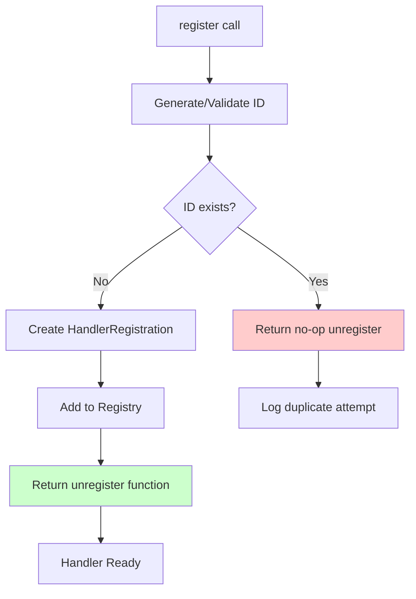
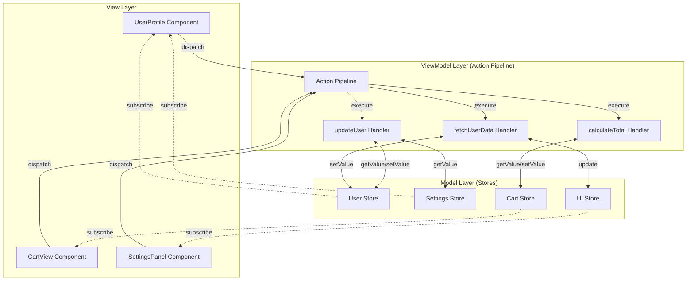
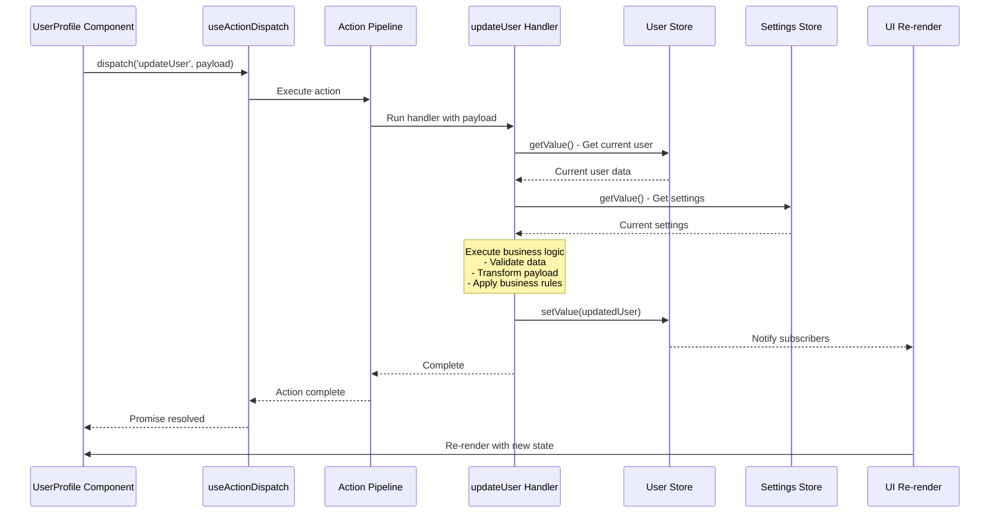
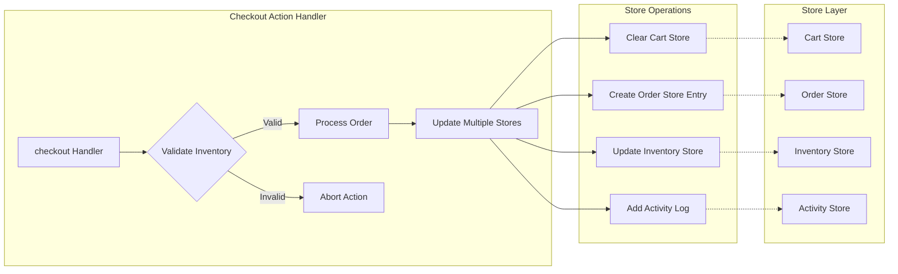
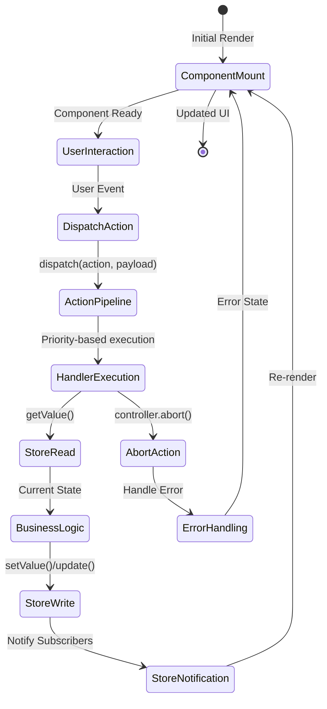
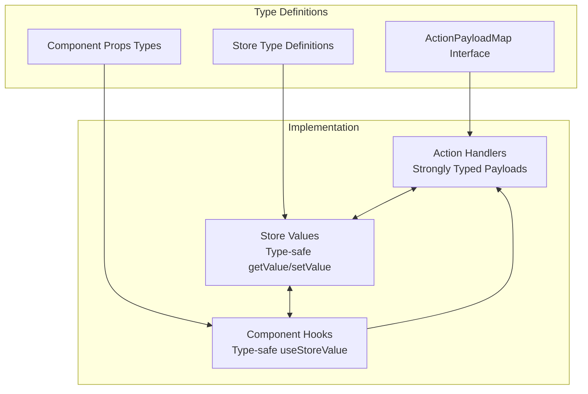
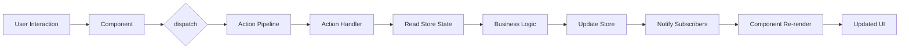

# Context-Action Store Integration Architecture

## Overview

The Context-Action framework implements a clean separation of concerns through an MVVM-inspired pattern combined with **Context Store Pattern** for complete domain isolation. This architecture provides:

- **Actions** handle business logic (ViewModel layer)
- **Context Store Pattern** manages state with domain isolation (Model layer)
- **Components** render UI (View layer)
- **Context Boundaries** isolate functional domains and enable modular architecture
- **Type-Safe Integration** between actions and stores through shared context registries

## Context-Based Domain Isolation

### 1. Core Principle: Domain Separation

The framework uses React Context to create **isolated functional domains**, where each domain has its own:

- **ActionRegister instance** - Independent action pipeline
- **Store registry** - Domain-specific state management
- **Component tree** - UI components within the domain boundary

```typescript
// Modern Context Store Pattern: Each domain gets isolated context with store integration
const {
  Provider: UserStoreProvider,
  useCreateStore: useCreateUserStore,
  useStore: useUserStore,
  useRegistry: useUserRegistry
} = createContextStorePattern('user');

const {
  Provider: AuthProvider,
  useActionRegister: useAuthRegister,
  useAction: useAuthAction
} = createActionContext<AuthActions>({ name: 'auth' });

// Combined domain structure provides:
// - Isolated store management per domain
// - Type-safe action dispatching per domain  
// - Shared registry access between actions and stores
// - Automatic cleanup and lifecycle management
// - Cross-context communication when needed
```

### 2. Context Boundary Benefits

**Isolation**: Actions and stores within one context cannot directly interfere with another context
**Modularity**: Each domain can be developed, tested, and deployed independently
**Type Safety**: Domain-specific action types are enforced within their context boundaries
**Scalability**: New domains can be added without affecting existing functionality

## Core Architecture

### 1. Context-Scoped Action Pipeline System

Each context maintains its own ActionRegister instance with an isolated action pipeline:

```typescript
// Domain-specific action definitions
interface AuthActions extends ActionPayloadMap {
  login: { username: string; password: string };
  logout: void;
  refreshToken: { token: string };
}

interface CartActions extends ActionPayloadMap {
  addItem: { productId: string; quantity: number };
  removeItem: { itemId: string };
  calculateTotal: { items: CartItem[] };
}

// Context creation returns all components for domain implementation
const {
  Provider: AuthProvider,
  useAction: useAuthAction,
  useActionHandler: useAuthHandler,
  useActionContext: useAuthContext,
  useActionRegister: useAuthRegister,
  useActionWithResult: useAuthActionWithResult
} = createActionContext<AuthActions>({ 
  name: 'AuthDomain' 
});

const {
  Provider: CartProvider,
  useAction: useCartAction,
  useActionHandler: useCartHandler,
  useActionContext: useCartContext,
  useActionRegister: useCartRegister,
  useActionWithResult: useCartActionWithResult
} = createActionContext<CartActions>({ 
  name: 'CartDomain' 
});

// Using the Provider from createActionContext
function App() {
  return (
    <AuthProvider>
      <CartProvider>
        {children}
      </CartProvider>
    </AuthProvider>
  );
}
```

### 2. Context-Aware Handler Registration

Action handlers are registered within their specific context boundaries using `useActionRegister` + `useEffect` pattern for optimal re-render performance:

```typescript
function useAuthHandlers() {
  const register = useAuthRegister();
  
  useEffect(() => {
    if (!register) return;
    
    // Register login handler
    const unregisterLogin = register.register('login', async (payload, controller) => {
      const { username, password } = payload;
      
      // Access stores at execution time for lazy evaluation
      const authStore = registry.getStore<AuthState>('auth');
      const userStore = registry.getStore<User>('currentUser');
      
      try {
        const response = await authAPI.login(username, password);
        
        authStore.setValue({ isAuthenticated: true, token: response.token });
        userStore.setValue(response.user);
      } catch (error) {
        controller.abort('Login failed', error);
      }
    });
    
    // Register logout handler
    const unregisterLogout = register.register('logout', async (_, controller) => {
      const authStore = registry.getStore<AuthState>('auth');
      const userStore = registry.getStore<User>('currentUser');
      
      authStore.setValue({ isAuthenticated: false, token: null });
      userStore.setValue(null);
    });
    
    // Cleanup function unregisters handlers
    return () => {
      unregisterLogin();
      unregisterLogout();
    };
  }, [register]); // Re-register if register instance changes
}

```

### 3. Action Result Collection and Processing

The Context-Action framework provides powerful result collection capabilities through the `useActionWithResult` hook and expanded dispatch options:

```typescript
// Using result collection with filtering and processing
function useAdvancedCart() {
  const cartDispatch = useCartActionWithResult();
  
  const processCartAction = async (items: CartItem[]) => {
    // Dispatch with result collection and handler filtering
    const result = await cartDispatch('calculateTotal', { items }, {
      // Result collection options
      result: {
        collect: true,          // Enable result collection
        strategy: 'all',        // Collect all handler results
        timeout: 5000,          // 5 second timeout
        maxResults: 10          // Limit to 10 results
      },
      
      // Handler filtering options
      filter: {
        tags: ['calculation', 'validation'],  // Only run handlers with these tags
        excludeTags: ['logging'],             // Exclude logging handlers
        environment: 'production',            // Only production handlers
        category: 'business-logic'            // Only business logic handlers
      },
      
      // Execution options
      executionMode: 'sequential',            // Override execution mode
      throttle: 1000                         // Throttle to once per second
    });
    
    // Access detailed execution information
    console.log('Execution success:', result.success);
    console.log('Handler results:', result.results);
    console.log('Execution duration:', result.execution.duration);
    console.log('Handlers executed:', result.execution.handlersExecuted);
    
    if (result.terminated) {
      console.log('Pipeline terminated early with result:', result.result);
    }
    
    if (result.errors.length > 0) {
      console.log('Execution errors:', result.errors);
    }
    
    return result.result;
  };
}

// Handler with result return
function useCartHandlers() {
  const calculateTotalHandler = useCallback(async (payload, controller) => {
    const { items } = payload;
    
    // Perform calculation
    const subtotal = items.reduce((sum, item) => sum + (item.price * item.quantity), 0);
    const tax = subtotal * 0.1;
    const total = subtotal + tax;
    
    // Return structured result
    const calculationResult = {
      subtotal,
      tax,
      total,
      itemCount: items.length,
      timestamp: Date.now()
    };
    
    // Option 1: Set result and continue pipeline
    controller.setResult(calculationResult);
    
    // Option 2: Return result and terminate pipeline early
    // controller.return(calculationResult);
    
    return calculationResult; // This will be collected automatically
    
  }, []);
  
  useCartHandler('calculateTotal', calculateTotalHandler, {
    priority: 10,
    tags: ['calculation', 'business-logic'],
    category: 'cart-operations',
    returnType: 'value'
  });
}

// Multiple result strategies
function useResultStrategies() {
  const dispatchWithResult = useCartActionWithResult();
  
  const demonstrateStrategies = async () => {
    // Strategy 1: Collect first result only
    const firstResult = await dispatchWithResult('validateCart', cart, {
      result: { collect: true, strategy: 'first' }
    });
    
    // Strategy 2: Collect last result only
    const lastResult = await dispatchWithResult('processCart', cart, {
      result: { collect: true, strategy: 'last' }
    });
    
    // Strategy 3: Collect all results
    const allResults = await dispatchWithResult('enrichCart', cart, {
      result: { collect: true, strategy: 'all' }
    });
    
    // Strategy 4: Merge results with custom merger
    const mergedResult = await dispatchWithResult('aggregateCart', cart, {
      result: { 
        collect: true, 
        strategy: 'merge',
        merger: (results) => {
          // Custom merge logic
          return results.reduce((acc, result) => ({
            ...acc,
            ...result,
            totalProcessed: acc.totalProcessed + 1
          }), { totalProcessed: 0 });
        }
      }
    });
  };
}
```

### 4. Context Store Pattern Integration (Recommended)

The **Context Store Pattern** provides the best integration between contexts and stores with type-safe, domain-scoped store management. This is the recommended approach for modern Context-Action applications.

#### Context Store Pattern Setup

```typescript
// 1. Create Context Store Pattern with destructuring (recommended)
const {
  Provider: UserStoreProvider,
  useCreateStore: useCreateUserStore,
  useStore: useUserStore,
  useRegistry: useUserRegistry
} = createContextStorePattern('user');

const {
  Provider: AuthProvider,
  useActionRegister: useAuthRegister,
  // ... other auth hooks
} = createActionContext<AuthActions>({ name: 'auth' });
```

#### Store Creation and Access Pattern

```typescript
// 2. App structure with combined providers
function App() {
  return (
    <UserStoreProvider>
      <AuthProvider>
        <UserStoreSetup />
        <UserProfile />
        <UserActions />
      </AuthProvider>
    </UserStoreProvider>
  );
}

// 3. Store creation (context-aware)
function UserStoreSetup() {
  // Create stores in the UserStore context registry
  useCreateUserStore('profile', {
    id: '',
    name: '',
    email: '',
    createdBy: 'initial'
  });
  
  useCreateUserStore('activity', [] as Activity[]);
  useCreateUserStore('settings', defaultSettings);
  
  return null; // Setup component
}

// 4. Store usage in components
function UserProfile() {
  // Access stores by name only (type-safe)
  const profileStore = useUserStore<User>('profile');
  const settingsStore = useUserStore<Settings>('settings');
  
  const profile = useStoreValue(profileStore);
  const settings = useStoreValue(settingsStore);
  
  return (
    <div>
      <h1>{profile.name}</h1>
      <p>Theme: {settings.theme}</p>
    </div>
  );
}

// 5. Store access in action handlers
function useUserActions() {
  const register = useAuthRegister();
  const userRegistry = useUserRegistry(); // Access UserStore registry
  
  useEffect(() => {
    if (!register) return;
    
    const unregisterUpdate = register.register('updateUser', async (payload, controller) => {
      // Access stores from UserStore context registry (same names as components)
      const profileStore = userRegistry.getStore<User>('profile');
      const activityStore = userRegistry.getStore<Activity[]>('activity');
      const settingsStore = userRegistry.getStore<Settings>('settings');
      
      // Read current state
      const currentProfile = profileStore.getValue();
      const currentSettings = settingsStore.getValue();
      
      // Business logic
      const updatedProfile = {
        ...currentProfile,
        ...payload,
        lastModified: Date.now(),
        theme: currentSettings.theme
      };
      
      // Update stores
      profileStore.setValue(updatedProfile);
      activityStore.update(activities => [...activities, {
        type: 'user_updated',
        timestamp: Date.now(),
        userId: payload.id
      }]);
    });
    
    return () => unregisterUpdate();
  }, [register, userRegistry]);
}

```

### 5. Cross-Context Communication

When communication between contexts is needed, each context provides its own dispatch function:

```typescript
function useCrossContextIntegration() {
  // Each context provides its own dispatch function
  const authDispatch = useAuthAction();
  const userDispatch = useUserAction();
  
  // Explicit cross-context communication
  const handleUserProfileUpdate = async (data) => {
    await userDispatch('updateUser', data);
    await authDispatch('refreshToken', { token: data.authToken });
  };
}
```

## Context-Based Data Flow

```
Context Boundary A (Auth Domain):
┌─────────────────────────────────────────────────────────────┐
│ ┌──────────────┐ dispatch ┌──────────────┐ get/set ┌──────┐ │
│ │ Auth         │ -------> │ Auth Action  │ ------> │ Auth │ │
│ │ Component    │ <------- │ Pipeline     │ <------ │Store │ │
│ └──────────────┘ subscribe └──────────────┘         └──────┘ │
└─────────────────────────────────────────────────────────────┘

Context Boundary B (Cart Domain):
┌─────────────────────────────────────────────────────────────┐
│ ┌──────────────┐ dispatch ┌──────────────┐ get/set ┌──────┐ │
│ │ Cart         │ -------> │ Cart Action  │ ------> │ Cart │ │
│ │ Component    │ <------- │ Pipeline     │ <------ │Store │ │
│ └──────────────┘ subscribe └──────────────┘         └──────┘ │
└─────────────────────────────────────────────────────────────┘

```

### Context-Scoped Execution Flow:

1. **Context-Scoped Dispatch**: Component calls `contextDispatch('actionName', payload)` within its context boundary
2. **Domain Pipeline Processing**: Context-specific ActionRegister executes registered handlers in priority order (higher numbers execute first: priority 100 → priority 50 → priority 10)
3. **Context Store Access**: Handlers access stores within the same context boundary
4. **Domain Business Logic**: Handlers process payload with context-specific state values
5. **Context Store Updates**: Handlers update stores within their domain boundary
6. **Context Component Re-render**: Only components within the same context that subscribe to updated stores re-render

### Handler Priority System:

The Context-Action framework uses a numeric priority system to control handler execution order:

- **Higher priority numbers execute first** (e.g., priority: 100 runs before priority: 50)
- **Default priority is 0** if not specified
- **Use priorities for dependent operations**: validation (priority: 100) → business logic (priority: 50) → logging (priority: 10)
- **Priority jump control**: Use `controller.jumpToPriority(priority)` to skip to handlers with specific priority levels

```typescript
// Example: Ordered handler execution
useActionHandler('processOrder', validationHandler, { priority: 100 }); // Runs first
useActionHandler('processOrder', businessLogicHandler, { priority: 50 }); // Runs second  
useActionHandler('processOrder', loggingHandler, { priority: 10 }); // Runs last

// Priority jump example
const criticalHandler = useCallback(async (payload, controller) => {
  if (payload.isCritical) {
    // Skip to high-priority handlers only
    controller.jumpToPriority(90);
  }
}, []);
```

### Automatic Handler Execution:

**Important**: Handlers execute automatically without requiring explicit `controller.next()` calls:

- **Sequential mode** (default): Handlers run one after another automatically using priority order
- **Parallel mode**: All handlers execute simultaneously using `Promise.allSettled()`
- **Race mode**: All handlers compete, first to complete wins using `Promise.race()`
- **`controller.next()` is optional**: The method exists for compatibility but does nothing - execution proceeds automatically

```typescript
// ✅ Handlers execute automatically - no controller.next() needed
useActionHandler('processData', async (payload, controller) => {
  const result = await processPayload(payload);
  // Automatically proceeds to next handler after completion
  return result;
});

// ✅ Controller methods for pipeline control (optional)
useActionHandler('validateData', async (payload, controller) => {
  if (!isValid(payload)) {
    controller.abort('Invalid data'); // Stop pipeline
    return;
  }
  
  if (payload.isUrgent) {
    controller.jumpToPriority(90); // Skip to high-priority handlers
  }
  
  // Execution continues automatically to next handler
}, { priority: 100 });

// ✅ Early termination with result
useActionHandler('quickProcess', async (payload, controller) => {
  const result = await quickCheck(payload);
  
  if (result.canFinishEarly) {
    controller.return(result); // Terminate pipeline and return result
  }
  
  // If not terminated, continues to next handler automatically
});
```

### Handler Blocking Configuration:

**Critical for Sequential Execution**: The `blocking` option controls whether the framework waits for async handlers to complete in sequential mode:

- **`blocking: true`** - Framework waits for handler completion before proceeding to next handler
- **`blocking: false`** (default) - Async handlers start simultaneously, framework doesn't wait for completion
- **Essential for timing control**: Use `blocking: true` when handlers have individual delays or must execute in strict order

```typescript
// ❌ Problem: All handlers start simultaneously despite sequential mode
useActionHandler('processStep', async (payload, controller) => {
  await new Promise(resolve => setTimeout(resolve, 1000)); // 1 second delay
  console.log('Step completed');
}, { 
  priority: 100 
  // Missing blocking: true - handler starts but framework doesn't wait
});

// ✅ Solution: Framework waits for each handler to complete
useActionHandler('processStep', async (payload, controller) => {
  await new Promise(resolve => setTimeout(resolve, 1000)); // 1 second delay
  console.log('Step completed');
}, { 
  priority: 100,
  blocking: true  // Framework waits for completion before next handler
});

// ✅ Multiple handlers with different delays execute in sequence
useActionHandler('step1', stepOneHandler, { priority: 100, blocking: true });
useActionHandler('step2', stepTwoHandler, { priority: 90, blocking: true });
useActionHandler('step3', stepThreeHandler, { priority: 80, blocking: true });

// With blocking: true, execution order is guaranteed:
// step1 (waits for completion) → step2 (waits for completion) → step3
```

### When to Use `blocking: true`:

1. **Sequential Processing with Delays**: When handlers have individual `setTimeout` or async operations
2. **Strict Execution Order**: When subsequent handlers depend on previous handler completion
3. **Testing Scenarios**: When testing execution timing and order control
4. **State Dependencies**: When handlers modify state that subsequent handlers need

```typescript
// Example: Priority Test Page with individual delays
configs.forEach((config) => {
  useActionHandler('priorityTest', async (payload, controller) => {
    // Individual delay per handler configuration
    await new Promise(resolve => setTimeout(resolve, config.delay));
    
    // Jump logic based on execution count
    if (config.jumpToPriority && executionCount <= 10) {
      controller.jumpToPriority(config.jumpToPriority);
    }
  }, {
    priority: config.priority,
    blocking: true  // Essential: Framework waits for each handler's delay
  });
});

// Result: Handlers execute sequentially with proper delays:
// Handler A (150ms delay) → waits → Handler B (120ms delay) → waits → Handler C (90ms delay)
```

### Execution Modes and Blocking:

| Mode | `blocking: false` (default) | `blocking: true` |
|------|----------------------------|------------------|
| **Sequential** | Async handlers start simultaneously | Framework waits for each handler |
| **Parallel** | All handlers start simultaneously | All handlers start simultaneously |
| **Race** | First to complete wins | First to complete wins |

**Note**: `blocking` primarily affects sequential mode behavior. In parallel and race modes, the timing behavior is inherently different regardless of the blocking setting.

### Handler ID-Based Duplicate Prevention:

**Automatic Duplicate Prevention**: ActionRegister prevents duplicate handler registration using unique handler IDs:

- **Explicit ID**: When `config.id` is provided, it's used as the handler identifier for explicit registration
- **Auto-generated Secure ID**: When no ID is provided, ActionRegister generates unpredictable IDs like `handler_1_k3x9z` to prevent collisions with explicit IDs
- **Duplicate Detection**: If a handler with the same ID already exists, new registration is ignored
- **No-op Unregister**: Duplicate registrations return a no-op unregister function

```typescript
// ID-based duplicate prevention examples
register('updateUser', handler1, { id: 'user-updater' }); // ✅ Registered
register('updateUser', handler2, { id: 'user-updater' }); // ❌ Ignored (duplicate ID)

// Auto-generated IDs - all registered with unique IDs
register('updateUser', handler1); // ✅ Registered as 'handler_1'
register('updateUser', handler2); // ✅ Registered as 'handler_2' 
register('updateUser', handler3); // ✅ Registered as 'handler_3'

// Mixed approach
register('updateUser', handler1, { id: 'custom' }); // ✅ Registered as 'custom'
register('updateUser', handler2);                   // ✅ Registered as 'handler_1'
register('updateUser', handler3, { id: 'custom' }); // ❌ Ignored (duplicate)
```

### Handler ID Management Best Practices:

1. **Use Meaningful IDs**: Provide descriptive IDs for important handlers
2. **Avoid ID Conflicts**: Use namespaced or component-specific IDs
3. **Leverage Auto-IDs**: Let ActionRegister generate IDs for temporary handlers
4. **Check Registration**: Handle cases where duplicate registration might occur

### ⚠️ Security Consideration: ID Prediction Attack

**Vulnerability**: The current auto-generated ID pattern (`handler_1`, `handler_2`, ...) is predictable and can be exploited by malicious code to prevent legitimate handlers from registering.

**Attack Scenario**:
```typescript
// 🚨 Malicious code can predict and occupy future auto-generated IDs
register('criticalAction', maliciousHandler, { id: 'handler_1' }); // Hijack future auto-ID
register('criticalAction', maliciousHandler, { id: 'handler_2' }); // Hijack future auto-ID

// 😭 Later, legitimate handlers are silently ignored
register('criticalAction', legitimateHandler); // Ignored! (would be handler_1)
register('criticalAction', anotherHandler);    // Ignored! (would be handler_2)
```

**Impact**: 
- Legitimate handlers silently fail to register
- Malicious handlers can monopolize action execution
- No visible errors or warnings to developers

**Framework Mitigation**: Starting from v0.0.5, ActionRegister automatically generates unpredictable IDs using `handler_${counter}_${randomSuffix}` pattern to prevent prediction attacks.

**Additional Security Strategies**:
1. **Always Use Explicit IDs**: Avoid relying on auto-generated IDs for critical handlers
2. **Use Lightweight Secure IDs**: Generate unpredictable IDs efficiently
3. **Namespace Protection**: Use component/module-specific prefixes
4. **Registration Validation**: Check return value of registration functions

```typescript
// ✅ Framework secure: Auto-generated IDs now unpredictable
register('action', handler); // Generates: handler_1_k3x9z (unpredictable suffix)

// ✅ Lightweight secure: Counter + random (2.3x faster than crypto.randomUUID)
let counter = 0;
const generateId = () => `secure_${++counter}_${Math.random().toString(36).substr(2, 5)}`;

register('criticalAction', handler, { 
  id: generateId() // e.g., secure_1_k3x9z
});

// ✅ Maximum security: Cryptographically secure (but slower)
import { randomUUID } from 'crypto';

register('criticalAction', handler, { 
  id: `secure-${randomUUID()}` // Cryptographically secure
});

// ✅ Secure: Use meaningful, namespaced IDs
register('criticalAction', handler, { 
  id: 'payment-processor-validation' // Meaningful + specific
});

// ✅ Secure: Component-scoped IDs
function PaymentComponent() {
  const componentId = useId(); // React's unique ID
  
  useEffect(() => {
    register('processPayment', handler, {
      id: `payment-${componentId}` // Component-specific
    });
  }, []);
}

// ⚠️ Detection: Check if registration actually succeeded
const unregister = register('criticalAction', handler);
if (unregister.toString().includes('{}')) {
  console.warn('Handler registration failed - possible ID conflict');
}
```

```typescript
// ✅ Good: Meaningful, namespaced IDs
register('processOrder', orderValidationHandler, { 
  id: 'order-validation',
  priority: 100 
});

register('processOrder', paymentHandler, { 
  id: 'payment-processing', 
  priority: 90 
});

// ✅ Good: Component-specific ID pattern  
register('userAction', handler, { 
  id: `user-profile-${componentId}`,
  priority: 50 
});

// ✅ Good: Strategic use of auto-IDs for temporary handlers
register('debugAction', tempHandler); // Auto-ID: handler_1
register('debugAction', anotherTempHandler); // Auto-ID: handler_2

// ❌ Potential issue: Generic IDs may conflict
register('processData', handler1, { id: 'handler' }); // First registration
register('processData', handler2, { id: 'handler' }); // Ignored silently
```

### Duplicate Registration Detection:

**When Duplicates Occur**:
- Same action type AND same handler ID
- Second registration is silently ignored
- Original handler remains active
- No-op unregister function returned

**Use Cases for Intentional Duplicates**:
- **Component Re-mounting**: Same component registers same handler multiple times
- **Development Hot Reload**: Handler re-registration during development
- **Conditional Registration**: Prevent double registration in complex flows

## Advanced Handler ID Management

### Handler Unique ID System Architecture

The Context-Action framework implements a sophisticated **Handler Unique ID system** that goes beyond simple name-based registration to provide robust duplicate prevention and handler lifecycle management.

#### Core Components:

1. **Handler ID Registry**: Central registry that tracks all registered handler IDs across all action types
2. **ID Generation Strategy**: Intelligent system for creating predictable vs. secure IDs
3. **Collision Detection**: Advanced duplicate prevention with configurable behavior
4. **Lifecycle Tracking**: Monitors handler registration, execution, and cleanup phases

```typescript
interface HandlerRegistration {
  id: string;                    // Unique identifier 
  actionType: string;           // Associated action type
  handler: Function;            // Handler function reference
  config: HandlerConfig;        // Configuration metadata
  registeredAt: number;         // Registration timestamp
  executionCount: number;       // Number of executions
  lastExecuted?: number;        // Last execution timestamp
}

interface HandlerRegistry {
  [handlerId: string]: HandlerRegistration;
}
```

#### Registration Flow:



### Handler ID Generation Strategies

#### 1. **Auto-Generated Secure IDs** (Recommended)

**Pattern**: `handler_${counter}_${randomSuffix}`

```typescript
// Framework automatically generates secure IDs
register('processOrder', orderHandler);
// Generated ID: "handler_1_k3x9z"

register('processOrder', validateHandler); 
// Generated ID: "handler_2_m7q4p"
```

**Benefits**:
- ✅ **Security**: Unpredictable suffixes prevent ID prediction attacks
- ✅ **Performance**: Lightweight generation (no crypto overhead)
- ✅ **Uniqueness**: Counter + random ensures no collisions
- ✅ **Debugging**: Sequential counter aids in debugging

**Implementation Details**:
```typescript
class SecureIDGenerator {
  private counter = 0;
  
  generate(): string {
    return `handler_${++this.counter}_${Math.random().toString(36).substr(2, 5)}`;
  }
}
```

#### 2. **Explicit Semantic IDs**

**Pattern**: `${module}-${purpose}-${scope}`

```typescript
register('processPayment', validatePaymentHandler, {
  id: 'payment-validation-primary'    // Module-Purpose-Scope
});

register('processPayment', logPaymentHandler, {
  id: 'payment-logging-audit'         // Clear semantic meaning
});
```

**Benefits**:
- ✅ **Maintainability**: Self-documenting handler purpose
- ✅ **Debugging**: Easy identification during troubleshooting
- ✅ **Team Collaboration**: Clear ownership and responsibility
- ✅ **Testing**: Predictable IDs for unit tests

#### 3. **Component-Scoped IDs**

**Pattern**: `${component}-${handler}-${instance}`

```typescript
function PaymentForm() {
  const componentId = useId(); // React's unique ID: r1, r2, etc.
  
  useActionHandler('processPayment', paymentHandler, {
    id: `PaymentForm-process-${componentId}`, // e.g., PaymentForm-process-r1
    cleanup: true  // Auto-unregister on component unmount
  });
}
```

**Benefits**:
- ✅ **Isolation**: Handlers tied to component instances
- ✅ **Cleanup**: Automatic unregistration on unmount
- ✅ **Debugging**: Clear component-handler relationship
- ✅ **Scalability**: No conflicts across component instances

#### 4. **Handler Name + useId Pattern for Non-Split Contexts**

When contexts aren't split but internal duplication is needed (e.g., multiple instances of the same component in a single context), combine handler names with component IDs:

**Pattern**: `${handlerName}-${componentId}`

```typescript
// Shared context with multiple component instances
function TodoItem({ todoId }: { todoId: string }) {
  const componentId = useId(); // React's unique ID for this instance
  const dispatch = useActionDispatch();
  
  // Use handler name + component ID for uniqueness
  useActionHandler('updateTodo', async (payload) => {
    // Handler specific to this TodoItem instance
    const todoStore = useStore(`todo-${todoId}`);
    await todoStore.update(payload);
  }, {
    // Combine semantic handler name with component instance ID
    id: `updateTodo-${componentId}`,
    cleanup: true
  });
  
  // Alternative: Include todo ID for more granular identification
  useActionHandler('deleteTodo', async () => {
    const todoStore = useStore(`todo-${todoId}`);
    await todoStore.remove();
  }, {
    id: `deleteTodo-${todoId}-${componentId}`,
    cleanup: true
  });
}

// Parent component with multiple TodoItems in same context
function TodoList() {
  const todos = useStoreValue(todosStore);
  
  return (
    <>
      {/* Same context, but each TodoItem has unique handler IDs */}
      {todos.map(todo => (
        <TodoItem key={todo.id} todoId={todo.id} />
      ))}
    </>
  );
}
```

**Advanced Pattern - Dynamic Handler Registration**:

```typescript
function DynamicForm({ formId }: { formId: string }) {
  const componentId = useId();
  const [fields, setFields] = useState<Field[]>([]);
  
  // Register field-specific handlers dynamically
  useEffect(() => {
    fields.forEach(field => {
      register(`validate-${field.name}`, (value) => {
        return validateField(field, value);
      }, {
        // Combine handler name, field name, and component ID
        id: `validate-${field.name}-${componentId}`,
        replace: true // Replace if field config changes
      });
    });
    
    // Cleanup function
    return () => {
      fields.forEach(field => {
        unregister(`validate-${field.name}-${componentId}`);
      });
    };
  }, [fields, componentId]);
}
```

**When to Use This Pattern**:
- ✅ **Single Context**: When splitting contexts isn't feasible or desired
- ✅ **Dynamic Components**: Lists, forms, or other repeating components
- ✅ **Component Isolation**: Need handler isolation without context separation
- ✅ **Temporary Handlers**: Short-lived handlers for component lifecycle

**Benefits**:
- **Uniqueness Without Context Split**: Achieve handler uniqueness in shared contexts
- **Semantic Clarity**: Handler names remain meaningful and debuggable
- **Automatic Cleanup**: Component unmount naturally cleans up handlers
- **Performance**: Avoid context creation overhead for simple duplication needs

### Handler ID Collision Handling

#### Detection Mechanisms:

```typescript
interface CollisionResult {
  isCollision: boolean;
  existingHandler: HandlerRegistration;
  action: 'ignore' | 'replace' | 'error' | 'warn';
  message: string;
}

// Collision detection with different strategies
register('action', handler, { 
  id: 'duplicate-test',
  onCollision: 'warn'  // 'ignore' | 'replace' | 'error' | 'warn'
});
```

#### Collision Resolution Strategies:

1. **Silent Ignore** (Default)
```typescript
register('action', handler1, { id: 'test' }); // ✅ Registered
register('action', handler2, { id: 'test' }); // ⚠️ Silently ignored
// handler1 remains active, handler2 never executes
```

2. **Warning Mode** (Development)
```typescript
register('action', handler, { 
  id: 'test', 
  onCollision: 'warn' 
});
// Console warning: "Handler ID 'test' already registered for action 'action'"
```

3. **Error Mode** (Strict)
```typescript
register('action', handler, { 
  id: 'test', 
  onCollision: 'error' 
});
// Throws: HandlerRegistrationError
```

4. **Replace Mode** (Override)
```typescript
register('action', handler, { 
  id: 'test', 
  onCollision: 'replace' 
});
// Previous handler unregistered, new handler takes over
```

### Production vs Development Behavior

#### Development Environment:
- **Verbose Logging**: All collision attempts logged with stack traces
- **Hot Reload Support**: Automatic handler replacement during development
- **Debug Information**: Handler registry inspection tools
- **Performance Warnings**: Identifies potential ID generation bottlenecks

```typescript
// Development mode features
if (process.env.NODE_ENV === 'development') {
  // Enhanced debugging
  register.debug = true;
  
  // Registry inspection
  console.log('Registered handlers:', register.getRegistry());
  
  // Performance monitoring
  console.time('handler-registration');
  register('action', handler);
  console.timeEnd('handler-registration');
}
```

#### Production Environment:
- **Silent Operation**: Minimal logging to reduce noise
- **Performance Optimized**: Streamlined ID generation and lookup
- **Memory Efficient**: Automatic cleanup of unused registrations
- **Security Hardened**: Enhanced protection against prediction attacks

### Handler ID Lifecycle Management

#### Registration Phase:
```typescript
const unregister = register('processOrder', handler, {
  id: 'order-processor',
  metadata: {
    module: 'ecommerce',
    priority: 100,
    version: '1.2.0'
  }
});
```

#### Execution Phase:
```typescript
// Framework automatically tracks execution
dispatch('processOrder', orderData);
// Increments executionCount, updates lastExecuted timestamp
```

#### Cleanup Phase:
```typescript
// Manual cleanup
unregister();

// Automatic cleanup (component unmount)
useEffect(() => {
  const unregister = register('action', handler, { id: 'temp' });
  return unregister; // Cleanup on component unmount
}, []);

// Bulk cleanup (entire action type)
register.unregisterAll('processOrder');
```

### Handler Registry Inspection

#### Debug Information:
```typescript
// Get all registered handlers
const registry = register.getRegistry();

// Filter by action type
const orderHandlers = register.getHandlersFor('processOrder');

// Find handler by ID
const handler = register.findById('payment-validation-primary');

// Get handler statistics
const stats = register.getStats();
/*
{
  totalHandlers: 24,
  byActionType: {
    'processOrder': 3,
    'updateUser': 2,
    'validatePayment': 5
  },
  mostExecuted: 'payment-validation-primary',
  registrationRate: '2.3 handlers/minute'
}
*/
```

### Testing Handler IDs

#### Unit Testing:
```typescript
describe('Handler Registration', () => {
  beforeEach(() => {
    register.clearRegistry(); // Clean state
  });

  it('should prevent duplicate registration', () => {
    const unregister1 = register('action', handler1, { id: 'test' });
    const unregister2 = register('action', handler2, { id: 'test' });
    
    expect(unregister1).toBeTruthy();
    expect(unregister2).toBe(register.NOOP); // No-op unregister
  });

  it('should generate unique auto-IDs', () => {
    register('action', handler1); // handler_1_xxxxx
    register('action', handler2); // handler_2_yyyyy
    
    const handlers = register.getHandlersFor('action');
    expect(handlers).toHaveLength(2);
    expect(handlers[0].id).toMatch(/handler_1_[a-z0-9]{5}/);
    expect(handlers[1].id).toMatch(/handler_2_[a-z0-9]{5}/);
  });
});
```

### Migration Guide: Name-Based to ID-Based

#### Legacy Pattern (Handler Name Based):
```typescript
// ❌ Old: Registration based only on handler function names
register('action', namedHandler);     // Relies on function.name
register('action', anotherHandler);   // Potential conflicts with minification
```

#### Modern Pattern (Handler ID Based):
```typescript
// ✅ New: Explicit ID-based registration
register('action', handlerFunction, { 
  id: 'action-processor-v1',           // Explicit, semantic ID
  metadata: { purpose: 'validation' }  // Additional context
});

register('action', otherHandlerFunction, { 
  id: 'action-logger-audit',           // Clear, unique ID
  metadata: { purpose: 'logging' }     // Handler classification
});
```

#### Migration Steps:
1. **Audit Current Handlers**: Identify all registered handlers
2. **Add Explicit IDs**: Provide meaningful IDs for critical handlers
3. **Update Tests**: Modify tests to use ID-based assertions
4. **Enable Warnings**: Use `onCollision: 'warn'` during migration
5. **Validate Coverage**: Ensure all handlers have appropriate IDs

```typescript
// Example: Component-safe registration pattern
function UserProfile() {
  const actionRegister = useActionRegister();
  const componentId = useId();

  useEffect(() => {
    // Use component ID to prevent duplicates across instances
    const unregister = actionRegister.register('updateProfile', handler, {
      id: `profile-updater-${componentId}`,
      priority: 100
    });

    return unregister; // Clean unregister even if duplicate was ignored
  }, [actionRegister, componentId]);
}

// Example: Development-safe registration
function DevToolsHandler() {
  useEffect(() => {
    // Safe re-registration during hot reload
    const unregister = actionRegister.register('devTools', debugHandler, {
      id: 'dev-debug-handler' // Same ID = ignored on re-mount
    });
    
    return unregister; 
  }, []);
}
```

## Key Design Principles

### 1. Context Isolation

- Each context maintains independent ActionRegister instances
- Actions within one context cannot directly access another context's stores
- Context boundaries prevent unintended side effects between domains
- Type safety is enforced within each context boundary

### 2. Lazy Evaluation

- Store getters are called at execution time within context scope
- No stale closure issues - handlers always get current context state
- Context-scoped stores ensure data freshness within domain boundaries

### 3. Modular Decoupled Architecture

- Actions don't know about components or other contexts
- Stores are scoped to their context domain
- Components only know their context's action names and payloads
- Cross-context communication requires explicit bridging

### 4. Domain-Specific Type Safety

- Full TypeScript support within each context
- Context-specific action types and payloads are strongly typed
- Store values maintain type integrity within domain boundaries
- Compile-time checking prevents cross-context type errors

### 5. Isolated Testability

- Each context can be tested independently with domain-specific mock stores
- Context stores can be tested without affecting other domains
- Components can be tested with context-scoped mock dispatch
- Cross-context integration can be tested at the bridge level

## Integration with React

### Declarative Store Pattern Setup (Recommended)

The Declarative Store Pattern provides the best integration approach, combining compile-time type safety with HOC patterns for clean component composition:

```typescript
// 1. Define store schemas with compile-time types
interface UserStores extends StorePayloadMap {
  profile: { id: string; name: string; email: string };
  preferences: { theme: 'light' | 'dark'; notifications: boolean };
}

interface CartStores extends StorePayloadMap {
  items: CartItem[];
  totals: { subtotal: number; tax: number; total: number };
}

// 2. Create declarative stores
const UserStores = createDeclarativeStores('User', {
  profile: { 
    initialValue: { id: '', name: '', email: '' },
    description: 'User profile data',
    tags: ['user', 'profile']
  },
  preferences: { 
    initialValue: { theme: 'light', notifications: true },
    description: 'User preferences',
    tags: ['user', 'settings']
  }
});

const CartStores = createDeclarativeStores('Cart', {
  items: { 
    initialValue: [],
    description: 'Shopping cart items',
    tags: ['shopping', 'cart']
  },
  totals: { 
    initialValue: { subtotal: 0, tax: 0, total: 0 },
    description: 'Cart totals',
    tags: ['shopping', 'totals']
  }
});

const {
  Provider: AuthProvider,
  useActionRegister: useAuthRegister,
  useAction: useAuthAction
} = createActionContext<AuthActions>({ name: 'auth' });

const {
  Provider: ShopProvider,
  useActionRegister: useShopRegister
} = createActionContext<ShopActions>({ name: 'shop' });

// 3. HOC Pattern for cleaner composition (recommended)
const UserSection = UserStores.withCustomProvider(
  ({ children }) => (
    <AuthProvider>
      {children}
    </AuthProvider>
  ),
  'user-section'
);

const ShoppingSection = CartStores.withCustomProvider(
  ({ children }) => (
    <ShopProvider>
      {children}
    </ShopProvider>
  ),
  'shopping-section'
);

// 4. App structure (clean composition)
function App() {
  return (
    <div>
      <UserSection>
        <UserProfile />
        <UserActions />
      </UserSection>
      
      <ShoppingSection>
        <ShoppingCart />
        <CheckoutFlow />
      </ShoppingSection>
    </div>
  );
}

```

### Declarative Store Pattern Component Usage

```typescript
// Component using declarative stores (no setup needed)
function UserProfile() {
  // Type-safe store access with compile-time inference
  const profileStore = UserStores.useStore('profile'); // Inferred: Store<{id: string, name: string, email: string}>
  const preferencesStore = UserStores.useStore('preferences'); // Inferred: Store<{theme: 'light' | 'dark', notifications: boolean}>
  
  const profile = useStoreValue(profileStore);
  const preferences = useStoreValue(preferencesStore);
  
  // Use Auth context's dispatch
  const authDispatch = useAuthAction();

  const handleLogin = (username: string, password: string) => {
    // Auth action in Auth context
    authDispatch('login', { username, password });
  };

  return (
    <div>
      <h1>User: {profile.name}</h1>
      <p>Theme: {preferences.theme}</p>
      <button onClick={() => handleLogin('user', 'pass')}>
        Login
      </button>
    </div>
  );
}

// Component within Cart declarative stores
function ShoppingCart() {
  // Use Shop context's dispatch
  const shopDispatch = useShopAction();
  
  // Type-safe cart store access
  const itemsStore = CartStores.useStore('items'); // Inferred: Store<CartItem[]>
  const totalsStore = CartStores.useStore('totals'); // Inferred: Store<{subtotal: number, tax: number, total: number}>
  
  const items = useStoreValue(itemsStore);
  const totals = useStoreValue(totalsStore);

  const addItem = (productId: string, quantity: number) => {
    // Shop action in Shop context
    shopDispatch('addToCart', { productId, quantity });
  };

  return (
    <div>
      <h1>Cart ({items.length} items)</h1>
      <p>Total: ${totals.total}</p>
      <button onClick={() => addItem('prod-1', 1)}>
        Add Item
      </button>
    </div>
  );
}

// Component using multiple declarative stores (cross-store access)
function DashboardComponent() {
  const authDispatch = useAuthAction();
  const shopDispatch = useShopAction();
  
  // Access stores from different declarative patterns
  const profileStore = UserStores.useStore('profile');
  const itemsStore = CartStores.useStore('items');
  
  const profile = useStoreValue(profileStore);
  const items = useStoreValue(itemsStore);
  
  const handleLogout = async () => {
    // Coordinate across multiple contexts
    await shopDispatch('clearCart', undefined);
    await authDispatch('logout', undefined);
  };

  return (
    <div>
      <h2>Welcome, {profile.name}</h2>
      <p>Cart: {items.length} items</p>
      <button onClick={handleLogout}>
        Complete Logout
      </button>
    </div>
  );
}
```

### Declarative Store Action Handler Registration

```typescript
// Handler registration with declarative stores
function useUserActions() {
  const register = useAuthRegister();

  const updateUserHandler = useCallback(
    async (payload, controller) => {
      // Type-safe store access in handlers
      const profileStore = UserStores.useStore('profile');
      const preferencesStore = UserStores.useStore('preferences');
      
      const profile = profileStore.getValue();
      const preferences = preferencesStore.getValue();

      // Domain-specific business logic
      if (!isValidName(payload.name)) {
        controller.abort('Invalid name');
        return;
      }

      profileStore.setValue({
        ...profile,
        ...payload,
        updatedAt: Date.now()
      });
    },
    [] // No registry dependency needed
  );

  // Register handler with useEffect pattern
  useEffect(() => {
    if (!register) return;
    const unregister = register.register('updateUser', updateUserHandler, { priority: 10, blocking: true });
    return unregister;
  }, [register, updateUserHandler]);
}

// Cross-context handler coordination with declarative stores
function useCrossContextHandlers() {
  const authRegister = useAuthRegister();
  
  // Auth context handler - wrapped with useCallback
  const loginHandler = useCallback(async (payload, controller) => {
    const authResult = await authenticateUser(payload);
    
    // Update user stores after successful auth
    const profileStore = UserStores.useStore('profile');
    const userData = await fetchUserData(authResult.userId);
    profileStore.setValue(userData);
    
    // Signal to other contexts if needed
    window.dispatchEvent(new CustomEvent('auth:login', { 
      detail: { userId: authResult.userId } 
    }));
  }, []);

  // Register handlers with useEffect pattern
  useEffect(() => {
    if (!authRegister) return;
    const unregister = authRegister.register('login', loginHandler);
    return unregister;
  }, [authRegister, loginHandler]);
}
```

## Advanced Context Patterns

### 1. Intra-Context Store Coordination

```typescript
// Create checkout context
const {
  Provider: CheckoutProvider,
  useAction: useCheckoutAction,
  useActionHandler: useCheckoutHandler,
  useActionContext: useCheckoutContext
} = createActionContext<CheckoutActions>({ name: 'CheckoutDomain' });

// Within a single context, coordinate multiple stores
function useCheckoutHandlers() {
  const registry = useStoreRegistry();
  
  // Wrap handler to prevent re-registration
  const processCheckoutHandler = useCallback(async (payload, controller) => {
    // All stores are within CheckoutContext boundary
    const cartStore = registry.getStore('cart');
    const inventoryStore = registry.getStore('inventory');
    const orderStore = registry.getStore('order');
    
    const cart = cartStore.getValue();
    const inventory = inventoryStore.getValue();

    // Validate inventory within context
    const unavailable = cart.items.filter(item =>
      inventory[item.id] < item.quantity
    );

    if (unavailable.length > 0) {
      controller.abort('Items unavailable');
      return;
    }

    // Atomic updates within context boundary
    orderStore.setValue({ ...payload, status: 'processing' });
    cartStore.setValue({ items: [] });
    inventoryStore.update(inv => updateInventory(inv, cart.items));
  }, [registry]); // Dependencies for useCallback
  
  // Register the handler
  useCheckoutHandler('processCheckout', processCheckoutHandler);
}
```

### 2. Cross-Context Coordination

```typescript
// Create payment context
const {
  Provider: PaymentProvider,
  useAction: usePaymentAction,
  useActionHandler: usePaymentHandler
} = createActionContext<PaymentActions>({ name: 'PaymentDomain' });

// Coordinate actions across different contexts
function useMultiDomainCheckout() {
  const checkoutDispatch = useCheckoutAction();
  const paymentDispatch = usePaymentAction();
  const userDispatch = useUserAction();
  
  const handleCompleteCheckout = async (checkoutData) => {
    try {
      // Step 1: Process checkout in CheckoutContext
      await checkoutDispatch('processCheckout', checkoutData);
      
      // Step 2: Process payment in PaymentContext  
      await paymentDispatch('processPayment', {
        amount: checkoutData.total,
        method: checkoutData.paymentMethod
      });
      
      // Step 3: Update user activity in UserContext
      await userDispatch('addPurchaseHistory', {
        orderId: checkoutData.orderId,
        timestamp: Date.now()
      });
      
    } catch (error) {
      // Rollback across contexts if needed
      console.error('Checkout failed:', error);
    }
  };
  
  return handleCompleteCheckout;
}
```

### 3. Context-Scoped Computed Values

```typescript
// Create calculation context
const {
  Provider: CalculationProvider,
  useAction: useCalculationAction,
  useActionHandler: useCalculationHandler
} = createActionContext<CalculationActions>({ name: 'CalculationDomain' });

// Computed values within context boundary
function useCalculationHandlers() {
  const registry = useStoreRegistry();
  
  const calculateTotalsHandler = useCallback(async (payload, controller) => {
    // All stores are within CalculationContext
    const cartStore = registry.getStore('cart');
    const promoStore = registry.getStore('promos');
    const taxStore = registry.getStore('tax');
    const totalsStore = registry.getStore('totals');
    
    const cart = cartStore.getValue();
    const promos = promoStore.getValue();
    const taxRules = taxStore.getValue();

    // Complex calculation within context scope
    const subtotal = calculateSubtotal(cart.items);
    const discount = calculateDiscount(promos, subtotal);
    const tax = calculateTax(taxRules, subtotal - discount);

    // Update context-scoped totals store
    totalsStore.setValue({
      subtotal,
      discount,
      tax,
      total: subtotal - discount + tax
    });
  }, [registry]); // Dependencies
  
  // Register the handler
  useCalculationHandler('calculateTotals', calculateTotalsHandler);
}

// Cross-context computed values
function useCrossContextCalculations() {
  const calculationDispatch = useCalculationAction();
  const userDispatch = useUserAction();
  
  const handleUserSpecificCalculation = async () => {
    // Get user data from UserContext
    const userData = await new Promise(resolve => {
      userDispatch('getUserData', { callback: resolve });
    });
    
    // Use user data for calculation in CalculationContext
    await calculationDispatch('calculateTotals', { 
      userLocation: userData.location,
      membershipLevel: userData.membership 
    });
  };
}
```

### 4. Context-Scoped Async Operations

```typescript
// Create data context
const {
  Provider: DataProvider,
  useAction: useDataAction,
  useActionHandler: useDataHandler
} = createActionContext<DataActions>({ name: 'DataDomain' });

// Async operations within context boundary
function useDataFetchingHandlers() {
  const registry = useStoreRegistry();
  
  const fetchUserDataHandler = useCallback(async (payload, controller) => {
    // All state updates are scoped to DataContext
    const uiStore = registry.getStore('ui');
    const userStore = registry.getStore('user');
    const preferencesStore = registry.getStore('preferences');
    const errorStore = registry.getStore('error');

    // Set loading state within context
    uiStore.update(ui => ({ ...ui, loading: true }));

    try {
      const response = await api.getUser(payload.userId);

      // Update stores within context boundary
      userStore.setValue(response.user);
      
      if (response.preferences) {
        preferencesStore.setValue(response.preferences);
      }

      // Clear any previous errors
      errorStore.setValue(null);

    } catch (error) {
      // Error handling within context
      errorStore.setValue({
        message: 'Failed to fetch user',
        error,
        context: 'DataContext'
      });
      controller.abort('API error');

    } finally {
      // Always clear loading state
      uiStore.update(ui => ({ ...ui, loading: false }));
    }
  }, [registry]); // Dependencies
  
  // Register the handler
  useDataHandler('fetchUserData', fetchUserDataHandler);
}

// Create notification context
const {
  Provider: NotificationProvider,
  useAction: useNotificationAction,
  useActionHandler: useNotificationHandler
} = createActionContext<NotificationActions>({ name: 'NotificationDomain' });

// Cross-context async coordination
function useCrossContextAsyncFlow() {
  const authDispatch = useAuthAction();
  const dataDispatch = useDataAction();
  const notificationDispatch = useNotificationAction();
  
  const handleCompleteUserLoad = async (userId: string) => {
    try {
      // Step 1: Authenticate in AuthContext
      await authDispatch('validateSession', { userId });
      
      // Step 2: Fetch data in DataContext
      await dataDispatch('fetchUserData', { userId });
      
      // Step 3: Show success notification in NotificationContext
      await notificationDispatch('showNotification', {
        type: 'success',
        message: 'User data loaded successfully'
      });
      
    } catch (error) {
      // Handle cross-context error
      await notificationDispatch('showNotification', {
        type: 'error',
        message: 'Failed to load user data'
      });
    }
  };
}
```

## Architectural Diagrams

### 1. Overall Architecture Overview



### 2. Action Execution Flow Sequence



### 3. Cross-Store Coordination Pattern



### 4. Component-Store-Action Lifecycle



### 5. Type Safety Flow



### 6. Data Flow Pattern



## Context-Based Architecture Benefits

1. **Domain Isolation**: Each context maintains complete independence with its own action pipeline and stores
2. **Clear Separation**: Business logic in actions, state in stores, UI in components, all scoped within context boundaries
3. **Modular Reusability**: Actions can be reused across components within the same context, and contexts can be reused across applications
4. **Isolated Testability**: Each context can be tested independently without affecting other domains
5. **Context-Scoped Type Safety**: Full TypeScript support with compile-time checking within domain boundaries
6. **Optimized Performance**: Only components within the same context that use changed stores re-render
7. **Domain-Specific Debugging**: Clear action flow with pipeline tracing within each context boundary  
8. **Horizontal Scalability**: Easy to add new contexts/domains without affecting existing functionality
9. **Team Scalability**: Different teams can work on different contexts independently
10. **Deployment Flexibility**: Contexts can be deployed as separate modules or micro-frontends

## Declarative Store Pattern Best Practices

### Declarative Store Pattern Design
1. **Define Store Schemas**: Always define `StorePayloadMap` interfaces for compile-time type safety
2. **Use createDeclarativeStores**: Create stores with pre-defined schemas and initial values
3. **Domain-Focused Patterns**: Create separate declarative patterns for different business domains
4. **HOC Composition**: Use `withProvider` and `withCustomProvider` for clean component wrapping

### Store Management Best Practices
5. **Type-Safe Access**: Use `PatternName.useStore('storeName')` for automatic type inference
6. **Consistent Schemas**: Keep store schemas consistent across components and handlers
7. **Singleton Behavior**: Stores are singletons within Provider boundaries - same name returns same instance
8. **Initial Values**: Provide proper initial values instead of null to prevent useStoreValue warnings

### Action Design with Declarative Stores
9. **Direct Store Access**: Use `PatternName.useStore('storeName')` directly in handlers
10. **Type Safety**: Leverage compile-time type checking for store access
11. **Cross-Pattern Coordination**: Access stores from different patterns when needed
12. **Handle Errors**: Use try-catch in async handlers with pattern-specific error handling

### Handler Registration Best Practices  
13. **Use useActionRegister Pattern**: Primary pattern is `useActionRegister` + `useEffect` for optimal performance
14. **Direct Store Integration**: Access declarative stores directly without registry indirection
15. **Handler Lifecycle**: Register handlers in `useEffect` and always return cleanup functions

### Result Collection Best Practices
13. **Use Metadata Tags**: Tag handlers appropriately for filtering (e.g., 'validation', 'business-logic', 'logging')
14. **Return Meaningful Results**: Design handler return values to be useful for composition and debugging
15. **Choose Result Strategy**: Select appropriate result strategy (first, last, all, merge) based on use case
16. **Handle Termination**: Use controller.return() for early termination with final result
17. **Collect Selectively**: Use filtering options to collect results only from relevant handlers
18. **Monitor Performance**: Use execution metadata to monitor and optimize handler performance

### Store Management
16. **Pattern-Scoped Stores**: Keep stores within their appropriate declarative pattern boundaries
17. **Avoid Side Effects**: Keep store updates predictable and traceable within pattern scope
18. **Semantic Naming**: Use clear store names that match the StorePayloadMap keys
19. **Proper Initial Values**: Always provide type-appropriate initial values in store schemas

```typescript
// ✅ Declarative Store Pattern: Type-safe schemas with proper initial values
interface AppStores extends StorePayloadMap {
  user: { id: string; name: string; email: string; status: 'loading' | 'loaded' | 'error' };
  data: { status: 'pending' | 'loading' | 'success' | 'error'; result: any; error: string | null };
}

const AppStores = createDeclarativeStores('App', {
  user: { 
    initialValue: { 
      id: '', 
      name: '', 
      email: '', 
      status: 'loading' // Clear initial state
    } 
  },
  data: { 
    initialValue: { 
      status: 'pending', 
      result: null, 
      error: null 
    } 
  }
});

// ✅ UI logic: Use status fields to distinguish states
const user = useStoreValue(AppStores.useStore('user'));
const isUserLoaded = user.status === 'loaded';

const response = useStoreValue(AppStores.useStore('data'));
const isDataLoaded = response.status === 'success';
```

### Type Safety
20. **Pattern-Specific Types**: Define `StorePayloadMap` interfaces per pattern for better type safety
21. **Leverage Type Inference**: Use TypeScript's automatic inference with declarative stores
22. **Cross-Pattern Types**: Define explicit interfaces for cross-pattern communication

### Testing Strategy  
23. **Pattern Isolation Testing**: Test each pattern independently with mock declarative stores
24. **Cross-Pattern Integration Testing**: Test cross-pattern communication at the integration level
25. **Mock Declarative Providers**: Create mock providers for testing components

### Performance
26. **Pattern Scope Optimization**: Only subscribe to stores within the relevant pattern
27. **Lazy Pattern Loading**: Load patterns only when needed
28. **Pattern Memory Management**: Properly cleanup pattern resources when unmounting

### Development Workflow
29. **Schema-First Development**: Design store schemas before implementing features
30. **Pattern Ownership**: Assign pattern ownership to specific teams or developers
31. **Pattern Documentation**: Document pattern boundaries, responsibilities, and store schemas
