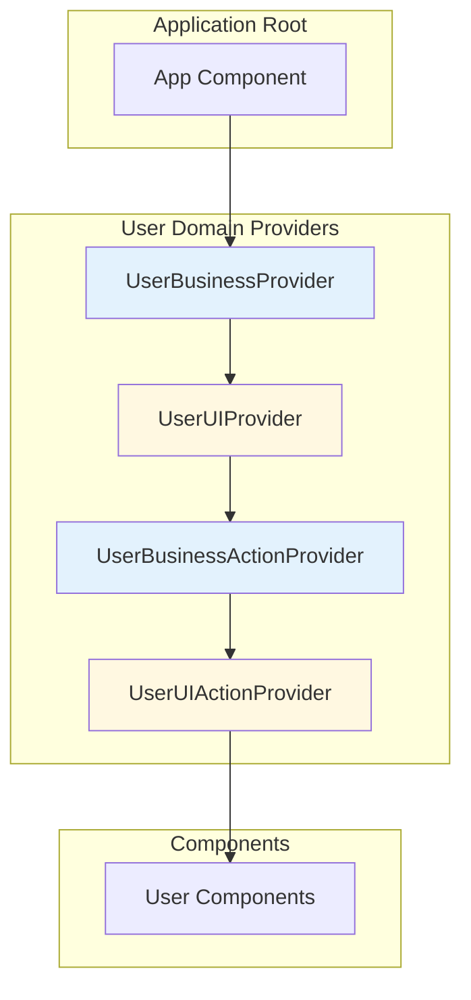
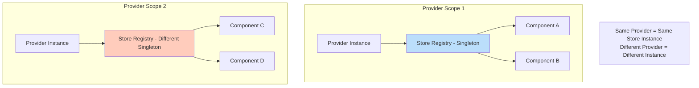

# Context-Action Store Integration Architecture

## 1. Overview & Core Concepts

### What is Context-Action Architecture?

The Context-Action framework is a **revolutionary state management system** designed to overcome the fundamental limitations of existing libraries through document-centric context separation and effective artifact management.

#### Project Philosophy

The Context-Action framework addresses critical issues in modern state management:

**Problems with Existing Libraries:**
- **High React Coupling**: Tight integration makes component modularization and props handling difficult
- **Binary State Approach**: Simple global/local state dichotomy fails to handle specific scope-based separation  
- **Inadequate Handler/Trigger Management**: Poor support for complex interactions and business logic processing

**Context-Action's Solution:**
- **Document-Artifact Centered Design**: Context separation based on document themes and deliverable management
- **Perfect Separation of Concerns**: 
  - View design in isolation → Design Context
  - Development architecture in isolation → Architecture Context
  - Business logic in isolation → Business Context  
  - Data validation in isolation → Validation Context
- **Clear Boundaries**: Implementation results maintain distinct, well-defined domain boundaries
- **Effective Document-Artifact Management**: State management library that actively supports the relationship between documentation and deliverables

### Architecture Implementation

The framework implements a clean separation of concerns through an MVVM-inspired pattern combined with **Declarative Store Pattern** for complete domain isolation:

- **Actions** handle business logic (ViewModel layer)
- **Declarative Store Pattern** manages state with domain isolation (Model layer)
- **Components** render UI (View layer)
- **Context Boundaries** isolate functional domains
- **Type-Safe Integration** through domain-specific hooks

### Core Architecture Flow

```
[Component] → dispatch → [Action Pipeline] → handlers → [Store] → subscribe → [Component]
```

### Context Separation Strategy

#### Domain-Based Context Architecture
- **Business Context**: Business logic, data processing, and domain rules
- **UI Context**: Screen state, user interactions, and component behavior  
- **Validation Context**: Data validation, form processing, and error handling
- **Design Context**: Theme management, styling, layout, and visual states
- **Architecture Context**: System configuration, infrastructure, and technical decisions

#### Document-Based Context Design
Each context is designed to manage its corresponding documentation and deliverables:
- **Design Documentation** → Design Context (themes, component specifications, style guides)
- **Business Requirements** → Business Context (workflows, rules, domain logic)  
- **Architecture Documents** → Architecture Context (system design, technical decisions)
- **Validation Specifications** → Validation Context (rules, schemas, error handling)
- **UI Specifications** → UI Context (interactions, state management, user flows)

### Advanced Handler & Trigger Management

Context-Action provides sophisticated handler and trigger management that existing libraries lack:

#### Priority-Based Handler Execution
- **Sequential Processing**: Handlers execute in priority order with proper async handling
- **Domain Isolation**: Each context maintains its own handler registry
- **Cross-Context Coordination**: Controlled communication between domain contexts
- **Result Collection**: Aggregate results from multiple handlers for complex workflows

#### Intelligent Trigger System
- **State-Change Triggers**: Automatic triggers based on store value changes
- **Cross-Context Triggers**: Domain boundaries can trigger actions in other contexts
- **Conditional Triggers**: Smart triggers based on business rules and conditions
- **Trigger Cleanup**: Automatic cleanup prevents memory leaks and stale references

### Key Benefits

1. **Document-Artifact Management**: Direct relationship between documentation and implementation
2. **Domain Isolation**: Each context maintains complete independence
3. **Type Safety**: Full TypeScript support with domain-specific hooks
4. **Performance**: Only affected components re-render
5. **Scalability**: Easy to add new domains without affecting existing ones
6. **Team Collaboration**: Different teams can work on different domains without conflicts
7. **Clear Boundaries**: Perfect separation of concerns based on document domains

## 2. Domain-Specific Hooks Pattern (Core)

### Philosophy: Renamed Hook Pattern

The framework's core philosophy is to create **domain-specific hooks** through destructuring assignments, providing intuitive, type-safe APIs that improve developer experience.

```typescript
// ✅ Domain-specific hook naming pattern
export const {
  Provider: UserBusinessProvider,
  useStore: useUserBusinessStore,        // Domain-specific store hook
  useStoreManager: useUserBusinessStoreManager,    // Domain-specific store registry hook
  useStoreInfo: useUserBusinessStoreInfo
} = createDeclarativeStorePattern('UserBusiness', storeDefinitions);

export const {
  Provider: UserBusinessActionProvider,
  useActionDispatch: useUserBusinessAction,      // Domain-specific action hook
  useActionHandler: useUserBusinessActionHandler
} = createActionContext<UserBusinessActions>('UserBusinessAction');
```

### Benefits of Domain-Specific Naming

1. **Type Safety**: Full TypeScript inference with domain-specific types
2. **Developer Experience**: Clear, autocomplete-friendly API
3. **Maintainability**: Easy to identify which domain a hook belongs to
4. **Refactoring Safety**: Type errors immediately highlight breaking changes
5. **Team Scalability**: Different teams can work on different domains without conflicts

### Store Access Patterns

Three valid patterns for accessing stores, each with specific use cases:

```typescript
// Pattern 1: Domain-specific hooks (Components)
const store = useUserBusinessStore('profile');

// Pattern 2: Store manager access for advanced use cases (Handlers)
const storeManager = useUserBusinessStoreManager();
const store = storeManager.getStore('profile');
```

## 3. Basic Setup & Usage

### Step 1: Define Domain Stores and Actions

```typescript
// stores/userBusiness.store.ts
import { createDeclarativeStorePattern } from '@context-action/react';
import { createActionContext } from '@context-action/react';

// Define store interface
export interface UserBusinessData {
  profile: {
    id: string;
    name: string;
    email: string;
    role: 'admin' | 'user' | 'guest';
  };
  preferences: {
    theme: 'light' | 'dark';
    language: string;
  };
}

// Define action interface
export interface UserBusinessActions {
  updateProfile: {
    data: Partial<UserBusinessData['profile']>;
    validate?: boolean;
  };
  deleteUser: { userId: string };
}

// Create domain-specific store hooks
export const {
  Provider: UserBusinessStoreProvider,
  useStore: useUserBusinessStore,
  useStoreManager: useUserBusinessStoreManager,
  useStoreInfo: useUserBusinessStoreInfo
} = createDeclarativeStorePattern('UserBusiness', {
  profile: {
    initialValue: {
      id: '',
      name: '',
      email: '',
      role: 'guest'
    }
  },
  preferences: {
    initialValue: {
      theme: 'light',
      language: 'en'
    }
  }
});

// Create domain-specific action hooks
export const {
  Provider: UserBusinessActionProvider,
  useActionDispatch: useUserBusinessAction,
  useActionHandler: useUserBusinessActionHandler,
  useActionDispatchWithResult: useUserBusinessActionWithResult
} = createActionContext<UserBusinessActions>('UserBusinessAction');
```

### Step 2: Provider Composition

```tsx
// providers/UserProvider.tsx
import React, { FC } from 'react';
import { 
  UserBusinessStoreProvider,
  UserBusinessActionProvider,
  UserUIStoreProvider,
  UserUIActionProvider
} from '@/stores';

// Compose all providers for the domain
export const UserProvider: FC<{ children: React.ReactNode }> = ({ children }) => (
  <UserBusinessStoreProvider>
    <UserUIStoreProvider>
      <UserBusinessActionProvider>
        <UserUIActionProvider>
          {children}
        </UserUIActionProvider>
      </UserBusinessActionProvider>
    </UserUIStoreProvider>
  </UserBusinessStoreProvider>
);

// HOC pattern for cleaner composition (alternative)
export const withUserProviders = (Component: React.ComponentType) => {
  return (props: any) => (
    <UserProvider>
      <Component {...props} />
    </UserProvider>
  );
};
```

### Step 3: Component Implementation

```tsx
// components/UserProfile.tsx
import React, { useCallback } from 'react';
import { useStoreValue } from '@context-action/react';
import { useUserBusinessStore, useUserBusinessAction } from '@/stores/userBusiness.store';

export function UserProfile() {
  // Access domain-specific stores
  const profileStore = useUserBusinessStore('profile');
  const preferencesStore = useUserBusinessStore('preferences');
  
  // Get current values
  const profile = useStoreValue(profileStore);
  const preferences = useStoreValue(preferencesStore);
  
  // Get domain-specific action dispatcher
  const dispatch = useUserBusinessAction();
  
  const handleUpdateProfile = useCallback(async () => {
    await dispatch('updateProfile', {
      data: { name: 'New Name' },
      validate: true
    });
  }, [dispatch]);
  
  return (
    <div>
      <h2>{profile.name}</h2>
      <p>Theme: {preferences.theme}</p>
      <button onClick={handleUpdateProfile}>
        Update Profile
      </button>
    </div>
  );
}
```

## 4. Store Management

### Store Creation and Access

```tsx
// Store setup component
function UserStoreSetup() {
  // Create stores in the context registry
  useCreateUserBusinessStore('profile', {
    id: '',
    name: '',
    email: '',
    role: 'guest'
  });
  
  useCreateUserBusinessStore('preferences', {
    theme: 'light',
    language: 'en'
  });
  
  return null;
}

// Store access in components
function UserSettings() {
  const preferencesStore = useUserBusinessStore('preferences');
  const preferences = useStoreValue(preferencesStore);
  
  const updateTheme = useCallback((theme: 'light' | 'dark') => {
    preferencesStore.setValue({ ...preferences, theme });
  }, [preferences, preferencesStore]);
  
  return (
    <div>
      <button onClick={() => updateTheme('dark')}>
        Switch to Dark Theme
      </button>
    </div>
  );
}
```

### Store Patterns

#### Singleton Behavior

Stores are singletons within Provider boundaries - same name returns same instance:

```typescript
function ComponentA() {
  const store = useUserBusinessStore('profile'); // Same instance
}

function ComponentB() {
  const store = useUserBusinessStore('profile'); // Same instance as ComponentA
}
```

#### Lazy Evaluation in Handlers

Use stores.getStore() for lazy evaluation to avoid stale closures:

```typescript
const handler = async (payload, controller) => {
  // Lazy evaluation - gets current value at execution time
  const profileStore = registry.getStore<UserProfile>('profile');
  const currentProfile = profileStore.getValue();
  
  // Business logic with current data
  profileStore.setValue({ ...currentProfile, ...payload });
};
```

## 5. Action Handlers

### Best Practice: useActionHandler Pattern

The recommended pattern for handler registration uses `useActionHandler` + `useEffect` for optimal performance and proper cleanup:

```typescript
import React, { useEffect, useCallback } from 'react';
import { useUserBusinessActionHandler, useUserBusinessStoreManager } from '@/stores/userBusiness.store';

function useUserBusinessHandlers() {
  const addHandler = useUserBusinessActionHandler();
  const storeManager = useUserBusinessStoreManager();
  
  // Wrap handler with useCallback to prevent re-registration
  const updateProfileHandler = useCallback(async (payload, controller) => {
    // Lazy evaluation using store manager for current state
    const profileStore = storeManager.getStore('profile');
    const currentProfile = profileStore.getValue();
    
    // Validation
    if (payload.validate && !isValidEmail(payload.data.email)) {
      controller.abort('Invalid email format');
      return;
    }
    
    // Business logic
    const updatedProfile = {
      ...currentProfile,
      ...payload.data,
      updatedAt: Date.now()
    };
    
    // Update store
    profileStore.setValue(updatedProfile);
    
    // Return result for collection
    return { success: true, profile: updatedProfile };
  }, [registry]);
  
  // Register handler with cleanup
  useEffect(() => {
    if (!addHandler) return;
    
    // Register returns unregister function
    const unaddHandler = addHandler('updateProfile', updateProfileHandler, {
      priority: 100,      // Higher priority executes first
      blocking: true,     // Wait for async completion in sequential mode
      tags: ['business'], // For filtering
      id: 'profile-updater' // Explicit ID for debugging
    });
    
    // Critical: Return unregister for memory cleanup on unmount
    return unregister;
  }, [register, updateProfileHandler]);
  
  // TODO: Bulk cleanup method
  // register.clearAll(); // Coming soon for bulk unregistration
}
```

### Handler Registration Options

```typescript
interface HandlerConfig {
  priority?: number;        // Execution order (higher = first)
  blocking?: boolean;       // Wait for async completion
  tags?: string[];         // For filtering and categorization
  id?: string;            // Explicit handler ID
  category?: string;      // Handler category
  returnType?: 'value';   // Enable return value collection
}
```

### Handler Execution Flow

1. **Sequential Mode** (default): Handlers run in priority order
2. **Parallel Mode**: All handlers execute simultaneously
3. **Race Mode**: First handler to complete wins

```typescript
// Sequential with blocking
register('processOrder', handler1, { priority: 100, blocking: true });
register('processOrder', handler2, { priority: 90, blocking: true });
register('processOrder', handler3, { priority: 80, blocking: true });
// Execution: handler1 → waits → handler2 → waits → handler3

// Parallel execution
dispatch('processOrder', payload, { executionMode: 'parallel' });
```

### Controller Methods

```typescript
const handler = async (payload, controller) => {
  // Abort pipeline
  if (error) controller.abort('Error message');
  
  // Jump to specific priority
  if (urgent) controller.jumpToPriority(90);
  
  // Set result for collection
  controller.setResult(computedValue);
  
  // Terminate pipeline with result
  if (canFinishEarly) controller.return(finalResult);
};
```

### Result Collection

```typescript
function useOrderProcessing() {
  const dispatchWithResult = useUserBusinessActionWithResult();
  
  const processOrder = async (orderData) => {
    const result = await dispatchWithResult('processOrder', orderData, {
      result: {
        collect: true,         // Enable collection
        strategy: 'all',       // Collect all results
        timeout: 5000,         // 5 second timeout
        maxResults: 10         // Limit results
      },
      filter: {
        tags: ['validation', 'business'], // Only these handlers
        excludeTags: ['logging']          // Exclude logging
      }
    });
    
    if (result.success) {
      console.log('Results:', result.results);
      console.log('Duration:', result.execution.duration);
    }
    
    return result.result;
  };
}
```

## 6. Advanced Patterns

### Cross-Domain Integration (When Needed)

While domain isolation is preferred, sometimes cross-domain interaction is necessary:

```typescript
// hooks/useUserCartIntegration.ts
export function useUserCartIntegration() {
  // Access multiple domains
  const userProfile = useUserBusinessStore('profile');
  const cartItems = useCartStore('items');
  const userAction = useUserBusinessAction();
  const cartAction = useCartAction();
  
  const profile = useStoreValue(userProfile);
  const items = useStoreValue(cartItems);
  
  const processCheckout = useCallback(async () => {
    // Validate user
    if (!profile.id) {
      await userAction('requireLogin', {});
      return;
    }
    
    // Process cart
    await cartAction('processCheckout', {
      userId: profile.id,
      items: items
    });
  }, [profile.id, items, userAction, cartAction]);
  
  return { processCheckout };
}
```

### Logic Fit Hooks Pattern

Combine business and UI logic in reusable hooks:

```typescript
export function useUserEditor() {
  // Business layer
  const profileStore = useUserBusinessStore('profile');
  const businessAction = useUserBusinessAction();
  
  // UI layer  
  const viewStore = useUserUIStore('view');
  const uiAction = useUserUIAction();
  
  const profile = useStoreValue(profileStore);
  const view = useStoreValue(viewStore);
  
  const startEditing = useCallback(() => {
    uiAction('setEditMode', { editing: true });
  }, [uiAction]);
  
  const saveChanges = useCallback(async (data) => {
    await businessAction('updateProfile', { data });
    uiAction('setEditMode', { editing: false });
  }, [businessAction, uiAction]);
  
  return {
    profile,
    isEditing: view.isEditing,
    startEditing,
    saveChanges
  };
}
```

### Handler ID Strategies for Component Instances

When multiple instances of the same component exist:

```tsx
function TodoItem({ todoId }: { todoId: string }) {
  const componentId = useId(); // React's unique ID
  const addHandler = useTodoActionHandler();
  
  const handler = useCallback(async (payload) => {
    // Handler logic specific to this instance
  }, [todoId]);
  
  useEffect(() => {
    if (!addHandler) return;
    
    // Unique ID per component instance
    const unaddHandler = addHandler('updateTodo', handler, {
      id: `updateTodo-${componentId}`,
      cleanup: true
    });
    
    return unregister;
  }, [register, handler, componentId]);
}
```

## 7. Best Practices

### Handler Registration

1. **Always use `useActionHandler` + `useEffect` pattern**
2. **Return unregister function for cleanup**
3. **Use `blocking: true` for sequential async handlers**
4. **Consider explicit IDs for debugging and critical handlers**
5. **Wrap handlers with `useCallback` to prevent re-registration**

### Store Access

6. **Use domain-specific hooks in components**
7. **Use `stores.getStore()` for lazy evaluation in handlers**
8. **Provide proper initial values, not null**
9. **Keep store updates predictable and traceable**

### Type Safety (Recommended)

10. **Define interfaces for better type safety**
11. **Use domain-specific hooks for type inference**
12. **Avoid `any` types - leverage TypeScript**

### Performance

13. **Only subscribe to needed stores**
14. **Use proper handler priorities**
15. **Clean up handlers on unmount**
16. **Use result collection selectively**

### Architecture

17. **One domain = One context boundary**
18. **Separate business and UI concerns**
19. **Prefer domain isolation, use cross-domain communication when necessary**
20. **Document domain boundaries clearly**

## 8. Common Pitfalls

### ❌ Missing Cleanup

```typescript
// Wrong - No cleanup
useEffect(() => {
  register('action', handler);
}, []);

// ✅ Correct - With cleanup
useEffect(() => {
  if (!addHandler) return;
  const unaddHandler = addHandler('action', handler);
  return unregister; // Memory cleanup on unmount
}, [register, handler]);
```

### ❌ Missing blocking for Async Handlers

```typescript
// Wrong - Handlers execute simultaneously
register('action', asyncHandler, { priority: 100 });

// ✅ Correct - Sequential execution
register('action', asyncHandler, { 
  priority: 100, 
  blocking: true // Wait for completion
});
```

### ❌ Using Stale Closures

```typescript
// Wrong - Stale closure
const profile = profileStore.getValue();
const handler = async () => {
  console.log(profile); // Stale value
};

// ✅ Correct - Lazy evaluation
const handler = async () => {
  const profileStore = stores.getStore('profile');
  const profile = profileStore.getValue(); // Current value
};
```


## Architecture Diagrams 

### Provider Composition Pattern



### Store Singleton Behavior



## 9. Implementation Examples

### Quick Start Example

```typescript
// 1. Define Domain (stores/user.store.ts)
export interface UserData {
  profile: { id: string; name: string; email: string; role: 'admin' | 'user' | 'guest' };
  preferences: { theme: 'light' | 'dark'; language: string };
}

export interface UserActions {
  login: { email: string; password: string };
  logout: void;
  updateProfile: { data: Partial<UserData['profile']> };
}

// Create domain-specific hooks
export const {
  Provider: UserProvider,
  useStore: useUserStore,
  useStoreManager: useUserStoreManager
} = createDeclarativeStorePattern('User', {
  profile: { initialValue: { id: '', name: '', email: '', role: 'guest' } },
  preferences: { initialValue: { theme: 'light', language: 'en' } }
});

export const {
  Provider: UserActionProvider,
  useActionDispatch: useUserAction,
  useActionHandler: useUserActionHandler
} = createActionContext<UserActions>('UserAction');
```

```typescript
// 2. Define Actions & Handlers (hooks/useUserHandlers.ts)
export function useUserHandlers() {
  const addHandler = useUserActionHandler();
  const stores = useUserStores();
  
  // Login handler example
  const loginHandler = useCallback(async (payload, controller) => {
    const profileStore = stores.getStore('profile');
    
    try {
      // Validation
      if (!validateEmail(payload.email)) {
        controller.abort('Invalid email format');
        return;
      }
      
      // API call
      const response = await authAPI.login(payload.email, payload.password);
      
      // Update store
      profileStore.setValue({
        ...response.user,
        status: 'active'
      });
      
      return { success: true, userId: response.user.id };
    } catch (error) {
      controller.abort('Login failed', error);
      return { success: false };
    }
  }, [registry]);
  
  // Similar patterns for logout, updateProfile handlers...
  
  // Register handlers with cleanup
  useEffect(() => {
    if (!addHandler) return;
    
    const unregisterLogin = register('login', loginHandler, {
      priority: 100,
      blocking: true,
      id: 'user-login-handler'
    });
    
    // Register other handlers...
    
    // Cleanup on unmount
    return () => {
      unregisterLogin();
      // Cleanup other handlers...
    };
  }, [register, loginHandler]);
}
```

```tsx
// 3. Use in Component (components/UserProfile.tsx)
export function UserProfile() {
  const profileStore = useUserStore('profile');
  const profile = useStoreValue(profileStore);
  const dispatch = useUserAction();
  
  const handleLogin = useCallback(async () => {
    const result = await dispatch('login', {
      email: 'user@example.com',
      password: 'password123'
    });
    
    if (result?.success) {
      console.log('Login successful');
    }
  }, [dispatch]);
  
  const handleUpdateProfile = useCallback(() => {
    dispatch('updateProfile', {
      data: { name: 'New Name' }
    });
  }, [dispatch]);
  
  return (
    <div>
      <h1>Welcome, {profile.name || 'Guest'}</h1>
      <p>Email: {profile.email}</p>
      <p>Role: {profile.role}</p>
      
      {profile.id ? (
        <button onClick={handleUpdateProfile}>Update Profile</button>
      ) : (
        <button onClick={handleLogin}>Login</button>
      )}
    </div>
  );
}
```

```tsx
// 4. App Setup (App.tsx)
function App() {
  return (
    <UserProvider>
      <UserActionProvider>
        <UserHandlersSetup />
        <UserProfile />
      </UserActionProvider>
    </UserProvider>
  );
}

// Handler setup component
function UserHandlersSetup() {
  useUserHandlers();
  return null;
}
```

### Logic Fit Hook Pattern (Combining Business & UI)

```typescript
// hooks/useUserEditor.ts
export function useUserEditor() {
  // Business layer
  const profileStore = useUserStore('profile');
  const profile = useStoreValue(profileStore);
  const dispatch = useUserAction();
  
  // UI state (local or separate UI store)
  const [isEditing, setIsEditing] = useState(false);
  const [formData, setFormData] = useState(profile);
  
  // Combined logic
  const startEditing = useCallback(() => {
    setIsEditing(true);
    setFormData(profile);
  }, [profile]);
  
  const saveChanges = useCallback(async () => {
    const result = await dispatch('updateProfile', { data: formData });
    if (result?.success) {
      setIsEditing(false);
    }
    return result;
  }, [dispatch, formData]);
  
  const cancelEditing = useCallback(() => {
    setIsEditing(false);
    setFormData(profile);
  }, [profile]);
  
  return {
    // Data
    profile,
    formData,
    isEditing,
    
    // Methods
    startEditing,
    saveChanges,
    cancelEditing,
    setFormData
  };
}
```

### Complete Implementation Pattern

For a full implementation with Business/UI separation, provider composition, and comprehensive handler patterns, see the [GitHub repository examples](https://github.com/mineclover/context-action/tree/main/example).

Key patterns demonstrated:
- **Store Definition**: Business data, UI state, and domain isolation
- **Handler Registration**: Priority-based execution with cleanup
- **Provider Composition**: Nested providers for domain boundaries
- **Logic Fit Hooks**: Combining business and UI logic
- **Testing Patterns**: Unit and integration testing approaches

## 10. Testing Guide

### Unit Testing Handlers

```typescript
// __tests__/handlers/userBusinessHandlers.test.ts
import { renderHook } from '@testing-library/react-hooks';
import { useUserBusinessHandlers } from '@/hooks/handlers/useUserBusinessHandlers';
import { createMockRegistry, createMockController } from '@/test-utils';

describe('User Business Handlers', () => {
  let mockRegistry;
  let mockController;
  
  beforeEach(() => {
    mockRegistry = createMockRegistry();
    mockController = createMockController();
  });
  
  it('should validate email in login handler', async () => {
    const { result } = renderHook(() => useUserBusinessHandlers());
    
    const loginHandler = result.current.loginHandler;
    
    await loginHandler(
      { email: 'invalid-email', password: 'password123' },
      mockController
    );
    
    expect(mockController.abort).toHaveBeenCalledWith('Invalid email format');
  });
  
  it('should update profile store on successful login', async () => {
    const mockProfileStore = {
      getValue: jest.fn(() => ({ id: '', name: '' })),
      setValue: jest.fn()
    };
    
    mockRegistry.getStore.mockReturnValue(mockProfileStore);
    
    const { result } = renderHook(() => useUserBusinessHandlers());
    
    await result.current.loginHandler(
      { email: 'user@example.com', password: 'password123' },
      mockController
    );
    
    expect(mockProfileStore.setValue).toHaveBeenCalledWith(
      expect.objectContaining({
        email: 'user@example.com',
        status: 'active'
      })
    );
  });
});
```

### Integration Testing

```tsx
// __tests__/integration/userFlow.test.tsx
import React from 'react';
import { render, fireEvent, waitFor } from '@testing-library/react';
import { UserProvider } from '@/providers/UserProvider';
import { UserProfile } from '@/components/UserProfile';

describe('User Profile Integration', () => {
  it('should handle complete edit flow', async () => {
    const { getByText, getByLabelText } = render(
      <UserProvider>
        <UserProfile />
      </UserProvider>
    );
    
    // Start editing
    fireEvent.click(getByText('Edit Profile'));
    
    // Update fields
    const nameInput = getByLabelText('Name:');
    fireEvent.change(nameInput, { target: { value: 'New Name' } });
    
    // Save changes
    fireEvent.click(getByText('Save'));
    
    // Verify updates
    await waitFor(() => {
      expect(getByText('Name: New Name')).toBeInTheDocument();
    });
  });
});
```

## 11. Migration Guide

### From Legacy Patterns

```typescript
// ❌ Old Pattern: Direct handler registration
function OldComponent() {
  const dispatch = useDispatch();
  
  const handler = () => {
    // handler logic
  };
  
  useActionHandler('action', handler); // Direct registration
}

// ✅ New Pattern: Register with cleanup
function NewComponent() {
  const register = useActionHandler();
  const dispatch = useAction();
  
  const handler = useCallback(() => {
    // handler logic
  }, []);
  
  useEffect(() => {
    if (!addHandler) return;
    const unaddHandler = addHandler('action', handler, {
      id: 'unique-handler-id',
      blocking: true
    });
    return unregister; // Cleanup
  }, [register, handler]);
}
```

### Incremental Migration Steps

1. **Phase 1: Add Type Definitions**
    
    - Define interfaces for all stores and actions
    - Add domain-specific hook exports
2. **Phase 2: Update Handler Registration**
    
    - Convert to useActionHandler pattern
    - Add cleanup functions
    - Add explicit handler IDs
3. **Phase 3: Implement Domain Isolation**
    
    - Separate business and UI concerns
    - Create domain-specific providers
    - Update component imports
4. **Phase 4: Testing & Validation**
    
    - Update tests for new patterns
    - Verify cleanup on unmount
    - Performance testing

## 12. Troubleshooting

### Common Issues and Solutions

#### Handler Not Executing

```typescript
// Problem: Handler registered but not executing
register('action', asyncHandler, { priority: 100 });

// Solution: Add blocking for async handlers
register('action', asyncHandler, { 
  priority: 100,
  blocking: true // Required for sequential async execution
});
```

#### Stale State in Handlers

```typescript
// Problem: Getting old values
const value = store.getValue();
const handler = () => console.log(value); // Stale

// Solution: Use lazy evaluation
const handler = () => {
  const store = stores.getStore('name');
  const value = store.getValue(); // Current
};
```

#### Memory Leaks

```typescript
// Problem: Handlers not cleaned up
useEffect(() => {
  register('action', handler);
}); // No cleanup!

// Solution: Return unregister
useEffect(() => {
  if (!addHandler) return;
  const unaddHandler = addHandler('action', handler);
  return unregister; // Cleanup on unmount
}, [register, handler]);
```

#### Type Errors

```typescript
// Problem: Type inference not working
const store = useStore('profile'); // Generic type

// Solution: Use domain-specific hooks
const store = useUserBusinessStore('profile'); // Typed
```

## Conclusion

The Context-Action Store Integration Architecture provides a robust, scalable, and type-safe foundation for React applications. By following the patterns and best practices outlined in this guide, you can build maintainable applications with clear separation of concerns, excellent performance, and great developer experience.

### Key Takeaways

1. **Use domain-specific hooks** for type safety and clarity
2. **Always implement cleanup** with unregister functions
3. **Use lazy evaluation** in handlers to avoid stale state
4. **Separate business and UI concerns** with different stores/actions
5. **Prefer domain isolation** - use cross-domain only when necessary
6. **Consider explicit IDs** for debugging and critical handlers
7. **Use blocking: true** for sequential async handlers
8. **Test handlers in isolation** before integration

For more information and updates, visit the project repository.