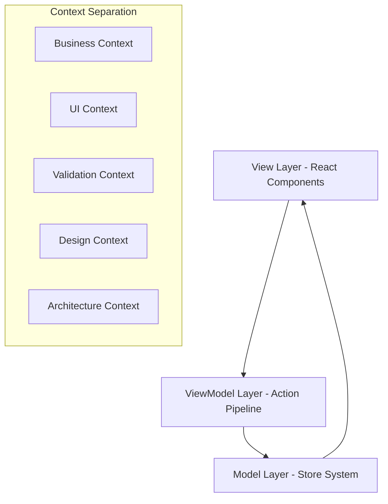

# Getting Started

Welcome to **Context-Action framework** - a revolutionary state management system designed to overcome the fundamental limitations of existing libraries through document-centric context separation and effective artifact management.

## What is Context-Action?

Context-Action addresses critical issues in modern state management:

### Problems with Existing Libraries
- **High React Coupling**: Tight integration makes component modularization and props handling difficult
- **Binary State Approach**: Simple global/local state dichotomy fails to handle specific scope-based separation  
- **Inadequate Handler/Trigger Management**: Poor support for complex interactions and business logic processing

### Context-Action's Solution
- **Document-Artifact Centered Design**: Context separation based on document themes and deliverable management
- **Perfect Separation of Concerns**: Clear boundaries between different domain contexts
- **Advanced Handler & Trigger Management**: Priority-based handler execution with sophisticated trigger system

## Core Architecture

Context-Action implements an **MVVM-inspired architecture** with three clear layers:



### Key Components

1. **View Layer**: React components that render UI and dispatch actions
2. **ViewModel Layer**: Action pipeline with priority-based handler execution
3. **Model Layer**: Store system with reactive state management

## Package Structure

Context-Action is organized as a TypeScript monorepo:

- **@context-action/core** - Core action pipeline management (no React dependency)
- **@context-action/react** - React integration with Context API and hooks

## Installation

```bash
# Install both packages
npm install @context-action/core @context-action/react

# Or with pnpm
pnpm add @context-action/core @context-action/react

# Or with yarn
yarn add @context-action/core @context-action/react
```

## Two Main Patterns

Context-Action provides two primary patterns that can be used independently or combined:

### 🎯 Action Only Pattern
For pure action dispatching without state management:
- Event systems and command patterns
- Type-safe action dispatching with handler registration
- Lightweight with no store overhead

### 🏪 Store Only Pattern (Recommended)
For pure state management without action dispatching:
- Data layers and simple state management
- Excellent type inference without manual annotations  
- Simplified API focused on store management

## Quick Example

Here's a simple example using both patterns together:

```typescript
// 1. Action Only Pattern for events
const {
  Provider: EventActionProvider,
  useActionDispatch: useEventAction,
  useActionHandler: useEventActionHandler
} = createActionContext<{
  trackEvent: { event: string; data: any }
}>('Events');

// 2. Store Only Pattern for state
const {
  Provider: UserStoreProvider,
  useStore: useUserStore,
  useStoreManager: useUserStoreManager
} = createDeclarativeStorePattern('User', {
  profile: { initialValue: { name: '', email: '' } },
  preferences: { initialValue: { theme: 'light' } }
});

// 3. Compose providers
function App() {
  return (
    <EventActionProvider>
      <UserStoreProvider>
        <UserComponent />
      </UserStoreProvider>
    </EventActionProvider>
  );
}

// 4. Use in components
function UserComponent() {
  const dispatch = useEventAction();
  const profileStore = useUserStore('profile');
  const profile = useStoreValue(profileStore);
  
  useEventActionHandler('trackEvent', async (payload) => {
    console.log('Event tracked:', payload);
  });
  
  return (
    <div>
      <h1>{profile.name}</h1>
      <button onClick={() => dispatch('trackEvent', { 
        event: 'button_click', 
        data: { button: 'profile' } 
      })}>
        Track Event
      </button>
    </div>
  );
}
```

## Next Steps

Now that you understand the basics, explore these topics:

- **[MVVM Architecture](./mvvm-architecture)** - Deep dive into the architectural patterns
- **[Action Pipeline](./action-pipeline)** - Learn about the action processing system  
- **[Main Patterns](./patterns)** - Understand Action Only and Store Only patterns in detail
- **[Examples](../examples/basic-setup)** - See complete working examples

## Key Benefits

✅ **Type Safety**: Full TypeScript support with strict type checking  
✅ **Separation of Concerns**: Clear boundaries between View, ViewModel, and Model  
✅ **Scalable Architecture**: Document-centric context separation  
✅ **Advanced Handler Management**: Priority-based execution with trigger system  
✅ **React Integration**: Clean hooks-based integration  
✅ **Pattern Flexibility**: Use Action Only, Store Only, or both together