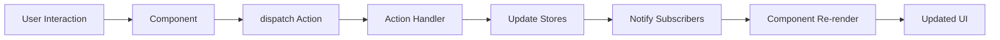

# MVVM Architecture in Context-Action

## Overview

The Context-Action framework implements a clean separation of concerns through an **MVVM-inspired pattern** that adapts the traditional Model-View-ViewModel architecture for modern React applications with centralized state management.

### Architecture Layers

- **🎨 View Layer**: React Components (Presentation)
- **⚡ ViewModel Layer**: Action Handlers (Business Logic)  
- **📦 Model Layer**: Stores (State Management)

### Key Benefits

- **Clean Separation**: Clear boundaries between presentation, logic, and data
- **Testability**: Each layer can be tested independently
- **Reusability**: Business logic can be shared across components
- **Type Safety**: Full TypeScript support throughout all layers
- **Performance**: Optimized re-rendering with selective store subscriptions

## Architecture Diagram

```
┌─────────────────────────────────────────────────────────────────────────┐
│                                  VIEW LAYER                              │
│                             (React Components)                           │
│                                                                         │
│  ┌─────────────┐    ┌─────────────┐    ┌─────────────┐               │
│  │  Component A │    │  Component B │    │  Component C │               │
│  │             │    │             │    │             │               │
│  │  dispatch() │    │  dispatch() │    │  dispatch() │               │
│  │  useStore() │    │  useStore() │    │  useStore() │               │
│  └──────┬──────┘    └──────┬──────┘    └──────┬──────┘               │
│         │ dispatch          │ dispatch          │ dispatch              │
│         │ subscribe         │ subscribe         │ subscribe             │
└─────────┼───────────────────┼───────────────────┼──────────────────────┘
          │                   │                   │
          ▼                   ▼                   ▼
┌─────────────────────────────────────────────────────────────────────────┐
│                            VIEWMODEL LAYER                               │
│                          (Action Pipeline)                               │
│                                                                         │
│  ┌─────────────────────────────────────────────────────────────────┐  │
│  │                      ActionRegister<T>                           │  │
│  │  ┌────────────┐  ┌────────────┐  ┌────────────┐               │  │
│  │  │  Handler 1 │  │  Handler 2 │  │  Handler 3 │               │  │
│  │  │ priority:10│  │ priority:5 │  │ priority:0 │               │  │
│  │  └────────────┘  └────────────┘  └────────────┘               │  │
│  │                                                                 │  │
│  │  Pipeline Execution: payload → handler → store updates         │  │
│  └─────────────────────────────────────────────────────────────────┘  │
│                            │                                            │
│                            │ get/set at execution time                  │
│                            ▼                                            │
└─────────────────────────────────────────────────────────────────────────┘
                             │
                             ▼
┌─────────────────────────────────────────────────────────────────────────┐
│                              MODEL LAYER                                 │
│                               (Stores)                                   │
│                                                                         │
│  ┌─────────────┐    ┌─────────────┐    ┌─────────────┐               │
│  │   Store A   │    │   Store B   │    │   Store C   │               │
│  │             │    │             │    │             │               │
│  │  getValue() │    │  getValue() │    │  getValue() │               │
│  │  setValue() │    │  setValue() │    │  setValue() │               │
│  │  update()   │    │  update()   │    │  update()   │               │
│  │  subscribe()│    │  subscribe()│    │  subscribe()│               │
│  └─────────────┘    └─────────────┘    └─────────────┘               │
│                                                                         │
│  ┌─────────────────────────────────────────────────────────────────┐  │
│  │                        StoreRegistry                             │  │
│  │                 Centralized store management                     │  │
│  └─────────────────────────────────────────────────────────────────┘  │
└─────────────────────────────────────────────────────────────────────────┘
```

## Data Flow Sequence

```
User Interaction
       │
       ▼
Component.dispatch('action', payload)
       │
       ▼
ActionPipeline.execute(payload)
       │
       ▼
Handler.process(payload, controller)
       │
       ├─→ Store.getValue() [Read current state]
       │
       ├─→ Business Logic [Process with payload + state]
       │
       ├─→ Store.setValue() [Update state]
       │
       ▼
Store.notifySubscribers()
       │
       ▼
Component.reRender() [Via React hooks]
```

## Core Concepts

### 1. 🎨 View Layer (React Components)

Components in the View layer are responsible for:
- **Presentation**: Rendering UI based on store state
- **User Interaction**: Capturing user events and dispatching actions
- **Store Subscription**: Automatically re-rendering when subscribed stores change

```typescript
function UserProfile() {
  // Subscribe to stores (Model layer)
  const user = useStoreValue(userStore);
  const settings = useStoreValue(settingsStore);
  
  // Get action dispatcher (ViewModel layer)
  const dispatch = useActionDispatch();
  
  // Handle user interactions
  const updateUserName = (name: string) => {
    dispatch('updateUser', { id: user.id, name });
  };
  
  return (
    <div>
      <h1>{user.name}</h1>
      <input 
        value={user.name}
        onChange={(e) => updateUserName(e.target.value)}
      />
      <span>Theme: {settings.theme}</span>
    </div>
  );
}
```

#### Component Responsibilities
- ✅ **DO**: Handle presentation and user interaction
- ✅ **DO**: Subscribe to relevant stores
- ✅ **DO**: Dispatch actions with payloads
- ❌ **DON'T**: Contain business logic
- ❌ **DON'T**: Directly manipulate store state
- ❌ **DON'T**: Make API calls or side effects

### 2. ⚡ ViewModel Layer (Action Handlers)

Action handlers serve as the ViewModel layer, containing:
- **Business Logic**: Core application logic and rules
- **State Coordination**: Reading and updating multiple stores
- **Side Effects**: API calls, external service integration
- **Validation**: Input validation and error handling

```typescript
// Action handler acting as ViewModel
actionRegister.register('updateUser', async (payload, controller) => {
  // Read current state from Model layer
  const currentUser = userStore.getValue();
  const settings = settingsStore.getValue();
  const permissions = permissionsStore.getValue();
  
  // Business logic validation
  if (!permissions.canEditProfile) {
    controller.abort('Insufficient permissions');
    return;
  }
  
  if (settings.validateNames && !isValidName(payload.name)) {
    controller.abort('Invalid name format');
    return;
  }
  
  // Execute business logic
  const updatedUser = {
    ...currentUser,
    ...payload,
    lastModified: Date.now(),
    version: currentUser.version + 1
  };
  
  // Update Model layer
  userStore.setValue(updatedUser);
  
  // Log activity (side effect)
  activityStore.update(activities => [...activities, {
    type: 'user_updated',
    userId: payload.id,
    timestamp: Date.now()
  }]);
  
  // Async side effect (API call)
  try {
    await api.updateUser(updatedUser);
  } catch (error) {
    // Rollback on failure
    userStore.setValue(currentUser);
    controller.abort('Failed to save changes');
  }
});
```

#### Action Handler Responsibilities
- ✅ **DO**: Implement business logic and validation
- ✅ **DO**: Coordinate multiple stores
- ✅ **DO**: Handle async operations and side effects
- ✅ **DO**: Provide error handling and rollback
- ❌ **DON'T**: Directly manipulate DOM
- ❌ **DON'T**: Handle presentation logic
- ❌ **DON'T**: Maintain local state

### 3. 📦 Model Layer (Stores)

Stores in the Model layer handle:
- **State Storage**: Centralized application state
- **State Updates**: Controlled state mutations
- **Change Notification**: Automatic component re-rendering
- **Data Persistence**: Integration with external storage

```typescript
// Store definition (Model layer)
interface User {
  id: string;
  name: string;
  email: string;
  lastModified: number;
  version: number;
}

const userStore = createStore<User>({
  id: '',
  name: '',
  email: '',
  lastModified: 0,
  version: 0
});

// Store with computed values
const userDisplayStore = createComputedStore([userStore, settingsStore], 
  (user, settings) => ({
    displayName: settings.showFullName ? user.name : user.name.split(' ')[0],
    avatar: generateAvatar(user.id, settings.theme),
    status: user.lastModified > Date.now() - 300000 ? 'active' : 'away'
  })
);
```

#### Store Responsibilities
- ✅ **DO**: Manage application state
- ✅ **DO**: Provide controlled access to data
- ✅ **DO**: Notify subscribers of changes
- ✅ **DO**: Integrate with persistence layers
- ❌ **DON'T**: Contain business logic
- ❌ **DON'T**: Handle UI concerns
- ❌ **DON'T**: Make direct API calls

## Architecture Patterns

### 1. Unidirectional Data Flow



**Flow Description**:
1. **User Interaction**: User performs action (click, input, etc.)
2. **Component**: Captures interaction and dispatches action
3. **Action Handler**: Executes business logic in ViewModel layer
4. **Store Updates**: Action handler updates relevant stores in Model layer
5. **Component Re-render**: Subscribed components automatically re-render
6. **Updated UI**: User sees the result of their interaction

### 2. Cross-Store Coordination

```typescript
// Example: Shopping cart checkout coordination
actionRegister.register('checkout', async (payload, controller) => {
  // Read from multiple stores (Model layer)
  const cart = cartStore.getValue();
  const user = userStore.getValue();
  const inventory = inventoryStore.getValue();
  const payment = paymentStore.getValue();
  
  // Business validation (ViewModel logic)
  if (cart.items.length === 0) {
    controller.abort('Cart is empty');
    return;
  }
  
  if (!payment.isValid) {
    controller.abort('Invalid payment method');
    return;
  }
  
  // Check inventory availability
  const unavailableItems = cart.items.filter(item => 
    inventory[item.id] < item.quantity
  );
  
  if (unavailableItems.length > 0) {
    controller.abort('Some items are no longer available');
    return;
  }
  
  // Execute coordinated updates (Model layer updates)
  const order = {
    id: generateOrderId(),
    userId: user.id,
    items: cart.items,
    total: calculateTotal(cart.items),
    status: 'processing',
    createdAt: Date.now()
  };
  
  // Atomic-like updates
  orderStore.setValue(order);
  cartStore.setValue({ items: [] });
  inventoryStore.update(inv => updateInventory(inv, cart.items));
  
  // Side effect: API call
  try {
    await api.processOrder(order);
    orderStore.update(o => ({ ...o, status: 'confirmed' }));
  } catch (error) {
    // Rollback strategy
    orderStore.setValue(null);
    cartStore.setValue(cart);
    inventoryStore.update(inv => restoreInventory(inv, cart.items));
    controller.abort('Payment processing failed');
  }
});
```

### 3. Computed Values and Derived State

```typescript
// Derived state pattern
const shoppingCartSummary = createComputedStore(
  [cartStore, inventoryStore, userStore], 
  (cart, inventory, user) => {
    const availableItems = cart.items.filter(item => 
      inventory[item.id] >= item.quantity
    );
    
    const subtotal = availableItems.reduce((sum, item) => 
      sum + (item.price * item.quantity), 0
    );
    
    const discount = calculateDiscount(user.membershipLevel, subtotal);
    const tax = calculateTax(user.location, subtotal - discount);
    
    return {
      itemCount: availableItems.length,
      subtotal,
      discount,
      tax,
      total: subtotal - discount + tax,
      hasUnavailableItems: availableItems.length < cart.items.length
    };
  }
);
```

## Key Architectural Concepts

### 1. Lazy Evaluation Pattern

Context-Action implements lazy evaluation to ensure action handlers always receive fresh state values:

```typescript
// Handler gets fresh store values at execution time
actionRegister.register('updateCart', (payload, controller) => {
  // getValue() called when handler executes, not when registered
  const currentCart = cartStore.getValue();  // Always fresh
  const userPrefs = prefsStore.getValue();   // Always current
  
  // Process with latest values
  const updatedCart = processCart(currentCart, payload, userPrefs);
  cartStore.setValue(updatedCart);
});
```

This pattern eliminates stale closure issues common in event-driven architectures.

### 2. Action Context Registration

Actions are registered to the pipeline context at component mount, enabling proper lifecycle management:

```typescript
// Actions are registered to pipeline context at component mount
function CartFeature() {
  const registry = useStoreRegistry();
  const dispatch = useActionDispatch();
  
  useEffect(() => {
    // Get stores from registry
    const cartStore = registry.getStore('cart');
    const inventoryStore = registry.getStore('inventory');
    
    // Register action handlers with store access
    const unregister = actionRegister.register('addToCart', 
      (payload, controller) => {
        // Business logic with store access
        const cart = cartStore.getValue();
        const inventory = inventoryStore.getValue();
        
        if (inventory[payload.productId] < payload.quantity) {
          controller.abort('Insufficient inventory');
          return;
        }
        
        cartStore.update(cart => ({
          ...cart,
          items: [...cart.items, payload]
        }));
        
        inventoryStore.update(inv => ({
          ...inv,
          [payload.productId]: inv[payload.productId] - payload.quantity
        }));
      },
      { priority: 10, blocking: true }
    );
    
    return unregister; // Cleanup on unmount
  }, [registry]);
  
  return <CartUI onAddItem={(item) => dispatch('addToCart', item)} />;
}
```

### 3. Pipeline Execution Control

The pipeline controller enables sophisticated flow control within action handlers:

```typescript
// Pipeline controller enables flow control
actionRegister.register('processOrder', async (payload, controller) => {
  // Validation phase
  if (!validateOrder(payload)) {
    controller.abort('Invalid order data');
    return;
  }
  
  // Modify payload for next handlers
  controller.modifyPayload(order => ({
    ...order,
    processedAt: Date.now(),
    status: 'processing'
  }));
  
  // Continue to next handler
  controller.next();
});
```

## Design Principles

### 1. 🔄 Lazy Evaluation
- Store values are retrieved at execution time
- No stale closure issues
- Always fresh state in action handlers

### 2. 🧩 Separation of Concerns
- Clear boundaries between layers
- Each layer has distinct responsibilities
- Minimal coupling between layers

### 3. 🎯 Type Safety
- Strong typing throughout all layers
- Compile-time error detection
- Enhanced developer experience

### 4. 🧪 Testability
- Independent testing of each layer
- Mock stores for action testing
- Mock actions for component testing

### 5. ⚡ Performance
- Selective component re-rendering
- Efficient store subscription management
- Optimized cross-store operations

## Integration with React

### Provider Setup

```typescript
function App() {
  return (
    <StoreProvider>
      <ActionProvider>
        {/* Register action handlers */}
        <ActionHandlerRegistry />
        <Application />
      </ActionProvider>
    </StoreProvider>
  );
}

function ActionHandlerRegistry() {
  useUserActions();    // Register user-related actions
  useCartActions();    // Register cart-related actions
  useOrderActions();   // Register order-related actions
  return null;
}
```

### Component Integration Patterns

```typescript
// 1. Simple store subscription
function UserName() {
  const user = useStoreValue(userStore);
  return <span>{user.name}</span>;
}

// 2. Multiple store subscription
function Dashboard() {
  const user = useStoreValue(userStore);
  const cart = useStoreValue(cartStore);
  const orders = useStoreValue(ordersStore);
  
  return (
    <div>
      <UserHeader user={user} />
      <CartSummary cart={cart} />
      <OrderHistory orders={orders} />
    </div>
  );
}

// 3. Computed store subscription
function CartCheckout() {
  const summary = useStoreValue(shoppingCartSummary);
  const dispatch = useActionDispatch();
  
  const handleCheckout = () => {
    dispatch('checkout', { paymentMethod: 'card' });
  };
  
  return (
    <div>
      <div>Items: {summary.itemCount}</div>
      <div>Total: ${summary.total}</div>
      {summary.hasUnavailableItems && (
        <div>Some items are no longer available</div>
      )}
      <button onClick={handleCheckout}>Checkout</button>
    </div>
  );
}
```

## Advanced Patterns

### 1. 🔄 Async Operations with Loading States

```typescript
actionRegister.register('fetchUserProfile', async (payload, controller) => {
  // Set loading state
  uiStore.update(ui => ({ ...ui, loading: true, error: null }));
  
  try {
    const response = await api.getUserProfile(payload.userId);
    
    // Update multiple stores with response data
    userStore.setValue(response.user);
    preferencesStore.setValue(response.preferences);
    activityStore.setValue(response.recentActivity);
    
  } catch (error) {
    uiStore.update(ui => ({ ...ui, error: error.message }));
    controller.abort('Failed to fetch user profile');
  } finally {
    uiStore.update(ui => ({ ...ui, loading: false }));
  }
});
```

### 2. 🏗️ State Machines with Actions

```typescript
enum OrderStatus {
  DRAFT = 'draft',
  PROCESSING = 'processing',
  CONFIRMED = 'confirmed',
  SHIPPED = 'shipped',
  DELIVERED = 'delivered',
  CANCELLED = 'cancelled'
}

const orderStateMachine = {
  [OrderStatus.DRAFT]: [OrderStatus.PROCESSING, OrderStatus.CANCELLED],
  [OrderStatus.PROCESSING]: [OrderStatus.CONFIRMED, OrderStatus.CANCELLED],
  [OrderStatus.CONFIRMED]: [OrderStatus.SHIPPED, OrderStatus.CANCELLED],
  [OrderStatus.SHIPPED]: [OrderStatus.DELIVERED],
  [OrderStatus.DELIVERED]: [],
  [OrderStatus.CANCELLED]: []
};

actionRegister.register('updateOrderStatus', async (payload, controller) => {
  const currentOrder = orderStore.getValue();
  const allowedTransitions = orderStateMachine[currentOrder.status];
  
  if (!allowedTransitions.includes(payload.newStatus)) {
    controller.abort(`Invalid status transition from ${currentOrder.status} to ${payload.newStatus}`);
    return;
  }
  
  orderStore.update(order => ({
    ...order,
    status: payload.newStatus,
    updatedAt: Date.now()
  }));
});
```

### 3. 🎯 Event Sourcing Pattern

```typescript
interface Event {
  id: string;
  type: string;
  payload: any;
  timestamp: number;
  userId: string;
}

actionRegister.register('processEvent', async (event: Event, controller) => {
  // Store event in event log
  eventStore.update(events => [...events, event]);
  
  // Apply event to appropriate stores based on event type
  switch (event.type) {
    case 'USER_UPDATED':
      userStore.update(user => ({ ...user, ...event.payload }));
      break;
      
    case 'ITEM_ADDED_TO_CART':
      cartStore.update(cart => ({
        ...cart,
        items: [...cart.items, event.payload.item]
      }));
      break;
      
    case 'ORDER_PLACED':
      orderStore.setValue(event.payload.order);
      cartStore.setValue({ items: [] });
      break;
  }
  
  // Update derived state
  dispatch('recalculateAggregates', { eventType: event.type });
});
```

## Best Practices

### ✅ Do's

1. **Keep Actions Focused**: One action should handle one business operation
2. **Use Type Safety**: Leverage TypeScript for all layers
3. **Handle Errors Gracefully**: Always provide error handling and rollback strategies
4. **Test Each Layer**: Write unit tests for actions, integration tests for stores
5. **Document Business Logic**: Comment complex business rules in action handlers
6. **Use Computed Stores**: For derived state that depends on multiple stores
7. **Implement Loading States**: Show loading indicators for async operations

### ❌ Don'ts

1. **Don't Mix Concerns**: Keep presentation logic out of action handlers
2. **Don't Skip Error Handling**: Always handle potential failure scenarios
3. **Don't Ignore Performance**: Monitor re-render patterns and optimize subscriptions
4. **Don't Bypass the Pattern**: Avoid direct store manipulation from components
5. **Don't Forget Cleanup**: Clean up subscriptions and side effects properly
6. **Don't Overcomplicate**: Start simple and add complexity only when needed

## Migration Guide

### From Redux to Context-Action MVVM

```typescript
// Before: Redux approach
const userSlice = createSlice({
  name: 'user',
  initialState: { id: '', name: '', loading: false },
  reducers: {
    updateUserStart: (state) => {
      state.loading = true;
    },
    updateUserSuccess: (state, action) => {
      state.loading = false;
      Object.assign(state, action.payload);
    },
    updateUserFailure: (state) => {
      state.loading = false;
    }
  }
});

// After: Context-Action MVVM approach
const userStore = createStore({ id: '', name: '' });
const uiStore = createStore({ loading: false, error: null });

actionRegister.register('updateUser', async (payload, controller) => {
  uiStore.update(ui => ({ ...ui, loading: true, error: null }));
  
  try {
    const updatedUser = await api.updateUser(payload);
    userStore.setValue(updatedUser);
  } catch (error) {
    uiStore.update(ui => ({ ...ui, error: error.message }));
    controller.abort('Update failed');
  } finally {
    uiStore.update(ui => ({ ...ui, loading: false }));
  }
});
```

## Performance Considerations

### 1. Store Subscription Optimization

```typescript
// ❌ Inefficient: Subscribing to entire store
function UserProfile() {
  const user = useStoreValue(userStore); // Re-renders on any user change
  return <div>{user.name}</div>;
}

// ✅ Efficient: Selective subscription
function UserProfile() {
  const userName = useStoreValue(userStore, user => user.name); // Only re-renders when name changes
  return <div>{userName}</div>;
}
```

### 2. Batching Store Updates

```typescript
// ❌ Multiple separate updates
actionRegister.register('updateUserProfile', async (payload, controller) => {
  userStore.update(user => ({ ...user, name: payload.name }));
  userStore.update(user => ({ ...user, email: payload.email }));
  userStore.update(user => ({ ...user, phone: payload.phone }));
});

// ✅ Single batched update
actionRegister.register('updateUserProfile', async (payload, controller) => {
  userStore.update(user => ({
    ...user,
    name: payload.name,
    email: payload.email,
    phone: payload.phone
  }));
});
```

## Comparison with Traditional MVVM

Understanding how Context-Action's MVVM differs from traditional implementations:

| Aspect | Traditional MVVM | Context-Action MVVM |
|--------|-----------------|-------------------|
| Data Binding | Two-way binding | One-way flow via actions |
| ViewModel | Class instances | Functional handlers |
| Commands | Command objects | Action dispatch |
| State Updates | Property setters | Store setters |
| Type Safety | Runtime checking | Compile-time types |
| Testing | Mock dependencies | Mock stores |
| Debugging | Complex binding chains | Linear action flow |

### Key Advantages

1. **Predictable Data Flow**: Unlike two-way data binding, Context-Action enforces unidirectional flow
2. **Better Performance**: No complex binding overhead, optimized re-rendering
3. **Enhanced Debugging**: Linear action flow makes it easy to trace state changes
4. **Type Safety**: Full TypeScript support provides compile-time guarantees
5. **Functional Approach**: No class inheritance complexity, pure functions

## Summary

Context-Action's MVVM implementation provides:
- **Clear separation** between UI, business logic, and state
- **Type-safe** action dispatch and state management
- **Lazy evaluation** ensuring fresh state values
- **Testable** architecture with mockable dependencies
- **Scalable** pattern for complex applications

The framework combines the best of MVVM architectural principles with modern React patterns and TypeScript capabilities, resulting in a maintainable and performant architecture for building sophisticated web applications.

## Related Resources

- [Architecture Overview](./architecture.md) - Comprehensive architecture guide with implementation patterns
- [Architecture Diagrams](./architecture-diagrams.md) - Visual diagrams of system architecture
- [Store Integration Guide](./store-integration.md) - Detailed store coordination patterns
- [Data Flow Patterns](./data-flow-patterns.md) - Advanced data flow techniques
- [Best Practices](./best-practices.md) - Development best practices
- [API Reference](/api/core/) - Core API documentation
- [Examples](/examples/mvvm-patterns/) - Practical MVVM examples