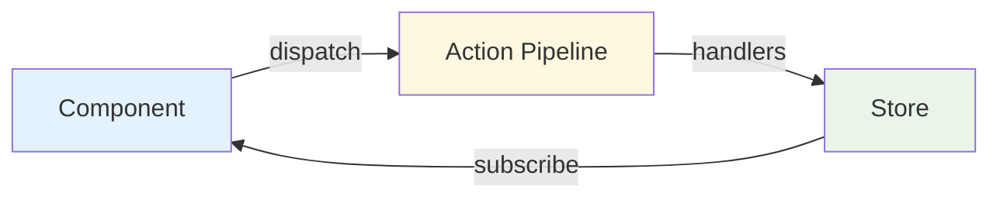

# Context Action Framework Overview

The Context-Action framework implements a clean separation of concerns through an MVVM-inspired pattern combined with **Context Store Pattern** for complete domain isolation.

## Architecture Overview

## Key Benefits

1. **Domain Isolation** - Each context maintains complete independence
2. **Type Safety** - Full TypeScript support with domain-specific hooks
3. **Performance** - Only affected components re-render
4. **Scalability** - Easy to add new domains without affecting existing ones
5. **Team Collaboration** - Different teams can work on different domains

## Quick Navigation

- [Full Implementation Guide](./full) - Complete implementation guide with all patterns
- [Quick Start](./quick-start) - Get up and running quickly
- [Core Concepts](./concepts) - Understand the fundamental concepts
- [Setup & Usage](./setup-usage) - Detailed setup instructions

## Framework Philosophy

The Context-Action framework follows these core principles:

- **Actions** handle business logic (ViewModel layer)
- **Context Store Pattern** manages state with domain isolation (Model layer)
- **Components** render UI (View layer)
- **Context Boundaries** isolate functional domains
- **Type-Safe Integration** through domain-specific hooks

---

::: tip Next Steps
Start with the [Full Implementation Guide](./full) for a comprehensive understanding, or jump to [Quick Start](./quick-start) if you want to start coding immediately.
:::