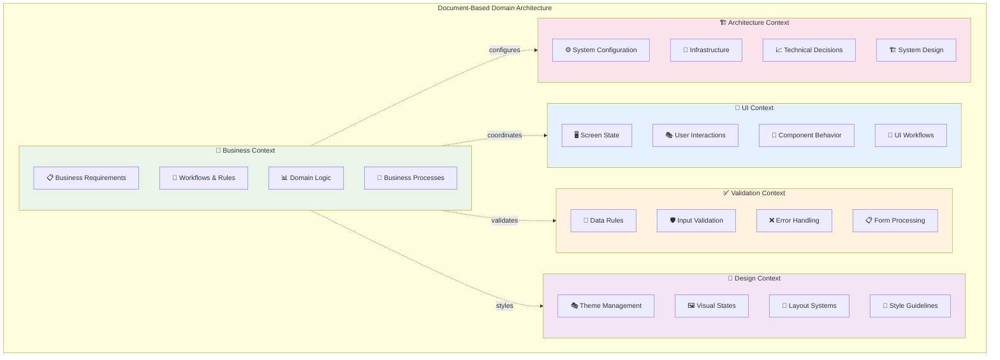

# Domain Context Architecture Pattern

Document-centric domain separation architecture for multi-domain applications using the Context-Action framework.

## Pattern Overview

Domain Context Architecture organizes application architecture around business domains and their corresponding documentation:

- **Business Context**: Core business logic and domain rules
- **UI Context**: Screen state and user interactions  
- **Validation Context**: Data validation and error handling
- **Design Context**: Theme management and visual states
- **Architecture Context**: System configuration and technical decisions

## Context Separation Strategy



## Implementation Example

### Step 1: Business Context (Core Domain)

```typescript
// contexts/BusinessContext.ts
export interface BusinessStores {
  orders: Order[];
  inventory: InventoryItem[];
  customers: Customer[];
}

export interface BusinessActions {
  processOrder: { customerId: string; items: OrderItem[] };
  updateInventory: { itemId: string; quantity: number };
  validateCustomer: { customerId: string };
}

export const {
  Provider: BusinessModelProvider,
  useStore: useBusinessStore,
  useStoreManager: useBusinessStoreManager
} = createDeclarativeStorePattern<BusinessStores>('Business', {
  orders: { initialValue: [] },
  inventory: { initialValue: [] },
  customers: { initialValue: [] }
});

export const {
  Provider: BusinessActionProvider,
  useActionDispatch: useBusinessActionDispatch,
  useActionHandler: useBusinessActionHandler
} = createActionContext<BusinessActions>('Business');
```

### Step 2: UI Context (Interface State)

```typescript
// contexts/UIContext.ts  
export interface UIStores {
  screenState: { 
    currentScreen: 'orders' | 'inventory' | 'customers';
    isLoading: boolean;
    notifications: Notification[];
  };
  modals: {
    orderModal: { isOpen: boolean; orderId?: string };
    customerModal: { isOpen: boolean; customerId?: string };
  };
}

export interface UIActions {
  navigateToScreen: { screen: string };
  showNotification: { message: string; type: 'success' | 'error' };
  openModal: { modalType: string; data?: any };
  closeModal: { modalType: string };
}

export const {
  Provider: UIModelProvider,
  useStore: useUIStore,
  useStoreManager: useUIStoreManager
} = createDeclarativeStorePattern<UIStores>('UI', {
  screenState: {
    initialValue: {
      currentScreen: 'orders',
      isLoading: false,
      notifications: []
    }
  },
  modals: {
    initialValue: {
      orderModal: { isOpen: false },
      customerModal: { isOpen: false }
    }
  }
});

export const {
  Provider: UIActionProvider,
  useActionDispatch: useUIActionDispatch,
  useActionHandler: useUIActionHandler
} = createActionContext<UIActions>('UI');
```

### Step 3: Validation Context (Data Rules)

```typescript
// contexts/ValidationContext.ts
export interface ValidationStores {
  fieldErrors: Record<string, string[]>;
  validationRules: Record<string, ValidationRule[]>;
  isValid: boolean;
}

export interface ValidationActions {
  validateField: { fieldName: string; value: any };
  clearFieldErrors: { fieldName: string };
  validateForm: { formData: Record<string, any> };
}

export const {
  Provider: ValidationModelProvider,
  useStore: useValidationStore,
  useStoreManager: useValidationStoreManager
} = createDeclarativeStorePattern<ValidationStores>('Validation', {
  fieldErrors: { initialValue: {} },
  validationRules: { initialValue: {} },
  isValid: { initialValue: false }
});

export const {
  Provider: ValidationActionProvider,
  useActionDispatch: useValidationActionDispatch,
  useActionHandler: useValidationActionHandler
} = createActionContext<ValidationActions>('Validation');
```

### Step 4: Design Context (Visual State)

```typescript
// contexts/DesignContext.ts
export interface DesignStores {
  theme: {
    mode: 'light' | 'dark';
    primaryColor: string;
    fontSize: 'small' | 'medium' | 'large';
  };
  layout: {
    sidebarCollapsed: boolean;
    gridView: boolean;
    screenSize: 'mobile' | 'tablet' | 'desktop';
  };
}

export interface DesignActions {
  toggleTheme: void;
  updateThemeColor: { color: string };
  toggleSidebar: void;
  setScreenSize: { size: 'mobile' | 'tablet' | 'desktop' };
}

export const {
  Provider: DesignModelProvider,
  useStore: useDesignStore,
  useStoreManager: useDesignStoreManager
} = createDeclarativeStorePattern<DesignStores>('Design', {
  theme: {
    initialValue: {
      mode: 'light',
      primaryColor: '#2196f3',
      fontSize: 'medium'
    }
  },
  layout: {
    initialValue: {
      sidebarCollapsed: false,
      gridView: false,
      screenSize: 'desktop'
    }
  }
});

export const {
  Provider: DesignActionProvider,
  useActionDispatch: useDesignActionDispatch,
  useActionHandler: useDesignActionHandler
} = createActionContext<DesignActions>('Design');
```

### Step 5: Cross-Domain Coordination

```typescript
// hooks/useCrossDomainActions.ts
export function useOrderProcessingWorkflow() {
  const businessManager = useBusinessStoreManager();
  const uiManager = useUIStoreManager();
  const validationManager = useValidationStoreManager();
  
  const processOrderHandler = useCallback(async (payload, controller) => {
    // 1. UI Context - Show loading
    const screenStateStore = uiManager.getStore('screenState');
    screenStateStore.update(state => ({ ...state, isLoading: true }));
    
    // 2. Validation Context - Validate order
    const validationResult = await validateOrderData(payload);
    if (!validationResult.isValid) {
      const fieldErrorsStore = validationManager.getStore('fieldErrors');
      fieldErrorsStore.setValue(validationResult.errors);
      controller.abort('Validation failed');
      return;
    }
    
    // 3. Business Context - Process order
    try {
      const order = await orderAPI.create(payload);
      const ordersStore = businessManager.getStore('orders');
      ordersStore.update(orders => [...orders, order]);
      
      // 4. UI Context - Show success notification
      screenStateStore.update(state => ({
        ...state,
        isLoading: false,
        notifications: [...state.notifications, {
          message: 'Order processed successfully',
          type: 'success'
        }]
      }));
      
      return { success: true, orderId: order.id };
    } catch (error) {
      screenStateStore.update(state => ({ ...state, isLoading: false }));
      controller.abort('Order processing failed', error);
    }
  }, [businessManager, uiManager, validationManager]);
  
  useBusinessActionHandler('processOrder', processOrderHandler);
}
```

### Step 6: Application Composition

```tsx
// App.tsx - Multi-domain composition
function MultiDomainApp() {
  return (
    {/* Business Domain - Core Logic */}
    <BusinessModelProvider>
      <BusinessActionProvider>
        
        {/* UI Domain - Interface State */}
        <UIModelProvider>
          <UIActionProvider>
            
            {/* Validation Domain - Data Rules */}
            <ValidationModelProvider>
              <ValidationActionProvider>
                
                {/* Design Domain - Visual State */}
                <DesignModelProvider>
                  <DesignActionProvider>
                    
                    {/* Cross-Domain Coordination */}
                    <CrossDomainHandlers />
                    
                    {/* Application Components */}
                    <OrderManagementScreen />
                    <InventoryScreen />
                    <CustomerScreen />
                    
                  </DesignActionProvider>
                </DesignModelProvider>
              </ValidationActionProvider>
            </ValidationModelProvider>
          </UIActionProvider>
        </UIModelProvider>
      </BusinessActionProvider>
    </BusinessModelProvider>
  );
}

function CrossDomainHandlers() {
  // Register cross-domain workflows
  useOrderProcessingWorkflow();
  useCustomerValidationWorkflow();
  useInventoryUpdateWorkflow();
  useUINotificationWorkflow();
  
  return null;
}
```

## Domain Responsibilities

### Business Context
- ✅ Core business logic and rules
- ✅ Domain entity management
- ✅ Business process orchestration
- ✅ Data transformation and processing
- ❌ UI presentation concerns
- ❌ Visual styling decisions
- ❌ Input validation rules

### UI Context
- ✅ Screen state management
- ✅ User interaction handling
- ✅ Navigation and routing
- ✅ Modal and overlay management
- ❌ Business logic implementation
- ❌ Data validation rules
- ❌ Visual theme management

### Validation Context
- ✅ Input validation rules
- ✅ Form validation logic
- ✅ Error message management
- ✅ Data integrity checks
- ❌ Business process logic
- ❌ UI state management
- ❌ Visual styling

### Design Context
- ✅ Theme and visual state
- ✅ Layout configuration
- ✅ Style management
- ✅ Responsive design state
- ❌ Business logic
- ❌ Data validation
- ❌ User interaction logic

### Architecture Context
- ✅ System configuration
- ✅ Infrastructure settings
- ✅ Technical parameters
- ✅ Environment management
- ❌ Business domain logic
- ❌ User interface concerns
- ❌ Visual presentation

## Document-Centric Design

Each context corresponds to specific documentation:

### Business Documentation → Business Context
- Requirements documents
- Business process flows
- Domain models
- User stories

### UI Specifications → UI Context  
- Wireframes and mockups
- User interaction flows
- Screen specifications
- Navigation maps

### Validation Specifications → Validation Context
- Validation rules documentation
- Error handling procedures
- Data integrity requirements
- Form validation specs

### Design Guidelines → Design Context
- Style guides
- Design systems
- Theme specifications
- Branding guidelines

### Architecture Documents → Architecture Context
- System architecture diagrams
- Technical specifications
- Infrastructure documentation
- Configuration guides

## Cross-Domain Communication Patterns

### Coordinated Actions
```typescript
// Business triggers UI updates
const businessHandler = useCallback(async (payload, controller) => {
  // Process business logic
  const result = await processBusinessLogic(payload);
  
  // Trigger UI notification
  dispatch('showNotification', {
    message: 'Business process completed',
    type: 'success'
  });
}, []);
```

### Validation Integration
```typescript
// UI triggers validation before business logic
const uiHandler = useCallback(async (payload, controller) => {
  // Validate first
  const isValid = await dispatch('validateForm', payload);
  
  if (isValid) {
    // Process business logic
    await dispatch('processOrder', payload);
  }
}, []);
```

## Best Practices

### ✅ Do's

1. **Clear Domain Boundaries**
   - Keep each context focused on its domain
   - Use explicit cross-domain communication
   - Document domain responsibilities
   - Maintain domain isolation

2. **Document Alignment**
   - Align contexts with documentation structure
   - Keep domain docs updated with code
   - Use contexts to organize deliverables
   - Maintain traceability

3. **Cross-Domain Coordination**
   - Use explicit action dispatching between domains
   - Implement coordinated workflows
   - Handle cross-domain errors gracefully
   - Monitor inter-domain dependencies

### ❌ Don'ts

1. **Domain Mixing**
   - Don't put business logic in UI context
   - Don't handle validation in design context
   - Don't manage UI state in business context
   - Don't mix architectural concerns

2. **Tight Coupling**
   - Don't directly access other domain stores
   - Don't create circular dependencies
   - Don't bypass the action pipeline
   - Don't share context instances

## When to Use Domain Context Architecture

### ✅ Perfect For

- Multi-domain business applications
- Applications with clear business boundaries
- Teams organized by business domains
- Document-heavy development processes
- Microservice architecture alignment

### ❌ Consider Alternatives For

- Simple single-domain applications (use MVVM)
- Applications with minimal business complexity
- Small teams preferring technical organization
- Performance-critical applications requiring tighter integration

## Related Patterns

- **[MVVM Architecture](./mvvm.md)** - Alternative for single-domain apps
- **[Pattern Composition](./composition.md)** - Combining multiple architectural approaches
- **[Store Only Pattern](../store/basic-usage.md)** - Foundation for domain data management
- **[Action Only Pattern](../action/basic-usage.md)** - Foundation for domain logic