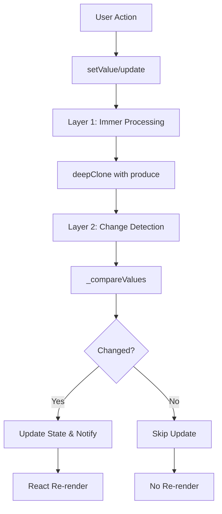

# Immutability Architecture Guide

Technical deep-dive into Context-Action's immutability and change detection architecture, covering implementation details, performance optimizations, and design decisions.

## System Architecture Overview

### Dual-Layer Processing Pipeline



### Core Components

#### 1. Immutability Layer (Immer)

**Location**: `packages/react/src/stores/utils/immutable.ts`

**Key Functions**:
```typescript
// Primary immutability function
export function deepClone<T>(value: T): T {
  if (!TypeGuards.isObject(value)) return value;

  try {
    return produce(value, (draft) => {
      // Immer's Copy-on-Write optimization
      // No forced mutations - trust Immer's philosophy
    });
  } catch (error) {
    // Fallback for non-Immer compatible objects
    return fallbackClone(value);
  }
}
```

**Design Philosophy**:
- **Copy-on-Write**: Only create new objects when necessary
- **Structural Sharing**: Reuse unchanged parts of object tree
- **Safe Mutations**: Enable mutation-like syntax with immutable results
- **Fallback Strategy**: Handle edge cases Immer can't process

#### 2. Change Detection Layer (Comparison)

**Location**: `packages/react/src/stores/utils/comparison.ts`

**Key Functions**:
```typescript
// Performance-optimized default comparison
export function fastCompare<T>(oldValue: T, newValue: T): boolean {
  // Level 1: Reference equality (O(1))
  if (Object.is(oldValue, newValue)) return true;
  
  // Level 2: Type and null checks (O(1))
  if (oldValue == null || newValue == null) return oldValue === newValue;
  if (typeof oldValue !== 'object') return false;
  
  // Level 3: JSON serialization optimization (O(n))
  try {
    return JSON.stringify(oldValue) === JSON.stringify(newValue);
  } catch {
    // Level 4: Fallback strategies
    return performFallbackComparison(oldValue, newValue);
  }
}
```

## Implementation Deep Dive

### Store.setValue() Implementation

```typescript
// packages/react/src/stores/core/Store.ts
setValue(value: T): void {
  // Security validation
  if (TypeGuards.isDOMEvent(value)) {
    ErrorHandlers.store('DOM event object detected', { /* context */ });
    return;
  }

  // Layer 1: Immutability processing
  const safeValue = deepClone(value);
  
  // Layer 2: Change detection
  const hasChanged = this._compareValues(this._value, safeValue);
  
  if (hasChanged) {
    // State update
    this._value = safeValue;
    
    // Subscriber notification (React integration)
    this._notifyListeners();
    
    // Event system integration
    this.eventBus.emit('store:changed', {
      storeName: this.name,
      previousValue: this._previousValue,
      currentValue: safeValue
    });
  }
  
  // Performance metrics (development)
  if (process.env.NODE_ENV === 'development') {
    this._recordMetrics({ hasChanged, comparisonStrategy: this._getActiveStrategy() });
  }
}
```

### Store.update() Implementation

```typescript
update(updater: (current: T) => T): void {
  // Concurrency protection
  if (this.isUpdating) {
    this.updateQueue.push(() => this.update(updater));
    return;
  }

  try {
    this.isUpdating = true;
    
    // Create safe copy for updater function
    const safeCurrentValue = deepClone(this._value);
    
    // Apply user's update function on safe copy
    const updatedValue = updater(safeCurrentValue);
    
    // Security: Detect problematic return values
    if (TypeGuards.isSuspiciousEventObject(updatedValue)) {
      ErrorHandlers.store('Event object in update result', { /* context */ });
      return;
    }
    
    // Delegate to setValue for consistency
    this.setValue(updatedValue);
    
  } finally {
    this.isUpdating = false;
    this._processUpdateQueue();
  }
}
```

## Performance Optimization Strategies

### 1. Immer Optimizations

#### Copy-on-Write Benefits
```typescript
// Example: Large nested object update
const largeState = {
  users: Array(1000).fill().map(() => ({ /* user data */ })),
  settings: { /* many settings */ },
  metadata: { /* metadata */ }
};

// Only creates new objects for changed parts
const updated = produce(largeState, draft => {
  draft.settings.theme = 'dark'; // Only settings object is recreated
  // users and metadata arrays/objects are reused!
});

console.log(updated.users === largeState.users); // true - reused!
console.log(updated.settings === largeState.settings); // false - new object
```

#### Structural Sharing Visualization
```
Original:     { users: [Array], settings: {obj}, metadata: {obj} }
Updated:      { users: [Array], settings: {new}, metadata: {obj} }
                     ↑            ↑              ↑
                   reused       new copy       reused
```

### 2. Comparison Optimizations

#### Fast Comparison Algorithm
```typescript
// Optimized for common patterns
export function fastCompare<T>(oldValue: T, newValue: T): boolean {
  // Step 1: Reference check (covers Immer no-change optimization)
  if (Object.is(oldValue, newValue)) return true;
  
  // Step 2: Null/primitive fast path
  if (oldValue == null || newValue == null) return oldValue === newValue;
  if (typeof oldValue !== 'object' || typeof newValue !== 'object') return false;
  
  // Step 3: Array optimization
  if (Array.isArray(oldValue) && Array.isArray(newValue)) {
    if (oldValue.length !== newValue.length) return false;
    return oldValue.every((item, index) => fastCompare(item, newValue[index]));
  }
  
  // Step 4: Object optimization with JSON serialization
  try {
    // Handles most object cases efficiently
    return JSON.stringify(oldValue) === JSON.stringify(newValue);
  } catch (error) {
    // Step 5: Fallback for complex objects
    return performStructuralComparison(oldValue, newValue);
  }
}
```

#### Performance Characteristics

| Scenario | Reference Check | JSON Serialization | Structural Compare |
|----------|----------------|-------------------|-------------------|
| Same object | ⚡ O(1) | ❌ Skip | ❌ Skip |
| Different primitives | ⚡ O(1) | ❌ Skip | ❌ Skip |
| Small objects | ⚡ O(1) | ⚡⚡ O(n) | ❌ Skip |
| Large objects | ⚡ O(1) | ⚡ O(n) | ⚡⚡⚡ O(n²) |
| Circular refs | ⚡ O(1) | ❌ Error | ⚡⚡ O(n) |

### 3. Integration Optimizations

#### React Integration
```typescript
// useSyncExternalStore integration
const getSnapshot = useCallback(() => {
  // Direct access to current value (no comparison needed)
  return store._value;
}, [store]);

const getServerSnapshot = useCallback(() => {
  // Server-side rendering support
  return store.getInitialValue();
}, [store]);

const subscribe = useCallback((onStoreChange) => {
  // Only notified when comparison detects actual changes
  return store.subscribe(onStoreChange);
}, [store]);

// React's built-in optimization + our change detection
const value = useSyncExternalStore(subscribe, getSnapshot, getServerSnapshot);
```

## Memory Management

### 1. Immer Memory Safety

```typescript
// Automatic cleanup of draft proxies
export function deepClone<T>(value: T): T {
  try {
    return produce(value, (draft) => {
      // Draft proxy is automatically cleaned up after produce
      // No manual memory management needed
    });
  } finally {
    // Immer handles all cleanup automatically
    // No manual intervention required
  }
}
```

### 2. Comparison Memory Safety

```typescript
// Avoid memory leaks in comparison functions
export function shallowEquals<T>(oldValue: T, newValue: T, ignoreKeys: string[] = []): boolean {
  // Use for..in instead of Object.keys() to avoid array allocation
  const oldKeys = new Set();
  const newKeys = new Set();
  
  // Efficient key counting without intermediate arrays
  for (const key in oldValue) {
    if (ignoreKeys.includes(key)) continue;
    oldKeys.add(key);
    if (!(key in newValue) || !Object.is(oldValue[key], newValue[key])) {
      return false;
    }
  }
  
  // Check for keys only in newValue
  for (const key in newValue) {
    if (!ignoreKeys.includes(key)) newKeys.add(key);
  }
  
  return oldKeys.size === newKeys.size;
}
```

## Error Handling and Resilience

### 1. Immutability Error Recovery

```typescript
export function deepClone<T>(value: T): T {
  try {
    // Primary: Immer processing
    return produce(value, (draft) => {});
  } catch (immerError) {
    try {
      // Fallback 1: structuredClone (modern browsers)
      return structuredClone(value);
    } catch (cloneError) {
      try {
        // Fallback 2: JSON-based cloning
        return JSON.parse(JSON.stringify(value));
      } catch (jsonError) {
        // Fallback 3: Shallow copy with warning
        ErrorHandlers.store('All cloning methods failed, using shallow copy', {
          immerError: immerError.message,
          cloneError: cloneError.message,
          jsonError: jsonError.message,
          valueType: typeof value
        });
        
        return { ...value } as T;
      }
    }
  }
}
```

### 2. Comparison Error Recovery

```typescript
protected _compareValues(oldValue: T, newValue: T): boolean {
  try {
    // Primary comparison strategy
    return this._performComparison(oldValue, newValue);
  } catch (error) {
    // Error recovery with telemetry
    ErrorHandlers.store('Comparison failed, falling back to reference equality', {
      error: error.message,
      valueTypes: [typeof oldValue, typeof newValue],
      strategy: this._getActiveStrategy(),
      storeName: this.name
    });
    
    // Safe fallback: reference comparison
    return !Object.is(oldValue, newValue);
  }
}
```

## Development and Debugging

### 1. Debug Mode Integration

```typescript
// Enhanced debugging for both layers
export function debugDeepClone<T>(value: T, context: string): T {
  const start = performance.now();
  let strategy = 'unknown';
  
  try {
    strategy = 'immer';
    const result = produce(value, (draft) => {});
    
    const duration = performance.now() - start;
    console.debug(`[${context}] Immer cloning: ${duration.toFixed(2)}ms`, {
      strategy,
      sameReference: result === value,
      originalSize: JSON.stringify(value).length
    });
    
    return result;
  } catch (error) {
    strategy = 'fallback';
    const result = fallbackClone(value);
    
    console.warn(`[${context}] Fallback cloning used:`, { strategy, error: error.message });
    return result;
  }
}
```

### 2. Performance Profiling

```typescript
interface PerformanceMetrics {
  immutabilityTime: number;
  comparisonTime: number;
  strategy: ComparisonStrategy;
  hasChanged: boolean;
  objectSize: number;
}

export function profileStoreOperation<T>(
  operation: () => T,
  context: string
): { result: T; metrics: PerformanceMetrics } {
  const start = performance.now();
  
  const immutabilityStart = performance.now();
  // ... immutability processing
  const immutabilityTime = performance.now() - immutabilityStart;
  
  const comparisonStart = performance.now();
  // ... comparison processing
  const comparisonTime = performance.now() - comparisonStart;
  
  const result = operation();
  
  return {
    result,
    metrics: {
      immutabilityTime,
      comparisonTime,
      strategy: 'detected-strategy',
      hasChanged: true,
      objectSize: JSON.stringify(result).length
    }
  };
}
```

## Testing Strategies

### 1. Immer Integration Tests

```typescript
describe('Immer Integration', () => {
  it('should leverage Copy-on-Write optimization', () => {
    const original = { user: { name: 'John' }, settings: { theme: 'dark' } };
    
    // Test no-change scenario
    const unchanged = deepClone(original);
    expect(unchanged).toBe(original); // Same reference!
    
    // Test change scenario
    const changed = produce(original, draft => {
      draft.user.name = 'Jane';
    });
    expect(changed).not.toBe(original);
    expect(changed.settings).toBe(original.settings); // Structural sharing!
  });
});
```

### 2. Comparison Logic Tests

```typescript
describe('Comparison Integration', () => {
  it('should optimize for common patterns', () => {
    const store = new Store('test', { name: 'John', age: 30 });
    
    // Should not trigger re-render for same values
    const listenerSpy = jest.fn();
    store.subscribe(listenerSpy);
    
    store.setValue({ name: 'John', age: 30 }); // Same content
    expect(listenerSpy).not.toHaveBeenCalled(); // No notification!
    
    store.setValue({ name: 'Jane', age: 30 }); // Different content
    expect(listenerSpy).toHaveBeenCalledTimes(1); // Notified!
  });
});
```

## Migration and Upgrade Paths

### From Manual Immutability

```typescript
// Old: Manual immutability
setValue(value) {
  // Manual deep cloning
  const cloned = JSON.parse(JSON.stringify(value));
  if (!isEqual(this._value, cloned)) {
    this._value = cloned;
    this._notifyListeners();
  }
}

// New: Immer + Comparison integration
setValue(value) {
  const safeValue = deepClone(value); // Immer-powered
  if (this._compareValues(this._value, safeValue)) { // Optimized comparison
    this._value = safeValue;
    this._notifyListeners();
  }
}
```

### Performance Migration

```typescript
// Migrate from lodash.isEqual to optimized comparison
// Old
import isEqual from 'lodash.isequal';
if (!isEqual(oldValue, newValue)) { /* update */ }

// New
import { fastCompare } from '@context-action/react';
if (!fastCompare(oldValue, newValue)) { /* update */ }
```

## Related Architecture Documents

- [Store Core Architecture](../store/store-configuration.md) - Store system design
- [Performance Architecture](../store/performance-patterns.md) - Performance optimization
- [Comparison Strategies](../store/comparison-strategies.md) - Detailed comparison options
- [Memory Management](../store/memory-management.md) - Resource management
- [Error Handling Architecture](../store/error-handling-recovery.md) - Error resilience