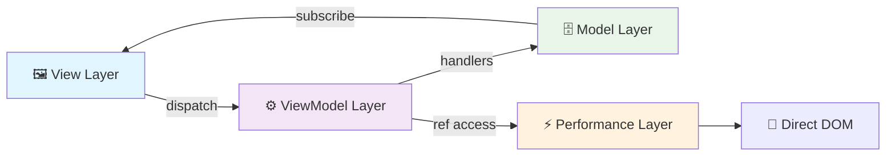

# MVVM Architecture Pattern

The Model-View-ViewModel (MVVM) architecture pattern using the Context-Action framework's three core patterns for perfect layer separation.

## Pattern Overview

MVVM provides a structured approach to building complex applications with clear separation of concerns:

- **Model Layer**: Store Only Pattern for reactive state management
- **ViewModel Layer**: Action Only Pattern for business logic and coordination  
- **Performance Layer**: RefContext Pattern for direct DOM manipulation
- **View Layer**: Pure React components for UI presentation

## Architecture Flow



## Implementation Example

### Step 1: Define Types and Contexts

```typescript
// contexts/UserContext.ts
export interface UserStores {
  profile: { id: string; name: string; role: 'admin' | 'user' };
  session: { isAuthenticated: boolean; permissions: string[] };
}

export interface UserActions {
  login: { email: string; password: string };
  logout: void;
  updateProfile: { name: string; role: string };
}

// Model Layer (Store Only Pattern)
export const {
  Provider: UserModelProvider,
  useStore: useUserStore,
  useStoreManager: useUserStoreManager
} = createDeclarativeStorePattern<UserStores>('User', {
  profile: {
    initialValue: { id: '', name: '', role: 'user' },
    strategy: 'shallow'
  },
  session: {
    initialValue: { isAuthenticated: false, permissions: [] },
    strategy: 'shallow'
  }
});

// ViewModel Layer (Action Only Pattern)
export const {
  Provider: UserViewModelProvider,
  useActionDispatch: useUserActionDispatch,
  useActionHandler: useUserActionHandler
} = createActionContext<UserActions>('User');

// Performance Layer (RefContext Pattern)
export type UserPerformanceRefs = {
  profileCard: HTMLDivElement;
  loginButton: HTMLButtonElement;
};

export const {
  Provider: UserPerformanceProvider,
  useRefHandler: useUserPerformanceRef
} = createRefContext<UserPerformanceRefs>('UserPerformance');
```

### Step 2: Model Layer (Data Management)

```typescript
// hooks/useUserData.ts - Data subscription hooks
export function useUserProfile() {
  const profileStore = useUserStore('profile');
  const profile = useStoreValue(profileStore);
  
  return {
    profile,
    isGuest: profile.role === 'user' && !profile.id,
    displayName: profile.name || 'Guest User',
    roleLabel: profile.role.toUpperCase()
  };
}

export function useUserSession() {
  const sessionStore = useUserStore('session');
  const session = useStoreValue(sessionStore);
  
  return {
    session,
    isAuthenticated: session.isAuthenticated,
    canAccess: (permission: string) => session.permissions.includes(permission)
  };
}
```

### Step 3: ViewModel Layer (Business Logic)

```typescript
// hooks/useUserActions.ts - Business logic handlers
export function useUserAuthActions() {
  const storeManager = useUserStoreManager();
  const dispatch = useUserActionDispatch();
  
  const loginHandler = useCallback(async (payload, controller) => {
    try {
      const response = await authAPI.login(payload.email, payload.password);
      
      // Update stores after successful login
      const profileStore = storeManager.getStore('profile');
      const sessionStore = storeManager.getStore('session');
      
      profileStore.setValue({
        id: response.user.id,
        name: response.user.name,
        role: response.user.role
      });
      
      sessionStore.setValue({
        isAuthenticated: true,
        permissions: response.permissions
      });
      
      return { success: true };
    } catch (error) {
      controller.abort('Login failed', error);
    }
  }, [storeManager]);
  
  useUserActionHandler('login', loginHandler);
  
  const login = useCallback((email: string, password: string) => 
    dispatch('login', { email, password }), [dispatch]);
  
  return { login };
}
```

### Step 4: Performance Layer (DOM Manipulation)

```typescript
// hooks/useUserPerformanceActions.ts - Direct DOM operations
export function useUserPerformanceActions() {
  const profileCard = useUserPerformanceRef('profileCard');
  const loginButton = useUserPerformanceRef('loginButton');
  
  const animateLoginHandler = useCallback(async (payload, controller) => {
    // Get result from business logic handler
    const result = controller.getResult();
    
    if (result?.success && loginButton.target) {
      // Direct DOM animation - zero React re-renders
      loginButton.target.style.transform = 'scale(0.95)';
      loginButton.target.style.transition = 'transform 150ms ease-out';
      
      setTimeout(() => {
        if (loginButton.target) {
          loginButton.target.style.transform = 'scale(1)';
        }
      }, 150);
    }
    
    if (result?.success && profileCard.target) {
      profileCard.target.style.transform = 'scale(1.05)';
      profileCard.target.style.transition = 'transform 300ms ease-out';
      
      setTimeout(() => {
        if (profileCard.target) {
          profileCard.target.style.transform = 'scale(1)';
        }
      }, 300);
    }
  }, [profileCard, loginButton]);
  
  // Lower priority so it runs after business logic
  useUserActionHandler('login', animateLoginHandler, { priority: 50 });
  
  return { profileCardRef: profileCard, loginButtonRef: loginButton };
}
```

### Step 5: View Layer (UI Presentation)

```typescript
// components/UserProfileView.tsx - Pure presentation component
export function UserProfileView() {
  // Data subscriptions (Model Layer)
  const { displayName, roleLabel, isGuest } = useUserProfile();
  const { isAuthenticated } = useUserSession();
  
  // Action functions (ViewModel Layer)
  const { login } = useUserAuthActions();
  
  // Performance refs (Performance Layer)
  const { profileCardRef, loginButtonRef } = useUserPerformanceActions();
  
  // Pure UI logic
  const handleLogin = useCallback(() => {
    login('user@example.com', 'password123');
  }, [login]);
  
  return (
    <div ref={profileCardRef.setRef} className="user-profile-card">
      <div className="profile-info">
        <h2>{displayName}</h2>
        <span className={`role role-${roleLabel.toLowerCase()}`}>
          {roleLabel}
        </span>
      </div>
      
      <div className="actions">
        {isAuthenticated ? (
          <button onClick={() => dispatch('logout', undefined)}>
            Logout
          </button>
        ) : (
          <button 
            ref={loginButtonRef.setRef} 
            onClick={handleLogin}
          >
            {isGuest ? 'Login as Guest' : 'Login'}
          </button>
        )}
      </div>
    </div>
  );
}
```

### Step 6: Application Setup

```tsx
// App.tsx - Complete MVVM setup
function UserApp() {
  return (
    {/* Model Layer - Foundation */}
    <UserModelProvider>
      
      {/* ViewModel Layer - Business Logic */}
      <UserViewModelProvider>
        
        {/* Performance Layer - Direct DOM */}
        <UserPerformanceProvider>
          
          {/* View Layer - UI Components */}
          <UserProfileView />
          <UserDashboard />
          <UserSettings />
          
        </UserPerformanceProvider>
      </UserViewModelProvider>
    </UserModelProvider>
  );
}
```

## Layer Responsibilities

### Model Layer (Store Only Pattern)
- ✅ Reactive state management
- ✅ Type-safe data containers  
- ✅ Store definitions and initial values
- ✅ Subscription management
- ❌ Business logic
- ❌ UI concerns
- ❌ Direct DOM manipulation

### ViewModel Layer (Action Only Pattern)
- ✅ Business logic implementation
- ✅ Action handler registration
- ✅ Cross-domain coordination
- ✅ Side effects management
- ✅ Store updates via handlers
- ❌ UI presentation
- ❌ Direct DOM manipulation
- ❌ Component lifecycle

### Performance Layer (RefContext Pattern)
- ✅ Direct DOM manipulation
- ✅ Zero-rerender animations
- ✅ Hardware acceleration
- ✅ Real-time interactions
- ✅ Performance-critical updates
- ❌ Business logic
- ❌ State management
- ❌ UI presentation logic

### View Layer (React Components)
- ✅ UI presentation and structure
- ✅ Event binding and dispatching
- ✅ Component lifecycle management
- ✅ Provider composition
- ❌ Business logic
- ❌ Direct state mutation
- ❌ Direct DOM manipulation

## Best Practices

### ✅ Do's

1. **Clear Layer Separation**
   - Keep business logic in ViewModel layer
   - Use Model layer only for state management
   - Reserve Performance layer for DOM operations
   - Keep View layer purely presentational

2. **Proper Data Flow**
   - View dispatches actions to ViewModel
   - ViewModel updates Model through handlers
   - Model notifies View through subscriptions
   - Performance layer accesses DOM directly

3. **Type Safety**
   - Define clear interfaces for each domain
   - Use typed action definitions
   - Strongly type DOM element references
   - Maintain type safety across layers

### ❌ Don'ts

1. **Layer Mixing**
   - Don't put business logic in View components
   - Don't manipulate DOM in ViewModel handlers
   - Don't manage state in Performance layer
   - Don't dispatch actions from Model layer

2. **Direct Dependencies**
   - Don't let View access Model directly
   - Don't let Performance layer manage state
   - Don't put UI logic in ViewModel
   - Don't bypass the action pipeline

## Performance Characteristics

- **Model Layer**: Reactive with minimal re-renders
- **ViewModel Layer**: Efficient action processing
- **Performance Layer**: Zero React re-renders
- **View Layer**: Optimized subscriptions

## When to Use MVVM

### ✅ Perfect For

- Complex single-domain applications
- Applications requiring clear architectural boundaries
- Teams with technical specialization (frontend, backend, performance)
- Applications with heavy business logic
- Performance-critical applications

### ❌ Consider Alternatives For

- Simple applications with minimal business logic
- Multi-domain applications (use Domain Context Architecture)
- Applications with minimal performance requirements
- Small teams preferring simpler patterns

## Related Patterns

- **[Store Only Pattern](../store/basic-usage.md)** - Model Layer implementation
- **[Action Only Pattern](../action/basic-usage.md)** - ViewModel Layer implementation  
- **[RefContext Pattern](../ref/basic-usage.md)** - Performance Layer implementation
- **[Domain Context Architecture](./domain-context.md)** - Alternative for multi-domain apps