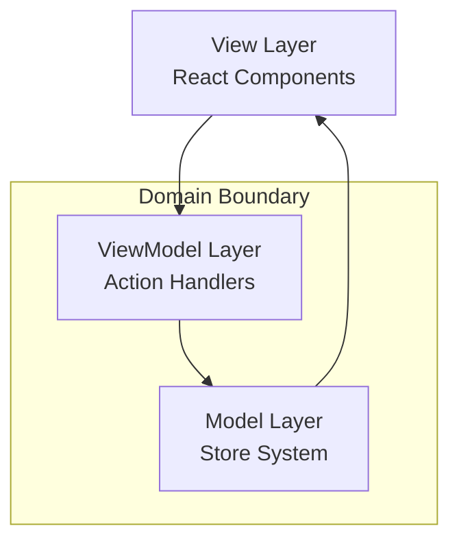

# Design Philosophy

The Context-Action framework is built on foundational principles that guide every architectural decision and implementation pattern. Understanding these principles is essential for effective usage.

## Core Philosophy

**"Evidence-based architecture with type-safe domain isolation"**

The framework implements a clean separation of concerns through an MVVM-inspired pattern, where:

- **Actions** handle business logic (ViewModel layer)
- **Context Store Pattern** manages state with domain isolation (Model layer)  
- **Components** render UI (View layer)
- **Context Boundaries** isolate functional domains
- **Type-Safe Integration** through domain-specific hooks

## Fundamental Principles

### 1. Domain Isolation First

Each functional domain maintains complete independence through context boundaries:

```typescript
// Each domain has its own isolated context
const UserDomain = createContextStorePattern('User');
const CartDomain = createContextStorePattern('Cart');
const OrderDomain = createContextStorePattern('Order');
```

**Benefits:**
- No accidental state coupling between domains
- Teams can work independently on different domains
- Easier testing and debugging
- Scalable architecture for large applications

### 2. Type Safety at Every Layer

Full TypeScript integration ensures compile-time safety:

```typescript
// Domain-specific interfaces
interface UserData {
  profile: { id: string; name: string; email: string };
  preferences: { theme: 'light' | 'dark' };
}

interface UserActions {
  updateProfile: { data: Partial<UserData['profile']> };
  toggleTheme: void;
}

// Type-safe hooks automatically inferred
const profileStore = useUserStore('profile'); // Typed as Store<UserData['profile']>
const dispatch = useUserAction(); // Typed dispatch for UserActions
```

### 3. Declarative Action Pipeline

Business logic flows through a declarative pipeline system:

```typescript
// Declare what should happen, not how
dispatch('updateProfile', { data: { name: 'New Name' } });

// Framework handles the "how":
// 1. Action validation
// 2. Handler execution by priority
// 3. Store updates
// 4. Component re-renders
```

### 4. Reactive State Management

Components automatically react to relevant state changes:

```typescript
function UserProfile() {
  const profile = useStoreValue(useUserStore('profile'));
  // ↑ Component re-renders only when profile changes
  
  return <div>Welcome, {profile.name}!</div>;
}
```

## Architecture Patterns

### MVVM-Inspired Separation



### Context Store Pattern

The core pattern for domain isolation:

```typescript
// 1. Create domain context
const UserStores = createContextStorePattern('User');

// 2. Provide context boundary
<UserStores.Provider registryId="user-app">
  <UserComponents />
</UserStores.Provider>

// 3. Use within boundary
const userStore = UserStores.useStore('profile', initialData);
```

## Design Decisions

### Why Domain-Specific Hooks?

**Traditional Approach (Generic):**
```typescript
const store = useStore('user-profile'); // No type information
const dispatch = useDispatch(); // No action type safety
```

**Context-Action Approach (Domain-Specific):**
```typescript
const store = useUserStore('profile'); // Fully typed
const dispatch = useUserAction(); // Type-safe actions
```

**Benefits:**
- Full TypeScript inference
- Clear domain boundaries
- Refactoring safety
- Better developer experience

### Why Action Pipeline Over Direct State Updates?

**Direct Updates (Anti-Pattern):**
```typescript
// Scattered business logic
function updateUser() {
  setUser(prev => ({ ...prev, name: 'New Name' }));
  logActivity('user_updated');
  validateUser();
  syncToServer();
}
```

**Action Pipeline (Recommended):**
```typescript
// Centralized, testable business logic
dispatch('updateUser', { name: 'New Name' });

// Handlers manage complexity:
register('updateUser', async (payload, controller) => {
  const userStore = registry.getStore('user');
  // Update, log, validate, sync - all in one place
});
```

**Benefits:**
- Centralized business logic
- Testable handlers
- Consistent error handling
- Auditable action flow

## Performance Philosophy

### Minimal Re-renders

Only components using changed data re-render:

```typescript
// Component A uses profile
const profile = useStoreValue(useUserStore('profile'));

// Component B uses preferences  
const prefs = useStoreValue(useUserStore('preferences'));

// Updating profile won't re-render Component B
dispatch('updateProfile', { name: 'New Name' });
```

### Lazy Evaluation in Handlers

Avoid stale closures with lazy store access:

```typescript
const handler = async (payload, controller) => {
  // ❌ Stale: captured at registration time
  const oldValue = profileStore.getValue();
  
  // ✅ Fresh: evaluated at execution time
  const currentValue = registry.getStore('profile').getValue();
};
```

## Developer Experience Priorities

### 1. Type Safety Without Ceremony

```typescript
// Automatic inference, no manual typing needed
const store = useUserStore('profile'); // Store<UserProfile>
const profile = useStoreValue(store); // UserProfile
```

### 2. Intuitive API Design

```typescript
// Natural, React-like patterns
const dispatch = useUserAction();
dispatch('updateProfile', { name: 'New Name' });
```

### 3. Clear Error Messages

```typescript
// Compile-time errors guide correct usage
dispatch('invalidAction', { data: 'wrong' }); 
// TS Error: 'invalidAction' does not exist in UserActions
```

### 4. Flexible Integration

```typescript
// Works with existing React patterns
function useUserProfile() {
  const profileStore = useUserStore('profile');
  const profile = useStoreValue(profileStore);
  const dispatch = useUserAction();
  
  // Compose with other hooks naturally
  const memoizedData = useMemo(() => 
    processProfile(profile), [profile]
  );
  
  return { profile, memoizedData, dispatch };
}
```

## Architectural Benefits

### Scalability

- **Horizontal:** Add new domains without affecting existing ones
- **Vertical:** Add features within domains without cross-contamination
- **Team:** Multiple teams can work on different domains independently

### Maintainability

- **Clear Boundaries:** Domain isolation prevents unexpected dependencies
- **Testability:** Business logic in handlers is easily unit tested
- **Debuggability:** Action flow is auditable and traceable

### Performance

- **Selective Re-renders:** Only affected components update
- **Lazy Loading:** Domains can be loaded on demand
- **Memory Efficiency:** Context boundaries prevent memory leaks

---

## Summary

The Context-Action framework's philosophy centers on **type-safe domain isolation** with **reactive state management**. By following MVVM-inspired patterns and declarative action pipelines, applications become more maintainable, testable, and scalable.

The framework prioritizes developer experience through automatic type inference, intuitive APIs, and clear architectural boundaries that guide correct usage patterns.

---

::: tip Next Steps
Now that you understand the philosophy, explore the [Core Concepts](./concepts) to see how these principles translate into practical implementation patterns.
:::