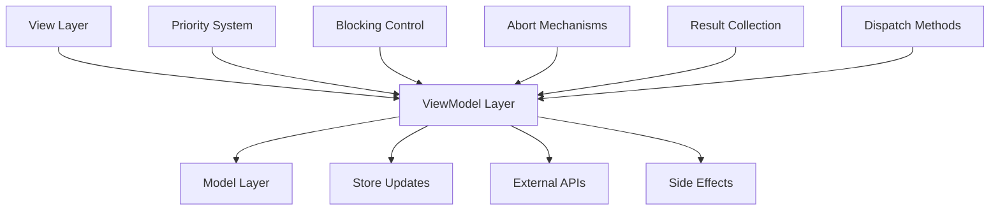

# Pipeline System

Advanced action pipeline features for sophisticated business logic orchestration.

## Overview

The Action Pipeline System provides advanced control mechanisms for managing complex business logic flows through priority-based handler execution, blocking operations, abort mechanisms, and comprehensive result collection.

## Core Features

### 🏆 Priority-Based Execution
Handlers execute in priority order (highest first) ensuring critical operations run before optional ones.

```typescript
actionRegister.register('authenticate', validateInput, { priority: 100 });   // 1st
actionRegister.register('authenticate', checkSecurity, { priority: 90 });    // 2nd  
actionRegister.register('authenticate', performAuth, { priority: 80 });      // 3rd
actionRegister.register('authenticate', logAudit, { priority: 30 });         // 4th
```

### 🚧 Blocking Operations
Control execution flow with blocking and non-blocking handlers.

```typescript
// Blocking: Wait for completion
actionRegister.register('process', criticalHandler, { blocking: true });

// Non-blocking: Continue immediately
actionRegister.register('process', analyticsHandler, { blocking: false });
```

### 🛑 Abort Mechanisms
Stop pipeline execution when conditions aren't met.

```typescript
actionRegister.register('validate', (payload, controller) => {
  if (!isValid(payload)) {
    controller.abort('Validation failed');
    return;
  }
  // Continue pipeline
});
```

### 📊 Result Collection
Collect and coordinate results across handlers.

```typescript
// Set intermediate results
controller.setResult({ step: 'validation', valid: true });

// Access previous results
const results = controller.getResults();
const validationResult = results.find(r => r.step === 'validation');
```

## Pipeline Features

| Feature | Purpose | Documentation |
|---------|---------|---------------|
| **[Priority System](./priority.md)** | Control execution order | Priority-based handler execution |
| **[Blocking Operations](./blocking.md)** | Control execution flow | Blocking vs non-blocking handlers |
| **[Dispatch Methods](./dispatch.md)** | Trigger pipelines | Basic dispatch vs result collection |
| **[Abort Mechanisms](./abort.md)** | Stop execution | Graceful pipeline termination |
| **[Result Handling](./result-handling.md)** | Collect results | Inter-handler communication |

## Quick Start

### 1. Basic Pipeline Setup

```typescript
import { ActionRegister, type ActionPayloadMap } from '@context-action/core';

interface AppActions extends ActionPayloadMap {
  processUser: { userId: string; action: string };
}

const appRegister = new ActionRegister<AppActions>();
```

### 2. Register Handlers with Features

```typescript
// High priority validation with blocking
appRegister.register('processUser', (payload, controller) => {
  if (!payload.userId) {
    controller.abort('User ID required');
    return;
  }
  
  controller.setResult({ step: 'validation', valid: true });
  return { step: 'user-validation', success: true };
}, { 
  priority: 100,    // High priority
  blocking: true,   // Wait for completion
  id: 'validator'   // Unique identifier
});

// Medium priority processing with blocking
appRegister.register('processUser', async (payload, controller) => {
  const results = controller.getResults();
  const isValid = results.find(r => r.step === 'validation')?.valid;
  
  if (!isValid) {
    controller.abort('Cannot process invalid user');
    return;
  }
  
  const processed = await processUserData(payload.userId, payload.action);
  
  controller.setResult({ 
    step: 'processing', 
    userId: payload.userId,
    processedAt: Date.now()
  });
  
  return { step: 'user-processing', result: processed };
}, { 
  priority: 80,
  blocking: true,
  id: 'processor'
});

// Low priority analytics without blocking
appRegister.register('processUser', (payload, controller) => {
  const results = controller.getResults();
  
  // Track analytics in background
  analytics.track('user_processed', {
    userId: payload.userId,
    action: payload.action,
    steps: results.map(r => r.step)
  });
  
  return { step: 'analytics', tracked: true };
}, { 
  priority: 30,
  blocking: false,  // Don't wait for analytics
  id: 'analytics'
});
```

### 3. Execute Pipeline

```typescript
// Basic execution
await appRegister.dispatch('processUser', {
  userId: '123',
  action: 'profile-update'
});

// Execution with result collection
const result = await appRegister.dispatchWithResult('processUser', 
  { userId: '123', action: 'profile-update' },
  { result: { collect: true } }
);

if (result.success) {
  console.log('Pipeline completed:', result.results);
} else if (result.aborted) {
  console.log('Pipeline aborted:', result.abortReason);
}
```

## Real-World Pipeline Example

### E-commerce Order Processing

```typescript
interface OrderActions extends ActionPayloadMap {
  placeOrder: { 
    items: OrderItem[]; 
    userId: string; 
    paymentMethod: string;
  };
}

const orderRegister = new ActionRegister<OrderActions>();

// Step 1: Input validation (Priority 100, Blocking)
orderRegister.register('placeOrder', (payload, controller) => {
  if (!payload.items?.length) {
    controller.abort('Order must contain items');
    return;
  }
  
  if (!payload.userId) {
    controller.abort('User ID required');
    return;
  }
  
  controller.setResult({ step: 'validation', itemCount: payload.items.length });
  return { step: 'input-validation', success: true };
}, { priority: 100, blocking: true, id: 'input-validator' });

// Step 2: Inventory check (Priority 90, Blocking)
orderRegister.register('placeOrder', async (payload, controller) => {
  const inventoryChecks = await Promise.all(
    payload.items.map(item => checkInventory(item.productId, item.quantity))
  );
  
  const insufficientItems = inventoryChecks
    .filter(check => !check.available)
    .map(check => check.productId);
  
  if (insufficientItems.length > 0) {
    controller.abort('Insufficient inventory', { insufficientItems });
    return;
  }
  
  controller.setResult({ 
    step: 'inventory', 
    allAvailable: true,
    checkedItems: inventoryChecks.length
  });
  
  return { step: 'inventory-check', success: true };
}, { priority: 90, blocking: true, id: 'inventory-checker' });

// Step 3: Payment processing (Priority 80, Blocking)
orderRegister.register('placeOrder', async (payload, controller) => {
  const total = calculateOrderTotal(payload.items);
  
  const payment = await processPayment({
    userId: payload.userId,
    amount: total,
    method: payload.paymentMethod
  });
  
  if (!payment.success) {
    controller.abort('Payment failed', { reason: payment.error });
    return;
  }
  
  controller.setResult({ 
    step: 'payment', 
    transactionId: payment.transactionId,
    amount: total
  });
  
  return { 
    step: 'payment-processing', 
    success: true, 
    transactionId: payment.transactionId 
  };
}, { priority: 80, blocking: true, id: 'payment-processor' });

// Step 4: Order creation (Priority 70, Blocking)
orderRegister.register('placeOrder', async (payload, controller) => {
  const results = controller.getResults();
  const paymentResult = results.find(r => r.step === 'payment');
  
  const order = await createOrder({
    userId: payload.userId,
    items: payload.items,
    transactionId: paymentResult.transactionId,
    total: paymentResult.amount
  });
  
  controller.setResult({ 
    step: 'order-creation', 
    orderId: order.id,
    createdAt: order.createdAt
  });
  
  return { 
    step: 'order-created', 
    success: true, 
    orderId: order.id 
  };
}, { priority: 70, blocking: true, id: 'order-creator' });

// Step 5: Inventory update (Priority 60, Blocking)
orderRegister.register('placeOrder', async (payload, controller) => {
  await Promise.all(
    payload.items.map(item => 
      updateInventory(item.productId, -item.quantity)
    )
  );
  
  return { step: 'inventory-update', success: true };
}, { priority: 60, blocking: true, id: 'inventory-updater' });

// Step 6: Email notification (Priority 40, Non-blocking)
orderRegister.register('placeOrder', async (payload, controller) => {
  const results = controller.getResults();
  const orderResult = results.find(r => r.step === 'order-creation');
  
  // Send confirmation email in background
  await sendOrderConfirmation({
    userId: payload.userId,
    orderId: orderResult.orderId,
    items: payload.items
  });
  
  return { step: 'email-notification', sent: true };
}, { priority: 40, blocking: false, id: 'email-notifier' });

// Step 7: Analytics tracking (Priority 30, Non-blocking)  
orderRegister.register('placeOrder', (payload, controller) => {
  const results = controller.getResults();
  const orderResult = results.find(r => r.step === 'order-creation');
  const paymentResult = results.find(r => r.step === 'payment');
  
  // Track order analytics
  analytics.track('order_placed', {
    orderId: orderResult.orderId,
    userId: payload.userId,
    itemCount: payload.items.length,
    orderValue: paymentResult.amount,
    paymentMethod: payload.paymentMethod
  });
  
  return { step: 'analytics', tracked: true };
}, { priority: 30, blocking: false, id: 'analytics-tracker' });

// Execute complete order pipeline
const result = await orderRegister.dispatchWithResult('placeOrder', {
  items: [{ productId: 'prod-1', quantity: 2 }],
  userId: 'user-123',
  paymentMethod: 'credit-card'
}, { result: { collect: true } });

// Pipeline executes: validation → inventory → payment → order → inventory-update
// Email and analytics run in background
```

## Migration from Basic Actions

### Before: Simple Action Handlers

```typescript
// Basic action handling
const handleUserUpdate = async (userData: UserData) => {
  await validateUser(userData);
  await updateDatabase(userData);
  await sendNotification(userData.id);
  await trackAnalytics('user_updated', userData);
};
```

### After: Pipeline-Based Actions

```typescript
// Pipeline-based action handling
interface UserActions extends ActionPayloadMap {
  updateUser: UserData;
}

const userRegister = new ActionRegister<UserActions>();

// Validation (Priority 100, Blocking)
userRegister.register('updateUser', async (payload, controller) => {
  const validation = await validateUser(payload);
  if (!validation.valid) {
    controller.abort('User validation failed', validation.errors);
    return;
  }
  return { step: 'validation', success: true };
}, { priority: 100, blocking: true });

// Database update (Priority 80, Blocking)  
userRegister.register('updateUser', async (payload) => {
  const result = await updateDatabase(payload);
  return { step: 'database', success: true, userId: result.id };
}, { priority: 80, blocking: true });

// Notification (Priority 40, Non-blocking)
userRegister.register('updateUser', async (payload) => {
  await sendNotification(payload.id);
  return { step: 'notification', sent: true };
}, { priority: 40, blocking: false });

// Analytics (Priority 30, Non-blocking)
userRegister.register('updateUser', (payload) => {
  trackAnalytics('user_updated', payload);
  return { step: 'analytics', tracked: true };
}, { priority: 30, blocking: false });

// Execute pipeline
await userRegister.dispatch('updateUser', userData);
```

## Architecture Integration

### MVVM Layer Integration



### Integration with Store Patterns

Pipeline features work seamlessly with store integration:

```typescript
// Pipeline updates stores based on results
actionRegister.register('updateUserData', async (payload, controller) => {
  // Get current store state
  const currentUser = userStore.getValue();
  
  // Validate update
  const validation = validateUserUpdate(currentUser, payload.updates);
  if (!validation.valid) {
    controller.abort('Update validation failed');
    return;
  }
  
  // Apply update
  const updatedUser = { ...currentUser, ...payload.updates };
  userStore.setValue(updatedUser);
  
  controller.setResult({ 
    step: 'store-update', 
    previousValue: currentUser,
    newValue: updatedUser
  });
  
  return { step: 'user-update', success: true };
}, { priority: 80, blocking: true });
```

## Best Practices Summary

### 1. Priority Guidelines
- **90-100**: Critical validation, security, input checking
- **70-89**: Business logic, data processing, core operations  
- **50-69**: State updates, external API calls
- **30-49**: Notifications, secondary operations
- **10-29**: Analytics, logging, cleanup

### 2. Blocking Guidelines
- **Use blocking** for operations that affect subsequent handlers
- **Use non-blocking** for analytics, logging, optional enhancements

### 3. Abort Guidelines
- **Use abort** for business rule violations, validation failures
- **Use throw** for unexpected system errors

### 4. Result Guidelines
- Use consistent result structures
- Include meaningful step names and timing
- Leverage results for handler coordination

## Advanced Patterns

Explore specific pipeline patterns:

- **[Priority System](./priority.md)** - Priority-based execution order and best practices
- **[Blocking Operations](./blocking.md)** - Controlling execution flow and performance
- **[Dispatch Methods](./dispatch.md)** - Different ways to trigger pipelines  
- **[Abort Mechanisms](./abort.md)** - Graceful pipeline termination
- **[Result Handling](./result-handling.md)** - Comprehensive result collection and usage

## Live Examples from Example App

The [Context-Action Example App](https://mineclover.github.io/context-action/example/) provides real-world implementations of all pipeline features:

### Featured Examples
- **[Priority Performance Demo](https://mineclover.github.io/context-action/example/actionguard/priority-performance)** - Priority-based execution with performance tracking
- **[API Blocking Demo](https://mineclover.github.io/context-action/example/actionguard/api-blocking)** - Rate limiting with blocking/non-blocking patterns
- **[Enhanced Abortable Search](https://mineclover.github.io/context-action/example/examples/enhanced-search)** - Search cancellation and automatic cleanup
- **[UseActionWithResult Demo](https://mineclover.github.io/context-action/example/react/useActionWithResult)** - Sequential workflows with comprehensive result handling

These examples demonstrate production-ready patterns for common pipeline scenarios.

## Related

- **[Action Patterns](../patterns/action/)** - Action Only pattern implementation
- **[Store Integration](../patterns/store/)** - Combining pipelines with state management
- **[MVVM Architecture](../patterns/architecture/mvvm.md)** - Pipeline role in MVVM pattern
- **[Hook Lifecycle](../lifecycle/)** - How hooks connect to the pipeline system