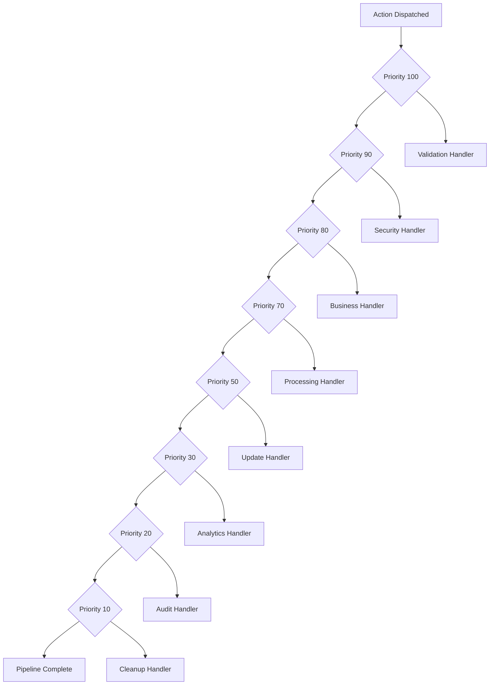

# Priority-Based Handler Execution

Priority-based execution ensures handlers run in the correct order for proper business logic flow.

## Basic Priority System

### Priority Levels

Handlers execute in **descending priority order** (highest number first):

```typescript
actionRegister.register('authenticate', validateInput, { priority: 100 });  // Runs 1st
actionRegister.register('authenticate', checkRateLimit, { priority: 90 });  // Runs 2nd  
actionRegister.register('authenticate', performAuth, { priority: 80 });     // Runs 3rd
actionRegister.register('authenticate', logAudit, { priority: 70 });        // Runs 4th
```

### Default Priority

If no priority is specified, handlers default to priority `50`:

```typescript
// These handlers have priority 50 and execute in registration order
actionRegister.register('processData', handlerA);
actionRegister.register('processData', handlerB);
actionRegister.register('processData', handlerC);
```

## Priority Categories

### High Priority (90-100): System Critical
- Input validation
- Security checks
- Rate limiting
- Authentication

```typescript
// Authentication pipeline with critical checks first
actionRegister.register('authenticate', validateCredentials, { priority: 100 });
actionRegister.register('authenticate', checkSecurityPolicy, { priority: 95 });
actionRegister.register('authenticate', rateLimitCheck, { priority: 90 });
```

### Medium Priority (50-89): Business Logic
- Data processing
- Business rule validation
- External API calls
- State updates

```typescript
// Data processing with business logic
actionRegister.register('processOrder', validateBusinessRules, { priority: 80 });
actionRegister.register('processOrder', calculatePricing, { priority: 70 });
actionRegister.register('processOrder', updateInventory, { priority: 60 });
actionRegister.register('processOrder', sendConfirmation, { priority: 50 });
```

### Low Priority (10-49): Logging & Analytics
- Audit logging
- Analytics tracking
- Performance monitoring
- Cleanup tasks

```typescript
// Logging and analytics last
actionRegister.register('userAction', processAction, { priority: 80 });
actionRegister.register('userAction', trackAnalytics, { priority: 30 });
actionRegister.register('userAction', auditLog, { priority: 20 });
actionRegister.register('userAction', cleanup, { priority: 10 });
```

## Priority Execution Examples

### Example 1: Authentication Flow

```typescript
interface AuthActions extends ActionPayloadMap {
  login: { username: string; password: string };
}

const authRegister = new ActionRegister<AuthActions>();

// Priority 100: Critical validation
authRegister.register('login', (payload, controller) => {
  if (!payload.username || !payload.password) {
    controller.abort('Missing credentials');
    return;
  }
  
  controller.setResult({ step: 'validation', valid: true });
  return { step: 'input-validation', success: true };
}, { priority: 100, id: 'input-validator' });

// Priority 90: Security check
authRegister.register('login', async (payload, controller) => {
  const isSuspicious = await checkSuspiciousActivity(payload.username);
  
  if (isSuspicious) {
    controller.abort('Suspicious activity detected');
    return;
  }
  
  controller.setResult({ step: 'security', cleared: true });
  return { step: 'security-check', success: true };
}, { priority: 90, id: 'security-checker' });

// Priority 80: Rate limiting
authRegister.register('login', (payload, controller) => {
  const rateLimiter = getRateLimiter(payload.username);
  
  if (!rateLimiter.isAllowed()) {
    controller.abort('Rate limit exceeded');
    return;
  }
  
  rateLimiter.consume();
  controller.setResult({ step: 'rate-limit', consumed: true });
  return { step: 'rate-limiting', success: true };
}, { priority: 80, id: 'rate-limiter' });

// Priority 70: Authentication
authRegister.register('login', async (payload) => {
  const user = await authenticateUser(payload.username, payload.password);
  const token = generateJWT(user);
  
  return { 
    step: 'authentication', 
    success: true,
    user: { id: user.id, username: user.username },
    token 
  };
}, { priority: 70, id: 'authenticator' });

// Priority 30: Analytics (low priority)
authRegister.register('login', (payload) => {
  analytics.track('login_attempt', {
    username: payload.username,
    timestamp: Date.now()
  });
  
  return { step: 'analytics', tracked: true };
}, { priority: 30, id: 'analytics-tracker' });

// Priority 10: Audit logging (lowest priority)
authRegister.register('login', (payload, controller) => {
  const results = controller.getResults();
  const authResult = results.find(r => r.step === 'authentication');
  
  auditLogger.log({
    action: 'login',
    username: payload.username,
    success: authResult?.success || false,
    timestamp: Date.now()
  });
  
  return { step: 'audit', logged: true };
}, { priority: 10, id: 'audit-logger' });
```

### Example 2: Data Processing Pipeline

```typescript
interface DataActions extends ActionPayloadMap {
  processData: { data: any; options?: ProcessingOptions };
}

const dataRegister = new ActionRegister<DataActions>();

// Priority 100: Input sanitization
dataRegister.register('processData', (payload, controller) => {
  const sanitized = sanitizeInput(payload.data);
  
  controller.modifyPayload(current => ({
    ...current,
    data: sanitized,
    sanitized: true
  }));
  
  return { step: 'sanitization', success: true };
}, { priority: 100, id: 'sanitizer' });

// Priority 90: Schema validation
dataRegister.register('processData', (payload, controller) => {
  const isValid = validateSchema(payload.data);
  
  if (!isValid) {
    controller.abort('Schema validation failed');
    return;
  }
  
  controller.setResult({ step: 'validation', schema: 'valid' });
  return { step: 'schema-validation', success: true };
}, { priority: 90, id: 'schema-validator' });

// Priority 80: Business rules
dataRegister.register('processData', (payload, controller) => {
  const violations = checkBusinessRules(payload.data);
  
  if (violations.length > 0) {
    controller.abort(`Business rule violations: ${violations.join(', ')}`);
    return;
  }
  
  return { step: 'business-validation', success: true };
}, { priority: 80, id: 'business-validator' });

// Priority 70: Data transformation
dataRegister.register('processData', (payload) => {
  const transformed = transformData(payload.data, payload.options);
  
  return { 
    step: 'transformation', 
    success: true,
    data: transformed,
    originalSize: JSON.stringify(payload.data).length,
    transformedSize: JSON.stringify(transformed).length
  };
}, { priority: 70, id: 'transformer' });

// Priority 60: Database save
dataRegister.register('processData', async (payload, controller) => {
  const results = controller.getResults();
  const transformed = results.find(r => r.step === 'transformation')?.data;
  
  const savedId = await database.save(transformed);
  
  return { 
    step: 'persistence', 
    success: true,
    id: savedId,
    timestamp: Date.now()
  };
}, { priority: 60, id: 'persister' });

// Priority 20: Performance monitoring
dataRegister.register('processData', (payload, controller) => {
  const results = controller.getResults();
  const duration = Date.now() - (results[0]?.timestamp || Date.now());
  
  performanceMonitor.track('data_processing', {
    duration,
    dataSize: JSON.stringify(payload.data).length,
    handlersExecuted: results.length
  });
  
  return { step: 'monitoring', tracked: true, duration };
}, { priority: 20, id: 'monitor' });
```

## Priority Best Practices

### 1. Use Standard Priority Ranges

```typescript
// System critical: 90-100
const PRIORITY_CRITICAL = 100;
const PRIORITY_SECURITY = 95;
const PRIORITY_VALIDATION = 90;

// Business logic: 50-89
const PRIORITY_BUSINESS_HIGH = 80;
const PRIORITY_BUSINESS_MEDIUM = 70;
const PRIORITY_BUSINESS_LOW = 60;
const PRIORITY_PROCESSING = 50;

// Monitoring/logging: 10-49
const PRIORITY_ANALYTICS = 30;
const PRIORITY_AUDIT = 20;
const PRIORITY_CLEANUP = 10;
```

### 2. Group Related Handlers

```typescript
// Authentication group (90-100)
authRegister.register('login', inputValidator, { priority: 100 });
authRegister.register('login', securityChecker, { priority: 95 });
authRegister.register('login', rateLimiter, { priority: 90 });

// Business logic group (70-80)  
authRegister.register('login', authenticator, { priority: 80 });
authRegister.register('login', sessionManager, { priority: 70 });

// Monitoring group (10-30)
authRegister.register('login', analyticsTracker, { priority: 30 });
authRegister.register('login', auditLogger, { priority: 20 });
```

### 3. Leave Priority Gaps

```typescript
// ✅ Good - allows inserting handlers between existing ones
actionRegister.register('process', handlerA, { priority: 100 });
actionRegister.register('process', handlerB, { priority: 80 });  // Gap of 20
actionRegister.register('process', handlerC, { priority: 60 });  // Gap of 20

// ❌ Avoid - no room for new handlers
actionRegister.register('process', handlerA, { priority: 100 });
actionRegister.register('process', handlerB, { priority: 99 });  // Too close
actionRegister.register('process', handlerC, { priority: 98 });  // Too close
```

### 4. Document Priority Rationale

```typescript
// Clear priority reasoning in comments
actionRegister.register('uploadFile', validateFile, { 
  priority: 100,  // Must validate before any processing
  id: 'file-validator' 
});

actionRegister.register('uploadFile', scanVirus, { 
  priority: 95,   // Security scan after validation
  id: 'virus-scanner' 
});

actionRegister.register('uploadFile', processFile, { 
  priority: 80,   // Process only after security clearance
  id: 'file-processor' 
});
```

## Priority Visualization



## Live Example: Priority Performance Demo

See a real implementation of priority-based execution in the [Priority Performance Demo](https://mineclover.github.io/context-action/example/actionguard/priority-performance):

```typescript
// High priority validation (100) - higher numbers = higher priority
useActionHandler('executeHighPriority', handler, { priority: 100 });

// Medium priority business logic (80)
useActionHandler('executeMediumPriority', handler, { priority: 80 });

// Low priority analytics (30)
useActionHandler('executeLowPriority', handler, { priority: 30 });
```

This example demonstrates performance tracking with timing measurements to show how priority affects execution order in real scenarios.

## Related

- **[Blocking Operations](./blocking.md)** - Control execution flow with blocking
- **[Abort Mechanisms](./abort.md)** - Stop pipeline execution when needed
- **[Result Handling](./result-handling.md)** - Collect and use handler results
- **[Dispatch Methods](./dispatch.md)** - Different ways to trigger pipelines