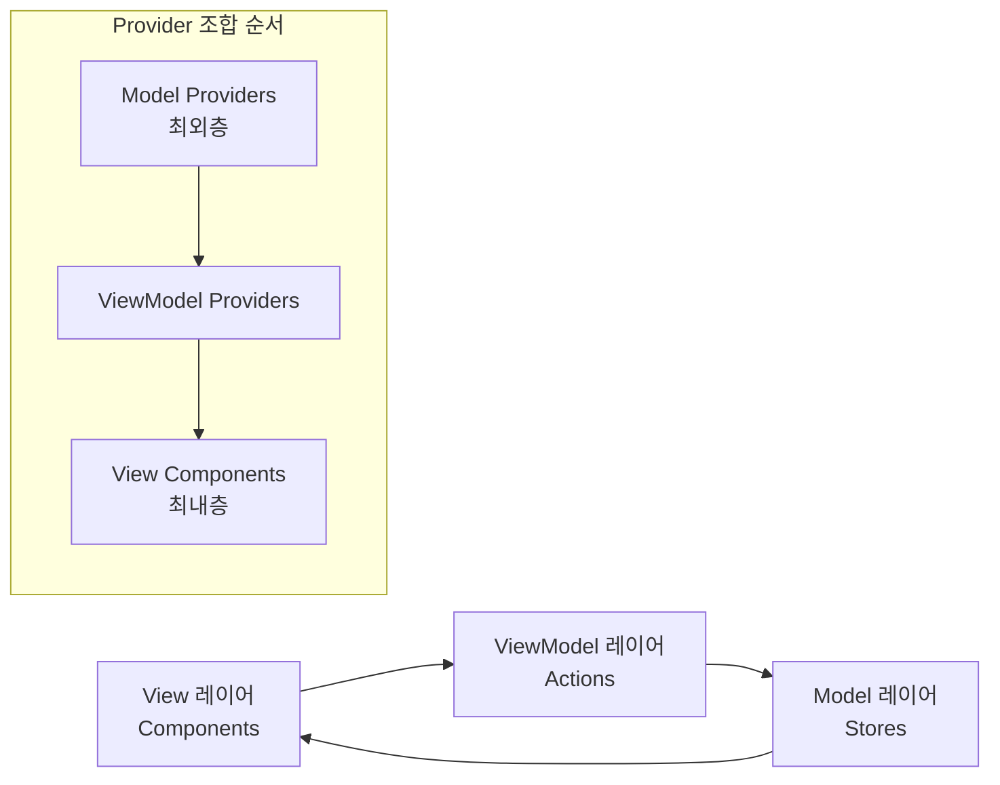

# Context-Action MVVM 핵심 아키텍처

**프롬프트 기반 개발을 위한 실용적 MVVM 구현 가이드**

## 🎯 아키텍처 개요

Context-Action Framework는 **순수한 MVVM 아키텍처**를 구현합니다:
- **Model**: `create~Context` 선언 (Store, Action, Ref)
- **ViewModel**: 상태와 동작을 주입하는 커스텀 훅 
- **View**: 최소한의 내부 상태로 훅을 소비하는 컴포넌트

### 핵심 원칙
**"선언적 컨텍스트 정의 + 훅 기반 주입 = 순수한 MVVM"**

### MVVM 아키텍처 흐름



**Provider 조합 순서** (외부 → 내부):
1. **Model 레이어**: Store Providers (데이터 관리)
2. **ViewModel 레이어**: Action Providers (비즈니스 로직) 
3. **View 레이어**: Components (UI 렌더링)

```tsx
// MVVM Provider 구조
<ModelProviders>      {/* Stores - 최외층 */}
  <ViewModelProviders> {/* Actions */}
    <ViewComponents /> {/* Components - 최내층 */}
  </ViewModelProviders>
</ModelProviders>
```

---

## 📐 3계층 아키텍처

### 🏗️ **Model 레이어**: 컨텍스트 선언

**역할**: 비즈니스 로직, 상태 관리, DOM 참조를 선언적으로 미리 정의

```typescript
// Model: 선언적 컨텍스트 정의
// 파일: src/models/UserModel.ts
export const {
  Provider: UserStoreProvider,
  useStore: useUserStore,
  useStoreManager: useUserStoreManager
} = createStoreContext('User', {
  profile: { id: '', name: '', email: '', role: 'guest' as const },
  preferences: { theme: 'light' as const, language: 'ko', notifications: true },
  session: { isAuthenticated: false, permissions: [], lastActivity: 0 }
});

// 파일: src/models/UserActionModel.ts  
export const {
  Provider: UserActionProvider,
  useActionDispatch: useUserDispatch,
  useActionHandler: useUserActionHandler
} = createActionContext<UserActions>('UserActions');

// 파일: src/models/UserRefModel.ts
export const {
  Provider: UserRefProvider,
  useRefHandler: useUserRef
} = createRefContext<UserRefs>('UserRefs');
```

### 🔗 **ViewModel 레이어**: 훅 기반 주입 & 조합

**역할**: 상태와 동작을 위한 집중된 훅을 생성한 다음, 복잡한 페이지 요구사항을 위해 조합

```typescript
// ViewModel: 상태 전용 훅
// 파일: src/viewmodels/useUserState.ts
export function useUserState() {
  const profileStore = useUserStore('profile');
  const profile = useStoreValue(profileStore);
  
  return {
    profile,
    isLoggedIn: profile.id !== '',
    displayName: profile.name || 'Guest',
    canEdit: profile.role !== 'guest'
  };
}

// ViewModel: 액션 전용 훅  
// 파일: src/viewmodels/useUserActions.ts
export function useUserActions() {
  const dispatch = useUserDispatch();
  
  return {
    updateProfile: useCallback((data: Partial<UserProfile>) => {
      dispatch('updateProfile', data);
    }, [dispatch]),
    
    logout: useCallback(() => {
      dispatch('logout');
    }, [dispatch])
  };
}

// ViewModel: 페이지별 조합 훅
// 파일: src/viewmodels/useUserProfilePage.ts
export function useUserProfilePage() {
  const state = useUserState();
  const actions = useUserActions();
  
  // 페이지별 이펙트와 계산된 값 (모든 로직이 훅에 있음)
  useEffect(() => {
    // 페이지 마운트 시 프로필 데이터 로드
    if (state.isLoggedIn) {
      actions.loadProfile();
    }
  }, [state.isLoggedIn, actions.loadProfile]);
  
  const profileCompleteness = useMemo(() => {
    const fields = ['name', 'email', 'avatar'];
    const completed = fields.filter(field => state.profile[field as keyof typeof state.profile]);
    return (completed.length / fields.length) * 100;
  }, [state.profile]);
  
  return {
    ...state,
    ...actions,
    profileCompleteness
  };
}
```

### 🎨 **View 레이어**: 훅 조합을 통한 순수한 컴포넌트 소비

**역할**: 컴포넌트는 특정 요구사항에 맞게 조합된 ViewModel 훅을 소비

```typescript
// View: 조합된 훅을 사용하는 페이지 컴포넌트
// 파일: src/pages/UserProfilePage.tsx
export function UserProfilePage() {
  // 페이지별 조합 훅 - 모든 로직이 훅 조합에서 나옴
  const {
    profile, isLoggedIn, displayName, canEditProfile, profileCompleteness,
    saveProfileChanges, logout
  } = useUserProfilePage();
  
  // View: 조합된 훅에서 주입된 동작으로 순수한 렌더링
  return (
    <div className="user-profile-page">
      <header>
        <h1>{displayName}</h1>
        <div className="profile-progress">
          프로필 {profileCompleteness}% 완료
        </div>
      </header>
      
      {isLoggedIn ? (
        <div>
          <ProfileCard 
            profile={profile}
            canEdit={canEditProfile}
            onSave={saveProfileChanges}
          />
          <button onClick={logout}>로그아웃</button>
        </div>
      ) : (
        <LoginPrompt />
      )}
    </div>
  );
}

// 파일: src/pages/UserSettingsPage.tsx  
export function UserSettingsPage() {
  // 설정별 조합 훅
  const {
    profile, preferences, isLoggedIn, hasUnsavedChanges,
    saveAllSettings, updatePreferences
  } = useUserSettingsPage();
  
  if (!isLoggedIn) {
    return <LoginRequired />;
  }
  
  // View: 설정별 조합으로 순수한 UI 로직
  return (
    <div className="settings-page">
      <h1>설정</h1>
      
      <ProfileSettingsSection 
        profile={profile}
        onChange={(changes) => updatePreferences({ profile: changes })}
      />
      
      <PreferencesSection 
        preferences={preferences}
        onChange={updatePreferences}
      />
      
      <div className="settings-actions">
        <Button 
          variant="primary"
          disabled={!hasUnsavedChanges}
          onClick={() => saveAllSettings({ profile, preferences })}
        >
          모든 변경사항 저장
        </Button>
        {hasUnsavedChanges && <span>저장하지 않은 변경사항이 있습니다</span>}
      </div>
    </div>
  );
}

// 파일: src/components/ProfileCard.tsx - 집중된 훅을 사용하는 컴포넌트
export function ProfileCard({ 
  profile, 
  canEdit, 
  onSave 
}: { 
  profile: UserProfile; 
  canEdit: boolean; 
  onSave: (changes: Partial<UserProfile>) => void; 
}) {
  // 컴포넌트는 특정 필요에 따라 집중된 훅을 사용할 수 있음
  const { theme } = useUserState(); // 여기서 필요한 상태만
  const [isEditing, setIsEditing] = useState(false);
  const [changes, setChanges] = useState<Partial<UserProfile>>({});
  
  const handleSave = () => {
    onSave(changes);
    setIsEditing(false);
    setChanges({});
  };
  
  return (
    <Card theme={theme}>
      {isEditing ? (
        <div>
          <Input 
            value={changes.name ?? profile.name}
            onChange={(name) => setChanges(prev => ({ ...prev, name }))}
          />
          <Button onClick={handleSave}>저장</Button>
          <Button onClick={() => setIsEditing(false)}>취소</Button>
        </div>
      ) : (
        <div>
          <h3>{profile.name}</h3>
          <p>{profile.email}</p>
          {canEdit && (
            <Button onClick={() => setIsEditing(true)}>편집</Button>
          )}
        </div>
      )}
    </Card>
  );
}
```

---

## 🏢 **비즈니스 로직 레이어**: 액션 핸들러

**역할**: 액션 핸들러를 통해 UI와 별도로 비즈니스 로직 구현

```typescript
// 비즈니스 로직: 비즈니스 규칙을 위한 액션 핸들러
// 파일: src/business/UserBusinessLogic.tsx
export function UserBusinessLogic({ children }: { children: ReactNode }) {
  const profileStore = useUserStore('profile');
  const sessionStore = useUserStore('session');
  
  // 비즈니스 로직: 검증과 함께 프로필 업데이트
  useUserActionHandler('updateProfile', useCallback(async (payload) => {
    const current = profileStore.getValue();
    
    if (!payload.email.includes('@')) {
      throw new Error('잘못된 이메일 형식');
    }
    
    const updated = { ...current, ...payload };
    profileStore.setValue(updated);
    await saveToAPI(updated);
  }, [profileStore]));
  
  // 비즈니스 로직: 로그아웃
  useUserActionHandler('logout', useCallback(async () => {
    profileStore.setValue({ id: '', name: '', email: '' });
    await clearSession();
  }, [profileStore]));
  
  return <>{children}</>;
}
```

---

## 🎭 **공유 컴포넌트**: 스마트 위젯 패턴

**역할**: 재사용 가능성을 유지하면서 Context-Action을 통해 복잡성 처리

### 📦 **단순한 공유 컴포넌트**: 순수한 View
```typescript
// 단순한 공유: 명시적 props를 가진 순수한 뷰 컴포넌트
// 파일: src/shared/Button.tsx
interface ButtonProps {
  variant: 'primary' | 'secondary' | 'danger';
  size: 'small' | 'medium' | 'large';
  disabled?: boolean;
  loading?: boolean;
  children: ReactNode;
  onClick?: () => void;
}

export function Button({ variant, size, disabled, loading, children, onClick }: ButtonProps) {
  // 순수한 View: 훅 없음, 내부 상태 없음, 최대 재사용성
  return (
    <button 
      className={`btn btn-${variant} btn-${size}`}
      disabled={disabled || loading}
      onClick={onClick}
    >
      {loading ? <Spinner /> : children}
    </button>
  );
}
```

### 🧩 **스마트 위젯 패턴**
```typescript
// 스마트 위젯 훅: 모든 복잡성이 훅에 있음
function useDataTable(initialData: any[]) {
  const [data, setData] = useState(initialData);
  const [page, setPage] = useState(1);
  const [loading, setLoading] = useState(false);
  
  const changePage = useCallback((newPage: number) => {
    setLoading(true);
    setPage(newPage);
    // 데이터 로드 로직 여기서
    setLoading(false);
  }, []);
  
  return { data, page, loading, changePage };
}

// 스마트 위젯 컴포넌트: 순수한 소비
export function DataTable({ columns, data, onRowSelect }: {
  columns: Column[];
  data: any[];
  onRowSelect?: (row: any) => void;
}) {
  const table = useDataTable(data);
  
  return (
    <div>
      <table>
        <tbody>
          {table.data.map((row, i) => (
            <tr key={i} onClick={() => table.changePage(table.page + 1)}>
              {columns.map(col => <td key={col.key}>{row[col.key]}</td>)}
            </tr>
          ))}
        </tbody>
      </table>
      {table.loading && <div>로딩 중...</div>}
    </div>
  );
}

```

---

## 🏗️ **Provider 조합**: MVVM 아키텍처

**역할**: 최적의 아키텍처를 위해 MVVM 레이어 순서에 따라 컨텍스트 조합

### 🎯 **핵심 조합 방법**

#### 1. **composeProviders 유틸리티** (권장)
```typescript
import { composeProviders } from '@context-action/react';

// MVVM 호환 프로바이더 조합
const AppProviders = composeProviders([
  // Model 레이어 (최외층) - 데이터 관리
  UserStoreProvider,
  ProductStoreProvider,
  UIStoreProvider,
  
  // ViewModel 레이어 - 비즈니스 로직
  UserActionProvider,
  ProductActionProvider,
  UIActionProvider
]);

function App() {
  return (
    <AppProviders>
      {/* View 레이어 - 컴포넌트 */}
      <UserBusinessLogic>
        <Router>
          <Route path="/profile" element={<UserProfile />} />
          <Route path="/products" element={<ProductList />} />
        </Router>
      </UserBusinessLogic>
    </AppProviders>
  );
}
```

#### 2. **수동 MVVM 조합** (고급 제어)
```typescript
// MVVM 호환 수동 조합
function MVVMApp() {
  return (
    {/* Model 레이어 - 최외층 */}
    <UserStoreProvider>
      <ProductStoreProvider>
        <UIStoreProvider>
          
          {/* ViewModel 레이어 */}
          <UserActionProvider>
            <ProductActionProvider>
              <UIActionProvider>
                
                {/* 비즈니스 로직 레이어 */}
                <UserBusinessLogic>
                  <ProductBusinessLogic>
                    
                    {/* View 레이어 - 최내층 */}
                    <Router>
                      <Route path="/profile" element={<UserProfile />} />
                    </Router>
                    
                  </ProductBusinessLogic>
                </UserBusinessLogic>
              </UIActionProvider>
            </ProductActionProvider>
          </UserActionProvider>
        </UIStoreProvider>
      </ProductStoreProvider>
    </UserStoreProvider>
  );
}
```

#### 3. **조건부 MVVM 조합** (빌드 타임)
```typescript
// 빌드 타임 조건부 조합 (런타임보다 권장)
const isProduction = process.env.NODE_ENV === 'production';
const hasAnalytics = process.env.REACT_APP_ANALYTICS === 'true';

function createMVVMProviders() {
  const providers = [
    // Model 레이어 - 핵심 스토어
    UserStoreProvider,
    UIStoreProvider,
    
    // 빌드 구성에 기반한 선택적 스토어
    ...(hasAnalytics ? [AnalyticsStoreProvider] : []),
    ...(isProduction ? [ErrorTrackingStoreProvider] : [DebugStoreProvider]),
    
    // ViewModel 레이어 - 핵심 액션
    UserActionProvider,
    UIActionProvider,
    
    // 빌드 구성에 기반한 선택적 액션
    ...(hasAnalytics ? [AnalyticsActionProvider] : []),
    ...(isProduction ? [ErrorTrackingActionProvider] : [DebugActionProvider])
  ];
  
  return composeProviders(providers);
}

// 정적 조합 - 앱 초기화시 한 번 평가
const MVVMProviders = createMVVMProviders();

function App() {
  return (
    <MVVMProviders>
      <UserBusinessLogic>
        <AppContent />
      </UserBusinessLogic>
    </MVVMProviders>
  );
}
```

### 🎗️ **Provider 조합 모범 사례**

1. **레이어 순서**: Model (Stores) → ViewModel (Actions) → View (Components)
2. **정적 조합**: 런타임보다 빌드 타임 조합 선호
3. **도메인 그룹화**: 비즈니스 도메인별로 관련 프로바이더 그룹화
4. **깊은 중첩 방지**: 더 깨끗한 조합을 위해 `composeProviders` 사용

---

## 📋 **구현 체크리스트**

### ✅ **Model 레이어** (`src/models/`)
- [ ] 상태 관리를 위한 `~StoreContext` 생성
- [ ] 비즈니스 액션을 위한 `~ActionContext` 생성  
- [ ] DOM 조작을 위한 `~RefContext` 생성
- [ ] 도메인별 명명으로 프로바이더와 훅 내보내기

### ✅ **ViewModel 레이어** (`src/viewmodels/`)
- [ ] 먼저 집중된 훅 생성:
  - [ ] 상태 전용 훅 (`useUserState`, `useProductData`)
  - [ ] 액션 전용 훅 (`useUserActions`, `useProductActions`)
  - [ ] 이벤트 전용 훅 (`useUserEvents`, `useFormEvents`)
- [ ] 페이지용 조합 훅 생성:
  - [ ] 페이지별 훅 (`useUserProfilePage`, `useSettingsPage`)
  - [ ] 기능별 훅 (`useSearchFeature`, `useAdminFeature`)
- [ ] 훅을 순수하고 단일 책임에 집중되도록 유지
- [ ] 복잡한 페이지 요구사항을 위한 훅 조합 활성화
- [ ] 뷰가 필요한 것만 반환 (내부 로직 노출 없음)

### ✅ **비즈니스 로직 레이어** (`src/business/`)
- [ ] 비즈니스 규칙을 위한 `useActionHandler` 구현
- [ ] 비즈니스 로직을 UI 관심사와 분리 유지
- [ ] 검증, API 호출, 부수 효과 처리
- [ ] 스토어 간 조정 관리

### ✅ **View 레이어** (`src/components/`, `src/pages/`)
- [ ] ViewModel 훅만 소비
- [ ] 내부 상태 최소화 (주입된 상태 선호)
- [ ] 순수한 렌더링과 사용자 상호작용에 집중
- [ ] 모든 로직을 ViewModel 레이어에 위임

### ✅ **공유 컴포넌트** (`src/shared/`)
- [ ] 컴포넌트 복잡성 결정:
  - [ ] **단순한 컴포넌트**: 순수한 props, 훅 없음 (Button, Input, Card)
  - [ ] **스마트 위젯**: 복잡성을 위한 Context-Action (DataTable, RichTextEditor)
- [ ] 단순한 컴포넌트의 경우:
  - [ ] 명시적 props로 순수한 컴포넌트 생성
  - [ ] 훅 없음, 컨텍스트 소비 없음  
  - [ ] 뷰 상태 관리를 통한 최대 재사용성
- [ ] 스마트 위젯의 경우:
  - [ ] 전용 Model, ViewModel, 비즈니스 로직 생성
  - [ ] 격리를 위해 Provider로 래핑
  - [ ] Context-Action 패턴을 통해 복잡성 처리

---

## 🎯 **개발 워크플로우**

### 1. **도메인 정의** (Model)
```bash
# 먼저 컨텍스트 선언 생성
src/models/UserModel.ts       # Store 컨텍스트
src/models/UserActionModel.ts # Action 컨텍스트  
src/models/UserRefModel.ts    # Ref 컨텍스트
```

### 2. **ViewModels 생성** (ViewModel)
```bash
# 먼저 집중된 훅 생성
src/viewmodels/useUserState.ts     # 상태 전용 훅
src/viewmodels/useUserActions.ts   # 액션 전용 훅  
src/viewmodels/useUserEvents.ts    # 이벤트 전용 훅

# 그 다음 특정 페이지를 위한 조합 훅 생성
src/viewmodels/useUserProfilePage.ts  # 프로필 페이지용 조합
src/viewmodels/useUserSettingsPage.ts # 설정 페이지용 조합
src/viewmodels/useUserDashboard.ts    # 대시보드 페이지용 조합
```

### 3. **비즈니스 로직 구현** (Business)
```bash
# 비즈니스 규칙을 위한 액션 핸들러 생성
src/business/UserBusinessLogic.tsx
src/business/AuthBusinessLogic.tsx
```

### 4. **뷰 빌드** (View)
```bash
# ViewModels을 소비하는 컴포넌트 생성
src/pages/UserProfilePage.tsx
src/components/UserProfile.tsx
```

### 5. **공유 컴포넌트 생성** (Shared)
```bash
# 재사용 가능한 순수한 컴포넌트 빌드
src/shared/Button.tsx
src/shared/Card.tsx
src/shared/Form.tsx
```

---

## 🔧 **고급 패턴**

### 🎯 **훅 조합 전략**

Context-Action MVVM 아키텍처는 유연한 훅 조합을 지원합니다:

#### **집중된 훅 패턴**
```typescript
// 상태 전용 훅 - 데이터 접근에 집중
useUserState()     // 상태와 계산된 값만 반환
useProductData()   // 제품 관련 데이터만 반환
useCartState()     // 쇼핑카트 상태만 반환

// 액션 전용 훅 - 동작에 집중
useUserActions()   // 액션 함수만 반환
useProductActions() // 제품 관련 액션만 반환
useCartActions()   // 카트 관련 액션만 반환

// 이벤트 전용 훅 - DOM 이벤트 핸들러에 집중
useUserEvents()    // 사용자 상호작용 이벤트 핸들러만 반환
useFormEvents()    // 폼 관련 이벤트 핸들러만 반환
useKeyboardEvents() // 키보드 이벤트 핸들러만 반환
```

#### **조합된 훅 패턴**
```typescript
// 페이지별 훅 - 특정 페이지를 위해 집중된 훅 결합
useUserProfilePage()  // useUserState + useUserActions + 페이지 로직 결합
useProductListPage()  // useProductData + useProductActions + 목록 로직 결합
useCheckoutPage()     // useCartState + useUserState + usePaymentActions 결합

// 기능별 훅 - 특정 기능을 위해 결합
useSearchFeature()    // 검색 상태 + 검색 액션 + 검색 로직 결합
useShoppingFeature()  // 카트 + 제품 + 사용자 로직 결합
useAdminFeature()     // 관리자 상태 + 관리자 액션 + 권한 로직 결합
```

### 🧩 **스마트 위젯 vs 단순 컴포넌트 결정 트리**

```
컴포넌트가 내부 로직이 있는 복잡한 컴포넌트인가?
├─ YES → Context-Action을 사용한 스마트 위젯
│   ├─ 전용 Model 생성 (컨텍스트 선언)
│   ├─ 전용 ViewModel 생성 (동작 주입을 위한 훅)
│   ├─ 비즈니스 로직 생성 (액션 핸들러)
│   └─ 격리를 위해 Provider로 래핑
│
└─ NO → 단순한 공유 컴포넌트
    ├─ 순수한 props 인터페이스
    ├─ 훅이나 컨텍스트 소비 없음
    └─ 최대 재사용성

예시:
스마트 위젯: DataTable, RichTextEditor, MediaPlayer, Dashboard
단순 컴포넌트: Button, Input, Card, Modal, Icon
```

### 🎯 **핵심 규칙**

**컴포넌트 규칙:**
- ❌ 컴포넌트에서 `dispatch`나 `useEffect` 사용 금지
- ❌ 컴포넌트에서 Context-Action 직접 소비 금지  
- ✅ 커스텀 훅만 소비
- ✅ 순수한 렌더링에만 집중

**훅 규칙:**
- ✅ 모든 로직, 이펙트, 디스패치 호출을 훅에서
- ✅ 복잡한 요구사항을 위한 훅 조합
- ✅ 컴포넌트가 필요한 것만 반환

---

## 💡 **핵심 아키텍처 이점**

### 🔄 **완벽한 관심사 분리**
- **Model**: 어떤 데이터와 기능이 존재하는가
- **ViewModel**: 뷰에서 어떻게 사용하는가
- **View**: 사용자가 보고 상호작용하는 것
- **Business**: 왜 그리고 언제 일이 일어나는가
- **Shared**: 정보를 일관성 있게 표시하는 방법

### 🚀 **개발 효율성** 
- **Model 우선**: 구현 전에 기능 정의
- **훅 주입**: 모든 뷰에서 일관된 동작 패턴
- **순수한 뷰**: 컴포넌트는 프레젠테이션에만 집중
- **재사용 가능한 공유**: 한 번 빌드하면 어디서든 사용

### 🏗️ **아키텍처 확장성**
- **도메인 격리**: 기존 코드 건드리지 않고 새 기능 추가
- **타입 안전성**: 모든 레이어에서 완전한 TypeScript 지원
- **팀 협업**: 서로 다른 팀이 서로 다른 레이어에서 작업 가능
- **테스트**: 각 레이어를 독립적으로 테스트 가능

---

## 📚 **관련 문서**

- **[설정 패턴](../guide/patterns/setup/index.md)** - 컨텍스트 생성 패턴
- **[스토어 패턴](../guide/patterns/store/index.md)** - 상태 관리 패턴  
- **[액션 패턴](../guide/patterns/action/index.md)** - 비즈니스 로직 패턴
- **[아키텍처 패턴](../guide/patterns/architecture/index.md)** - 복잡한 아키텍처 패턴
- **[컨벤션](./conventions.md)** - 명명 및 코딩 컨벤션

이 아키텍처는 명확한 관심사 분리와 최대 코드 재사용성으로 확장 가능하고 유지보수 가능한 애플리케이션을 빌드하기 위한 **프롬프트 준비 기반**을 제공합니다.