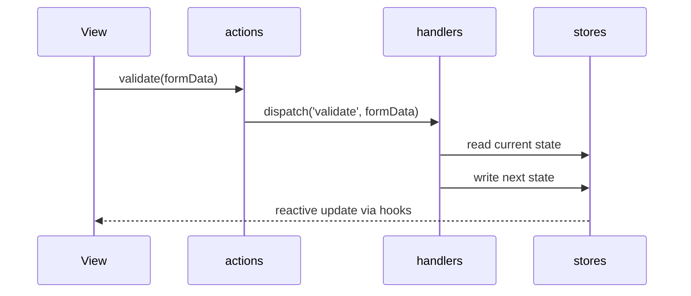

# Context-Layered 아키텍처 가이드

Context-Layered Architecture는 Context-Action 프레임워크를 사용하는 React 애플리케이션을 위해 설계된 계층형 구조입니다. 핵심 목표는 상태, 흐름 제어, UI, 의존성 주입을 한곳에 섞지 않고, 책임별 경계를 명확하게 나누는 데 있습니다.

이 구조는 단순히 파일을 나누는 규칙이 아니라 다음 세 가지를 동시에 달성하기 위한 설계입니다.

- 비즈니스 로직을 UI와 분리한다
- 최신 상태 접근과 side effect를 handler 레이어에서 통제한다
- 테스트를 컴포넌트 중심이 아니라 레이어 중심으로 조직한다

## 핵심 원칙

1. `contexts`는 경계를 정의하고 타입과 provider를 만든다
2. `handlers`는 흐름 제어와 side effect를 담당한다
3. `actions`는 dispatch API를 view 친화적으로 감싼다
4. `hooks`는 store 구독과 view용 파생 값을 제공한다
5. `views`는 렌더링과 사용자 입력 전달에 집중한다
6. 최상위 페이지는 provider 구성과 handler 등록을 담당한다

## 6-Layer 구조

```text
pages/checkout/
├── contexts/     # 타입 정의와 context 생성
├── handlers/     # 비즈니스 흐름과 side effect orchestration
├── actions/      # dispatch helper와 callback
├── hooks/        # store subscription
├── views/        # 순수 UI 컴포넌트
└── CheckoutPage.tsx  # 통합 지점
```

## 레이어별 책임

| 레이어 | 역할 | 하지 말아야 할 일 |
|-------|------|-------------------|
| `contexts` | 액션/스토어 타입 정의, provider 생성 | business logic 구현 |
| `handlers` | 최신 store 값 읽기, 검증 호출, side effect 실행 | UI 렌더링 |
| `actions` | dispatch를 의미 있는 함수로 감싸기 | store 직접 구독 |
| `hooks` | `useStoreValue` 기반 구독, 파생 값 계산 | handler 등록 |
| `views` | 렌더링, 이벤트 전달 | 가격 계산, 검증 규칙 작성 |
| `Page` | provider 구성, handler 등록 | 세부 business rule 구현 |

## 기본 데이터 흐름



이 흐름의 핵심은 `view`가 business rule을 직접 호출하지 않는다는 점입니다. 사용자의 의도는 action을 통해 전달되고, handler가 현재 상태와 외부 의존성을 바탕으로 실제 실행을 담당합니다.

## 왜 이 구조가 유리한가

### 1. 관심사 분리가 명확하다

컴포넌트가 커질수록 가장 먼저 섞이는 것이 상태 접근, 검증, API 호출, 포커스 이동, 로깅입니다. Context-Layered는 이 책임을 레이어별로 분리해 “어디를 봐야 하는지”를 빠르게 알 수 있게 합니다.

### 2. 테스트가 쉬워진다

- `business`는 순수 함수 테스트
- `handlers`는 orchestration 테스트
- `views`는 렌더링과 입력 전달 테스트
- 전체 예제는 시나리오 테스트

즉 테스트를 “하나의 거대한 컴포넌트 테스트”로 몰지 않아도 됩니다.

### 3. 최신 상태 접근 문제가 줄어든다

handler는 필요할 때 store에서 최신 값을 읽고, 그 결과를 다시 store에 반영합니다. 따라서 closure에 갇힌 오래된 값 때문에 흐름이 꼬이는 문제를 줄일 수 있습니다.

### 4. 팀 협업에 유리하다

- 타입 정의 작업은 `contexts`
- 도메인 규칙 작업은 `business`
- 실행 흐름 작업은 `handlers`
- UI 작업은 `views`

처럼 역할을 나눌 수 있어서, 동일 기능을 여러 사람이 병렬로 다루기 쉬워집니다.

## 언제 쓰는 것이 좋은가

### 잘 맞는 경우

- 중대형 React 애플리케이션
- 비즈니스 로직이 많은 화면
- 검증, API, 포커스 이동, 상태 업데이트가 섞인 복합 폼
- 장기 유지보수와 팀 규칙이 중요한 프로젝트

### 과할 수 있는 경우

- 단순한 CRUD 폼 하나만 있는 페이지
- 프로토타입이나 짧은 수명의 실험 코드
- 팀이 아직 레이어 분리 규칙에 익숙하지 않은 상태

## 추천 읽기 순서

1. 이 문서에서 전체 그림을 잡습니다.
2. [폴더 구조](/ko/context-layered/architecture/folder-structure)로 각 레이어의 책임을 봅니다.
3. [안정성 테스트 사이클](/ko/context-layered/stability-test-cycle)로 왜 이 구조가 안정성과 연결되는지 확인합니다.
4. [Canonical Order Form 예제](/ko/examples/canonical-order-form)로 실제 구현 흐름을 따라갑니다.
5. [마이그레이션 가이드](/ko/context-layered/migration-guide)로 기존 구조를 어떻게 옮길지 확인합니다.

## 관련 문서

- [폴더 구조](/ko/context-layered/architecture/folder-structure)
- [핸들러 레지스트리](/ko/context-layered/architecture/handler-registry)
- [안정성 테스트 사이클](/ko/context-layered/stability-test-cycle)
- [Canonical Order Form 예제](/ko/examples/canonical-order-form)
