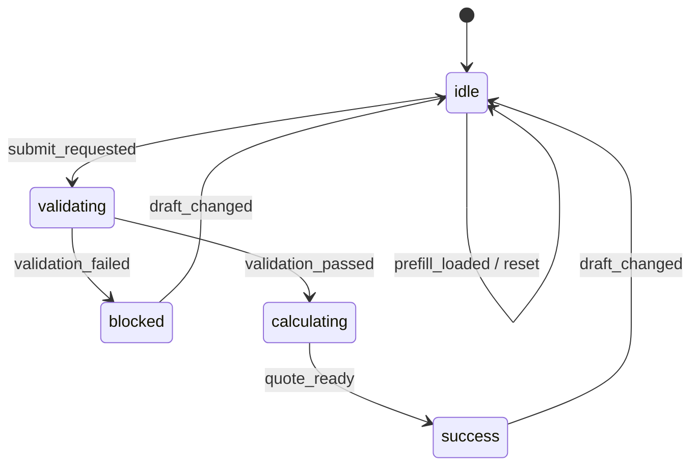

# 명시적 상태 머신

명시적 상태 머신은 비동기 흐름을 `상태 + 이벤트 + 전이`로 고정하는 패턴입니다. Context-Layered Architecture에서는 특히 handler 레이어가 비즈니스 규칙과 side effect를 함께 조율할 때 이 패턴의 효과가 큽니다.

`if` 문과 임시 플래그를 늘리는 대신, 현재 상태에서 어떤 이벤트를 받을 수 있는지 먼저 정의합니다. 그러면 복잡한 흐름도 수평적으로 확장하기 쉬워지고, 잘못된 상태 조합을 줄일 수 있습니다.

## 언제 쓰는가

- 검증, 제출, 저장, 동기화처럼 단계가 나뉜 비동기 흐름
- 성공/실패/재시도/리셋이 모두 존재하는 워크플로우
- activity log, analytics, UI 피드백이 같은 전이를 기준으로 움직여야 하는 화면
- handler가 커지기 시작해서 상태 전이를 코드로 설명하기 어려워진 시점

## 핵심 개념

### 상태

현재 워크플로우가 어느 단계에 있는지 나타냅니다.

예:

```ts
type SubmissionPhase =
  | 'idle'
  | 'validating'
  | 'blocked'
  | 'calculating'
  | 'success';
```

### 이벤트

상태를 움직이는 원인입니다.

예:

```ts
type SubmissionEvent =
  | { type: 'draft_changed' }
  | { type: 'submit_requested' }
  | { type: 'validation_failed' }
  | { type: 'validation_passed' }
  | { type: 'quote_ready'; total: number };
```

### 전이

현재 상태와 이벤트를 받아 다음 상태를 반환하는 순수 함수입니다.

```ts
function transition(current: SubmissionState, event: SubmissionEvent) {
  switch (event.type) {
    case 'submit_requested':
      return current.phase === 'idle'
        ? { phase: 'validating' }
        : current;
    case 'validation_failed':
      return current.phase === 'validating'
        ? { phase: 'blocked' }
        : current;
    case 'validation_passed':
      return current.phase === 'validating'
        ? { phase: 'calculating' }
        : current;
    case 'quote_ready':
      return current.phase === 'calculating'
        ? { phase: 'success', total: event.total }
        : current;
    default:
      return current;
  }
}
```

## Context-Layered에서의 역할 분담

- `business/`
  - 상태 타입
  - 이벤트 타입
  - 전이 함수
- `handlers/`
  - 현재 store 값 읽기
  - 전이 함수 호출
  - validation, ref focus, API 호출 같은 side effect 조율
- `hooks/`
  - 상태를 view 친화적인 형태로 변환
- `views/`
  - 최종 메시지와 UI만 렌더링

즉 상태 머신의 핵심은 `handler가 상태를 직접 조작하는 것`이 아니라, `handler가 정의된 전이를 호출한다`는 점입니다.

## implementation-playbook 예제에 적용한 구조

canonical example은 이 패턴을 submission 흐름에 적용합니다.



관련 파일:

- `/Users/junwoobang/workflow/context-action/example/src/pages/patterns/implementation-playbook/business/submissionStateMachine.ts`
- `/Users/junwoobang/workflow/context-action/example/src/pages/patterns/implementation-playbook/handlers/useCanonicalOrderSubmissionHandlers.tsx`
- `/Users/junwoobang/workflow/context-action/example/src/pages/patterns/implementation-playbook/handlers/orderHandlerSupport.ts`

## 왜 안정적인가

### 1. 잘못된 조합을 줄인다

`phase: 'success'`인데 `quote: null` 같은 모순을 타입으로 줄일 수 있습니다.

### 2. 복잡한 흐름을 수평으로 확장하기 쉽다

승인 단계가 필요해지면 `approved` 상태와 `approval_requested`, `approval_granted` 이벤트를 추가하면 됩니다. 기존 view와 handler를 모두 다시 설계하지 않아도 됩니다.

### 3. activity log와 UI 피드백을 같은 이벤트에서 파생할 수 있다

상태와 로그가 서로 다른 근거로 움직이지 않게 만들 수 있습니다.

### 4. 함수형 패턴과 잘 맞는다

전이 함수는 순수 함수이므로 테스트와 조합이 쉽습니다. validation, quote calculation, state transition을 각각 독립된 순수 함수로 유지할 수 있습니다.

## 실무 체크리스트

- 상태 이름은 화면 문구가 아니라 흐름 단계를 반영한다
- 이벤트 이름은 사용자 의도나 시스템 결과를 반영한다
- 전이 함수는 가능한 한 순수 함수로 둔다
- side effect는 전이 함수 바깥 handler에서 실행한다
- view 메시지는 상태를 해석해서 만든다
- 테스트는 상태 전이 전후를 직접 검증한다

## 같이 보면 좋은 문서

- `/Users/junwoobang/workflow/context-action/docs/ko/examples/canonical-order-form.md`
- `/Users/junwoobang/workflow/context-action/docs/ko/context-layered/stability-test-cycle.md`
- `/Users/junwoobang/workflow/context-action/docs/ko/concept/business-logic-separation-guide.md`
