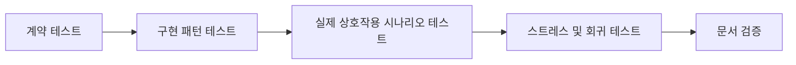

# Context-Layered 아키텍처를 위한 안정성 테스트 사이클

이 가이드는 다소 구조적인 아키텍처를 실제 제품 강점으로 보이게 만드는 테스트 사이클을 설명합니다. 목표는 단순히 정답 여부를 확인하는 것이 아니라, 레이어 분리가 변경과 스트레스 상황에서도 예측 가능성을 만든다는 점을 증명하는 것입니다.

## 왜 중요한가

Context-Layered Architecture는 단순한 React 구성보다 무겁게 느껴질 수 있습니다. 따라서 이 구조의 가치는 설명이 아니라 검증으로 보여줘야 합니다.

핵심 메시지는 다음과 같습니다.

- 이 아키텍처는 단순한 구성보다 더 구조적이다.
- 그 구조는 런타임 경계를 강하게 만든다.
- 그 경계는 계층화된 테스트 사이클로 지속적으로 검증된다.

## 안정성 중심 테스트 사이클

아키텍처의 복잡도가 실제로 정당화되는지 판단하려면 다음 문서와 함께 읽는 것이 가장 좋습니다.

- [Canonical Order Form 예제](/ko/examples/canonical-order-form)
- [Context-Layered 개요](/ko/context-layered/context-layered-guide)

### 1. 계약 테스트

계약 테스트는 핵심 팩토리와 경계가 약속하는 보장을 고정합니다.

- `createActionContext()`는 안정적인 dispatch와 안전한 handler 등록을 제공해야 합니다.
- `createStoreContext()`는 격리된 typed store와 예측 가능한 구독을 제공해야 합니다.
- `createRefContext()`는 mount 상태, imperative 접근, cleanup을 안전하게 관리해야 합니다.

이 단계가 답하는 질문은 "이 아키텍처가 무엇을 보장하는가?"입니다.

### 2. 구현 패턴 테스트

구현 패턴 테스트는 권장 아키텍처를 실제 코드가 따르고 있는지 검증합니다.

- `views`는 비즈니스 로직을 직접 담지 않고 액션을 디스패치하는가
- `handlers`는 상태 변경과 사이드 이펙트를 조율하는가
- `business`는 순수 함수로 유지되는가
- `hooks`는 뷰 친화적인 값을 구독하고 가공하는가
- `refs`는 imperative 대상에만 사용되는가

이 단계가 답하는 질문은 "코드가 의도된 설계를 따르고 있는가?"입니다.

### 3. 실제 상호작용 시나리오 테스트

시나리오 테스트는 유틸리티 확인이 아니라 제품 흐름처럼 작성되어야 합니다.

- 잘못된 폼 제출 시 필드 오류가 노출되는가
- 첫 번째 잘못된 필드에 `RefContext`를 통해 포커스가 이동하는가
- 정상 제출이 action, handler, business, store 레이어를 모두 통과하는가
- UI가 임시 로컬 상태가 아니라 store 구독을 통해 갱신되는가

이 단계가 답하는 질문은 "실제 사용자 흐름에서도 구조가 유지되는가?"입니다.

### 4. 스트레스 및 회귀 테스트

이 레이어에서 구조의 가치가 가장 분명해집니다.

- 고빈도 업데이트
- 반복적인 handler 실행
- 빠른 mount/unmount 이후 cleanup
- cross-context 격리
- 메모리 누수 방지
- patch 기반 구독 최적화

이 단계가 답하는 질문은 "압박 상황에서도 설계가 안정적인가?"입니다.

### 5. 문서 검증

문서는 개념 설명에 그치지 않고 실행 가능해야 합니다.

- 문서 예제 코드가 현재 API와 맞는가
- canonical example 구조가 실제 파일 구조와 대응되는가
- migration 가이드가 현재 구현 패턴과 일치하는가

이 단계가 답하는 질문은 "사용자가 이 아키텍처 설명을 믿을 수 있는가?"입니다.

## CI 권장 구성

하나의 거대한 파이프라인보다 여러 검증 레인을 나누는 편이 좋습니다.

### Fast PR Lane

- 계약 테스트
- 핵심 패턴 테스트
- 타입 체크

### Extended PR Lane

- 통합 시나리오
- migration 워크플로우
- canonical example 흐름 테스트

### Nightly Lane

- 고빈도 성능 테스트
- cleanup 및 lifecycle 스트레스 테스트
- 장시간 회귀 시나리오

### Release Lane

- React 패키지 전체 테스트
- example 앱 타입 체크 및 빌드
- 문서 빌드 및 링크 검증

## 추천 Assertion 방식

아키텍처 신뢰도를 높이는 assertion을 우선하세요.

- side effect가 예상된 handler 레이어에서만 발생하는가
- store 업데이트가 구독을 통해 관찰 가능한가
- ref 기반 focus 또는 scroll 동작이 숨겨진 로컬 상태 없이 동작하는가
- business logic이 명시적 입력으로부터 결정론적 결과를 만드는가
- reset 시 관련 store가 알려진 기본 상태로 복원되는가

## Canonical Example 전략

핵심 아키텍처 문서마다 다음 조건을 만족하는 canonical example 하나를 두는 것이 좋습니다.

- 한 번에 읽을 수 있을 만큼 작다
- 실제 제품 코드처럼 보일 만큼 현실적이다
- `contexts`, `business`, `handlers`, `actions`, `hooks`, `views` 구조를 모두 포함한다
- 실제 예제 컴포넌트를 검증하는 테스트가 붙어 있다

이 저장소에서는 구현 중심 주문 폼 예제를 canonical example으로 두는 것이 적합합니다.

- draft 상태는 store에 둔다
- validation은 순수 business 함수로 둔다
- submission orchestration은 handler가 맡는다
- 필드 포커스는 refs가 담당한다
- 요약 패널과 상태 패널은 hooks와 views가 구독으로 갱신한다

## 성공 기준

새로운 기여자가 다음을 해낼 수 있으면 아키텍처 전달이 잘 되고 있는 것입니다.

1. canonical example 하나를 연다
2. view -> action -> handler -> store -> view 흐름을 따라간다
3. 관련 테스트 파일 하나를 실행한다
4. 레이어가 많은 이유가 안정성과 연결된다는 점을 이해한다

이 지점에서 "과설계"는 "운영 안정성을 위한 설계"로 읽히기 시작합니다.
