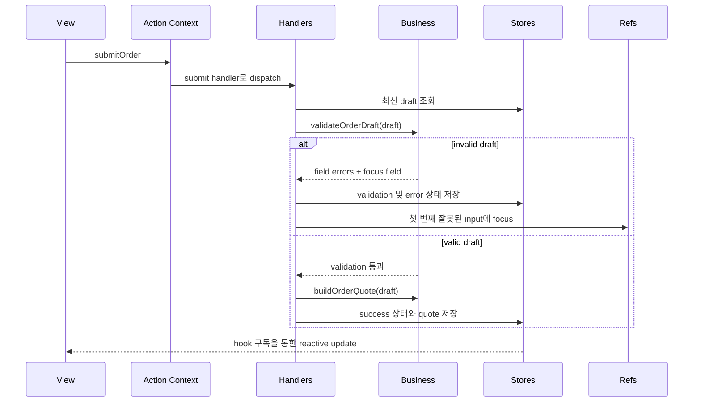

# Canonical Order Form 예제

이 예제는 저장소에서 권장하는 구현 중심 walkthrough입니다. 규모는 작지만, Context-Layered Architecture가 왜 안정성을 높이는지 보여주기에 충분하도록 구성되어 있습니다.

아키텍처를 이해하기 위해 예제를 하나만 읽는다면 이 예제를 먼저 보는 것을 권장합니다.

## 이 예제가 보여주는 것

- draft, validation, submission, activity 상태를 위한 `Store Context`
- 사용자 의도와 흐름 조율을 위한 `Action Context`
- 검증 실패 후 포커스 이동을 위한 `Ref Context`
- 결정론적 validation과 quote 계산을 위한 순수 `business` 함수
- 숨겨진 비즈니스 로직 없이 렌더링만 담당하는 reactive `hooks`와 `views`

## 라우트

live example은 example 앱에서 다음 경로로 확인할 수 있습니다.

```text
/patterns/implementation-playbook
```

## 파일 구조

```text
example/src/pages/patterns/implementation-playbook/
├── CanonicalOrderExample.tsx
├── CanonicalOrderExamplePage.tsx
├── contexts/
│   └── CanonicalOrderContexts.tsx
├── business/
│   └── orderBusiness.ts
├── handlers/
│   └── CanonicalOrderHandlers.tsx
├── actions/
│   └── useCanonicalOrderActions.ts
├── hooks/
│   └── useCanonicalOrderData.ts
└── views/
    └── CanonicalOrderView.tsx
```

## 런타임 흐름



## 스펙 문서 예시

이 예제를 실제 작업 단위로 쪼개고 싶다면, 아래처럼 간단한 스펙 문서 형식으로 먼저 고정한 뒤 구현에 들어가는 방식이 가장 안정적입니다.

```markdown
# 스펙: Canonical Order Form Example

## Overview
Context-Layered Architecture의 권장 개발 방식을 한 번에 보여주는 canonical example을 제공한다. 사용자는 하나의 예제로 Action, Store, Ref 경계와 테스트 사이클을 함께 이해할 수 있어야 한다.

## Goals
- Action, Store, Ref가 함께 동작하는 실제 예제를 제공한다.
- 파일 읽기 순서가 명확한 implementation-first example을 제공한다.
- validation 실패 시 focus 이동을 포함한 실제 동작을 검증한다.
- 예제 설명 문서와 실제 구현 파일, 테스트 파일을 연결한다.

## Quality Gates
- `pnpm test:canonical-example`
- `pnpm docs:build`
- `pnpm --dir example build:fast`

## User Stories

### US-001: 주문 초안 입력 흐름
**Description:** As a developer, I want a realistic order form draft flow so that I can understand how Store Context holds user-editable state.

**Acceptance Criteria:**
- [ ] 고객명, 이메일, 수량, 플랜, 온보딩 옵션, 메모를 draft store로 관리한다.
- [ ] view는 로컬 business state 없이 입력값을 action helper로 전달한다.
- [ ] hooks는 draft와 validation/submission 상태를 구독 가능한 형태로 노출한다.

### US-002: 잘못된 제출 차단과 focus 이동
**Description:** As a developer, I want invalid submission to stop at the handler layer so that I can see validation and RefContext responsibilities clearly.

**Acceptance Criteria:**
- [ ] 잘못된 이메일 또는 비어 있는 필수 필드 제출 시 validation error가 렌더링된다.
- [ ] 첫 번째 잘못된 필드로 focus가 이동한다.
- [ ] submission 상태는 성공으로 전이되지 않는다.

### US-003: 정상 제출 시 quote 계산
**Description:** As a developer, I want a valid submission to produce a quote so that I can trace business logic and side effects through the architecture.

**Acceptance Criteria:**
- [ ] valid draft 제출 시 business layer에서 quote가 계산된다.
- [ ] submission store에 success 상태와 quote 결과가 저장된다.
- [ ] activity timeline에 validation 및 submission 단계가 기록된다.

### US-004: 예제 리셋과 재검증
**Description:** As a developer, I want the example to reset to a known baseline so that repeated learning and automated verification remain reliable.

**Acceptance Criteria:**
- [ ] reset 시 draft, validation, submission 상태가 초기값으로 복원된다.
- [ ] reset 후 고객명 필드에 다시 focus를 줄 수 있다.
- [ ] integration test가 reset 이후 상태를 검증한다.

## Functional Requirements
- FR-1: 시스템은 Action, Store, Ref 경계를 모두 사용하는 예제를 제공해야 한다.
- FR-2: 시스템은 validation 규칙과 quote 계산을 순수 business 함수로 분리해야 한다.
- FR-3: 시스템은 handler 레이어에서 최신 draft를 읽고 상태 전이를 수행해야 한다.
- FR-4: 시스템은 example 페이지에서 소스 링크와 테스트 링크를 노출해야 한다.
- FR-5: 시스템은 문서에서 구현 파일 읽기 순서와 테스트 검증 루프를 설명해야 한다.

## Non-Goals
- 실제 백엔드 API 연동
- 복수 페이지에 걸친 주문 워크플로우
- 결제 처리와 영속 저장 구현

## Success Metrics
- 신규 기여자가 한 개의 예제로 아키텍처 전체 흐름을 설명할 수 있다.
- canonical example 테스트가 PR 검증용으로 독립 실행된다.
- 문서, 예제 앱, 테스트가 모두 같은 기능 설명을 가리킨다.
```

이 형식으로 먼저 스펙을 고정하면, 문서 설명과 실제 구현, 테스트 기준이 서로 어긋나지 않게 관리하기 쉬워집니다.

## 왜 canonical example인가

이 예제는 다음 다섯 가지 실무 질문에 빠르게 답하도록 설계되었습니다.

### 상태는 어디에 두는가

상태는 view 로컬 비즈니스 상태가 아니라 store에 둡니다.

- draft 값
- validation 결과
- submission 상태
- activity timeline

### 비즈니스 로직은 어디에 두는가

순수 의사결정 로직은 `business/orderBusiness.ts`에 둡니다.

- 필드 validation
- quote 계산
- 기본 상태 생성

### 사이드 이펙트는 어디에 두는가

조율과 imperative 작업은 handler에 둡니다.

- 최신 store 값 읽기
- submission 상태 전이
- 첫 번째 invalid field focus
- activity log 기록

### view는 무엇을 하는가

view는 상태를 렌더링하고 사용자 의도만 발생시킵니다.

- hook을 통해 값을 구독한다
- action dispatch helper를 호출한다
- 가격 계산이나 validation 규칙을 직접 품지 않는다

### 어떻게 테스트하는가

이 예제는 실제 컴포넌트를 import하는 integration test로 검증됩니다.

- 잘못된 입력에서 validation error가 렌더링되는가
- ref를 통해 invalid field로 focus가 이동하는가
- 정상 제출 시 quote와 success 상태가 생성되는가
- reset 시 기본 상태로 복원되는가

## 권장 읽기 순서

1. `contexts/CanonicalOrderContexts.tsx`
2. `business/orderBusiness.ts`
3. `handlers/CanonicalOrderHandlers.tsx`
4. `actions/useCanonicalOrderActions.ts`
5. `hooks/useCanonicalOrderData.ts`
6. `views/CanonicalOrderView.tsx`
7. `CanonicalOrderExample.tsx`

이 순서는 의도한 아키텍처 이해 순서와 같습니다. 먼저 경계를 보고, 다음에 구현을 보고, 마지막에 UI를 보는 방식입니다.
