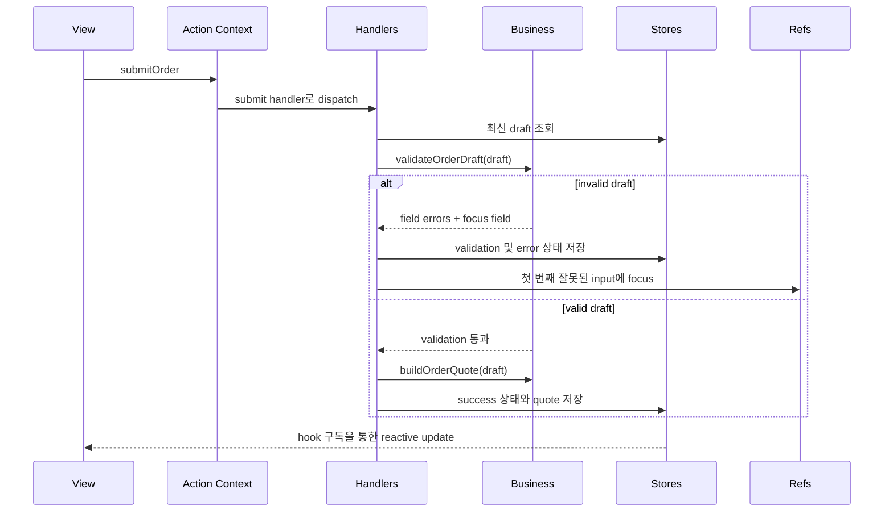

# Canonical Order Form 예제

이 예제는 저장소에서 권장하는 구현 중심 walkthrough입니다. 규모는 작지만, Context-Layered Architecture가 왜 안정성을 높이는지 보여주기에 충분하도록 구성되어 있습니다.

아키텍처를 이해하기 위해 예제를 하나만 읽는다면 이 예제를 먼저 보는 것을 권장합니다.

## 이 예제가 보여주는 것

- draft, validation, submission, activity 상태를 위한 `Store Context`
- 사용자 의도와 흐름 조율을 위한 `Action Context`
- 검증 실패 후 포커스 이동을 위한 `Ref Context`
- 결정론적 validation과 quote 계산을 위한 순수 `business` 함수
- 숨겨진 비즈니스 로직 없이 렌더링만 담당하는 reactive `hooks`와 `views`

## 라우트

live example은 example 앱에서 다음 경로로 확인할 수 있습니다.

```text
/patterns/implementation-playbook
```

## 파일 구조

```text
example/src/pages/patterns/implementation-playbook/
├── CanonicalOrderExample.tsx
├── CanonicalOrderExamplePage.tsx
├── contexts/
│   └── CanonicalOrderContexts.tsx
├── business/
│   └── orderBusiness.ts
├── handlers/
│   └── CanonicalOrderHandlers.tsx
├── actions/
│   └── useCanonicalOrderActions.ts
├── hooks/
│   └── useCanonicalOrderData.ts
└── views/
    └── CanonicalOrderView.tsx
```

## 런타임 흐름



## 왜 canonical example인가

이 예제는 다음 다섯 가지 실무 질문에 빠르게 답하도록 설계되었습니다.

### 상태는 어디에 두는가

상태는 view 로컬 비즈니스 상태가 아니라 store에 둡니다.

- draft 값
- validation 결과
- submission 상태
- activity timeline

### 비즈니스 로직은 어디에 두는가

순수 의사결정 로직은 `business/orderBusiness.ts`에 둡니다.

- 필드 validation
- quote 계산
- 기본 상태 생성

### 사이드 이펙트는 어디에 두는가

조율과 imperative 작업은 handler에 둡니다.

- 최신 store 값 읽기
- submission 상태 전이
- 첫 번째 invalid field focus
- activity log 기록

### view는 무엇을 하는가

view는 상태를 렌더링하고 사용자 의도만 발생시킵니다.

- hook을 통해 값을 구독한다
- action dispatch helper를 호출한다
- 가격 계산이나 validation 규칙을 직접 품지 않는다

### 어떻게 테스트하는가

이 예제는 실제 컴포넌트를 import하는 integration test로 검증됩니다.

- 잘못된 입력에서 validation error가 렌더링되는가
- ref를 통해 invalid field로 focus가 이동하는가
- 정상 제출 시 quote와 success 상태가 생성되는가
- reset 시 기본 상태로 복원되는가

## 권장 읽기 순서

1. `contexts/CanonicalOrderContexts.tsx`
2. `business/orderBusiness.ts`
3. `handlers/CanonicalOrderHandlers.tsx`
4. `actions/useCanonicalOrderActions.ts`
5. `hooks/useCanonicalOrderData.ts`
6. `views/CanonicalOrderView.tsx`
7. `CanonicalOrderExample.tsx`

이 순서는 의도한 아키텍처 이해 순서와 같습니다. 먼저 경계를 보고, 다음에 구현을 보고, 마지막에 UI를 보는 방식입니다.
