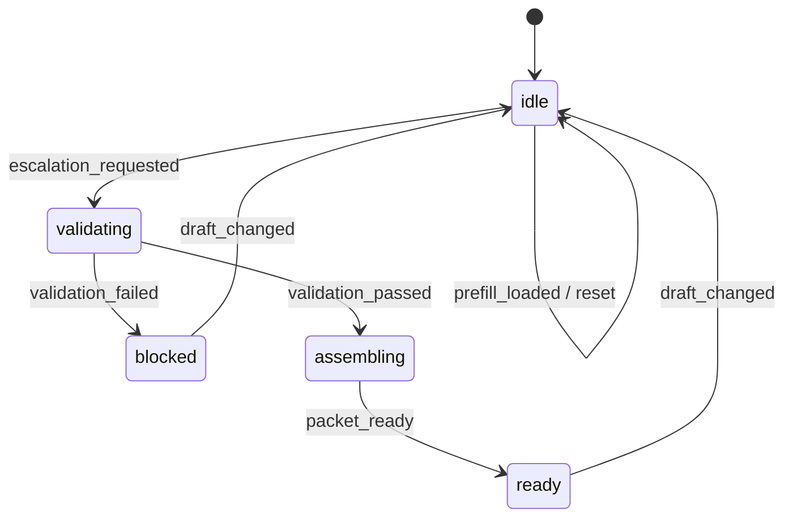

# Incident Escalation Playbook 예제

이 문서는 implementation-playbook skill을 `Incident Escalation` 도메인에 적용한 예제를 설명합니다. approval 계열인 access request 예제와 달리, 이 예제는 severity와 영향 범위에 따라 escalation packet을 조립하는 운영 workflow를 다룹니다.

## 무엇을 보여주는가

- `draft / validation / escalation / activity` store 분리
- severity 기반 규칙을 가진 명시적 상태 머신
- validation issue와 UI 문구의 분리
- domain event에서 파생되는 activity log
- success 이후 severity 변경 시 이전 escalation 결과 무효화

## 라우트

```text
/patterns/implementation-playbook/incident-escalation
```

## 핵심 파일

```text
example/src/pages/patterns/implementation-playbook/incident-escalation/
├── IncidentEscalationExample.tsx
├── IncidentEscalationExamplePage.tsx
├── contexts/
│   └── IncidentEscalationContexts.tsx
├── business/
│   ├── incidentDraft.ts
│   ├── incidentValidation.ts
│   ├── incidentEscalationPacket.ts
│   ├── incidentActivity.ts
│   ├── incidentStateMachine.ts
│   └── incidentBusiness.ts
├── handlers/
│   ├── IncidentEscalationHandlers.tsx
│   ├── incidentHandlerSupport.ts
│   ├── useIncidentDraftHandlers.tsx
│   └── useIncidentSubmissionHandlers.tsx
├── actions/
│   └── useIncidentEscalationActions.ts
├── hooks/
│   └── useIncidentEscalationData.ts
└── views/
    └── IncidentEscalationView.tsx
```

## 상태 머신



## 왜 이 예제가 필요한가

이 예제는 implementation-playbook이 운영/incident 도메인에도 그대로 적용된다는 점을 보여줍니다.

- quote 대신 escalation packet 생성
- severity, affected users, channel 규칙 기반 판단
- 운영 대응용 checklist와 escalation target 계산

즉 skill이 단순 form 처리 예제에만 묶이지 않는다는 걸 증명합니다.

## 검증 포인트

- sev1인데 statuspage가 아니면 submit이 막히는가
- valid incident면 escalation packet이 조립되는가
- success 이후 severity 변경 시 idle 상태로 돌아가는가
- reset 시 baseline 상태로 복원되는가

## 같이 보면 좋은 문서

- [Implementation Playbook 표준 컨벤션](/ko/context-layered/implementation-convention)
- [명시적 상태 머신](/ko/context-layered/patterns/explicit-state-machine)
- [Playbook 시나리오 라이브러리](/ko/examples/implementation-playbook-scenarios)
