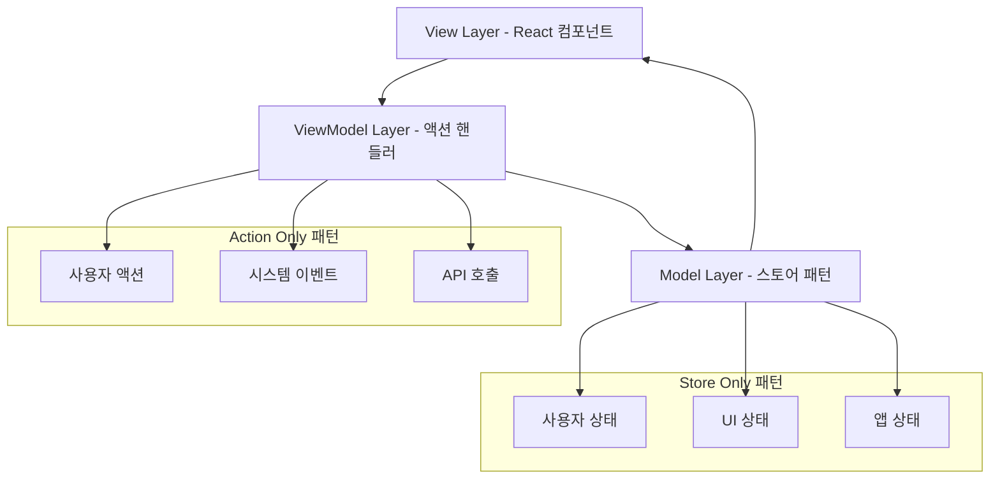

# 패턴 조합 예제

복잡한 애플리케이션을 위해 **Action Only**와 **Store Only** 패턴을 결합하는 방법을 보여줍니다. MVVM 아키텍처에 따라 완전한 관심사 분리를 구현합니다.

## 아키텍처 개요



## 완전한 애플리케이션 예제

### 1. 액션 타입 정의

```typescript
// types/AppActions.ts
import type { ActionPayloadMap } from '@context-action/core';

export interface UserActions extends ActionPayloadMap {
  // 인증 액션
  login: { username: string; password: string };
  logout: void;
  register: { username: string; email: string; password: string };
  
  // 프로필 액션
  updateProfile: { name: string; email: string; bio?: string };
  uploadAvatar: { file: File };
  deleteAccount: void;
  
  // 데이터 액션
  loadUserData: { userId: string };
  saveUserData: void;
  refreshData: void;
  
  // UI 액션
  showModal: { type: string; data?: any };
  hideModal: void;
  showNotification: { message: string; type: 'success' | 'error' | 'warning' | 'info' };
  clearNotification: void;
  
  // 시스템 액션
  trackEvent: { event: string; category: string; data?: any };
  reportError: { error: string; context: any };
  systemHealthCheck: void;
}

export interface SystemActions extends ActionPayloadMap {
  // 앱 라이프사이클
  appStartup: void;
  appShutdown: void;
  
  // 성능 모니터링
  measurePerformance: { metric: string; value: number; context?: any };
  
  // 에러 처리
  handleGlobalError: { error: Error; context: any };
  
  // 백그라운드 작업
  syncWithServer: void;
  cleanupOldData: void;
}
```

### 2. 스토어 설정

```typescript
// stores/AppStoreConfig.ts
export const appStoreConfig = {
  // 사용자 도메인 상태
  user: {
    id: '',
    username: '',
    email: '',
    name: '',
    bio: '',
    avatar: '',
    isAuthenticated: false,
    roles: [] as string[],
    lastLogin: null as Date | null,
    createdAt: null as Date | null
  },
  
  // UI 도메인 상태
  ui: {
    initialValue: {
      loading: {
        global: false,
        auth: false,
        profile: false,
        data: false
      },
      modals: {
        active: null as string | null,
        data: null as any,
        stack: [] as Array<{ type: string; data: any }>
      },
      notifications: [] as Array<{
        id: string;
        message: string;
        type: 'success' | 'error' | 'warning' | 'info';
        timestamp: number;
        dismissed: boolean;
      }>,
      sidebar: {
        collapsed: false,
        activeSection: 'dashboard'
      }
    },
    derived: {
      hasActiveModals: (ui) => ui.modals.active !== null,
      modalStackSize: (ui) => ui.modals.stack.length,
      unreadNotifications: (ui) => ui.notifications.filter(n => !n.dismissed).length,
      isLoading: (ui) => Object.values(ui.loading).some(Boolean)
    }
  },
  
  // 애플리케이션 도메인 상태
  app: {
    initialValue: {
      settings: {
        theme: 'light' as 'light' | 'dark',
        language: 'ko' as 'ko' | 'en' | 'es' | 'fr' | 'de',
        autoSave: true,
        syncInterval: 30000
      },
      features: {
        analytics: true,
        notifications: true,
        darkMode: true,
        experimentalFeatures: false
      },
      system: {
        version: '1.0.0',
        buildDate: new Date().toISOString(),
        environment: process.env.NODE_ENV || 'development'
      }
    },
    validator: (value) => {
      return typeof value === 'object' &&
             value !== null &&
             'settings' in value &&
             'features' in value &&
             'system' in value;
    }
  },
  
  // 데이터 캐시 도메인
  cache: {
    initialValue: {
      userData: {} as Record<string, any>,
      apiResponses: {} as Record<string, { data: any; timestamp: number }>,
      analytics: {
        events: [] as Array<{ type: string; data: any; timestamp: number }>,
        sessions: [] as Array<{ id: string; startTime: number; endTime?: number }>
      }
    },
    derived: {
      cacheSize: (cache) => Object.keys(cache.userData).length + Object.keys(cache.apiResponses).length,
      recentEvents: (cache) => cache.analytics.events.filter(e => 
        Date.now() - e.timestamp < 300000 // 최근 5분
      ),
      activeSessions: (cache) => cache.analytics.sessions.filter(s => !s.endTime)
    }
  }
} as const;
```

### 3. 컨텍스트 생성

```typescript
// contexts/AppContexts.tsx
import { createActionContext } from '@context-action/react';
import { createDeclarativeStorePattern } from '@context-action/react';
import type { UserActions, SystemActions } from '../types/AppActions';
import { appStoreConfig } from '../stores/AppStoreConfig';

// 액션 컨텍스트
export const {
  Provider: UserActionProvider,
  useActionDispatch: useUserAction,
  useActionHandler: useUserActionHandler
} = createActionContext<UserActions>('UserActions');

export const {
  Provider: SystemActionProvider,
  useActionDispatch: useSystemAction,
  useActionHandler: useSystemActionHandler
} = createActionContext<SystemActions>('SystemActions');

// 스토어 패턴
export const {
  Provider: AppStoreProvider,
  useStore: useAppStore,
  useStoreManager: useAppStoreManager,
  withProvider: withAppStoreProvider
} = createDeclarativeStorePattern('App', appStoreConfig);

export type AppStores = typeof appStoreConfig;
```

### 4. 액션 핸들러 컴포넌트

```typescript
// components/handlers/UserActionHandlers.tsx
import React, { useCallback } from 'react';
import { useUserAction, useUserActionHandler } from '../../contexts/AppContexts';
import { useAppStore } from '../../contexts/AppContexts';

export function UserActionHandlers() {
  const userDispatch = useUserAction();
  const userStore = useAppStore('user');
  const uiStore = useAppStore('ui');
  const cacheStore = useAppStore('cache');
  
  // 로그인 핸들러
  useUserActionHandler('login', useCallback(async (payload, controller) => {
    try {
      // 로딩 상태 설정
      uiStore.update(current => ({
        ...current,
        loading: { ...current.loading, auth: true }
      }));
      
      // 기존 에러 지우기
      uiStore.update(current => ({
        ...current,
        notifications: current.notifications.filter(n => n.type !== 'error')
      }));
      
      // 자격 증명 검증
      if (!payload.username || !payload.password) {
        controller.abort('사용자명과 비밀번호가 필요합니다');
        return;
      }
      
      // API 호출 시뮬레이션
      const response = await fetch('/api/auth/login', {
        method: 'POST',
        headers: { 'Content-Type': 'application/json' },
        body: JSON.stringify(payload)
      });
      
      if (!response.ok) {
        throw new Error('인증에 실패했습니다');
      }
      
      const userData = await response.json();
      
      // 사용자 스토어 업데이트
      userStore.setValue({
        id: userData.id,
        username: userData.username,
        email: userData.email,
        name: userData.name,
        bio: userData.bio || '',
        avatar: userData.avatar || '',
        isAuthenticated: true,
        roles: userData.roles || [],
        lastLogin: new Date(),
        createdAt: new Date(userData.createdAt)
      });
      
      // 사용자 데이터 캐시
      cacheStore.update(current => ({
        ...current,
        userData: {
          ...current.userData,
          [userData.id]: userData
        }
      }));
      
      // 성공 알림 표시
      userDispatch('showNotification', {
        message: `다시 오신 것을 환영합니다, ${userData.name}님!`,
        type: 'success'
      });
      
      // 로그인 이벤트 추적
      userDispatch('trackEvent', {
        event: 'user_login',
        category: 'authentication',
        data: { userId: userData.id, timestamp: Date.now() }
      });
      
      controller.setResult({ step: 'login', success: true, user: userData });
      return { success: true, user: userData };
      
    } catch (error) {
      // 에러 알림 표시
      userDispatch('showNotification', {
        message: '로그인에 실패했습니다. 자격 증명을 확인해주세요.',
        type: 'error'
      });
      
      // 에러 보고
      userDispatch('reportError', {
        error: (error as Error).message,
        context: { action: 'login', username: payload.username }
      });
      
      controller.abort(`로그인 실패: ${(error as Error).message}`);
      
    } finally {
      // 로딩 상태 지우기
      uiStore.update(current => ({
        ...current,
        loading: { ...current.loading, auth: false }
      }));
    }
  }, [userDispatch, userStore, uiStore, cacheStore]), { priority: 100, id: 'login-handler' });
  
  // 프로필 업데이트 핸들러
  useUserActionHandler('updateProfile', useCallback(async (payload, controller) => {
    try {
      uiStore.update(current => ({
        ...current,
        loading: { ...current.loading, profile: true }
      }));
      
      // 프로필 데이터 검증
      const validation = validateProfileData(payload);
      if (!validation.isValid) {
        controller.abort(`검증 실패: ${validation.errors.join(', ')}`);
        return;
      }
      
      // 현재 사용자 가져오기
      const currentUser = userStore.getValue();
      if (!currentUser.isAuthenticated) {
        controller.abort('사용자가 인증되지 않았습니다');
        return;
      }
      
      // API 호출 시뮬레이션
      const response = await fetch(`/api/users/${currentUser.id}`, {
        method: 'PUT',
        headers: { 'Content-Type': 'application/json' },
        body: JSON.stringify(payload)
      });
      
      if (!response.ok) {
        throw new Error('프로필 업데이트에 실패했습니다');
      }
      
      const updatedUser = await response.json();
      
      // 사용자 스토어 업데이트
      userStore.update(current => ({
        ...current,
        name: updatedUser.name,
        email: updatedUser.email,
        bio: updatedUser.bio
      }));
      
      // 캐시 업데이트
      cacheStore.update(current => ({
        ...current,
        userData: {
          ...current.userData,
          [currentUser.id]: updatedUser
        }
      }));
      
      // 성공 알림 표시
      userDispatch('showNotification', {
        message: '프로필이 성공적으로 업데이트되었습니다!',
        type: 'success'
      });
      
      // 업데이트 이벤트 추적
      userDispatch('trackEvent', {
        event: 'profile_update',
        category: 'user-management',
        data: { userId: currentUser.id, fields: Object.keys(payload) }
      });
      
      return { success: true, user: updatedUser };
      
    } catch (error) {
      userDispatch('showNotification', {
        message: '프로필 업데이트에 실패했습니다. 다시 시도해주세요.',
        type: 'error'
      });
      
      controller.abort(`프로필 업데이트 실패: ${(error as Error).message}`);
      
    } finally {
      uiStore.update(current => ({
        ...current,
        loading: { ...current.loading, profile: false }
      }));
    }
  }, [userDispatch, userStore, uiStore, cacheStore]), { priority: 100, id: 'profile-updater' });
  
  // 알림 핸들러
  useUserActionHandler('showNotification', useCallback((payload) => {
    const notificationId = `notification-${Date.now()}-${Math.random()}`;
    
    uiStore.update(current => ({
      ...current,
      notifications: [
        ...current.notifications,
        {
          id: notificationId,
          message: payload.message,
          type: payload.type,
          timestamp: Date.now(),
          dismissed: false
        }
      ]
    }));
    
    // 5초 후 자동 해제
    setTimeout(() => {
      uiStore.update(current => ({
        ...current,
        notifications: current.notifications.map(n =>
          n.id === notificationId ? { ...n, dismissed: true } : n
        )
      }));
    }, 5000);
    
  }, [uiStore]), { priority: 90, id: 'notification-handler' });
  
  return null;
}

function validateProfileData(data: any): { isValid: boolean; errors: string[] } {
  const errors: string[] = [];
  
  if (!data.name?.trim()) errors.push('이름은 필수입니다');
  if (data.name?.length > 100) errors.push('이름이 너무 깁니다');
  
  if (!data.email?.trim()) {
    errors.push('이메일은 필수입니다');
  } else if (!/^[^\s@]+@[^\s@]+\.[^\s@]+$/.test(data.email)) {
    errors.push('올바르지 않은 이메일 형식입니다');
  }
  
  if (data.bio && data.bio.length > 500) {
    errors.push('소개가 너무 깁니다 (최대 500자)');
  }
  
  return { isValid: errors.length === 0, errors };
}
```

### 5. 시스템 액션 핸들러

```typescript
// components/handlers/SystemActionHandlers.tsx
import React, { useCallback, useEffect } from 'react';
import { useSystemAction, useSystemActionHandler } from '../../contexts/AppContexts';
import { useAppStore } from '../../contexts/AppContexts';

export function SystemActionHandlers() {
  const systemDispatch = useSystemAction();
  const cacheStore = useAppStore('cache');
  const appStore = useAppStore('app');
  
  // 앱 시작 핸들러
  useSystemActionHandler('appStartup', useCallback(async (payload, controller) => {
    try {
      // 애플리케이션 초기화
      console.log('애플리케이션을 시작하고 있습니다...');
      
      // 캐시된 데이터 로드
      const cachedData = localStorage.getItem('app-cache');
      if (cachedData) {
        const cache = JSON.parse(cachedData);
        cacheStore.setValue(cache);
      }
      
      // 앱 설정 로드
      const settings = localStorage.getItem('app-settings');
      if (settings) {
        const parsedSettings = JSON.parse(settings);
        appStore.update(current => ({
          ...current,
          settings: { ...current.settings, ...parsedSettings }
        }));
      }
      
      // 헬스 체크 시작
      systemDispatch('systemHealthCheck');
      
      controller.setResult({ step: 'startup', success: true });
      return { startup: true, timestamp: Date.now() };
      
    } catch (error) {
      console.error('시작 실패:', error);
      systemDispatch('handleGlobalError', {
        error: error as Error,
        context: { action: 'appStartup' }
      });
      
      controller.abort(`시작 실패: ${(error as Error).message}`);
    }
  }, [systemDispatch, cacheStore, appStore]), { priority: 100, id: 'startup-handler' });
  
  // 서버 동기화 핸들러
  useSystemActionHandler('syncWithServer', useCallback(async () => {
    try {
      const currentCache = cacheStore.getValue();
      
      // 현재 상태를 서버로 전송
      const response = await fetch('/api/sync', {
        method: 'POST',
        headers: { 'Content-Type': 'application/json' },
        body: JSON.stringify({
          userData: currentCache.userData,
          timestamp: Date.now()
        })
      });
      
      if (response.ok) {
        const serverData = await response.json();
        
        // 서버 데이터로 캐시 업데이트
        cacheStore.update(current => ({
          ...current,
          userData: { ...current.userData, ...serverData.userData },
          apiResponses: {
            ...current.apiResponses,
            sync: { data: serverData, timestamp: Date.now() }
          }
        }));
        
        return { synced: true, timestamp: Date.now() };
      }
      
    } catch (error) {
      console.error('동기화 실패:', error);
      return { synced: false, error: (error as Error).message };
    }
  }, [cacheStore]), { priority: 80, id: 'sync-handler' });
  
  // 성능 모니터링
  useSystemActionHandler('measurePerformance', useCallback((payload) => {
    cacheStore.update(current => ({
      ...current,
      analytics: {
        ...current.analytics,
        events: [
          ...current.analytics.events,
          {
            type: 'performance',
            data: {
              metric: payload.metric,
              value: payload.value,
              context: payload.context
            },
            timestamp: Date.now()
          }
        ]
      }
    }));
    
    // 성능 메트릭 로그
    console.log(`성능 메트릭: ${payload.metric} = ${payload.value}`);
    
    return { recorded: true, metric: payload.metric, value: payload.value };
  }, [cacheStore]), { priority: 70, id: 'performance-monitor' });
  
  // 서버와 자동 동기화
  useEffect(() => {
    const app = appStore.getValue();
    const syncInterval = setInterval(() => {
      systemDispatch('syncWithServer');
    }, app.settings.syncInterval);
    
    return () => clearInterval(syncInterval);
  }, [systemDispatch, appStore]);
  
  // 마운트 시 앱 초기화
  useEffect(() => {
    systemDispatch('appStartup');
    
    return () => {
      systemDispatch('appShutdown');
    };
  }, [systemDispatch]);
  
  return null;
}
```

### 6. 메인 애플리케이션 컴포넌트

```typescript
// components/App.tsx
import React from 'react';
import { 
  UserActionProvider, 
  SystemActionProvider, 
  withAppStoreProvider 
} from '../contexts/AppContexts';
import { UserActionHandlers } from './handlers/UserActionHandlers';
import { SystemActionHandlers } from './handlers/SystemActionHandlers';
import { UserDashboard } from './UserDashboard';
import { AppNavigation } from './AppNavigation';
import { NotificationSystem } from './NotificationSystem';
import { ModalSystem } from './ModalSystem';
import { PerformanceMonitor } from './PerformanceMonitor';

// HOC 패턴을 사용하여 모든 프로바이더 조합
const App = withAppStoreProvider(() => {
  return (
    <UserActionProvider>
      <SystemActionProvider>
        {/* 핸들러 등록 컴포넌트 */}
        <UserActionHandlers />
        <SystemActionHandlers />
        <PerformanceMonitor />
        
        {/* UI 컴포넌트 */}
        <div className="app">
          <AppNavigation />
          <main className="app-main">
            <UserDashboard />
          </main>
          
          {/* 시스템 컴포넌트 */}
          <NotificationSystem />
          <ModalSystem />
        </div>
      </SystemActionProvider>
    </UserActionProvider>
  );
});

export default App;
```

### 7. 대시보드 컴포넌트

```typescript
// components/UserDashboard.tsx
import React from 'react';
import { useStoreValue } from '@context-action/react';
import { useUserAction } from '../contexts/AppContexts';
import { useAppStore } from '../contexts/AppContexts';

export function UserDashboard() {
  const userDispatch = useUserAction();
  const userStore = useAppStore('user');
  const uiStore = useAppStore('ui');
  const cacheStore = useAppStore('cache');
  
  const user = useStoreValue(userStore);
  const ui = useStoreValue(uiStore);
  const cache = useStoreValue(cacheStore);
  
  const handleLogin = () => {
    userDispatch('login', {
      username: 'demo@example.com',
      password: 'password123'
    });
  };
  
  const handleLogout = () => {
    userDispatch('logout');
  };
  
  const handleProfileUpdate = () => {
    userDispatch('updateProfile', {
      name: '업데이트된 이름',
      email: user.email,
      bio: '새로운 정보로 업데이트된 소개'
    });
  };
  
  const showProfileModal = () => {
    userDispatch('showModal', {
      type: 'profile-edit',
      data: { user }
    });
  };
  
  const refreshData = () => {
    userDispatch('refreshData');
  };
  
  if (!user.isAuthenticated) {
    return (
      <div className="login-section">
        <h2>로그인 해주세요</h2>
        <button 
          onClick={handleLogin}
          disabled={ui.loading.auth}
          className="login-button"
        >
          {ui.loading.auth ? '로그인 중...' : '데모 사용자로 로그인'}
        </button>
      </div>
    );
  }
  
  return (
    <div className="user-dashboard">
      <div className="dashboard-header">
        <div className="user-info">
          <h1>환영합니다, {user.name}님</h1>
          <p>{user.email}</p>
          {user.lastLogin && (
            <p className="last-login">
              마지막 로그인: {user.lastLogin.toLocaleString()}
            </p>
          )}
        </div>
        <div className="header-actions">
          <button onClick={showProfileModal}>프로필 편집</button>
          <button onClick={handleLogout}>로그아웃</button>
        </div>
      </div>
      
      {/* 로딩 표시기 */}
      {ui.isLoading && (
        <div className="loading-banner">
          로딩 중... 
          {ui.loading.profile && ' 프로필'}
          {ui.loading.data && ' 데이터'}
        </div>
      )}
      
      {/* 대시보드 콘텐츠 */}
      <div className="dashboard-grid">
        {/* 사용자 통계 */}
        <div className="dashboard-card">
          <h3>사용자 통계</h3>
          <div className="stats">
            <div className="stat">
              <label>계정 생성일:</label>
              <span>
                {user.createdAt 
                  ? Math.floor((Date.now() - user.createdAt.getTime()) / (1000 * 60 * 60 * 24)) + '일 전'
                  : '알 수 없음'
                }
              </span>
            </div>
            <div className="stat">
              <label>역할:</label>
              <span>{user.roles.join(', ') || '역할 없음'}</span>
            </div>
          </div>
        </div>
        
        {/* 애널리틱스 데이터 */}
        <div className="dashboard-card">
          <h3>애널리틱스</h3>
          <div className="analytics-stats">
            <div className="stat">
              <label>최근 이벤트:</label>
              <span>{cache.recentEvents.length}</span>
            </div>
            <div className="stat">
              <label>활성 세션:</label>
              <span>{cache.activeSessions.length}</span>
            </div>
            <div className="stat">
              <label>캐시 크기:</label>
              <span>{cache.cacheSize} 항목</span>
            </div>
          </div>
        </div>
        
        {/* 빠른 액션 */}
        <div className="dashboard-card">
          <h3>빠른 액션</h3>
          <div className="quick-actions">
            <button onClick={handleProfileUpdate}>프로필 업데이트</button>
            <button onClick={refreshData}>데이터 새로고침</button>
            <button onClick={() => userDispatch('saveUserData')}>데이터 저장</button>
          </div>
        </div>
        
        {/* 최근 활동 */}
        <div className="dashboard-card recent-activity">
          <h3>최근 활동</h3>
          <div className="activity-list">
            {cache.recentEvents.slice(-5).reverse().map((event, index) => (
              <div key={index} className="activity-item">
                <div className="activity-type">{event.type}</div>
                <div className="activity-time">
                  {new Date(event.timestamp).toLocaleTimeString()}
                </div>
              </div>
            ))}
          </div>
        </div>
      </div>
    </div>
  );
}
```

### 8. 모달 시스템

```typescript
// components/ModalSystem.tsx
import React from 'react';
import { useStoreValue } from '@context-action/react';
import { useUserAction } from '../contexts/AppContexts';
import { useAppStore } from '../contexts/AppContexts';

export function ModalSystem() {
  const userDispatch = useUserAction();
  const uiStore = useAppStore('ui');
  const ui = useStoreValue(uiStore);
  
  const closeModal = () => {
    userDispatch('hideModal');
  };
  
  const closeOnBackdrop = (e: React.MouseEvent) => {
    if (e.target === e.currentTarget) {
      closeModal();
    }
  };
  
  if (!ui.hasActiveModals) {
    return null;
  }
  
  const renderModalContent = () => {
    switch (ui.modals.active) {
      case 'profile-edit':
        return <ProfileEditModal data={ui.modals.data} onClose={closeModal} />;
      case 'confirm-delete':
        return <ConfirmDeleteModal data={ui.modals.data} onClose={closeModal} />;
      case 'settings':
        return <SettingsModal onClose={closeModal} />;
      default:
        return <div>알 수 없는 모달 타입: {ui.modals.active}</div>;
    }
  };
  
  return (
    <div className="modal-overlay" onClick={closeOnBackdrop}>
      <div className="modal-content">
        <div className="modal-header">
          <button onClick={closeModal} className="modal-close">×</button>
        </div>
        <div className="modal-body">
          {renderModalContent()}
        </div>
      </div>
    </div>
  );
}

function ProfileEditModal({ data, onClose }: { data: any; onClose: () => void }) {
  const userDispatch = useUserAction();
  const userStore = useAppStore('user');
  const user = useStoreValue(userStore);
  
  const handleSave = () => {
    userDispatch('updateProfile', {
      name: '모달에서 업데이트됨',
      email: user.email,
      bio: '모달에서 업데이트된 소개'
    });
    onClose();
  };
  
  return (
    <div className="profile-edit-modal">
      <h2>프로필 편집</h2>
      <p>현재 사용자: {user.name}</p>
      <div className="modal-actions">
        <button onClick={handleSave}>변경사항 저장</button>
        <button onClick={onClose}>취소</button>
      </div>
    </div>
  );
}

function ConfirmDeleteModal({ data, onClose }: { data: any; onClose: () => void }) {
  const userDispatch = useUserAction();
  
  const handleConfirm = () => {
    userDispatch('deleteAccount');
    onClose();
  };
  
  return (
    <div className="confirm-delete-modal">
      <h2>계정 삭제 확인</h2>
      <p>정말로 계정을 삭제하시겠습니까? 이 작업은 되돌릴 수 없습니다.</p>
      <div className="modal-actions">
        <button onClick={handleConfirm} className="danger-button">
          계정 삭제
        </button>
        <button onClick={onClose}>취소</button>
      </div>
    </div>
  );
}

function SettingsModal({ onClose }: { onClose: () => void }) {
  const appStore = useAppStore('app');
  const app = useStoreValue(appStore);
  
  const updateTheme = (theme: 'light' | 'dark') => {
    appStore.update(current => ({
      ...current,
      settings: { ...current.settings, theme }
    }));
  };
  
  const toggleFeature = (feature: keyof typeof app.features) => {
    appStore.update(current => ({
      ...current,
      features: {
        ...current.features,
        [feature]: !current.features[feature]
      }
    }));
  };
  
  return (
    <div className="settings-modal">
      <h2>애플리케이션 설정</h2>
      
      <div className="settings-section">
        <h3>테마</h3>
        <div className="theme-options">
          <label>
            <input
              type="radio"
              checked={app.settings.theme === 'light'}
              onChange={() => updateTheme('light')}
            />
            라이트 테마
          </label>
          <label>
            <input
              type="radio"
              checked={app.settings.theme === 'dark'}
              onChange={() => updateTheme('dark')}
            />
            다크 테마
          </label>
        </div>
      </div>
      
      <div className="settings-section">
        <h3>기능</h3>
        <div className="feature-toggles">
          {Object.entries(app.features).map(([feature, enabled]) => (
            <label key={feature}>
              <input
                type="checkbox"
                checked={enabled}
                onChange={() => toggleFeature(feature as keyof typeof app.features)}
              />
              {feature.charAt(0).toUpperCase() + feature.slice(1)}
            </label>
          ))}
        </div>
      </div>
      
      <div className="modal-actions">
        <button onClick={onClose}>닫기</button>
      </div>
    </div>
  );
}
```

### 9. 성능 모니터

```typescript
// components/PerformanceMonitor.tsx
import React, { useEffect } from 'react';
import { useSystemAction } from '../contexts/AppContexts';

export function PerformanceMonitor() {
  const systemDispatch = useSystemAction();
  
  useEffect(() => {
    // React 렌더링 성능 모니터링
    if (React.Profiler) {
      const onRenderCallback = (
        id: string,
        phase: 'mount' | 'update',
        actualDuration: number,
        baseDuration: number,
        startTime: number,
        commitTime: number
      ) => {
        systemDispatch('measurePerformance', {
          metric: 'react-render-time',
          value: actualDuration,
          context: { id, phase, baseDuration, startTime, commitTime }
        });
      };
      
      // 실제 구현에서는 전체 앱을 감쌀 것입니다
    }
    
    // 페이지 성능 모니터링
    const observer = new PerformanceObserver((list) => {
      for (const entry of list.getEntries()) {
        systemDispatch('measurePerformance', {
          metric: entry.name,
          value: entry.duration,
          context: { entryType: entry.entryType }
        });
      }
    });
    
    observer.observe({ entryTypes: ['measure', 'navigation'] });
    
    // 메모리 사용량 모니터링
    const memoryInterval = setInterval(() => {
      if ((performance as any).memory) {
        const memory = (performance as any).memory;
        systemDispatch('measurePerformance', {
          metric: 'memory-usage',
          value: memory.usedJSHeapSize,
          context: {
            total: memory.totalJSHeapSize,
            limit: memory.jsHeapSizeLimit
          }
        });
      }
    }, 10000); // 10초마다
    
    return () => {
      observer.disconnect();
      clearInterval(memoryInterval);
    };
  }, [systemDispatch]);
  
  return null;
}
```

### 10. 네비게이션 컴포넌트

```typescript
// components/AppNavigation.tsx
import React from 'react';
import { useStoreValue } from '@context-action/react';
import { useUserAction } from '../contexts/AppContexts';
import { useAppStore } from '../contexts/AppContexts';

export function AppNavigation() {
  const userDispatch = useUserAction();
  const userStore = useAppStore('user');
  const uiStore = useAppStore('ui');
  const appStore = useAppStore('app');
  
  const user = useStoreValue(userStore);
  const ui = useStoreValue(uiStore);
  const app = useStoreValue(appStore);
  
  const toggleSidebar = () => {
    uiStore.update(current => ({
      ...current,
      sidebar: {
        ...current.sidebar,
        collapsed: !current.sidebar.collapsed
      }
    }));
  };
  
  const changeSection = (section: string) => {
    uiStore.update(current => ({
      ...current,
      sidebar: {
        ...current.sidebar,
        activeSection: section
      }
    }));
  };
  
  const openSettings = () => {
    userDispatch('showModal', { type: 'settings' });
  };
  
  return (
    <nav className={`app-navigation ${ui.sidebar.collapsed ? 'collapsed' : ''} theme-${app.settings.theme}`}>
      <div className="nav-header">
        <button onClick={toggleSidebar} className="toggle-button">
          {ui.sidebar.collapsed ? '→' : '←'}
        </button>
        {!ui.sidebar.collapsed && <h2>네비게이션</h2>}
      </div>
      
      {!ui.sidebar.collapsed && (
        <>
          <div className="nav-user">
            {user.isAuthenticated ? (
              <div className="user-summary">
                <div className="user-avatar">
                  {user.avatar ? (
                    
                  ) : (
                    <div className="avatar-placeholder">
                      {user.name.charAt(0).toUpperCase()}
                    </div>
                  )}
                </div>
                <div className="user-details">
                  <div className="user-name">{user.name}</div>
                  <div className="user-email">{user.email}</div>
                </div>
              </div>
            ) : (
              <div className="not-authenticated">로그인되지 않음</div>
            )}
          </div>
          
          <div className="nav-menu">
            <div className="nav-sections">
              {['dashboard', 'profile', 'analytics', 'settings'].map(section => (
                <button
                  key={section}
                  onClick={() => changeSection(section)}
                  className={`nav-section ${ui.sidebar.activeSection === section ? 'active' : ''}`}
                >
                  {section.charAt(0).toUpperCase() + section.slice(1)}
                </button>
              ))}
            </div>
          </div>
          
          <div className="nav-footer">
            <button onClick={openSettings} className="settings-button">
              앱 설정
            </button>
            {ui.unreadNotifications > 0 && (
              <div className="notification-badge">
                {ui.unreadNotifications} 읽지 않음
              </div>
            )}
          </div>
        </>
      )}
    </nav>
  );
}
```

## 주요 아키텍처 이점

### 완벽한 관심사 분리

1. **View Layer**: 컴포넌트는 순수하게 UI 렌더링과 사용자 상호작용에 집중
2. **ViewModel Layer**: 액션 핸들러는 모든 비즈니스 로직과 조정을 담당
3. **Model Layer**: 스토어는 반응형 업데이트와 계산된 상태로 데이터 관리

### 패턴 조합의 이점

- **Action 패턴**: 복잡한 비즈니스 로직, API 호출, 횡단 관심사 처리
- **Store 패턴**: 타입 안전성과 계산된 값으로 반응형 상태 관리  
- **깔끔한 통합**: 두 패턴이 충돌이나 결합 없이 함께 작동

### 전체적인 타입 안전성

```typescript
// 전체 애플리케이션에 걸친 컴파일 타임 타입 체크
userDispatch('login', { username: 'test', password: '123' }); // ✅ 유효
userDispatch('login', { user: 'test' }); // ❌ TypeScript 에러

const profileStore = useAppStore('profile'); // ✅ 타입 추론됨
const invalidStore = useAppStore('invalid'); // ❌ TypeScript 에러
```

## 실증된 베스트 프랙티스

1. **핸들러 조직화**: 다른 도메인에 대한 분리된 핸들러 컴포넌트
2. **에러 경계**: 사용자 피드백을 포함한 포괄적인 에러 처리
3. **성능 모니터링**: 내장된 성능 추적 및 최적화
4. **상태 지속성**: 애플리케이션 상태의 자동 저장 및 로딩
5. **모달 관리**: 타입 안전한 데이터 전달을 가진 중앙화된 모달 시스템
6. **로딩 상태**: 다른 작업에 대한 세분화된 로딩 표시기

## 관련 자료

- **[Action Only 패턴](./action-only.md)** - 순수 액션 디스패치 예제
- **[Store Only 패턴](./store-only.md)** - 순수 상태 관리 예제
- **[기본 설정](./basic-setup.md)** - 두 패턴을 모두 사용한 기본 설정
- **[아키텍처 가이드](../concept/architecture-guide.md)** - MVVM 아키텍처 원칙