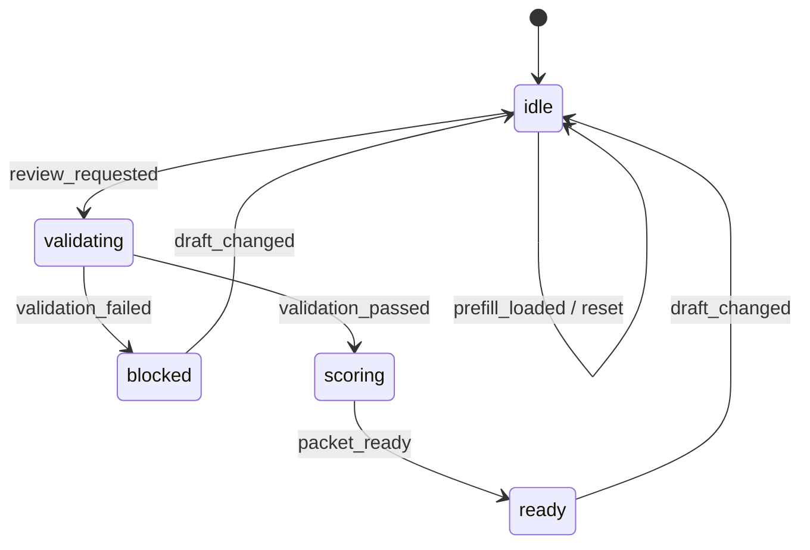

# Renewal Risk Review Playbook 예제

이 문서는 implementation-playbook skill을 `Renewal Risk Review` 도메인에 적용한 예제를 설명합니다. 이 예제는 usage score, renewal window, sponsor 여부를 기준으로 renewal review packet을 조립하는 customer-success workflow를 다룹니다.

## 무엇을 보여주는가

- `draft / validation / review / activity` store 분리
- scoring 중심의 명시적 상태 머신
- validation issue와 UI 문구의 분리
- domain event에서 파생되는 activity log
- success 이후 입력 변경 시 이전 review 결과 무효화

## 라우트

```text
/patterns/implementation-playbook/renewal-risk-review
```

## 핵심 파일

```text
example/src/pages/patterns/implementation-playbook/renewal-risk-review/
├── RenewalRiskReviewExample.tsx
├── RenewalRiskReviewExamplePage.tsx
├── contexts/
│   └── RenewalRiskReviewContexts.tsx
├── business/
│   ├── renewalDraft.ts
│   ├── renewalValidation.ts
│   ├── renewalRiskPacket.ts
│   ├── renewalActivity.ts
│   ├── renewalStateMachine.ts
│   └── renewalBusiness.ts
├── handlers/
│   ├── RenewalRiskReviewHandlers.tsx
│   ├── renewalHandlerSupport.ts
│   ├── useRenewalDraftHandlers.tsx
│   └── useRenewalSubmissionHandlers.tsx
├── actions/
│   └── useRenewalRiskReviewActions.ts
├── hooks/
│   └── useRenewalRiskReviewData.ts
└── views/
    └── RenewalRiskReviewView.tsx
```

## 상태 머신



## 왜 이 예제가 필요한가

이 예제는 implementation-playbook이 renewal/customer-success 도메인에도 그대로 적용된다는 점을 보여줍니다.

- quote 대신 renewal review packet 생성
- usage score와 sponsor 여부 기반 판단
- 갱신 윈도우에 따라 risk band와 next action 계산

즉 같은 skill이 approval, incident, renewal 세 가지 성격의 workflow에 모두 적용됩니다.

## 검증 포인트

- 30일 이내 갱신인데 sponsor가 없으면 submit이 막히는가
- valid review면 renewal packet이 생성되는가
- success 이후 usage score 변경 시 idle 상태로 돌아가는가
- reset 시 baseline 상태로 복원되는가

## 같이 보면 좋은 문서

- [Implementation Playbook 표준 컨벤션](/ko/context-layered/implementation-convention)
- [명시적 상태 머신](/ko/context-layered/patterns/explicit-state-machine)
- [Playbook 시나리오 라이브러리](/ko/examples/implementation-playbook-scenarios)
