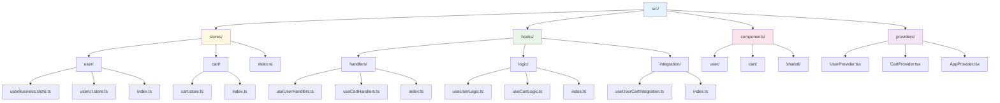

# 개발 모범 사례

Context-Action 프레임워크로 유지보수 가능하고 확장 가능한 애플리케이션을 구축하기 위한 필수 모범 사례입니다. 코드 품질, 성능, 팀 생산성을 보장하기 위해 이러한 가이드라인을 따르세요.

## 핸들러 등록 모범 사례

### 1. 항상 `useActionRegister` + `useEffect` 패턴 사용

```typescript
// ✅ 올바름: 정리와 함께 적절한 등록
function useUserHandlers() {
  const register = useUserActionRegister();
  const registry = useUserRegistry();
  
  const handler = useCallback(async (payload, controller) => {
    // 핸들러 로직
  }, [registry]);
  
  useEffect(() => {
    if (!register) return;
    const unregister = register('action', handler, {
      priority: 100,
      blocking: true
    });
    return unregister; // 중요: 언마운트 시 정리
  }, [register, handler]);
}

// ❌ 잘못됨: 정리 없음
function useUserHandlers() {
  const register = useUserActionRegister();
  
  useEffect(() => {
    register('action', handler); // 메모리 누수!
  }, []);
}
```

### 2. 순차 비동기 핸들러에는 `blocking: true` 사용

```typescript
// ✅ 올바름: 순차 실행
register('asyncAction', asyncHandler, { 
  priority: 100, 
  blocking: true // 완료 대기
});

// ❌ 잘못됨: 핸들러들이 동시에 실행됨
register('asyncAction', asyncHandler, { 
  priority: 100 
  // blocking: true 누락
});
```

### 3. 디버깅과 중요 핸들러에 명시적 ID 고려

```typescript
// ✅ 좋음: 디버깅을 위한 명시적 ID
register('updateProfile', handler, {
  priority: 100,
  blocking: true,
  id: 'profile-updater-main' // 디버깅에 도움
});

// ✅ 역시 좋음: 간단한 경우 자동 생성 ID
register('updateProfile', handler, {
  priority: 100,
  blocking: true
  // 프레임워크가 자동으로 ID 생성
});
```

### 4. 재등록 방지를 위해 `useCallback`으로 핸들러 래핑

```typescript
// ✅ 올바름: 안정된 핸들러 참조
const handler = useCallback(async (payload, controller) => {
  // 핸들러 로직
}, [registry]); // 안정된 의존성만

// ❌ 잘못됨: 매 렌더링마다 핸들러 재생성
const handler = async (payload, controller) => {
  // 매 렌더링마다 새 함수 생성
};
```

## 스토어 접근 모범 사례

### 5. 컴포넌트에서는 도메인별 훅 사용

```typescript
// ✅ 올바름: 도메인별 훅
function UserProfile() {
  const profileStore = useUserStore('profile');
  const profile = useStoreValue(profileStore);
  const dispatch = useUserAction();
  
  return <div>{profile.name}</div>;
}

// ❌ 잘못됨: 제네릭 훅 (타입 안전성 없음)
function UserProfile() {
  const store = useStore('user-profile'); // 타입 정보 없음
  const dispatch = useDispatch(); // 액션 안전성 없음
}
```

### 6. 핸들러에서는 지연 평가를 위해 `registry.getStore()` 사용

```typescript
// ✅ 올바름: 지연 평가 (최신 값)
const handler = useCallback(async (payload, controller) => {
  const profileStore = registry.getStore('profile');
  const currentProfile = profileStore.getValue(); // 현재 값
  
  // 최신 데이터로 비즈니스 로직
}, [registry]);

// ❌ 잘못됨: 오래된 클로저
const profile = profileStore.getValue();
const handler = useCallback(async (payload, controller) => {
  console.log(profile); // 등록 시점의 오래된 값
}, [profile]);
```

### 7. null이 아닌 적절한 초기값 제공

```typescript
// ✅ 올바름: 적절한 초기값
export const userStores = createDeclarativeStores<UserData>('User', {
  profile: {
    initialValue: {
      id: '',
      name: '',
      email: ''
    }
  }
});

// ❌ 잘못됨: null 값은 타입 문제 야기
export const userStores = createDeclarativeStores<UserData>('User', {
  profile: {
    initialValue: null // TypeScript 오류, 런타임 문제
  }
});
```

### 8. 스토어 업데이트를 예측 가능하고 추적 가능하게 유지

```typescript
// ✅ 올바름: 명확하고 추적 가능한 업데이트
const updateProfile = useCallback(async (updates: Partial<UserProfile>) => {
  const profileStore = registry.getStore('profile');
  const currentProfile = profileStore.getValue();
  
  const newProfile = {
    ...currentProfile,
    ...updates,
    updatedAt: Date.now() // 메타데이터 추가
  };
  
  profileStore.setValue(newProfile);
  
  // 디버깅용 로그
  console.log('프로필 업데이트:', { from: currentProfile, to: newProfile });
}, [registry]);

// ❌ 잘못됨: 불명확한 변경
const updateProfile = useCallback((updates) => {
  // 직접 변경 (디버깅 어려움)
  Object.assign(currentProfile, updates);
}, []);
```

## 타입 안전성 (권장)

### 9. 더 나은 타입 안전성을 위한 인터페이스 정의

```typescript
// ✅ 좋음: 명확한 인터페이스
export interface UserData {
  profile: {
    id: string;
    name: string;
    email: string;
    role: 'admin' | 'user' | 'guest';
  };
  preferences: {
    theme: 'light' | 'dark';
    language: string;
  };
}

export interface UserActions {
  updateProfile: { data: Partial<UserData['profile']> };
  deleteUser: { userId: string };
  resetUser: void; // 페이로드 없는 액션에 명시적 void
}

// ❌ 피하기: any 타입 (안전성 상실)
export interface UserActions {
  updateProfile: any;
  deleteUser: any;
}
```

### 10. 타입 추론을 위해 도메인별 훅 사용

```typescript
// ✅ 올바름: 자동 타입 추론
function UserComponent() {
  const profileStore = useUserStore('profile'); // Store<UserProfile>
  const profile = useStoreValue(profileStore);  // UserProfile
  const dispatch = useUserAction();             // 타입된 디스패처
  
  dispatch('updateProfile', { 
    data: { name: '새 이름' } // ✓ 타입 체크됨
  });
}
```

### 11. `any` 타입 피하기 - TypeScript 활용

```typescript
// ✅ 올바름: 적절한 타이핑
const handler = useCallback(async (
  payload: UserActions['updateProfile'],
  controller: ActionController
) => {
  // 완전히 타입된 핸들러
}, []);

// ❌ 잘못됨: any 타입이 목적을 무산
const handler = useCallback(async (payload: any, controller: any) => {
  // 모든 타입 안전성 상실
}, []);
```

## 성능 모범 사례

### 12. 필요한 스토어만 구독

```typescript
// ✅ 올바름: 최소한의 구독
function UserName() {
  const profileStore = useUserStore('profile');
  const profile = useStoreValue(profileStore);
  
  // 프로필 변경시만 리렌더링
  return <span>{profile.name}</span>;
}

// ❌ 잘못됨: 과도한 구독
function UserName() {
  const profileStore = useUserStore('profile');
  const preferencesStore = useUserStore('preferences'); // 불필요
  const sessionStore = useUserStore('session'); // 불필요
  
  const profile = useStoreValue(profileStore);
  const preferences = useStoreValue(preferencesStore); // 추가 리렌더링 유발
  const session = useStoreValue(sessionStore); // 추가 리렌더링 유발
  
  return <span>{profile.name}</span>; // 프로필만 필요
}
```

### 13. 적절한 핸들러 우선순위 사용

```typescript
// ✅ 올바름: 논리적 우선순위 순서
register('updateProfile', validationHandler, { 
  priority: 200, // 검증 먼저
  blocking: true 
});

register('updateProfile', updateHandler, { 
  priority: 100, // 메인 로직 다음
  blocking: true 
});

register('updateProfile', loggingHandler, { 
  priority: 50,  // 로깅 마지막
  blocking: true 
});
```

### 14. 언마운트 시 핸들러 정리

```typescript
// ✅ 올바름: 모든 핸들러 정리됨
useEffect(() => {
  if (!register) return;
  
  const unregisterA = register('actionA', handlerA);
  const unregisterB = register('actionB', handlerB);
  const unregisterC = register('actionC', handlerC);
  
  return () => {
    unregisterA();
    unregisterB();
    unregisterC();
  };
}, [register, handlerA, handlerB, handlerC]);
```

### 15. 결과 수집을 선택적으로 사용

```typescript
// ✅ 좋음: 결과가 필요할 때만
const dispatchWithResult = useUserActionWithResult();

const criticalAction = async () => {
  const result = await dispatchWithResult('importantAction', payload, {
    result: { collect: true, strategy: 'all' }
  });
  
  // 결과 처리
  return result.results;
};

// ✅ 역시 좋음: 결과가 불필요할 때는 일반 디스패치
const dispatch = useUserAction();

const simpleAction = () => {
  dispatch('simpleAction', payload); // 결과 수집 오버헤드 없음
};
```

## 아키텍처 모범 사례

### 16. 하나의 도메인 = 하나의 컨텍스트 경계

```typescript
// ✅ 올바름: 명확한 도메인 경계
function App() {
  return (
    <UserProvider>        {/* 사용자 도메인 */}
      <CartProvider>      {/* 장바구니 도메인 */}
        <OrderProvider>   {/* 주문 도메인 */}
          <AppContent />
        </OrderProvider>
      </CartProvider>
    </UserProvider>
  );
}
```

### 17. 비즈니스와 UI 관심사 분리

```typescript
// ✅ 올바름: 관심사 분리
// 비즈니스 데이터
interface UserBusinessData {
  profile: UserProfile;
  session: UserSession;
}

// UI 상태  
interface UserUIState {
  isEditing: boolean;
  selectedTab: string;
  loadingState: LoadingState;
}

// 분리된 프로바이더
<UserBusinessProvider>
  <UserUIProvider>
    <UserComponents />
  </UserUIProvider>
</UserBusinessProvider>
```

### 18. 도메인 격리 선호 - 필요시에만 크로스 도메인 사용

```typescript
// ✅ 좋음: 도메인 격리 (선호)
function UserProfile() {
  const profileStore = useUserStore('profile');
  const userAction = useUserAction();
  // 자체 포함된 사용자 로직
}

// ✅ 역시 좋음: 진짜 필요할 때만 크로스 도메인
function useCheckoutProcess() {
  const userProfile = useUserStore('profile');
  const cartItems = useCartStore('items');
  const userAction = useUserAction();
  const cartAction = useCartAction();
  
  // 진짜로 도메인을 횡단하는 비즈니스 로직
}

// ❌ 피하기: 불필요한 결합
function UserProfile() {
  const cartItems = useCartStore('items'); // 왜 사용자 프로필이 장바구니가 필요한가?
}
```

### 19. 도메인 경계를 명확하게 문서화

```typescript
// ✅ 좋음: 명확한 문서화
/**
 * 사용자 도메인
 * 
 * 책임사항:
 * - 사용자 인증 및 프로필 관리
 * - 사용자 환경설정 및 설정
 * - 사용자 세션 관리
 * 
 * 의존성:
 * - 없음 (자체 포함)
 * 
 * 다른 도메인에 제공:
 * - 데이터 연결을 위한 사용자 ID
 * - 인증 상태
 */
export interface UserData {
  // 도메인 데이터 정의
}
```

## 코드 구성 모범 사례

### 23. 일관된 파일 구조



### 24. 배럴 내보내기 사용

```typescript
// stores/user/index.ts
export * from './userBusiness.store';
export * from './userUI.store';

// stores/index.ts  
export * from './user';
export * from './cart';
export * from './order';

// 사용법
import { useUserStore, useCartStore } from '@/stores';
```

### 25. 일관된 명명 규칙 구현

```typescript
// ✅ 일관된 명명
// 스토어
export const useUserBusinessStore = ...;
export const useUserUIStore = ...;

// 액션
export const useUserBusinessAction = ...;
export const useUserUIAction = ...;

// 핸들러
export const useUserBusinessHandlers = ...;
export const useUserUIHandlers = ...;

// 로직 훅
export const useUserProfile = ...;
export const useUserSettings = ...;
```

---

## 요약 체크리스트

### 핸들러 등록 ✓
- [ ] 항상 `useActionRegister` + `useEffect` 패턴 사용
- [ ] 정리를 위해 unregister 함수 반환
- [ ] 순차 비동기 핸들러에 `blocking: true` 사용
- [ ] 디버깅과 중요 핸들러에 명시적 ID 고려
- [ ] 재등록 방지를 위해 `useCallback`으로 핸들러 래핑

### 스토어 접근 ✓
- [ ] 컴포넌트에서 도메인별 훅 사용
- [ ] 핸들러에서 지연 평가를 위해 `registry.getStore()` 사용
- [ ] null이 아닌 적절한 초기값 제공
- [ ] 스토어 업데이트를 예측 가능하고 추적 가능하게 유지

### 타입 안전성 ✓
- [ ] 더 나은 타입 안전성을 위한 인터페이스 정의
- [ ] 타입 추론을 위해 도메인별 훅 사용
- [ ] `any` 타입 피하기 - TypeScript 활용

### 성능 ✓
- [ ] 필요한 스토어만 구독
- [ ] 적절한 핸들러 우선순위 사용
- [ ] 언마운트 시 핸들러 정리
- [ ] 결과 수집을 선택적으로 사용

### 아키텍처 ✓
- [ ] 하나의 도메인 = 하나의 컨텍스트 경계
- [ ] 비즈니스와 UI 관심사 분리
- [ ] 도메인 격리 선호 - 필요시에만 크로스 도메인 사용
- [ ] 도메인 경계를 명확하게 문서화

이러한 모범 사례를 따르면 Context-Action 프레임워크로 유지보수 가능하고 확장 가능하며 성능이 뛰어난 애플리케이션을 보장할 수 있습니다.

---

::: tip 지속적인 개선
이 체크리스트에 대해 정기적으로 코드베이스를 검토하세요. 개발 워크플로우에서 이러한 패턴을 강제하기 위해 ESLint 규칙과 자동화된 검사 설정을 고려해보세요.
:::