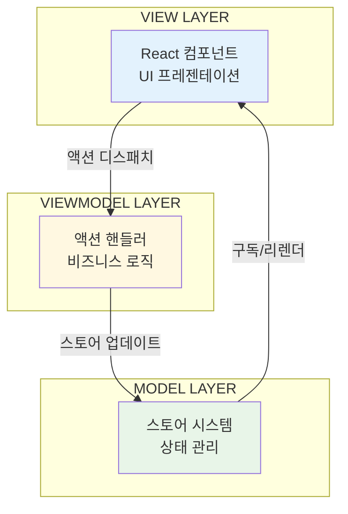

# 핵심 개념

Context-Action 프레임워크의 기본 개념을 이해하는 것은 효과적인 구현을 위해 필수적입니다. 이 가이드는 핵심 구성 요소와 그들의 관계를 다룹니다.

## 아키텍처 개요

Context-Action 프레임워크는 세 가지 주요 계층을 통해 깔끔한 관심사 분리를 구현합니다:



## 핵심 구성 요소

### 1. 도메인별 훅 패턴

프레임워크의 기초는 구조 분해 할당을 통해 도메인별 훅을 생성하는 것입니다:

```typescript
// 도메인 데이터 구조 정의
interface UserData {
  profile: { id: string; name: string; email: string };
  preferences: { theme: 'light' | 'dark'; language: string };
}

// 도메인별 스토어 훅 생성
export const {
  Provider: UserProvider,
  useStore: useUserStore,        // 도메인별 스토어 접근
  useStores: useUserStores,      // 스토어 레지스트리 접근
} = createDeclarativeStores<UserData>('User', {
  profile: { initialValue: { id: '', name: '', email: '' } },
  preferences: { initialValue: { theme: 'light', language: 'en' } }
});

// 도메인별 액션 훅 생성
export const {
  Provider: UserActionProvider,
  useAction: useUserAction,      // 도메인별 액션 디스패처
  useActionRegister: useUserActionRegister
} = createActionContext<UserActions>({ name: 'UserAction' });
```

**장점:**
- 완전한 TypeScript 추론
- 명확한 도메인 경계
- 직관적이고 자동완성 친화적인 API
- 리팩토링 안전성

### 2. 스토어 시스템

스토어는 프로바이더 경계 내에서 싱글톤 동작으로 상태를 관리합니다:

```typescript
function UserProfile() {
  // 도메인별 스토어 가져오기
  const profileStore = useUserStore('profile');
  
  // 변경 사항 구독 (반응형)
  const profile = useStoreValue(profileStore);
  
  // 직접 스토어 조작 (필요시)
  const updateName = (name: string) => {
    profileStore.setValue({ ...profile, name });
  };
  
  return <div>안녕하세요, {profile.name}님!</div>;
}
```

**스토어 패턴:**

1. **싱글톤 동작:** 프로바이더 범위 내에서 동일한 스토어 이름이 동일한 인스턴스 반환
2. **반응형 구독:** 컴포넌트가 변경 사항에 자동으로 리렌더링
3. **타입 안전성:** 도메인별 타입과 완전한 TypeScript 지원

### 3. 액션 파이프라인 시스템

액션은 우선순위 기반 핸들러 시스템을 통해 흐릅니다:

```typescript
// 액션 인터페이스 정의
interface UserActions {
  updateProfile: { data: Partial<UserData['profile']> };
  deleteUser: { userId: string };
  resetUser: void;
}

// 핸들러 등록
function useUserHandlers() {
  const register = useUserActionRegister();
  const registry = useUserRegistry();
  
  const updateProfileHandler = useCallback(async (payload, controller) => {
    // 현재 상태 가져오기 (지연 평가)
    const profileStore = registry.getStore('profile');
    const currentProfile = profileStore.getValue();
    
    // 검증
    if (!payload.data.email?.includes('@')) {
      controller.abort('잘못된 이메일 형식');
      return;
    }
    
    // 비즈니스 로직
    const updatedProfile = { ...currentProfile, ...payload.data };
    profileStore.setValue(updatedProfile);
    
    // 결과 반환
    return { success: true, profile: updatedProfile };
  }, [registry]);
  
  // 정리와 함께 등록
  useEffect(() => {
    if (!register) return;
    const unregister = register('updateProfile', updateProfileHandler, {
      priority: 100,
      blocking: true,
      id: 'profile-updater'
    });
    return unregister; // 중요: 언마운트 시 정리
  }, [register, updateProfileHandler]);
}
```

**핸들러 기능:**

- **우선순위 기반 실행:** 높은 우선순위 핸들러가 먼저 실행
- **블로킹/논블로킹:** 비동기 실행 흐름 제어
- **결과 수집:** 여러 핸들러로부터 결과 수집
- **오류 처리:** 내장된 오류 관리 및 중단 메커니즘

### 4. 프로바이더 구성

중첩된 프로바이더로 도메인 구성:

```typescript
// 도메인별 프로바이더 구성
function UserProvider({ children }: { children: React.ReactNode }) {
  return (
    <UserStoreProvider>
      <UserActionProvider>
        <UserHandlersSetup />
        {children}
      </UserActionProvider>
    </UserStoreProvider>
  );
}

// 핸들러 설정 컴포넌트
function UserHandlersSetup() {
  useUserHandlers(); // 모든 도메인 핸들러 등록
  return null;
}

// 사용법
function App() {
  return (
    <UserProvider>
      <UserProfile />
    </UserProvider>
  );
}
```

## 데이터 흐름 패턴

### 1. 컴포넌트 → 액션 → 스토어 → 컴포넌트

표준 반응형 흐름:

```typescript
function UserEditor() {
  // 스토어 구독
  const profile = useStoreValue(useUserStore('profile'));
  const dispatch = useUserAction();
  
  // 액션 트리거
  const handleSave = () => {
    dispatch('updateProfile', { 
      data: { name: '업데이트된 이름' } 
    });
  };
  
  // 프로필이 변경되면 컴포넌트 리렌더링
  return (
    <form onSubmit={handleSave}>
      <input defaultValue={profile.name} />
      <button type="submit">저장</button>
    </form>
  );
}
```

### 2. 핸들러 접근 패턴

스토어 접근을 위한 세 가지 유효한 패턴:

```typescript
// 패턴 1: 컴포넌트 접근 (반응형)
const store = useUserStore('profile');
const profile = useStoreValue(store);

// 패턴 2: 핸들러 접근 (지연 평가)
const handler = async (payload, controller) => {
  const profileStore = registry.getStore('profile');
  const currentProfile = profileStore.getValue(); // 최신 값
};

// 패턴 3: 컨텍스트 스토어 패턴 (격리됨)
const store = UserStores.useStore('profile', initialValue);
```

### 3. 크로스 도메인 커뮤니케이션

도메인 간 상호작용이 필요한 경우:

```typescript
function useUserCartIntegration() {
  // 여러 도메인 접근
  const userProfile = useUserStore('profile');
  const cartItems = useCartStore('items');
  const userAction = useUserAction();
  const cartAction = useCartAction();
  
  const profile = useStoreValue(userProfile);
  const items = useStoreValue(cartItems);
  
  const processCheckout = useCallback(async () => {
    // 크로스 도메인 검증
    if (!profile.id) {
      await userAction('requireLogin', {});
      return;
    }
    
    // 크로스 도메인 액션
    await cartAction('processCheckout', {
      userId: profile.id,
      items: items
    });
  }, [profile.id, items, userAction, cartAction]);
  
  return { processCheckout };
}
```

## 핸들러 등록 패턴

### 최선의 패턴

항상 `useActionRegister` + `useEffect`를 정리와 함께 사용:

```typescript
function useUserHandlers() {
  const register = useUserActionRegister();
  const registry = useUserRegistry();
  
  // useCallback으로 핸들러 래핑
  const handler = useCallback(async (payload, controller) => {
    // 여기에 핸들러 로직
  }, [registry]);
  
  // 정리와 함께 등록
  useEffect(() => {
    if (!register) return;
    
    const unregister = register('actionName', handler, {
      priority: 100,
      blocking: true,
      id: 'unique-handler-id'
    });
    
    return unregister; // 중요: 언마운트 시 정리
  }, [register, handler]);
}
```

### 핸들러 구성 옵션

```typescript
interface HandlerConfig {
  priority?: number;        // 실행 순서 (높을수록 먼저)
  blocking?: boolean;       // 비동기 완료 대기
  tags?: string[];         // 필터링용
  id?: string;            // 명시적 핸들러 ID
  category?: string;      // 핸들러 카테고리
  returnType?: 'value';   // 반환값 수집 활성화
}
```

## 컨텍스트 경계 & 도메인 격리

### 단일 도메인 아키텍처

```typescript
// 도메인별 스토어
const UserStores = createContextStorePattern('User');

// 격리된 프로바이더 경계
<UserStores.Provider registryId="user-domain">
  <UserComponents />
</UserStores.Provider>

// 도메인별 사용법
const userStore = UserStores.useStore('profile', initialData);
```

### 다중 도메인 아키텍처

```typescript
function App() {
  return (
    <UserProvider>        {/* 사용자 도메인 경계 */}
      <CartProvider>      {/* 장바구니 도메인 경계 */}
        <OrderProvider>   {/* 주문 도메인 경계 */}
          <ApplicationComponents />
        </OrderProvider>
      </CartProvider>
    </UserProvider>
  );
}
```

## 메모리 관리

### 스토어 생명주기

- **생성:** 프로바이더 내에서 처음 접근될 때 스토어가 생성됨
- **지속성:** 프로바이더의 생명주기 동안 스토어가 지속됨
- **정리:** 프로바이더가 언마운트되면 스토어가 정리됨

### 핸들러 정리

```typescript
// ❌ 메모리 누수 - 정리 없음
useEffect(() => {
  register('action', handler);
}, []);

// ✅ 적절한 정리
useEffect(() => {
  if (!register) return;
  const unregister = register('action', handler);
  return unregister; // 언마운트 시 정리
}, [register, handler]);
```

## 타입 안전성 기능

### 자동 타입 추론

```typescript
// 타입이 자동으로 추론됨
const store = useUserStore('profile'); // Store<UserProfile>
const profile = useStoreValue(store);  // UserProfile
const dispatch = useUserAction();      // Dispatch<UserActions>
```

### 컴파일 시 안전성

```typescript
// 잘못된 액션 이름 - 컴파일 에러
dispatch('invalidAction', {}); 
// TS 에러: '"invalidAction"' 형식의 인수를 할당할 수 없습니다

// 잘못된 페이로드 - 컴파일 에러  
dispatch('updateProfile', { invalid: 'data' });
// TS 에러: 객체 리터럴은 알려진 속성만 지정할 수 있습니다
```

---

## 요약

Context-Action 프레임워크의 핵심 개념들이 함께 작동하여 다음을 제공합니다:

- 컨텍스트 경계를 통한 **도메인 격리**
- 자동 추론을 통한 **타입 안전성**
- 최소한의 리렌더링을 통한 **반응형 상태 관리**
- 중앙화된 비즈니스 로직을 통한 **선언적 액션**
- 적절한 정리 패턴을 통한 **메모리 안전성**

이러한 개념을 이해하면 명확한 아키텍처 경계를 가진 확장 가능하고 유지 관리 가능한 애플리케이션을 구축할 수 있습니다.

---

::: tip 다음 단계
구현할 준비가 되셨나요? 완전한 패턴과 예제를 위해 [전체 구현 가이드](./full)를 확인하거나, 실습 코딩을 위해 [빠른 시작](./quick-start)으로 이동하세요.
:::