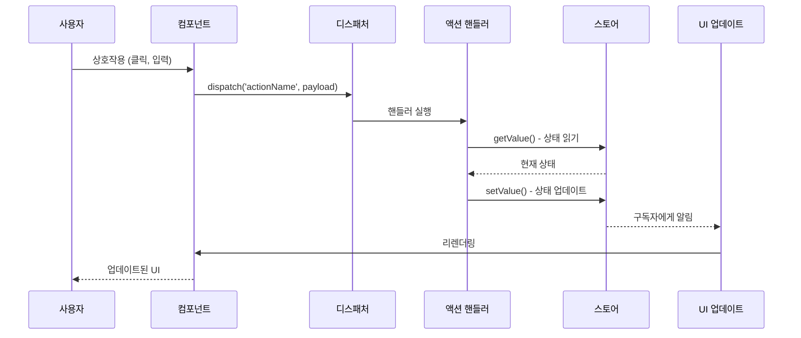

# 데이터 플로우 패턴

## 개요

Context-Action 프레임워크의 데이터 플로우 패턴은 사용자 상호작용부터 상태 업데이트를 거쳐 다시 UI로 돌아오는 정보의 흐름을 정의합니다. 이러한 패턴을 이해하는 것은 유지보수 가능하고 예측 가능하며 성능이 뛰어난 애플리케이션을 구축하는 데 중요합니다.

### 핵심 플로우 원칙

- **🔄 단방향 플로우**: 데이터가 시스템을 통해 한 방향으로 흐름
- **📡 이벤트 중심**: 사용자 상호작용이 시스템을 통해 흐르는 이벤트를 트리거
- **🎯 중앙집중식 로직**: 비즈니스 로직은 액션 핸들러에 중앙집중화
- **⚡ 반응형 업데이트**: UI가 상태 변경에 자동으로 반응
- **🛡️ 예측 가능한 상태**: 상태 변경이 예측 가능하고 추적 가능

## 기본 데이터 플로우 패턴

### 1. 간단한 액션 플로우

가장 기본적인 패턴: 사용자 상호작용 → 액션 → 스토어 업데이트 → UI 업데이트.



#### 구현 예제

```typescript
// 1. 컴포넌트가 액션 디스패치
function Counter() {
  const count = useStoreValue(counterStore);
  const dispatch = useActionDispatch();
  
  return (
    <div>
      <span>{count}</span>
      <button onClick={() => dispatch('increment', { amount: 1 })}>+</button>
    </div>
  );
}

// 2. 액션 핸들러가 플로우 처리
actionRegister.register('increment', async (payload: { amount: number }, controller) => {
  // 현재 상태 읽기
  const currentCount = counterStore.getValue();
  
  // 비즈니스 로직 적용
  const newCount = currentCount + payload.amount;
  
  // 필요시 검증
  if (newCount > 100) {
    controller.abort('카운트는 100을 초과할 수 없습니다');
    return;
  }
  
  // 스토어 업데이트
  counterStore.setValue(newCount);
});

// 3. 컴포넌트가 새 값으로 자동 리렌더링
```

### 2. 검증이 있는 다단계 플로우

더 복잡한 플로우는 여러 검증 단계와 조건부 로직을 포함합니다.

```typescript
interface UserRegistration {
  email: string;
  password: string;
  confirmPassword: string;
  acceptTerms: boolean;
}

actionRegister.register('registerUser', async (payload: UserRegistration, controller) => {
  // 1단계: 입력 검증
  if (!payload.email || !isValidEmail(payload.email)) {
    controller.abort('유효한 이메일이 필요합니다');
    return;
  }
  
  if (payload.password !== payload.confirmPassword) {
    controller.abort('비밀번호가 일치하지 않습니다');
    return;
  }
  
  if (!payload.acceptTerms) {
    controller.abort('서비스 약관에 동의해야 합니다');
    return;
  }
  
  // 2단계: 기존 사용자 확인
  const existingUsers = userListStore.getValue();
  if (existingUsers.some(user => user.email === payload.email)) {
    controller.abort('이미 등록된 이메일입니다');
    return;
  }
  
  // 3단계: 로딩 상태 설정
  uiStore.update(ui => ({ ...ui, loading: true, error: null }));
  
  try {
    // 4단계: 사용자 계정 생성
    const newUser = await api.createUser({
      email: payload.email,
      password: payload.password
    });
    
    // 5단계: 스토어 업데이트
    userListStore.update(users => [...users, newUser]);
    currentUserStore.setValue(newUser);
    
    // 6단계: 성공 피드백
    uiStore.update(ui => ({ 
      ...ui, 
      loading: false,
      message: '등록이 완료되었습니다!'
    }));
    
  } catch (error) {
    // 7단계: 에러 처리
    uiStore.update(ui => ({ 
      ...ui, 
      loading: false,
      error: error.message
    }));
    controller.abort('등록에 실패했습니다');
  }
});
```

## 고급 플로우 패턴

### 1. 캐스케이드 플로우 패턴

하나의 액션이 후속 액션들을 트리거하여 작업의 캐스케이드를 생성합니다.

```typescript
// 주요 액션이 캐스케이드를 트리거
actionRegister.register('completeOrder', async (payload: { orderId: string }, controller) => {
  const order = orderStore.getValue();
  
  if (!order || order.id !== payload.orderId) {
    controller.abort('주문을 찾을 수 없습니다');
    return;
  }
  
  // 주문 상태 업데이트
  orderStore.update(order => ({ ...order, status: 'completed' }));
  
  // 관련 액션들의 캐스케이드 트리거
  dispatch('updateInventory', { items: order.items });
  dispatch('sendCompletionEmail', { orderId: order.id, email: order.customerEmail });
  dispatch('updateCustomerStats', { customerId: order.customerId });
  dispatch('generateInvoice', { orderId: order.id });
});

// 캐스케이드된 액션들
actionRegister.register('updateInventory', async (payload: { items: OrderItem[] }, controller) => {
  const inventory = inventoryStore.getValue();
  
  const updatedInventory = { ...inventory };
  payload.items.forEach(item => {
    if (updatedInventory[item.productId]) {
      updatedInventory[item.productId].sold += item.quantity;
    }
  });
  
  inventoryStore.setValue(updatedInventory);
});

actionRegister.register('updateCustomerStats', async (payload: { customerId: string }, controller) => {
  const stats = customerStatsStore.getValue();
  const customer = customersStore.getValue().find(c => c.id === payload.customerId);
  
  if (customer) {
    customerStatsStore.update(stats => ({
      ...stats,
      [payload.customerId]: {
        ...stats[payload.customerId],
        totalOrders: (stats[payload.customerId]?.totalOrders || 0) + 1,
        lastOrderDate: Date.now()
      }
    }));
  }
});
```

### 2. 파이프라인 플로우 패턴

각 단계가 이전 단계의 출력에 의존하는 순차 처리입니다.

```typescript
interface ProcessingPipeline {
  step: number;
  data: any;
  result: any;
  error?: string;
}

actionRegister.register('processDataPipeline', async (payload: { inputData: any }, controller) => {
  const pipeline = createStore<ProcessingPipeline>({
    step: 0,
    data: payload.inputData,
    result: null
  });
  
  try {
    // 1단계: 데이터 검증
    pipeline.update(p => ({ ...p, step: 1 }));
    const validatedData = await validateData(pipeline.getValue().data);
    pipeline.update(p => ({ ...p, data: validatedData }));
    
    // 2단계: 데이터 변환
    pipeline.update(p => ({ ...p, step: 2 }));
    const transformedData = await transformData(pipeline.getValue().data);
    pipeline.update(p => ({ ...p, data: transformedData }));
    
    // 3단계: 데이터 보강
    pipeline.update(p => ({ ...p, step: 3 }));
    const enrichedData = await enrichData(pipeline.getValue().data);
    pipeline.update(p => ({ ...p, data: enrichedData }));
    
    // 4단계: 최종 처리
    pipeline.update(p => ({ ...p, step: 4 }));
    const result = await finalProcessing(pipeline.getValue().data);
    pipeline.update(p => ({ ...p, result, step: 5 }));
    
    // 최종 스토어 업데이트
    processedDataStore.setValue(result);
    
  } catch (error) {
    pipeline.update(p => ({ ...p, error: error.message }));
    controller.abort(`파이프라인이 ${pipeline.getValue().step}단계에서 실패했습니다: ${error.message}`);
  }
});
```

### 3. 팬아웃/팬인 패턴

하나의 액션이 여러 병렬 작업을 트리거하여 결국 수렴됩니다.

```typescript
actionRegister.register('aggregateUserData', async (payload: { userId: string }, controller) => {
  const userId = payload.userId;
  
  // 로딩 상태 설정
  userProfileStore.update(profile => ({ ...profile, loading: true }));
  userOrdersStore.update(orders => ({ ...orders, loading: true }));
  userPreferencesStore.update(prefs => ({ ...prefs, loading: true }));
  
  try {
    // 팬아웃: 여러 병렬 작업 트리거
    const [profile, orders, preferences] = await Promise.all([
      api.getUserProfile(userId),
      api.getUserOrders(userId),
      api.getUserPreferences(userId)
    ]);
    
    // 팬인: 결과 결합
    const aggregatedData = {
      profile,
      orders,
      preferences,
      summary: {
        totalOrders: orders.length,
        totalSpent: orders.reduce((sum, order) => sum + order.total, 0),
        favoriteCategory: calculateFavoriteCategory(orders),
        memberSince: profile.createdAt
      }
    };
    
    // 모든 스토어 업데이트
    userProfileStore.setValue({ ...profile, loading: false });
    userOrdersStore.setValue({ items: orders, loading: false });
    userPreferencesStore.setValue({ ...preferences, loading: false });
    userSummaryStore.setValue(aggregatedData.summary);
    
  } catch (error) {
    // 모든 스토어에서 에러 처리
    const errorState = { error: error.message, loading: false };
    userProfileStore.update(profile => ({ ...profile, ...errorState }));
    userOrdersStore.update(orders => ({ ...orders, ...errorState }));
    userPreferencesStore.update(prefs => ({ ...prefs, ...errorState }));
    
    controller.abort('사용자 데이터 수집에 실패했습니다');
  }
});
```

## 실시간 데이터 플로우 패턴

### 1. WebSocket 통합 플로우

WebSocket 연결을 통한 실시간 데이터 업데이트 처리.

```typescript
interface WebSocketMessage {
  type: string;
  payload: any;
  timestamp: number;
}

const wsConnectionStore = createStore<{
  connected: boolean;
  lastMessage: WebSocketMessage | null;
  error: string | null;
}>({
  connected: false,
  lastMessage: null,
  error: null
});

actionRegister.register('initializeWebSocket', async (payload: { url: string }, controller) => {
  try {
    const ws = new WebSocket(payload.url);
    
    ws.onopen = () => {
      wsConnectionStore.update(state => ({ 
        ...state, 
        connected: true, 
        error: null 
      }));
      dispatch('webSocketConnected', {});
    };
    
    ws.onmessage = (event) => {
      const message: WebSocketMessage = JSON.parse(event.data);
      wsConnectionStore.update(state => ({ 
        ...state, 
        lastMessage: message 
      }));
      
      // 적절한 핸들러로 메시지 라우팅
      dispatch('processWebSocketMessage', message);
    };
    
    ws.onerror = (error) => {
      wsConnectionStore.update(state => ({ 
        ...state, 
        error: 'WebSocket 오류',
        connected: false
      }));
    };
    
    ws.onclose = () => {
      wsConnectionStore.update(state => ({ 
        ...state, 
        connected: false
      }));
      dispatch('webSocketDisconnected', {});
    };
    
  } catch (error) {
    controller.abort('WebSocket 초기화에 실패했습니다');
  }
});

actionRegister.register('processWebSocketMessage', async (message: WebSocketMessage, controller) => {
  switch (message.type) {
    case 'USER_UPDATE':
      userStore.update(user => ({ ...user, ...message.payload }));
      break;
      
    case 'ORDER_STATUS_CHANGE':
      orderStore.update(order => 
        order.id === message.payload.orderId 
          ? { ...order, status: message.payload.status }
          : order
      );
      break;
      
    case 'INVENTORY_UPDATE':
      inventoryStore.update(inventory => ({
        ...inventory,
        [message.payload.productId]: {
          ...inventory[message.payload.productId],
          stock: message.payload.newStock
        }
      }));
      break;
      
    default:
      console.warn('알 수 없는 WebSocket 메시지 타입:', message.type);
  }
});
```

### 2. 폴링 플로우 패턴

폴링 메커니즘을 통한 정기적인 데이터 동기화.

```typescript
interface PollingConfig {
  interval: number;
  maxRetries: number;
  backoffMultiplier: number;
}

const pollingStateStore = createStore<{
  active: boolean;
  interval: number;
  lastSync: number;
  errorCount: number;
}>({
  active: false,
  interval: 30000, // 30초
  lastSync: 0,
  errorCount: 0
});

actionRegister.register('startPolling', async (payload: PollingConfig, controller) => {
  const intervalId = setInterval(async () => {
    const state = pollingStateStore.getValue();
    
    if (!state.active) {
      clearInterval(intervalId);
      return;
    }
    
    try {
      await dispatch('syncData', {});
      pollingStateStore.update(state => ({ 
        ...state, 
        lastSync: Date.now(),
        errorCount: 0
      }));
      
    } catch (error) {
      pollingStateStore.update(state => {
        const newErrorCount = state.errorCount + 1;
        
        if (newErrorCount >= payload.maxRetries) {
          // 최대 재시도 후 폴링 중지
          return { ...state, active: false, errorCount: newErrorCount };
        }
        
        // 오류 시 간격 증가 (지수 백오프)
        const newInterval = state.interval * payload.backoffMultiplier;
        clearInterval(intervalId);
        setTimeout(() => dispatch('startPolling', payload), newInterval);
        
        return { ...state, interval: newInterval, errorCount: newErrorCount };
      });
    }
  }, payload.interval);
  
  pollingStateStore.update(state => ({ 
    ...state, 
    active: true,
    interval: payload.interval
  }));
});

actionRegister.register('syncData', async (payload, controller) => {
  const lastSync = pollingStateStore.getValue().lastSync;
  
  const updates = await api.getUpdates({ since: lastSync });
  
  // 관련 스토어에 업데이트 적용
  if (updates.users) {
    userListStore.setValue(updates.users);
  }
  
  if (updates.orders) {
    orderListStore.setValue(updates.orders);
  }
  
  if (updates.inventory) {
    inventoryStore.setValue(updates.inventory);
  }
});
```

## 성능 최적화 패턴

### 1. 디바운스된 액션 플로우

디바운싱으로 과도한 액션 실행 방지.

```typescript
const searchStateStore = createStore<{
  query: string;
  results: any[];
  loading: boolean;
  debounceTimer: number | null;
}>({
  query: '',
  results: [],
  loading: false,
  debounceTimer: null
});

actionRegister.register('searchInput', async (payload: { query: string }, controller) => {
  const currentState = searchStateStore.getValue();
  
  // 기존 타이머 클리어
  if (currentState.debounceTimer) {
    clearTimeout(currentState.debounceTimer);
  }
  
  // UI 반응성을 위해 쿼리 즉시 업데이트
  searchStateStore.update(state => ({ ...state, query: payload.query }));
  
  // 새로운 디바운스 타이머 설정
  const timerId = setTimeout(() => {
    dispatch('performSearch', { query: payload.query });
  }, 300); // 300ms 디바운스
  
  searchStateStore.update(state => ({ ...state, debounceTimer: timerId }));
});

actionRegister.register('performSearch', async (payload: { query: string }, controller) => {
  if (!payload.query.trim()) {
    searchStateStore.update(state => ({ ...state, results: [], loading: false }));
    return;
  }
  
  searchStateStore.update(state => ({ ...state, loading: true }));
  
  try {
    const results = await api.search(payload.query);
    searchStateStore.update(state => ({ 
      ...state, 
      results, 
      loading: false,
      debounceTimer: null
    }));
  } catch (error) {
    searchStateStore.update(state => ({ 
      ...state, 
      loading: false,
      debounceTimer: null
    }));
    controller.abort('검색에 실패했습니다');
  }
});
```

### 2. 배치 업데이트 패턴

여러 작은 업데이트를 배치 작업으로 결합.

```typescript
interface BatchOperation {
  id: string;
  type: 'create' | 'update' | 'delete';
  data: any;
}

const batchStateStore = createStore<{
  operations: BatchOperation[];
  processing: boolean;
  lastFlush: number;
}>({
  operations: [],
  processing: false,
  lastFlush: 0
});

actionRegister.register('addToBatch', async (payload: BatchOperation, controller) => {
  batchStateStore.update(state => ({
    ...state,
    operations: [...state.operations, payload]
  }));
  
  // 배치가 커지면 자동 플러시
  const currentOperations = batchStateStore.getValue().operations;
  if (currentOperations.length >= 10) {
    dispatch('flushBatch', {});
  }
});

actionRegister.register('flushBatch', async (payload, controller) => {
  const state = batchStateStore.getValue();
  
  if (state.operations.length === 0 || state.processing) {
    return;
  }
  
  batchStateStore.update(state => ({ ...state, processing: true }));
  
  try {
    // 타입별로 작업 그룹화
    const creates = state.operations.filter(op => op.type === 'create');
    const updates = state.operations.filter(op => op.type === 'update');
    const deletes = state.operations.filter(op => op.type === 'delete');
    
    // 배치 작업 실행
    await Promise.all([
      creates.length > 0 ? api.batchCreate(creates.map(op => op.data)) : Promise.resolve(),
      updates.length > 0 ? api.batchUpdate(updates.map(op => op.data)) : Promise.resolve(),
      deletes.length > 0 ? api.batchDelete(deletes.map(op => op.id)) : Promise.resolve()
    ]);
    
    // 배치 클리어 및 타임스탬프 업데이트
    batchStateStore.update(state => ({
      operations: [],
      processing: false,
      lastFlush: Date.now()
    }));
    
    // 배치 작업 후 데이터 새로고침
    dispatch('refreshData', {});
    
  } catch (error) {
    batchStateStore.update(state => ({ ...state, processing: false }));
    controller.abort('배치 작업에 실패했습니다');
  }
});

// 자동 플러시 타이머
setInterval(() => {
  const state = batchStateStore.getValue();
  const timeSinceLastFlush = Date.now() - state.lastFlush;
  
  // 작업이 있고 5초가 지났으면 플러시
  if (state.operations.length > 0 && timeSinceLastFlush > 5000) {
    dispatch('flushBatch', {});
  }
}, 1000);
```

## 에러 처리 플로우 패턴

### 1. 재시도 플로우 패턴

지수 백오프를 사용한 자동 재시도 메커니즘.

```typescript
interface RetryConfig {
  maxRetries: number;
  baseDelay: number;
  maxDelay: number;
  backoffMultiplier: number;
}

const retryStateStore = createStore<Record<string, {
  attempts: number;
  lastAttempt: number;
  nextRetry: number;
  error: string | null;
}>>({});

actionRegister.register('executeWithRetry', async (
  payload: { actionName: string; actionPayload: any; retryConfig: RetryConfig },
  controller
) => {
  const { actionName, actionPayload, retryConfig } = payload;
  const retryKey = `${actionName}_${JSON.stringify(actionPayload)}`;
  
  const executeAttempt = async (attemptNumber: number): Promise<void> => {
    try {
      // 재시도 상태 업데이트
      retryStateStore.update(state => ({
        ...state,
        [retryKey]: {
          attempts: attemptNumber,
          lastAttempt: Date.now(),
          nextRetry: 0,
          error: null
        }
      }));
      
      // 실제 액션 실행
      await dispatch(actionName, actionPayload);
      
      // 성공 시 재시도 상태 클리어
      retryStateStore.update(state => {
        const newState = { ...state };
        delete newState[retryKey];
        return newState;
      });
      
    } catch (error) {
      const shouldRetry = attemptNumber < retryConfig.maxRetries;
      
      if (shouldRetry) {
        // 다음 재시도 지연 계산
        const delay = Math.min(
          retryConfig.baseDelay * Math.pow(retryConfig.backoffMultiplier, attemptNumber - 1),
          retryConfig.maxDelay
        );
        
        const nextRetry = Date.now() + delay;
        
        // 재시도 상태 업데이트
        retryStateStore.update(state => ({
          ...state,
          [retryKey]: {
            attempts: attemptNumber,
            lastAttempt: Date.now(),
            nextRetry,
            error: error.message
          }
        }));
        
        // 다음 시도 스케줄링
        setTimeout(() => {
          executeAttempt(attemptNumber + 1);
        }, delay);
        
      } else {
        // 최대 재시도 도달, 최종 에러 상태 업데이트
        retryStateStore.update(state => ({
          ...state,
          [retryKey]: {
            attempts: attemptNumber,
            lastAttempt: Date.now(),
            nextRetry: 0,
            error: `${retryConfig.maxRetries}번 시도 후 실패: ${error.message}`
          }
        }));
        
        controller.abort(`액션 ${actionName}이 ${retryConfig.maxRetries}번 재시도 후 실패했습니다`);
      }
    }
  };
  
  await executeAttempt(1);
});
```

### 2. 서킷 브레이커 패턴

실패하는 작업을 일시적으로 비활성화하여 연쇄 실패 방지.

```typescript
interface CircuitBreakerState {
  status: 'CLOSED' | 'OPEN' | 'HALF_OPEN';
  failureCount: number;
  lastFailureTime: number;
  nextAttemptTime: number;
}

const circuitBreakerStore = createStore<Record<string, CircuitBreakerState>>({});

actionRegister.register('executeWithCircuitBreaker', async (
  payload: { 
    actionName: string; 
    actionPayload: any; 
    failureThreshold: number;
    timeout: number;
  },
  controller
) => {
  const { actionName, actionPayload, failureThreshold, timeout } = payload;
  const breakerKey = actionName;
  
  const currentState = circuitBreakerStore.getValue()[breakerKey] || {
    status: 'CLOSED',
    failureCount: 0,
    lastFailureTime: 0,
    nextAttemptTime: 0
  };
  
  const now = Date.now();
  
  // 서킷 브레이커 상태 확인
  if (currentState.status === 'OPEN') {
    if (now < currentState.nextAttemptTime) {
      controller.abort(`${actionName}에 대한 서킷 브레이커가 OPEN 상태입니다`);
      return;
    } else {
      // HALF_OPEN으로 전환
      circuitBreakerStore.update(state => ({
        ...state,
        [breakerKey]: { ...currentState, status: 'HALF_OPEN' }
      }));
    }
  }
  
  try {
    // 액션 실행
    await dispatch(actionName, actionPayload);
    
    // 성공: 서킷 브레이커 리셋 또는 닫기
    circuitBreakerStore.update(state => ({
      ...state,
      [breakerKey]: {
        status: 'CLOSED',
        failureCount: 0,
        lastFailureTime: 0,
        nextAttemptTime: 0
      }
    }));
    
  } catch (error) {
    const newFailureCount = currentState.failureCount + 1;
    
    if (newFailureCount >= failureThreshold) {
      // 서킷 브레이커 열기
      circuitBreakerStore.update(state => ({
        ...state,
        [breakerKey]: {
          status: 'OPEN',
          failureCount: newFailureCount,
          lastFailureTime: now,
          nextAttemptTime: now + timeout
        }
      }));
    } else {
      // 실패 횟수 증가하지만 닫힌 상태 유지
      circuitBreakerStore.update(state => ({
        ...state,
        [breakerKey]: {
          ...currentState,
          failureCount: newFailureCount,
          lastFailureTime: now
        }
      }));
    }
    
    controller.abort(`액션 ${actionName} 실패: ${error.message}`);
  }
});
```

## 데이터 플로우 패턴 테스트

### 1. 모의 스토어를 사용한 플로우 테스트

```typescript
describe('User Registration Flow', () => {
  let mockUserListStore: jest.Mocked<Store<User[]>>;
  let mockCurrentUserStore: jest.Mocked<Store<User | null>>;
  let mockUIStore: jest.Mocked<Store<UIState>>;
  let mockAPI: jest.Mocked<typeof api>;
  
  beforeEach(() => {
    mockUserListStore = createMockStore([]);
    mockCurrentUserStore = createMockStore(null);
    mockUIStore = createMockStore({ loading: false, error: null });
    mockAPI = createMockAPI();
  });
  
  it('should complete registration flow successfully', async () => {
    // 준비
    const registrationData = {
      email: 'test@example.com',
      password: 'password123',
      confirmPassword: 'password123',
      acceptTerms: true
    };
    
    const newUser = { id: '1', email: 'test@example.com', name: 'Test User' };
    mockAPI.createUser.mockResolvedValue(newUser);
    
    // 실행
    await registerUserHandler(registrationData, { abort: jest.fn() });
    
    // 검증 - 전체 플로우 확인
    expect(mockUIStore.update).toHaveBeenCalledWith(
      expect.objectContaining({ loading: true })
    );
    expect(mockAPI.createUser).toHaveBeenCalledWith({
      email: 'test@example.com',
      password: 'password123'
    });
    expect(mockUserListStore.update).toHaveBeenCalledWith(
      expect.any(Function)
    );
    expect(mockCurrentUserStore.setValue).toHaveBeenCalledWith(newUser);
    expect(mockUIStore.update).toHaveBeenLastCalledWith(
      expect.objectContaining({ 
        loading: false,
        message: '등록이 완료되었습니다!'
      })
    );
  });
});
```

### 2. 통합 플로우 테스트

```typescript
describe('Shopping Cart Flow Integration', () => {
  let cartStore: Store<{ items: CartItem[] }>;
  let inventoryStore: Store<Record<string, Product>>;
  let orderStore: Store<Order | null>;
  
  beforeEach(() => {
    cartStore = createStore({ items: [] });
    inventoryStore = createStore({
      'prod1': { id: 'prod1', name: 'Product 1', stock: 10, price: 99.99 }
    });
    orderStore = createStore(null);
  });
  
  it('should handle complete checkout flow', async () => {
    // 초기 상태 설정
    await dispatch('addToCart', { productId: 'prod1', quantity: 2 });
    
    // 체크아웃 플로우 실행
    await dispatch('processCheckout', { paymentMethod: 'card' });
    
    // 최종 상태 검증
    const finalCart = cartStore.getValue();
    const finalInventory = inventoryStore.getValue();
    const finalOrder = orderStore.getValue();
    
    expect(finalCart.items).toHaveLength(0);
    expect(finalInventory['prod1'].stock).toBe(8);
    expect(finalOrder).toBeTruthy();
    expect(finalOrder?.status).toBe('confirmed');
  });
});
```

## 모범 사례

### ✅ 데이터 플로우에서 해야 할 것

1. **플로우를 예측 가능하게 유지**: 데이터가 일관되고 추적 가능한 방식으로 흐르도록 보장
2. **모든 상태 처리**: 로딩, 성공, 에러 상태를 고려
3. **타입 안전성 사용**: 페이로드와 상태 타이핑에 TypeScript 활용
4. **완전한 플로우 테스트**: 개별 액션이 아닌 전체 사용자 여정 테스트
5. **복잡한 플로우 문서화**: 복잡한 패턴에 다이어그램과 주석 사용
6. **에러 복구 구현**: 우아한 에러 처리와 복구 제공
7. **성능 모니터링**: 플로우 성능을 추적하고 병목 지점 최적화

### ❌ 데이터 플로우에서 하지 말 것

1. **순환 종속성을 만들지 말 것**: 무한 루프를 생성하는 액션을 피할 것
2. **검증을 건너뛰지 말 것**: 항상 입력과 상태 전환을 검증할 것
3. **에러를 무시하지 말 것**: 모든 잠재적 실패 시나리오를 처리할 것
4. **UI 스레드를 차단하지 말 것**: 무거운 계산에 비동기 작업 사용
5. **메모리를 누수시키지 말 것**: 타이머, 구독, 리소스를 정리할 것
6. **플로우를 우회하지 말 것**: 일관된 데이터 플로우 패턴 유지
7. **과도하게 복잡하게 만들지 말 것**: 간단하게 시작하고 점진적으로 복잡성 추가

## 플로우 패턴 요약

| 패턴 | 사용 사례 | 복잡성 | 장점 | 고려사항 |
|---------|----------|------------|----------|----------------|
| 간단한 액션 플로우 | 기본 CRUD 작업 | 낮음 | 이해하기 쉬움 | 제한된 기능 |
| 다단계 플로우 | 복잡한 작업 | 중간 | 포괄적인 검증 | 더 많은 에러 처리 필요 |
| 캐스케이드 플로우 | 종속 작업 | 중간 | 자동 조정 | 디버깅이 어려울 수 있음 |
| 파이프라인 플로우 | 순차 처리 | 높음 | 명확한 단계 분리 | 복잡한 에러 복구 |
| 팬아웃/팬인 | 병렬 작업 | 높음 | 성능 최적화 | 동기화 복잡성 |
| 실시간 플로우 | 라이브 데이터 업데이트 | 높음 | 즉각적인 업데이트 | 리소스 집약적 |
| 재시도 플로우 | 신뢰할 수 없는 작업 | 중간 | 내결함성 | 작업을 지연시킬 수 있음 |
| 서킷 브레이커 | 시스템 보호 | 높음 | 연쇄 실패 방지 | 신중한 튜닝 필요 |

## 관련 자료

- [MVVM 아키텍처 가이드](./mvvm-architecture.md) - 전체 아키텍처 패턴
- [스토어 통합 가이드](./store-integration.md) - 스토어 조정 패턴
- [모범 사례](./best-practices.md) - 개발 모범 사례
- [API 참조 - 핵심](/api/core/) - 핵심 API 문서
- [예제 - 고급 패턴](/examples/advanced-patterns/) - 복잡한 플로우 예제