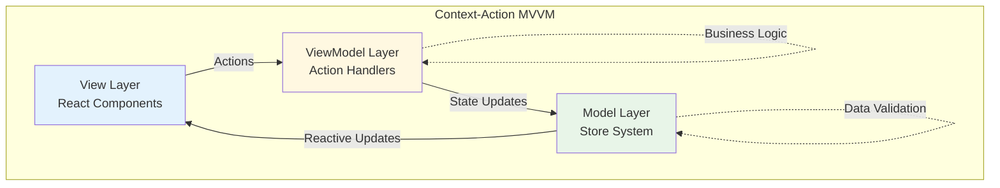
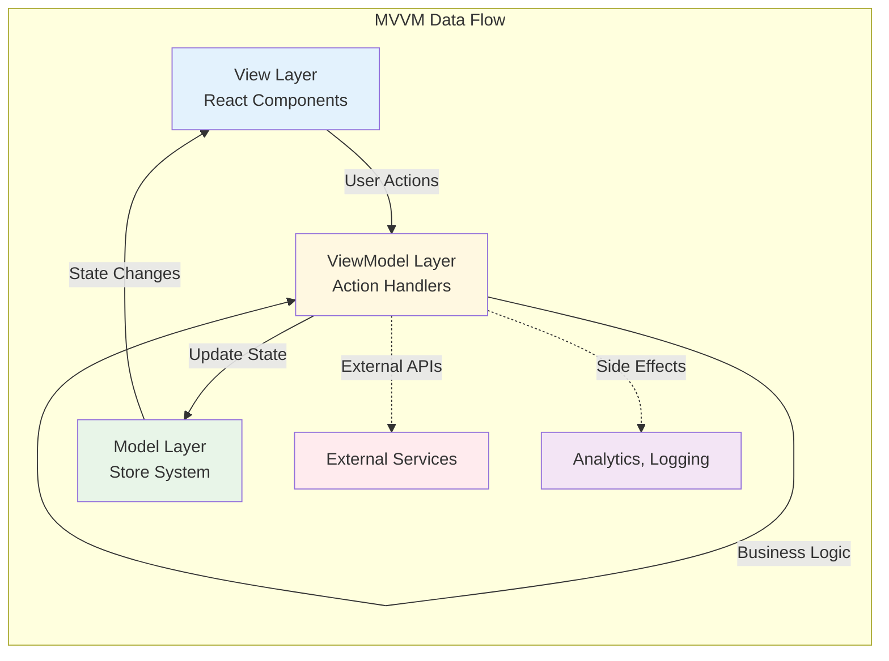

# MVVM 아키텍처

Context-Action 프레임워크는 Model-View-ViewModel(MVVM) 패턴에서 영감을 받아 React 환경에 맞게 적응된 아키텍처를 제공합니다. 이 가이드는 MVVM 원칙이 어떻게 구현되고 활용되는지 설명합니다.

## MVVM 아키텍처 개요

### 전통적인 MVVM vs Context-Action MVVM



### 계층별 책임 분리

| 계층 | 역할 | Context-Action 구현체 |
|------|------|---------------------|
| **View** | UI 렌더링, 사용자 상호작용 | React 컴포넌트 |
| **ViewModel** | 비즈니스 로직, 상태 변환 | 액션 핸들러 |
| **Model** | 데이터 상태, 영속성 | 스토어 시스템 |

## Model 계층 (스토어 시스템)

### 1. 순수한 데이터 모델

```typescript
// Model Layer - 순수한 데이터 구조
interface UserModel {
  // 엔티티 데이터
  profile: {
    id: string;
    name: string;
    email: string;
    avatar?: string;
    createdAt: string;
    updatedAt: string;
  };
  
  // 상태 데이터
  session: {
    isLoggedIn: boolean;
    token: string | null;
    expiresAt: number | null;
    lastActivity: number;
  };
  
  // 설정 데이터
  preferences: {
    theme: 'light' | 'dark';
    language: string;
    notifications: {
      email: boolean;
      push: boolean;
      sms: boolean;
    };
  };
}

// Model Layer 구현
export const {
  Provider: UserModelProvider,
  useStore: useUserModel,
  useStores: useUserModelRegistry
} = createDeclarativeStores<UserModel>('UserModel', {
  profile: {
    initialValue: {
      id: '',
      name: '',
      email: '',
      createdAt: '',
      updatedAt: ''
    },
    strategy: 'deep', // 중첩 객체 변경 감지
    validation: (value) => {
      // 데이터 검증 로직
      if (value.email && !value.email.includes('@')) {
        throw new Error('유효하지 않은 이메일 형식');
      }
      return true;
    }
  },
  session: {
    initialValue: {
      isLoggedIn: false,
      token: null,
      expiresAt: null,
      lastActivity: Date.now()
    },
    strategy: 'shallow'
  },
  preferences: {
    initialValue: {
      theme: 'light',
      language: 'ko',
      notifications: {
        email: true,
        push: true,
        sms: false
      }
    },
    strategy: 'deep'
  }
});
```

### 2. Model 계층 규칙

```typescript
// ✅ Model Layer 모범 사례
class UserModelValidator {
  // 순수한 검증 로직
  static validateProfile(profile: UserModel['profile']): ValidationResult {
    const errors: string[] = [];
    
    if (!profile.name.trim()) {
      errors.push('이름은 필수입니다');
    }
    
    if (!profile.email || !profile.email.includes('@')) {
      errors.push('유효한 이메일이 필요합니다');
    }
    
    return { isValid: errors.length === 0, errors };
  }
  
  static validateSession(session: UserModel['session']): ValidationResult {
    const errors: string[] = [];
    
    if (session.isLoggedIn && !session.token) {
      errors.push('로그인 상태에는 토큰이 필요합니다');
    }
    
    if (session.expiresAt && session.expiresAt < Date.now()) {
      errors.push('세션이 만료되었습니다');
    }
    
    return { isValid: errors.length === 0, errors };
  }
}

// Model 계층에서 사용
const profileStore = useUserModel('profile');
const currentProfile = profileStore.getValue();

// ❌ 비즈니스 로직은 Model에서 제외
// Model 계층에서는 순수한 데이터 저장/검증만 담당
```

## ViewModel 계층 (액션 핸들러)

### 1. 비즈니스 로직 캡슐화

```typescript
// ViewModel Layer - 비즈니스 로직과 상태 변환
interface UserViewModelActions {
  // 인증 비즈니스 로직
  login: { email: string; password: string; rememberMe?: boolean };
  logout: void;
  refreshSession: void;
  
  // 프로필 비즈니스 로직
  updateProfile: { data: Partial<UserModel['profile']> };
  uploadAvatar: { file: File };
  deleteAccount: { confirmation: string };
  
  // 설정 비즈니스 로직
  updatePreferences: { preferences: Partial<UserModel['preferences']> };
  exportData: void;
  importData: { data: Partial<UserModel> };
}

// ViewModel 구현
function useUserViewModel() {
  const register = useUserActionRegister();
  const modelRegistry = useUserModelRegistry();
  
  // 로그인 비즈니스 로직
  const loginHandler = useCallback(async (
    payload: UserViewModelActions['login'],
    controller: ActionController
  ) => {
    const profileStore = modelRegistry.getStore('profile');
    const sessionStore = modelRegistry.getStore('session');
    
    try {
      // 1. 입력 검증 (ViewModel 책임)
      if (!payload.email || !payload.password) {
        controller.abort('이메일과 비밀번호를 입력하세요');
        return { success: false, error: 'INVALID_INPUT' };
      }
      
      // 2. 외부 서비스 호출 (ViewModel 책임)
      const authResult = await authService.authenticate({
        email: payload.email,
        password: payload.password
      });
      
      if (!authResult.success) {
        controller.abort('로그인 실패: ' + authResult.error);
        return { success: false, error: authResult.error };
      }
      
      // 3. 데이터 변환 (ViewModel 책임)
      const transformedUser = {
        ...authResult.user,
        updatedAt: new Date().toISOString()
      };
      
      // 4. Model 업데이트 (ViewModel → Model)
      profileStore.setValue(transformedUser);
      sessionStore.setValue({
        isLoggedIn: true,
        token: authResult.token,
        expiresAt: Date.now() + (authResult.expiresIn * 1000),
        lastActivity: Date.now()
      });
      
      // 5. 부수 효과 처리 (ViewModel 책임)
      if (payload.rememberMe) {
        localStorage.setItem('rememberUser', payload.email);
      }
      
      // 6. 외부 시스템 알림 (ViewModel 책임)
      analyticsService.track('user_login', {
        userId: transformedUser.id,
        timestamp: Date.now()
      });
      
      return { success: true, user: transformedUser };
      
    } catch (error) {
      // 7. 오류 처리와 복구 (ViewModel 책임)
      controller.abort('로그인 처리 중 오류 발생', error);
      
      // 오류 상황에서의 Model 상태 복구
      sessionStore.setValue({
        isLoggedIn: false,
        token: null,
        expiresAt: null,
        lastActivity: Date.now()
      });
      
      return { success: false, error: 'NETWORK_ERROR' };
    }
  }, [modelRegistry]);
  
  // 프로필 업데이트 비즈니스 로직
  const updateProfileHandler = useCallback(async (
    payload: UserViewModelActions['updateProfile'],
    controller: ActionController
  ) => {
    const profileStore = modelRegistry.getStore('profile');
    const sessionStore = modelRegistry.getStore('session');
    
    const currentProfile = profileStore.getValue();
    const session = sessionStore.getValue();
    
    try {
      // 1. 권한 검증 (ViewModel 책임)
      if (!session.isLoggedIn) {
        controller.abort('로그인이 필요합니다');
        return { success: false, error: 'UNAUTHORIZED' };
      }
      
      // 2. 비즈니스 규칙 검증 (ViewModel 책임)
      const validation = UserModelValidator.validateProfile({
        ...currentProfile,
        ...payload.data
      });
      
      if (!validation.isValid) {
        controller.abort('검증 실패: ' + validation.errors.join(', '));
        return { success: false, error: 'VALIDATION_FAILED', details: validation.errors };
      }
      
      // 3. 낙관적 업데이트 (ViewModel 전략)
      const optimisticProfile = {
        ...currentProfile,
        ...payload.data,
        updatedAt: new Date().toISOString()
      };
      
      profileStore.setValue(optimisticProfile);
      
      // 4. 서버 동기화 (ViewModel 책임)
      const updateResult = await userService.updateProfile(currentProfile.id, payload.data);
      
      if (!updateResult.success) {
        // 실패 시 롤백
        profileStore.setValue(currentProfile);
        controller.abort('서버 업데이트 실패');
        return { success: false, error: 'SERVER_ERROR' };
      }
      
      // 5. 최종 데이터로 Model 업데이트
      profileStore.setValue(updateResult.user);
      
      return { success: true, profile: updateResult.user };
      
    } catch (error) {
      // 오류 시 롤백
      profileStore.setValue(currentProfile);
      controller.abort('프로필 업데이트 중 오류', error);
      return { success: false, error: 'UNKNOWN_ERROR' };
    }
  }, [modelRegistry]);
  
  // 핸들러 등록
  useEffect(() => {
    if (!register) return;
    
    const unregisterLogin = register('login', loginHandler, {
      id: 'user-viewmodel-login',
      priority: 100,
      blocking: true,
      category: 'authentication'
    });
    
    const unregisterUpdate = register('updateProfile', updateProfileHandler, {
      id: 'user-viewmodel-update-profile',
      priority: 100,
      blocking: true,
      category: 'profile-management'
    });
    
    return () => {
      unregisterLogin();
      unregisterUpdate();
    };
  }, [register, loginHandler, updateProfileHandler]);
}
```

### 2. ViewModel 패턴 원칙

```typescript
// ViewModel 계층 책임 분리
class UserViewModel {
  // ✅ ViewModel이 담당해야 할 것들
  
  // 1. 비즈니스 로직
  async validateAndLogin(credentials: LoginCredentials) {
    // 복잡한 로그인 로직
  }
  
  // 2. 데이터 변환
  transformUserDataForUI(rawUserData: RawUserData): UIUserData {
    return {
      displayName: rawUserData.firstName + ' ' + rawUserData.lastName,
      memberSince: new Date(rawUserData.createdAt).getFullYear(),
      // ... 기타 변환 로직
    };
  }
  
  // 3. 외부 서비스 조율
  async syncUserData(userId: string) {
    const [profile, preferences, activity] = await Promise.all([
      userService.getProfile(userId),
      preferencesService.getPreferences(userId),
      activityService.getActivity(userId)
    ]);
    
    // Model 업데이트
    this.updateModels(profile, preferences, activity);
  }
  
  // 4. 상태 조율
  coordinateLogout() {
    // 여러 Model의 상태를 조율하여 로그아웃 처리
    this.clearUserModel();
    this.clearCartModel();
    this.clearNotificationModel();
  }
  
  // ❌ ViewModel이 담당하지 말아야 할 것들
  
  // UI 렌더링 (View 계층의 책임)
  // renderUserProfile() { ... }
  
  // 순수한 데이터 저장 (Model 계층의 책임)
  // storeUserData(data) { ... }
}
```

## View 계층 (React 컴포넌트)

### 1. 순수한 프레젠테이션 계층

```typescript
// View Layer - 순수한 UI 컴포넌트
interface UserViewProps {
  // View는 데이터만 받아서 렌더링
  user: UserModel['profile'];
  session: UserModel['session'];
  preferences: UserModel['preferences'];
  
  // View는 이벤트만 발생
  onLogin: (credentials: LoginCredentials) => void;
  onLogout: () => void;
  onUpdateProfile: (data: Partial<UserModel['profile']>) => void;
}

// ✅ 순수한 View 컴포넌트 (프레젠테이션만 담당)
function UserProfileView({ user, session, preferences, onLogin, onLogout, onUpdateProfile }: UserViewProps) {
  // View는 로컬 UI 상태만 관리
  const [isEditing, setIsEditing] = useState(false);
  const [formData, setFormData] = useState(user);
  
  // View는 UI 이벤트만 처리
  const handleSubmit = useCallback((e: React.FormEvent) => {
    e.preventDefault();
    onUpdateProfile(formData); // ViewModel로 전달
    setIsEditing(false);
  }, [formData, onUpdateProfile]);
  
  // View는 순수한 렌더링만 담당
  if (!session.isLoggedIn) {
    return <LoginForm onLogin={onLogin} />;
  }
  
  return (
    <div className={`profile-view theme-${preferences.theme}`}>
      <header className="profile-header">
        
        <h1>{user.name}</h1>
        <p>{user.email}</p>
        <button onClick={onLogout}>로그아웃</button>
      </header>
      
      <main className="profile-content">
        {isEditing ? (
          <form onSubmit={handleSubmit}>
            <input
              value={formData.name}
              onChange={(e) => setFormData(prev => ({ ...prev, name: e.target.value }))}
              placeholder="이름"
            />
            <input
              type="email"
              value={formData.email}
              onChange={(e) => setFormData(prev => ({ ...prev, email: e.target.value }))}
              placeholder="이메일"
            />
            <button type="submit">저장</button>
            <button type="button" onClick={() => setIsEditing(false)}>취소</button>
          </form>
        ) : (
          <div className="profile-display">
            <p><strong>이름:</strong> {user.name}</p>
            <p><strong>이메일:</strong> {user.email}</p>
            <p><strong>가입일:</strong> {new Date(user.createdAt).toLocaleDateString()}</p>
            <button onClick={() => setIsEditing(true)}>편집</button>
          </div>
        )}
      </main>
    </div>
  );
}

// ✅ View Controller (View와 ViewModel 연결)
function UserProfileContainer() {
  // Model 구독 (MVVM의 데이터 바인딩)
  const user = useStoreValue(useUserModel('profile'));
  const session = useStoreValue(useUserModel('session'));
  const preferences = useStoreValue(useUserModel('preferences'));
  
  // ViewModel 액션 연결
  const dispatch = useUserAction();
  
  // View 이벤트를 ViewModel 액션으로 변환
  const handleLogin = useCallback((credentials: LoginCredentials) => {
    dispatch('login', credentials);
  }, [dispatch]);
  
  const handleLogout = useCallback(() => {
    dispatch('logout');
  }, [dispatch]);
  
  const handleUpdateProfile = useCallback((data: Partial<UserModel['profile']>) => {
    dispatch('updateProfile', { data });
  }, [dispatch]);
  
  // View에게 데이터와 이벤트 핸들러 전달
  return (
    <UserProfileView
      user={user}
      session={session}
      preferences={preferences}
      onLogin={handleLogin}
      onLogout={handleLogout}
      onUpdateProfile={handleUpdateProfile}
    />
  );
}
```

### 2. View 계층 패턴

```typescript
// View 컴포넌트 설계 패턴
interface ViewComponentProps<TData, TActions> {
  // 데이터 (Model에서 온 것)
  data: TData;
  
  // 로딩/오류 상태 (ViewModel에서 관리)
  loading?: boolean;
  error?: string;
  
  // 액션 콜백 (ViewModel로 전달)
  actions: TActions;
  
  // UI 설정
  className?: string;
  theme?: 'light' | 'dark';
}

// 예시: 사용자 목록 View
interface UserListData {
  users: UserModel['profile'][];
  totalCount: number;
  currentPage: number;
}

interface UserListActions {
  onLoadUsers: (page: number) => void;
  onDeleteUser: (userId: string) => void;
  onEditUser: (user: UserModel['profile']) => void;
}

function UserListView({ 
  data, 
  loading, 
  error, 
  actions, 
  className 
}: ViewComponentProps<UserListData, UserListActions>) {
  if (loading) {
    return <div className="loading">사용자 목록 로딩 중...</div>;
  }
  
  if (error) {
    return <div className="error">오류: {error}</div>;
  }
  
  return (
    <div className={`user-list ${className || ''}`}>
      <header>
        <h2>사용자 목록 ({data.totalCount}명)</h2>
      </header>
      
      <div className="user-grid">
        {data.users.map(user => (
          <UserCard
            key={user.id}
            user={user}
            onEdit={() => actions.onEditUser(user)}
            onDelete={() => actions.onDeleteUser(user.id)}
          />
        ))}
      </div>
      
      <Pagination
        currentPage={data.currentPage}
        totalPages={Math.ceil(data.totalCount / 10)}
        onPageChange={actions.onLoadUsers}
      />
    </div>
  );
}

// View Controller
function UserListContainer() {
  // Model 구독
  const users = useStoreValue(useAdminModel('userList'));
  const pagination = useStoreValue(useAdminModel('pagination'));
  
  // ViewModel 상태
  const [loading, setLoading] = useState(false);
  const [error, setError] = useState<string | null>(null);
  
  // ViewModel 액션
  const dispatch = useAdminAction();
  
  const actions: UserListActions = {
    onLoadUsers: useCallback(async (page: number) => {
      setLoading(true);
      setError(null);
      try {
        await dispatch('loadUsers', { page });
      } catch (err) {
        setError(err instanceof Error ? err.message : '사용자 로드 실패');
      } finally {
        setLoading(false);
      }
    }, [dispatch]),
    
    onDeleteUser: useCallback(async (userId: string) => {
      if (confirm('정말 삭제하시겠습니까?')) {
        try {
          await dispatch('deleteUser', { userId });
        } catch (err) {
          setError(err instanceof Error ? err.message : '사용자 삭제 실패');
        }
      }
    }, [dispatch]),
    
    onEditUser: useCallback((user: UserModel['profile']) => {
      dispatch('openUserEditor', { user });
    }, [dispatch])
  };
  
  const data: UserListData = {
    users,
    totalCount: pagination.total,
    currentPage: pagination.current
  };
  
  return (
    <UserListView
      data={data}
      loading={loading}
      error={error}
      actions={actions}
    />
  );
}
```

## MVVM 통합 패턴

### 1. 단방향 데이터 흐름



### 2. 실제 구현 예시

```typescript
// 완전한 MVVM 패턴 구현 예시
export function useUserMVVM() {
  // Model Layer
  const userModel = useUserModel('profile');
  const sessionModel = useUserModel('session');
  const preferencesModel = useUserModel('preferences');
  
  // ViewModel Layer
  useUserViewModel(); // 핸들러들이 등록됨
  
  // View Layer 데이터 (Model → View)
  const viewData = {
    profile: useStoreValue(userModel),
    session: useStoreValue(sessionModel),
    preferences: useStoreValue(preferencesModel)
  };
  
  // View Layer 액션 (View → ViewModel)
  const dispatch = useUserAction();
  const viewActions = {
    login: useCallback((credentials: LoginCredentials) => {
      return dispatch('login', credentials);
    }, [dispatch]),
    
    logout: useCallback(() => {
      return dispatch('logout');
    }, [dispatch]),
    
    updateProfile: useCallback((data: Partial<UserModel['profile']>) => {
      return dispatch('updateProfile', { data });
    }, [dispatch]),
    
    updatePreferences: useCallback((preferences: Partial<UserModel['preferences']>) => {
      return dispatch('updatePreferences', { preferences });
    }, [dispatch])
  };
  
  return {
    data: viewData,
    actions: viewActions
  };
}

// 사용법
function UserApp() {
  const { data, actions } = useUserMVVM();
  
  return (
    <UserModelProvider>
      <UserActionProvider>
        <UserProfileView
          user={data.profile}
          session={data.session}
          preferences={data.preferences}
          onLogin={actions.login}
          onLogout={actions.logout}
          onUpdateProfile={actions.updateProfile}
        />
      </UserActionProvider>
    </UserModelProvider>
  );
}
```

## 모범 사례

### 1. 계층별 책임 분리

```typescript
// ✅ 올바른 계층별 책임 분리

// Model: 순수한 데이터와 검증
interface UserModel {
  profile: UserProfile;
  // 비즈니스 로직 없음, 순수한 데이터만
}

// ViewModel: 비즈니스 로직과 상태 조율
class UserViewModel {
  async handleLogin(credentials) {
    // 복잡한 로그인 로직
    // 외부 API 호출
    // 상태 변환
    // Model 업데이트
  }
}

// View: 순수한 UI 렌더링
function UserView({ data, actions }) {
  // UI 로직만, 비즈니스 로직 없음
  return <div>{data.name}</div>;
}

// ❌ 잘못된 책임 분리

// Model에 비즈니스 로직 (X)
interface BadUserModel {
  profile: UserProfile;
  loginUser: (credentials) => Promise<void>; // ViewModel 책임
}

// View에 비즈니스 로직 (X)
function BadUserView() {
  const handleLogin = async () => {
    // 복잡한 로그인 로직 - ViewModel 책임
    const result = await fetch('/api/login', ...);
    // ...
  };
  // ...
}
```

### 2. 데이터 흐름 관리

```typescript
// ✅ 단방향 데이터 흐름 준수
function ProperDataFlow() {
  // View → ViewModel (액션)
  const dispatch = useUserAction();
  
  // Model → View (상태)
  const user = useStoreValue(useUserModel('profile'));
  
  // 올바른 흐름: View → ViewModel → Model → View
  const handleUpdate = (data) => {
    dispatch('updateProfile', { data }); // View → ViewModel
    // ViewModel이 Model 업데이트
    // Model이 View에 자동 반영
  };
}

// ❌ 양방향 데이터 흐름 (피하기)
function ImproperDataFlow() {
  const userStore = useUserModel('profile');
  
  const handleUpdate = (data) => {
    // View에서 직접 Model 조작 (X)
    userStore.setValue(data);
  };
}
```

---

## 요약

Context-Action의 MVVM 아키텍처는 다음 이점을 제공합니다:

- **명확한 관심사 분리** - 각 계층의 책임이 명확함
- **테스트 가능성** - 각 계층을 독립적으로 테스트
- **유지보수성** - 변경사항의 영향 범위가 제한됨
- **재사용성** - View와 ViewModel의 독립적 재사용
- **확장성** - 계층별 독립적 확장 가능

MVVM 패턴을 올바르게 구현하면 복잡한 애플리케이션도 체계적으로 관리할 수 있습니다.

---

::: tip 다음 단계
- [성능 최적화](./performance) - MVVM 아키텍처 성능 최적화
- [모범 사례](./best-practices) - 실제 프로덕션 환경 권장사항
- [공통 함정](./common-pitfalls) - MVVM 구현 시 주의사항
:::