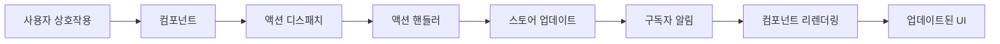

# Context-Action에서의 MVVM 아키텍처

## 개요

Context-Action 프레임워크는 전통적인 Model-View-ViewModel 아키텍처를 중앙집중식 상태 관리와 함께 사용하는 현대적인 React 애플리케이션에 맞게 적응시킨 **MVVM 패턴**을 통해 깔끔한 관심사의 분리를 구현합니다.

### 아키텍처 레이어

- **🎨 View 레이어**: React 컴포넌트 (프레젠테이션)
- **⚡ ViewModel 레이어**: 액션 핸들러 (비즈니스 로직)  
- **📦 Model 레이어**: 스토어 (상태 관리)

### 주요 장점

- **깔끔한 분리**: 프레젠테이션, 로직, 데이터 간의 명확한 경계
- **테스트 가능성**: 각 레이어를 독립적으로 테스트 가능
- **재사용성**: 비즈니스 로직을 컴포넌트 간에 공유 가능
- **타입 안전성**: 모든 레이어에 걸쳐 완전한 TypeScript 지원
- **성능**: 선택적 스토어 구독을 통한 최적화된 리렌더링

## 핵심 개념

### 1. 🎨 View 레이어 (React 컴포넌트)

View 레이어의 컴포넌트는 다음을 담당합니다:
- **프레젠테이션**: 스토어 상태를 기반으로 UI 렌더링
- **사용자 상호작용**: 사용자 이벤트를 캡처하고 액션 디스패치
- **스토어 구독**: 구독한 스토어가 변경될 때 자동으로 리렌더링

```typescript
function UserProfile() {
  // 스토어 구독 (Model 레이어)
  const user = useStoreValue(userStore);
  const settings = useStoreValue(settingsStore);
  
  // 액션 디스패처 가져오기 (ViewModel 레이어)
  const dispatch = useActionDispatch();
  
  // 사용자 상호작용 처리
  const updateUserName = (name: string) => {
    dispatch('updateUser', { id: user.id, name });
  };
  
  return (
    <div>
      <h1>{user.name}</h1>
      <input 
        value={user.name}
        onChange={(e) => updateUserName(e.target.value)}
      />
      <span>테마: {settings.theme}</span>
    </div>
  );
}
```

#### 컴포넌트 책임

- ✅ **해야 할 것**: 프레젠테이션과 사용자 상호작용 처리
- ✅ **해야 할 것**: 관련 스토어 구독
- ✅ **해야 할 것**: 페이로드와 함께 액션 디스패치
- ❌ **하지 말 것**: 비즈니스 로직 포함
- ❌ **하지 말 것**: 스토어 상태 직접 조작
- ❌ **하지 말 것**: API 호출이나 사이드 이펙트

### 2. ⚡ ViewModel 레이어 (액션 핸들러)

액션 핸들러는 ViewModel 레이어 역할을 하며 다음을 포함합니다:
- **비즈니스 로직**: 핵심 애플리케이션 로직과 규칙
- **상태 조정**: 여러 스토어 읽기 및 업데이트
- **사이드 이펙트**: API 호출, 외부 서비스 통합
- **검증**: 입력 검증 및 에러 처리

```typescript
// ViewModel 역할을 하는 액션 핸들러
actionRegister.register('updateUser', async (payload: { id: string; name: string }, controller) => {
  // Model 레이어에서 현재 상태 읽기
  const currentUser = userStore.getValue();
  const settings = settingsStore.getValue();
  const permissions = permissionsStore.getValue();
  
  // 비즈니스 로직 검증
  if (!permissions.canEditProfile) {
    controller.abort('권한이 부족합니다');
    return;
  }
  
  if (settings.validateNames && !isValidName(payload.name)) {
    controller.abort('유효하지 않은 이름 형식입니다');
    return;
  }
  
  // 비즈니스 로직 실행
  const updatedUser = {
    ...currentUser,
    ...payload,
    lastModified: Date.now(),
    version: currentUser.version + 1
  };
  
  // Model 레이어 업데이트
  userStore.setValue(updatedUser);
  
  // 활동 로그 (사이드 이펙트)
  activityStore.update(activities => [...activities, {
    type: 'user_updated',
    userId: payload.id,
    timestamp: Date.now()
  }]);
  
  // 비동기 사이드 이펙트 (API 호출)
  try {
    await api.updateUser(updatedUser);
  } catch (error) {
    // 실패 시 롤백
    userStore.setValue(currentUser);
    controller.abort('변경사항 저장에 실패했습니다');
  }
});
```

#### 액션 핸들러 책임

- ✅ **해야 할 것**: 비즈니스 로직과 검증 구현
- ✅ **해야 할 것**: 여러 스토어 조정
- ✅ **해야 할 것**: 비동기 작업과 사이드 이펙트 처리
- ✅ **해야 할 것**: 에러 처리와 롤백 제공
- ❌ **하지 말 것**: DOM 직접 조작
- ❌ **하지 말 것**: 프레젠테이션 로직 처리
- ❌ **하지 말 것**: 로컬 상태 유지

### 3. 📦 Model 레이어 (스토어)

Model 레이어의 스토어는 다음을 처리합니다:
- **상태 저장**: 중앙집중식 애플리케이션 상태
- **상태 업데이트**: 제어된 상태 변경
- **변경 알림**: 자동 컴포넌트 리렌더링
- **데이터 지속성**: 외부 저장소와의 통합

```typescript
// 스토어 정의 (Model 레이어)
interface User {
  id: string;
  name: string;
  email: string;
  lastModified: number;
  version: number;
}

const userStore = createStore<User>({
  id: '',
  name: '',
  email: '',
  lastModified: 0,
  version: 0
});

// 계산된 값을 가진 스토어
const userDisplayStore = createComputedStore([userStore, settingsStore], 
  (user, settings) => ({
    displayName: settings.showFullName ? user.name : user.name.split(' ')[0],
    avatar: generateAvatar(user.id, settings.theme),
    status: user.lastModified > Date.now() - 300000 ? 'active' : 'away'
  })
);
```

#### 스토어 책임

- ✅ **해야 할 것**: 애플리케이션 상태 관리
- ✅ **해야 할 것**: 데이터에 대한 제어된 접근 제공
- ✅ **해야 할 것**: 변경사항을 구독자에게 알림
- ✅ **해야 할 것**: 영속성 레이어와 통합
- ❌ **하지 말 것**: 비즈니스 로직 포함
- ❌ **하지 말 것**: UI 관련 처리
- ❌ **하지 말 것**: 직접 API 호출

## 아키텍처 패턴

### 1. 단방향 데이터 플로우



**플로우 설명**:
1. **사용자 상호작용**: 사용자가 액션 수행 (클릭, 입력 등)
2. **컴포넌트**: 상호작용을 캡처하고 액션 디스패치
3. **액션 핸들러**: ViewModel 레이어에서 비즈니스 로직 실행
4. **스토어 업데이트**: 액션 핸들러가 Model 레이어의 관련 스토어 업데이트
5. **컴포넌트 리렌더링**: 구독한 컴포넌트가 자동으로 리렌더링
6. **업데이트된 UI**: 사용자가 상호작용의 결과를 확인

### 2. 크로스 스토어 조정

```typescript
// 예제: 쇼핑카트 체크아웃 조정
actionRegister.register('checkout', async (payload, controller) => {
  // 여러 스토어에서 읽기 (Model 레이어)
  const cart = cartStore.getValue();
  const user = userStore.getValue();
  const inventory = inventoryStore.getValue();
  const payment = paymentStore.getValue();
  
  // 비즈니스 검증 (ViewModel 로직)
  if (cart.items.length === 0) {
    controller.abort('장바구니가 비어있습니다');
    return;
  }
  
  if (!payment.isValid) {
    controller.abort('유효하지 않은 결제 수단입니다');
    return;
  }
  
  // 재고 가용성 확인
  const unavailableItems = cart.items.filter(item => 
    inventory[item.id] < item.quantity
  );
  
  if (unavailableItems.length > 0) {
    controller.abort('일부 상품이 더 이상 사용할 수 없습니다');
    return;
  }
  
  // 조정된 업데이트 실행 (Model 레이어 업데이트)
  const order = {
    id: generateOrderId(),
    userId: user.id,
    items: cart.items,
    total: calculateTotal(cart.items),
    status: 'processing',
    createdAt: Date.now()
  };
  
  // 원자적 업데이트
  orderStore.setValue(order);
  cartStore.setValue({ items: [] });
  inventoryStore.update(inv => updateInventory(inv, cart.items));
  
  // 사이드 이펙트: API 호출
  try {
    await api.processOrder(order);
    orderStore.update(o => ({ ...o, status: 'confirmed' }));
  } catch (error) {
    // 롤백 전략
    orderStore.setValue(null);
    cartStore.setValue(cart);
    inventoryStore.update(inv => restoreInventory(inv, cart.items));
    controller.abort('결제 처리에 실패했습니다');
  }
});
```

### 3. 계산된 값과 파생 상태

```typescript
// 파생 상태 패턴 
const shoppingCartSummary = createComputedStore(
  [cartStore, inventoryStore, userStore], 
  (cart, inventory, user) => {
    const availableItems = cart.items.filter(item => 
      inventory[item.id] >= item.quantity
    );
    
    const subtotal = availableItems.reduce((sum, item) => 
      sum + (item.price * item.quantity), 0
    );
    
    const discount = calculateDiscount(user.membershipLevel, subtotal);
    const tax = calculateTax(user.location, subtotal - discount);
    
    return {
      itemCount: availableItems.length,
      subtotal,
      discount,
      tax,
      total: subtotal - discount + tax,
      hasUnavailableItems: availableItems.length < cart.items.length
    };
  }
);
```

## 설계 원칙

### 1. 🔄 지연 평가
- 스토어 값은 실행 시점에 검색되어 항상 최신 값 보장
- 오래된 클로저 문제 없음
- 액션 핸들러에서 항상 최신 상태

### 2. 🧩 관심사의 분리
- 레이어 간 명확한 경계
- 각 레이어의 고유한 책임
- 레이어 간 최소한의 결합

### 3. 🎯 타입 안전성
- 모든 레이어에 걸친 강력한 타이핑
- 컴파일 타임 에러 감지
- 향상된 개발자 경험

### 4. 🧪 테스트 가능성
- 각 레이어의 독립적 테스트
- 액션 테스트를 위한 모의 스토어
- 컴포넌트 테스트를 위한 모의 액션

### 5. ⚡ 성능
- 선택적 컴포넌트 리렌더링
- 효율적인 스토어 구독 관리
- 최적화된 크로스 스토어 작업

## React와의 통합

### Provider 설정

```typescript
function App() {
  return (
    <StoreProvider>
      <ActionProvider>
        {/* 액션 핸들러 등록 */}
        <ActionHandlerRegistry />
        <Application />
      </ActionProvider>
    </StoreProvider>
  );
}

function ActionHandlerRegistry() {
  useUserActions();    // 사용자 관련 액션 등록
  useCartActions();    // 장바구니 관련 액션 등록
  useOrderActions();   // 주문 관련 액션 등록
  return null;
}
```

### 컴포넌트 통합 패턴

```typescript
// 1. 간단한 스토어 구독
function UserName() {
  const user = useStoreValue(userStore);
  return <span>{user.name}</span>;
}

// 2. 여러 스토어 구독
function Dashboard() {
  const user = useStoreValue(userStore);
  const cart = useStoreValue(cartStore);
  const orders = useStoreValue(ordersStore);
  
  return (
    <div>
      <UserHeader user={user} />
      <CartSummary cart={cart} />
      <OrderHistory orders={orders} />
    </div>
  );
}

// 3. 계산된 스토어 구독
function CartCheckout() {
  const summary = useStoreValue(shoppingCartSummary);
  const dispatch = useActionDispatch();
  
  const handleCheckout = () => {
    dispatch('checkout', { paymentMethod: 'card' });
  };
  
  return (
    <div>
      <div>상품: {summary.itemCount}</div>
      <div>총계: ${summary.total}</div>
      {summary.hasUnavailableItems && (
        <div>일부 상품이 더 이상 사용할 수 없습니다</div>
      )}
      <button onClick={handleCheckout}>결제하기</button>
    </div>
  );
}
```

## 고급 패턴

### 1. 🔄 로딩 상태가 있는 비동기 작업

```typescript
actionRegister.register('fetchUserProfile', async (payload, controller) => {
  // 로딩 상태 설정
  uiStore.update(ui => ({ ...ui, loading: true, error: null }));
  
  try {
    const response = await api.getUserProfile(payload.userId);
    
    // 응답 데이터로 여러 스토어 업데이트
    userStore.setValue(response.user);
    preferencesStore.setValue(response.preferences);
    activityStore.setValue(response.recentActivity);
    
  } catch (error) {
    uiStore.update(ui => ({ ...ui, error: error.message }));
    controller.abort('사용자 프로필 로드에 실패했습니다');
  } finally {
    uiStore.update(ui => ({ ...ui, loading: false }));
  }
});
```

### 2. 🏗️ 액션을 사용한 상태 머신

```typescript
enum OrderStatus {
  DRAFT = 'draft',
  PROCESSING = 'processing',
  CONFIRMED = 'confirmed',
  SHIPPED = 'shipped',
  DELIVERED = 'delivered',
  CANCELLED = 'cancelled'
}

const orderStateMachine = {
  [OrderStatus.DRAFT]: [OrderStatus.PROCESSING, OrderStatus.CANCELLED],
  [OrderStatus.PROCESSING]: [OrderStatus.CONFIRMED, OrderStatus.CANCELLED],
  [OrderStatus.CONFIRMED]: [OrderStatus.SHIPPED, OrderStatus.CANCELLED],
  [OrderStatus.SHIPPED]: [OrderStatus.DELIVERED],
  [OrderStatus.DELIVERED]: [],
  [OrderStatus.CANCELLED]: []
};

actionRegister.register('updateOrderStatus', async (payload, controller) => {
  const currentOrder = orderStore.getValue();
  const allowedTransitions = orderStateMachine[currentOrder.status];
  
  if (!allowedTransitions.includes(payload.newStatus)) {
    controller.abort(`${currentOrder.status}에서 ${payload.newStatus}로의 상태 전환이 유효하지 않습니다`);
    return;
  }
  
  orderStore.update(order => ({
    ...order,
    status: payload.newStatus,
    updatedAt: Date.now()
  }));
});
```

### 3. 🎯 이벤트 소싱 패턴

```typescript
interface Event {
  id: string;
  type: string;
  payload: any;
  timestamp: number;
  userId: string;
}

actionRegister.register('processEvent', async (event: Event, controller) => {
  // 이벤트 로그에 이벤트 저장
  eventStore.update(events => [...events, event]);
  
  // 이벤트 타입에 따라 적절한 스토어에 이벤트 적용
  switch (event.type) {
    case 'USER_UPDATED':
      userStore.update(user => ({ ...user, ...event.payload }));
      break;
      
    case 'ITEM_ADDED_TO_CART':
      cartStore.update(cart => ({
        ...cart,
        items: [...cart.items, event.payload.item]
      }));
      break;
      
    case 'ORDER_PLACED':
      orderStore.setValue(event.payload.order);
      cartStore.setValue({ items: [] });
      break;
  }
  
  // 파생 상태 업데이트
  dispatch('recalculateAggregates', { eventType: event.type });
});
```

## 모범 사례

### ✅ 해야 할 것

1. **액션을 집중적으로 유지**: 하나의 액션은 하나의 비즈니스 작업을 처리해야 함
2. **타입 안전성 사용**: 모든 레이어에서 TypeScript 활용
3. **에러를 우아하게 처리**: 항상 에러 처리와 롤백 전략 제공
4. **각 레이어 테스트**: 액션의 단위 테스트, 스토어의 통합 테스트 작성
5. **비즈니스 로직 문서화**: 액션 핸들러의 복잡한 비즈니스 규칙에 주석 작성
6. **계산된 스토어 사용**: 여러 스토어에 의존하는 파생 상태용
7. **로딩 상태 구현**: 비동기 작업에 대한 로딩 표시기 제공

### ❌ 하지 말 것

1. **관심사를 혼합하지 말 것**: 액션 핸들러에 프레젠테이션 로직을 넣지 말 것
2. **에러 처리를 건너뛰지 말 것**: 항상 잠재적 실패 시나리오 처리
3. **성능을 무시하지 말 것**: 리렌더링 패턴을 모니터링하고 구독 최적화
4. **패턴을 우회하지 말 것**: 컴포넌트에서 직접 스토어 조작을 피할 것
5. **정리를 잊지 말 것**: 구독과 사이드 이펙트를 적절히 정리할 것
6. **과도하게 복잡하게 만들지 말 것**: 간단하게 시작하고 필요할 때만 복잡성 추가

## 마이그레이션 가이드

### Redux에서 Context-Action MVVM으로

```typescript
// 이전: Redux 접근 방식
const userSlice = createSlice({
  name: 'user',
  initialState: { id: '', name: '', loading: false },
  reducers: {
    updateUserStart: (state) => {
      state.loading = true;
    },
    updateUserSuccess: (state, action) => {
      state.loading = false;
      Object.assign(state, action.payload);
    },
    updateUserFailure: (state) => {
      state.loading = false;
    }
  }
});

// 이후: Context-Action MVVM 접근 방식
const userStore = createStore({ id: '', name: '' });
const uiStore = createStore({ loading: false, error: null });

actionRegister.register('updateUser', async (payload, controller) => {
  uiStore.update(ui => ({ ...ui, loading: true, error: null }));
  
  try {
    const updatedUser = await api.updateUser(payload);
    userStore.setValue(updatedUser);
  } catch (error) {
    uiStore.update(ui => ({ ...ui, error: error.message }));
    controller.abort('업데이트 실패');
  } finally {
    uiStore.update(ui => ({ ...ui, loading: false }));
  }
});
```

## 성능 고려사항

### 1. 스토어 구독 최적화

```typescript
// ❌ 비효율적: 전체 스토어 구독
function UserProfile() {
  const user = useStoreValue(userStore); // 모든 사용자 변경 시 리렌더링
  return <div>{user.name}</div>;
}

// ✅ 효율적: 선택적 구독
function UserProfile() {
  const userName = useStoreValue(userStore, user => user.name); // 이름 변경 시에만 리렌더링
  return <div>{userName}</div>;
}
```

### 2. 배치 스토어 업데이트

```typescript
// ❌ 여러 개별 업데이트
actionRegister.register('updateUserProfile', async (payload, controller) => {
  userStore.update(user => ({ ...user, name: payload.name }));
  userStore.update(user => ({ ...user, email: payload.email }));
  userStore.update(user => ({ ...user, phone: payload.phone }));
});

// ✅ 단일 배치 업데이트
actionRegister.register('updateUserProfile', async (payload, controller) => {
  userStore.update(user => ({
    ...user,
    name: payload.name,
    email: payload.email,
    phone: payload.phone
  }));
});
```

## 관련 자료

- [아키텍처 개요](./architecture.md) - 구현 패턴을 포함한 포괄적인 아키텍처 가이드
- [아키텍처 다이어그램](./architecture-diagrams.md) - 시스템 아키텍처의 시각적 다이어그램
- [스토어 통합 가이드](./store-integration.md) - 상세한 스토어 조정 패턴
- [데이터 플로우 패턴](./data-flow-patterns.md) - 고급 데이터 플로우 기법
- [모범 사례](./best-practices.md) - 개발 모범 사례
- [API 참조](/api/core/) - 핵심 API 문서
- [예제](/examples/mvvm-patterns/) - 실용적인 MVVM 예제