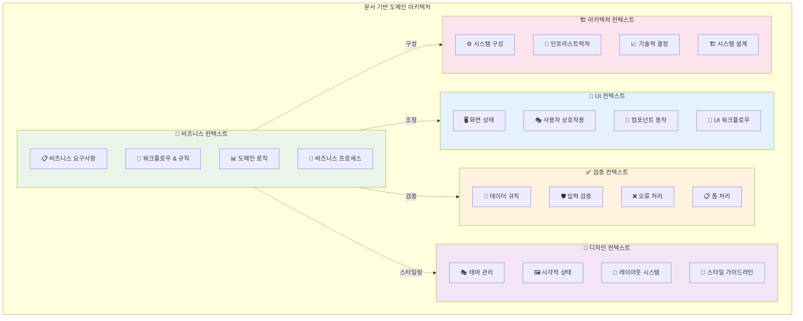

# 도메인 컨텍스트 아키텍처 패턴

Context-Action 프레임워크를 사용한 멀티 도메인 애플리케이션을 위한 문서 중심 도메인 분리 아키텍처.

## 패턴 개요

도메인 컨텍스트 아키텍처는 비즈니스 도메인과 해당 문서를 중심으로 애플리케이션 아키텍처를 구성합니다:

- **Business Context**: 핵심 비즈니스 로직과 도메인 규칙
- **UI Context**: 화면 상태와 사용자 상호작용  
- **Validation Context**: 데이터 검증과 오류 처리
- **Design Context**: 테마 관리와 시각적 상태
- **Architecture Context**: 시스템 구성과 기술적 결정

## 컨텍스트 분리 전략



## 사전 요구사항

타입 정의, 멀티 도메인 컨텍스트, 프로바이더 구성을 포함한 완전한 도메인 컨텍스트 설정 지침은 **[멀티 컨텍스트 설정 - 도메인 컨텍스트 아키텍처](../setup/multi-context-setup.md#domain-context-architecture-setup)**를 참조하세요.

이 문서는 도메인 컨텍스트 설정을 사용한 구현 패턴을 보여줍니다:
- 타입 정의 → [비즈니스 도메인 설정](../setup/multi-context-setup.md#business-domain-setup)
- 컨텍스트 생성 → [검증 도메인 설정](../setup/multi-context-setup.md#validation-domain-setup)
- 프로바이더 구성 → [도메인 기반 구성](../setup/multi-context-setup.md#domain-based-composition)

## 도메인 구현 패턴

### 비즈니스 컨텍스트 구현

```typescript
// 구성된 컨텍스트를 사용한 비즈니스 도메인 구현
function useBusinessLogic() {
  const businessDispatch = useBusinessActionDispatch();
  const businessManager = useBusinessStoreManager();
  
  const processOrderHandler = useCallback(async (payload, controller) => {
    try {
      const ordersStore = businessManager.getStore('orders');
      const inventoryStore = businessManager.getStore('inventory');
      
      // 비즈니스 로직 구현
      const order = await orderAPI.create(payload);
      ordersStore.update(orders => [...orders, order]);
      
      // 재고 업데이트
      inventoryStore.update(inventory => 
        updateInventoryAfterOrder(inventory, payload.items)
      );
      
    } catch (error) {
      controller.abort('주문 처리 실패', error);
    }
  }, [businessManager]);
  
  useBusinessActionHandler('processOrder', processOrderHandler);
}
```

### UI 컨텍스트 구현

UI 컨텍스트는 **[멀티 컨텍스트 설정 - UI 도메인](../setup/multi-context-setup.md#ui-domain)**의 명세를 사용합니다:

```typescript
// 설정 명세를 사용한 UI 컨텍스트 구현
function useUILogic() {
  const uiDispatch = useUIActionDispatch();
  const uiManager = useUIStoreManager();
  
  const showModalHandler = useCallback(async (payload) => {
    const modalStore = uiManager.getStore('modal');
    modalStore.setValue({ isOpen: true, type: payload.type, data: payload.data });
  }, [uiManager]);
  
  const hideModalHandler = useCallback(async () => {
    const modalStore = uiManager.getStore('modal');
    modalStore.setValue({ isOpen: false, type: undefined, data: undefined });
  }, [uiManager]);
  
  useUIActionHandler('showModal', showModalHandler);
  useUIActionHandler('hideModal', hideModalHandler);
}
```

### 검증 컨텍스트 구현

검증 컨텍스트는 **[멀티 컨텍스트 설정 - 검증 도메인 설정](../setup/multi-context-setup.md#validation-domain-setup)**의 명세를 사용합니다:

```typescript
// 설정 명세를 사용한 검증 컨텍스트 구현
function useValidationLogic() {
  const validationDispatch = useValidationActionDispatch();
  const validationManager = useValidationStoreManager();
  
  const validateFieldHandler = useCallback(async (payload) => {
    const { fieldName, value, rules } = payload;
    const validationResults = await validateFieldValue(value, rules);
    
    const fieldStatusesStore = validationManager.getStore('fieldStatuses');
    const formErrorsStore = validationManager.getStore('formErrors');
    
    if (validationResults.isValid) {
      fieldStatusesStore.update(statuses => ({ ...statuses, [fieldName]: 'valid' }));
      formErrorsStore.update(errors => {
        const newErrors = { ...errors };
        delete newErrors[fieldName];
        return newErrors;
      });
    } else {
      fieldStatusesStore.update(statuses => ({ ...statuses, [fieldName]: 'invalid' }));
      formErrorsStore.update(errors => ({ 
        ...errors, 
        [fieldName]: validationResults.errors 
      }));
    }
  }, [validationManager]);
  
  useValidationActionHandler('validateField', validateFieldHandler);
}
```

### 디자인 컨텍스트 구현

디자인 컨텍스트는 **[멀티 컨텍스트 설정 - 디자인 시스템 컨텍스트 설정](../setup/multi-context-setup.md#design-system-context-setup)**의 명세를 사용합니다:

```typescript
// 설정 명세를 사용한 디자인 컨텍스트 구현
function useDesignLogic() {
  const designDispatch = useDesignActionDispatch();
  const designManager = useDesignStoreManager();
  
  const changeColorSchemeHandler = useCallback(async (payload) => {
    const colorSchemeStore = designManager.getStore('colorScheme');
    colorSchemeStore.setValue(payload.scheme);
    
    // 색상 스킴에 기반한 테마 업데이트
    const themeStore = designManager.getStore('theme');
    const currentTheme = themeStore.getValue();
    const updatedTheme = applyColorScheme(currentTheme, payload.scheme);
    themeStore.setValue(updatedTheme);
  }, [designManager]);
  
  const updateBreakpointHandler = useCallback(async (payload) => {
    const breakpointStore = designManager.getStore('breakpoint');
    breakpointStore.setValue(payload.breakpoint);
  }, [designManager]);
  
  useDesignActionHandler('changeColorScheme', changeColorSchemeHandler);
  useDesignActionHandler('updateBreakpoint', updateBreakpointHandler);
}
```

### 도메인 간 조정

```typescript
// hooks/useCrossDomainActions.ts
export function useOrderProcessingWorkflow() {
  const businessManager = useBusinessStoreManager();
  const uiManager = useUIStoreManager();
  const validationManager = useValidationStoreManager();
  
  const processOrderHandler = useCallback(async (payload, controller) => {
    // 1. UI 컨텍스트 - 로딩 표시
    const screenStateStore = uiManager.getStore('screenState');
    screenStateStore.update(state => ({ ...state, isLoading: true }));
    
    // 2. 검증 컨텍스트 - 주문 검증
    const validationResult = await validateOrderData(payload);
    if (!validationResult.isValid) {
      const fieldErrorsStore = validationManager.getStore('fieldErrors');
      fieldErrorsStore.setValue(validationResult.errors);
      controller.abort('검증 실패');
      return;
    }
    
    // 3. 비즈니스 컨텍스트 - 주문 처리
    try {
      const order = await orderAPI.create(payload);
      const ordersStore = businessManager.getStore('orders');
      ordersStore.update(orders => [...orders, order]);
      
      // 4. UI 컨텍스트 - 성공 알림 표시
      screenStateStore.update(state => ({
        ...state,
        isLoading: false,
        notifications: [...state.notifications, {
          message: '주문이 성공적으로 처리되었습니다',
          type: 'success'
        }]
      }));
      
      return { success: true, orderId: order.id };
    } catch (error) {
      screenStateStore.update(state => ({ ...state, isLoading: false }));
      controller.abort('주문 처리 실패', error);
    }
  }, [businessManager, uiManager, validationManager]);
  
  useBusinessActionHandler('processOrder', processOrderHandler);
}
```

### 애플리케이션 구성

**[멀티 컨텍스트 설정 - 도메인 기반 구성](../setup/multi-context-setup.md#domain-based-composition)**을 사용합니다:

```tsx
// App.tsx - 설정 명세를 사용한 도메인 기반 구성
function DomainContextApp() {
  // 설정 명세에서 구성된 프로바이더 사용
  const DomainProviders = composeProviders([
    // 핵심 비즈니스 도메인
    BusinessModelProvider,
    BusinessViewModelProvider,
    
    // 사용자 인터페이스 도메인  
    UIModelProvider,
    UIViewModelProvider,
    
    // 검증 도메인
    ValidationModelProvider,
    ValidationViewModelProvider,
    
    // 디자인 시스템 도메인
    DesignModelProvider,
    DesignViewModelProvider
  ]);
  
  return (
    <DomainProviders>
      {/* 도메인 간 조정 */}
      <CrossDomainHandlers />
      
      {/* 애플리케이션 컴포넌트 */}
      <OrderManagementScreen />
      <InventoryScreen />
      <CustomerScreen />
    </DomainProviders>
  );
}

function CrossDomainHandlers() {
  // 도메인 간 워크플로우 등록
  useOrderProcessingWorkflow();
  useCustomerValidationWorkflow();
  useInventoryUpdateWorkflow();
  useUINotificationWorkflow();
  
  return null;
}
```

## 도메인 책임

### 비즈니스 컨텍스트
- ✅ 핵심 비즈니스 로직과 규칙
- ✅ 도메인 엔티티 관리
- ✅ 비즈니스 프로세스 오케스트레이션
- ✅ 데이터 변환과 처리
- ❌ UI 프레젠테이션 관련 사항
- ❌ 시각적 스타일링 결정
- ❌ 입력 검증 규칙

### UI 컨텍스트
- ✅ 화면 상태 관리
- ✅ 사용자 상호작용 처리
- ✅ 네비게이션과 라우팅
- ✅ 모달과 오버레이 관리
- ❌ 비즈니스 로직 구현
- ❌ 데이터 검증 규칙
- ❌ 시각적 테마 관리

### 검증 컨텍스트
- ✅ 입력 검증 규칙
- ✅ 폼 검증 로직
- ✅ 오류 메시지 관리
- ✅ 데이터 무결성 검사
- ❌ 비즈니스 프로세스 로직
- ❌ UI 상태 관리
- ❌ 시각적 스타일링

### 디자인 컨텍스트
- ✅ 테마와 시각적 상태
- ✅ 레이아웃 구성
- ✅ 스타일 관리
- ✅ 반응형 디자인 상태
- ❌ 비즈니스 로직
- ❌ 데이터 검증
- ❌ 사용자 상호작용 로직

### 아키텍처 컨텍스트
- ✅ 시스템 구성
- ✅ 인프라스트럭처 설정
- ✅ 기술적 파라미터
- ✅ 환경 관리
- ❌ 비즈니스 도메인 로직
- ❌ 사용자 인터페이스 관련 사항
- ❌ 시각적 프레젠테이션

## 문서 중심 디자인

각 컨텍스트는 특정 문서에 대응됩니다:

### 비즈니스 문서 → 비즈니스 컨텍스트
- 요구사항 문서
- 비즈니스 프로세스 플로우
- 도메인 모델
- 사용자 스토리

### UI 명세 → UI 컨텍스트  
- 와이어프레임과 목업
- 사용자 상호작용 플로우
- 화면 명세
- 네비게이션 맵

### 검증 명세 → 검증 컨텍스트
- 검증 규칙 문서
- 오류 처리 절차
- 데이터 무결성 요구사항
- 폼 검증 명세

### 디자인 가이드라인 → 디자인 컨텍스트
- 스타일 가이드
- 디자인 시스템
- 테마 명세
- 브랜딩 가이드라인

### 아키텍처 문서 → 아키텍처 컨텍스트
- 시스템 아키텍처 다이어그램
- 기술 명세
- 인프라스트럭처 문서
- 구성 가이드

## 도메인 간 통신 패턴

### 조정된 액션
```typescript
// 비즈니스가 UI 업데이트를 트리거
const businessHandler = useCallback(async (payload, controller) => {
  // 비즈니스 로직 처리
  const result = await processBusinessLogic(payload);
  
  // UI 알림 트리거
  dispatch('showNotification', {
    message: '비즈니스 프로세스가 완료되었습니다',
    type: 'success'
  });
}, []);
```

### 검증 통합
```typescript
// UI가 비즈니스 로직 전에 검증을 트리거
const uiHandler = useCallback(async (payload, controller) => {
  // 먼저 검증
  const isValid = await dispatch('validateForm', payload);
  
  if (isValid) {
    // 비즈니스 로직 처리
    await dispatch('processOrder', payload);
  }
}, []);
```

## 모범 사례

### ✅ 해야 할 것

1. **명확한 도메인 경계**
   - 각 컨텍스트를 해당 도메인에 집중시키기
   - 명시적인 도메인 간 통신 사용
   - 도메인 책임 문서화
   - 도메인 격리 유지

2. **문서 정렬**
   - 컨텍스트를 문서 구조와 정렬
   - 도메인 문서를 코드와 함께 업데이트
   - 컨텍스트를 사용하여 결과물 구성
   - 추적 가능성 유지

3. **도메인 간 조정**
   - 도메인 간 명시적인 액션 디스패칭 사용
   - 조정된 워크플로우 구현
   - 도메인 간 오류를 우아하게 처리
   - 도메인 간 종속성 모니터링

### ❌ 하지 말 것

1. **도메인 혼합**
   - UI 컨텍스트에 비즈니스 로직을 넣지 말기
   - 디자인 컨텍스트에서 검증을 처리하지 말기
   - 비즈니스 컨텍스트에서 UI 상태를 관리하지 말기
   - 아키텍처 관련 사항을 혼합하지 말기

2. **긴밀한 결합**
   - 다른 도메인 스토어에 직접 접근하지 말기
   - 순환 종속성을 만들지 말기
   - 액션 파이프라인을 우회하지 말기
   - 컨텍스트 인스턴스를 공유하지 말기

## 도메인 컨텍스트 아키텍처를 언제 사용할까

### ✅ 완벽한 경우

- 멀티 도메인 비즈니스 애플리케이션
- 명확한 비즈니스 경계가 있는 애플리케이션
- 비즈니스 도메인으로 구성된 팀
- 문서가 많은 개발 프로세스
- 마이크로서비스 아키텍처 정렬

### ❌ 대안을 고려할 경우

- 단순한 단일 도메인 애플리케이션 (MVVM 사용)
- 비즈니스 복잡성이 최소화된 애플리케이션
- 기술적 구성을 선호하는 소규모 팀
- 더 긴밀한 통합이 필요한 성능 중심 애플리케이션

## 관련 패턴

- **[MVVM 아키텍처](./mvvm.md)** - 단일 도메인 앱을 위한 대안
- **[패턴 구성](./composition.md)** - 여러 아키텍처 접근법 결합
- **[Store Only 패턴](../store/basic-usage.md)** - 도메인 데이터 관리의 기초
- **[Action Only 패턴](../action/basic-usage.md)** - 도메인 로직의 기초