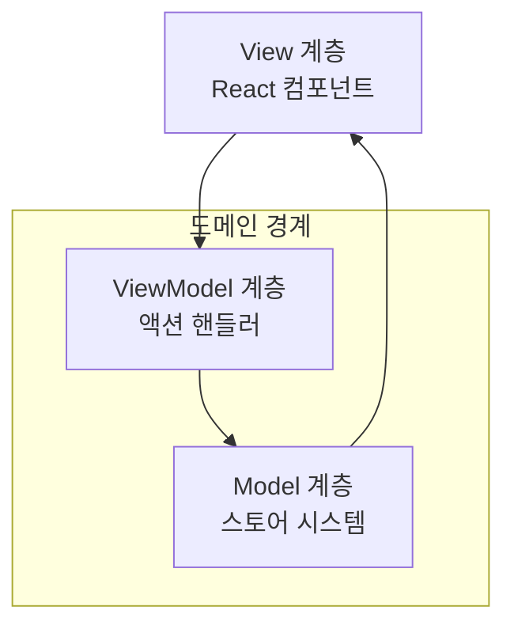

# 설계 철학

Context-Action 프레임워크는 모든 아키텍처 결정과 구현 패턴을 안내하는 기본 원칙들을 기반으로 구축되었습니다. 이러한 원칙을 이해하는 것은 효과적인 사용을 위해 필수적입니다.

## 핵심 철학

**"타입 안전한 도메인 격리를 통한 증거 기반 아키텍처"**

프레임워크는 MVVM에서 영감을 받은 패턴을 통해 깔끔한 관심사 분리를 구현합니다:

- **액션**이 비즈니스 로직 처리 (ViewModel 계층)
- **컨텍스트 스토어 패턴**이 도메인 격리와 함께 상태 관리 (Model 계층)  
- **컴포넌트**가 UI 렌더링 (View 계층)
- **컨텍스트 경계**가 기능 도메인 격리
- 도메인별 훅을 통한 **타입 안전 통합**

## 기본 원칙

### 1. 도메인 격리 우선

각 기능 도메인은 컨텍스트 경계를 통해 완전한 독립성을 유지합니다:

```typescript
// 각 도메인이 고유한 격리된 컨텍스트를 가짐
const UserDomain = createContextStorePattern('User');
const CartDomain = createContextStorePattern('Cart');
const OrderDomain = createContextStorePattern('Order');
```

**장점:**
- 도메인 간 우발적인 상태 결합 방지
- 팀이 다른 도메인에서 독립적으로 작업 가능
- 쉬운 테스팅과 디버깅
- 대규모 애플리케이션을 위한 확장 가능한 아키텍처

### 2. 모든 계층에서 타입 안전성

완전한 TypeScript 통합으로 컴파일 시 안전성 보장:

```typescript
// 도메인별 인터페이스
interface UserData {
  profile: { id: string; name: string; email: string };
  preferences: { theme: 'light' | 'dark' };
}

interface UserActions {
  updateProfile: { data: Partial<UserData['profile']> };
  toggleTheme: void;
}

// 타입 안전한 훅 자동 추론
const profileStore = useUserStore('profile'); // Store<UserData['profile']>로 타입됨
const dispatch = useUserAction(); // UserActions에 대한 타입 안전 디스패치
```

### 3. 선언적 액션 파이프라인

비즈니스 로직은 선언적 파이프라인 시스템을 통해 흐릅니다:

```typescript
// 어떻게가 아닌 무엇을 선언
dispatch('updateProfile', { data: { name: '새 이름' } });

// 프레임워크가 "어떻게"를 처리:
// 1. 액션 검증
// 2. 우선순위별 핸들러 실행
// 3. 스토어 업데이트
// 4. 컴포넌트 리렌더링
```

### 4. 반응형 상태 관리

컴포넌트가 관련 상태 변경에 자동으로 반응:

```typescript
function UserProfile() {
  const profile = useStoreValue(useUserStore('profile'));
  // ↑ 프로필이 변경될 때만 컴포넌트가 리렌더링됨
  
  return <div>환영합니다, {profile.name}님!</div>;
}
```

## 아키텍처 패턴

### MVVM에서 영감받은 분리



### 컨텍스트 스토어 패턴

도메인 격리를 위한 핵심 패턴:

```typescript
// 1. 도메인 컨텍스트 생성
const UserStores = createContextStorePattern('User');

// 2. 컨텍스트 경계 제공
<UserStores.Provider registryId="user-app">
  <UserComponents />
</UserStores.Provider>

// 3. 경계 내에서 사용
const userStore = UserStores.useStore('profile', initialData);
```

## 설계 결정

### 왜 도메인별 훅인가?

**전통적인 접근법 (제네릭):**
```typescript
const store = useStore('user-profile'); // 타입 정보 없음
const dispatch = useDispatch(); // 액션 타입 안전성 없음
```

**Context-Action 접근법 (도메인별):**
```typescript
const store = useUserStore('profile'); // 완전히 타입됨
const dispatch = useUserAction(); // 타입 안전한 액션
```

**장점:**
- 완전한 TypeScript 추론
- 명확한 도메인 경계
- 리팩토링 안전성
- 더 나은 개발자 경험

### 왜 직접 상태 업데이트 대신 액션 파이프라인인가?

**직접 업데이트 (안티패턴):**
```typescript
// 분산된 비즈니스 로직
function updateUser() {
  setUser(prev => ({ ...prev, name: '새 이름' }));
  logActivity('user_updated');
  validateUser();
  syncToServer();
}
```

**액션 파이프라인 (권장):**
```typescript
// 중앙화되고 테스트 가능한 비즈니스 로직
dispatch('updateUser', { name: '새 이름' });

// 핸들러가 복잡성 관리:
register('updateUser', async (payload, controller) => {
  const userStore = registry.getStore('user');
  // 업데이트, 로그, 검증, 동기화 - 한 곳에서
});
```

**장점:**
- 중앙화된 비즈니스 로직
- 테스트 가능한 핸들러
- 일관된 오류 처리
- 감사 가능한 액션 흐름

## 성능 철학

### 최소한의 리렌더링

변경된 데이터를 사용하는 컴포넌트만 리렌더링:

```typescript
// 컴포넌트 A는 프로필 사용
const profile = useStoreValue(useUserStore('profile'));

// 컴포넌트 B는 환경설정 사용  
const prefs = useStoreValue(useUserStore('preferences'));

// 프로필 업데이트해도 컴포넌트 B는 리렌더링되지 않음
dispatch('updateProfile', { name: '새 이름' });
```

### 핸들러에서 지연 평가

지연 스토어 접근으로 오래된 클로저 방지:

```typescript
const handler = async (payload, controller) => {
  // ❌ 오래됨: 등록 시점에 캡처됨
  const oldValue = profileStore.getValue();
  
  // ✅ 최신: 실행 시점에 평가됨
  const currentValue = registry.getStore('profile').getValue();
};
```

## 개발자 경험 우선순위

### 1. 형식 없는 타입 안전성

```typescript
// 자동 추론, 수동 타이핑 불필요
const store = useUserStore('profile'); // Store<UserProfile>
const profile = useStoreValue(store); // UserProfile
```

### 2. 직관적인 API 설계

```typescript
// 자연스럽고 React같은 패턴
const dispatch = useUserAction();
dispatch('updateProfile', { name: '새 이름' });
```

### 3. 명확한 오류 메시지

```typescript
// 컴파일 시 오류가 올바른 사용법을 안내
dispatch('invalidAction', { data: 'wrong' }); 
// TS 오류: 'invalidAction'은 UserActions에 존재하지 않습니다
```

### 4. 유연한 통합

```typescript
// 기존 React 패턴과 함께 작동
function useUserProfile() {
  const profileStore = useUserStore('profile');
  const profile = useStoreValue(profileStore);
  const dispatch = useUserAction();
  
  // 다른 훅과 자연스럽게 조합
  const memoizedData = useMemo(() => 
    processProfile(profile), [profile]
  );
  
  return { profile, memoizedData, dispatch };
}
```

## 아키텍처 장점

### 확장성

- **수평적:** 기존 도메인에 영향을 주지 않고 새 도메인 추가
- **수직적:** 도메인 간 오염 없이 도메인 내 기능 추가
- **팀:** 여러 팀이 다른 도메인에서 독립적으로 작업 가능

### 유지보수성

- **명확한 경계:** 도메인 격리가 예기치 않은 의존성 방지
- **테스트 가능성:** 핸들러의 비즈니스 로직을 쉽게 단위 테스트
- **디버그 가능성:** 액션 흐름이 감사 가능하고 추적 가능

### 성능

- **선택적 리렌더링:** 영향받은 컴포넌트만 업데이트
- **지연 로딩:** 도메인을 요청 시 로드 가능
- **메모리 효율성:** 컨텍스트 경계가 메모리 누수 방지

---

## 요약

Context-Action 프레임워크의 철학은 **반응형 상태 관리**와 함께 **타입 안전한 도메인 격리**를 중심으로 합니다. MVVM에서 영감받은 패턴과 선언적 액션 파이프라인을 따르면 애플리케이션이 더 유지보수하기 쉽고, 테스트하기 쉽고, 확장 가능해집니다.

프레임워크는 자동 타입 추론, 직관적인 API, 그리고 올바른 사용 패턴을 안내하는 명확한 아키텍처 경계를 통해 개발자 경험을 우선시합니다.

---

::: tip 다음 단계
이제 철학을 이해했으니, [핵심 개념](./concepts)을 탐색하여 이러한 원칙이 실용적인 구현 패턴으로 어떻게 변환되는지 확인해보세요.
:::