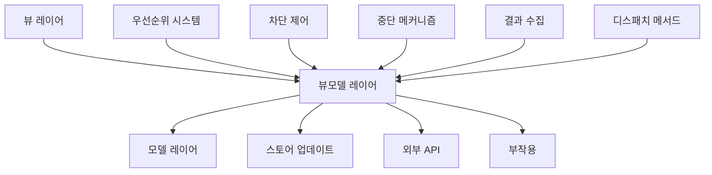

# 파이프라인 시스템

정교한 비즈니스 로직 오케스트레이션을 위한 고급 액션 파이프라인 기능.

## 개요

액션 파이프라인 시스템은 우선순위 기반 핸들러 실행, 차단 작업, 중단 메커니즘 및 포괄적인 결과 수집을 통해 복잡한 비즈니스 로직 플로우를 관리하기 위한 고급 제어 메커니즘을 제공합니다.

## 핵심 기능

### 🏆 우선순위 기반 실행
핸들러는 우선순위 순서대로 실행되어(높은 순서 먼저) 중요한 작업이 선택적 작업보다 먼저 실행되도록 합니다.

```typescript
actionRegister.register('authenticate', validateInput, { priority: 100 });   // 1번째
actionRegister.register('authenticate', checkSecurity, { priority: 90 });    // 2번째  
actionRegister.register('authenticate', performAuth, { priority: 80 });      // 3번째
actionRegister.register('authenticate', logAudit, { priority: 30 });         // 4번째
```

### 🚧 차단 작업
차단 및 비차단 핸들러로 실행 플로우를 제어합니다.

```typescript
// 차단: 완료를 기다림
actionRegister.register('process', criticalHandler, { blocking: true });

// 비차단: 즉시 계속
actionRegister.register('process', analyticsHandler, { blocking: false });
```

### 🛑 중단 메커니즘
조건이 충족되지 않을 때 파이프라인 실행을 중지합니다.

```typescript
actionRegister.register('validate', (payload, controller) => {
  if (!isValid(payload)) {
    controller.abort('검증 실패');
    return;
  }
  // 파이프라인 계속
});
```

### 📊 결과 수집
핸들러 간 결과를 수집하고 조정합니다.

```typescript
// 중간 결과 설정
controller.setResult({ step: 'validation', valid: true });

// 이전 결과 접근
const results = controller.getResults();
const validationResult = results.find(r => r.step === 'validation');
```

## 파이프라인 기능

| 기능 | 목적 | 문서 |
|------|------|------|
| **[우선순위 시스템](./priority.md)** | 실행 순서 제어 | 우선순위 기반 핸들러 실행 |
| **[차단 작업](./blocking.md)** | 실행 플로우 제어 | 차단 vs 비차단 핸들러 |
| **[디스패치 메서드](./dispatch.md)** | 파이프라인 트리거 | 기본 디스패치 vs 결과 수집 |
| **[중단 메커니즘](./abort.md)** | 실행 중지 | 우아한 파이프라인 종료 |
| **[결과 처리](./result-handling.md)** | 결과 수집 | 핸들러 간 통신 |

## 빠른 시작

### 1. 기본 파이프라인 설정

```typescript
import { ActionRegister, type ActionPayloadMap } from '@context-action/core';

interface AppActions extends ActionPayloadMap {
  processUser: { userId: string; action: string };
}

const appRegister = new ActionRegister<AppActions>();
```

### 2. 기능이 있는 핸들러 등록

```typescript
// 차단이 있는 높은 우선순위 검증
appRegister.register('processUser', (payload, controller) => {
  if (!payload.userId) {
    controller.abort('사용자 ID 필수');
    return;
  }
  
  controller.setResult({ step: 'validation', valid: true });
  return { step: 'user-validation', success: true };
}, { 
  priority: 100,    // 높은 우선순위
  blocking: true,   // 완료를 기다림
  id: 'validator'   // 고유 식별자
});

// 차단이 있는 중간 우선순위 처리
appRegister.register('processUser', async (payload, controller) => {
  const results = controller.getResults();
  const isValid = results.find(r => r.step === 'validation')?.valid;
  
  if (!isValid) {
    controller.abort('유효하지 않은 사용자를 처리할 수 없습니다');
    return;
  }
  
  const processed = await processUserData(payload.userId, payload.action);
  
  controller.setResult({ 
    step: 'processing', 
    userId: payload.userId,
    processedAt: Date.now()
  });
  
  return { step: 'user-processing', result: processed };
}, { 
  priority: 80,
  blocking: true,
  id: 'processor'
});

// 차단 없는 낮은 우선순위 분석
appRegister.register('processUser', (payload, controller) => {
  const results = controller.getResults();
  
  // 백그라운드에서 분석 추적
  analytics.track('user_processed', {
    userId: payload.userId,
    action: payload.action,
    steps: results.map(r => r.step)
  });
  
  return { step: 'analytics', tracked: true };
}, { 
  priority: 30,
  blocking: false,  // 분석을 기다리지 않음
  id: 'analytics'
});
```

### 3. 파이프라인 실행

```typescript
// 기본 실행
await appRegister.dispatch('processUser', {
  userId: '123',
  action: 'profile-update'
});

// 결과 수집과 함께 실행
const result = await appRegister.dispatchWithResult('processUser', 
  { userId: '123', action: 'profile-update' },
  { result: { collect: true } }
);

if (result.success) {
  console.log('파이프라인 완료:', result.results);
} else if (result.aborted) {
  console.log('파이프라인 중단:', result.abortReason);
}
```

## 실제 파이프라인 예제

### 전자상거래 주문 처리

```typescript
interface OrderActions extends ActionPayloadMap {
  placeOrder: { 
    items: OrderItem[]; 
    userId: string; 
    paymentMethod: string;
  };
}

const orderRegister = new ActionRegister<OrderActions>();

// 단계 1: 입력 검증 (우선순위 100, 차단)
orderRegister.register('placeOrder', (payload, controller) => {
  if (!payload.items?.length) {
    controller.abort('주문에는 상품이 포함되어야 합니다');
    return;
  }
  
  if (!payload.userId) {
    controller.abort('사용자 ID 필수');
    return;
  }
  
  controller.setResult({ step: 'validation', itemCount: payload.items.length });
  return { step: 'input-validation', success: true };
}, { priority: 100, blocking: true, id: 'input-validator' });

// 단계 2: 재고 확인 (우선순위 90, 차단)
orderRegister.register('placeOrder', async (payload, controller) => {
  const inventoryChecks = await Promise.all(
    payload.items.map(item => checkInventory(item.productId, item.quantity))
  );
  
  const insufficientItems = inventoryChecks
    .filter(check => !check.available)
    .map(check => check.productId);
  
  if (insufficientItems.length > 0) {
    controller.abort('재고 부족', { insufficientItems });
    return;
  }
  
  controller.setResult({ 
    step: 'inventory', 
    allAvailable: true,
    checkedItems: inventoryChecks.length
  });
  
  return { step: 'inventory-check', success: true };
}, { priority: 90, blocking: true, id: 'inventory-checker' });

// 단계 3: 결제 처리 (우선순위 80, 차단)
orderRegister.register('placeOrder', async (payload, controller) => {
  const total = calculateOrderTotal(payload.items);
  
  const payment = await processPayment({
    userId: payload.userId,
    amount: total,
    method: payload.paymentMethod
  });
  
  if (!payment.success) {
    controller.abort('결제 실패', { reason: payment.error });
    return;
  }
  
  controller.setResult({ 
    step: 'payment', 
    transactionId: payment.transactionId,
    amount: total
  });
  
  return { 
    step: 'payment-processing', 
    success: true, 
    transactionId: payment.transactionId 
  };
}, { priority: 80, blocking: true, id: 'payment-processor' });

// 단계 4: 주문 생성 (우선순위 70, 차단)
orderRegister.register('placeOrder', async (payload, controller) => {
  const results = controller.getResults();
  const paymentResult = results.find(r => r.step === 'payment');
  
  const order = await createOrder({
    userId: payload.userId,
    items: payload.items,
    transactionId: paymentResult.transactionId,
    total: paymentResult.amount
  });
  
  controller.setResult({ 
    step: 'order-creation', 
    orderId: order.id,
    createdAt: order.createdAt
  });
  
  return { 
    step: 'order-created', 
    success: true, 
    orderId: order.id 
  };
}, { priority: 70, blocking: true, id: 'order-creator' });

// 단계 5: 재고 업데이트 (우선순위 60, 차단)
orderRegister.register('placeOrder', async (payload, controller) => {
  await Promise.all(
    payload.items.map(item => 
      updateInventory(item.productId, -item.quantity)
    )
  );
  
  return { step: 'inventory-update', success: true };
}, { priority: 60, blocking: true, id: 'inventory-updater' });

// 단계 6: 이메일 알림 (우선순위 40, 비차단)
orderRegister.register('placeOrder', async (payload, controller) => {
  const results = controller.getResults();
  const orderResult = results.find(r => r.step === 'order-creation');
  
  // 백그라운드에서 확인 이메일 발송
  await sendOrderConfirmation({
    userId: payload.userId,
    orderId: orderResult.orderId,
    items: payload.items
  });
  
  return { step: 'email-notification', sent: true };
}, { priority: 40, blocking: false, id: 'email-notifier' });

// 단계 7: 분석 추적 (우선순위 30, 비차단)  
orderRegister.register('placeOrder', (payload, controller) => {
  const results = controller.getResults();
  const orderResult = results.find(r => r.step === 'order-creation');
  const paymentResult = results.find(r => r.step === 'payment');
  
  // 주문 분석 추적
  analytics.track('order_placed', {
    orderId: orderResult.orderId,
    userId: payload.userId,
    itemCount: payload.items.length,
    orderValue: paymentResult.amount,
    paymentMethod: payload.paymentMethod
  });
  
  return { step: 'analytics', tracked: true };
}, { priority: 30, blocking: false, id: 'analytics-tracker' });

// 완전한 주문 파이프라인 실행
const result = await orderRegister.dispatchWithResult('placeOrder', {
  items: [{ productId: 'prod-1', quantity: 2 }],
  userId: 'user-123',
  paymentMethod: 'credit-card'
}, { result: { collect: true } });

// 파이프라인 실행 순서: validation → inventory → payment → order → inventory-update
// 이메일과 분석은 백그라운드에서 실행
```

## 기본 액션에서 마이그레이션

### 이전: 단순 액션 핸들러

```typescript
// 기본 액션 처리
const handleUserUpdate = async (userData: UserData) => {
  await validateUser(userData);
  await updateDatabase(userData);
  await sendNotification(userData.id);
  await trackAnalytics('user_updated', userData);
};
```

### 이후: 파이프라인 기반 액션

```typescript
// 파이프라인 기반 액션 처리
interface UserActions extends ActionPayloadMap {
  updateUser: UserData;
}

const userRegister = new ActionRegister<UserActions>();

// 검증 (우선순위 100, 차단)
userRegister.register('updateUser', async (payload, controller) => {
  const validation = await validateUser(payload);
  if (!validation.valid) {
    controller.abort('사용자 검증 실패', validation.errors);
    return;
  }
  return { step: 'validation', success: true };
}, { priority: 100, blocking: true });

// 데이터베이스 업데이트 (우선순위 80, 차단)  
userRegister.register('updateUser', async (payload) => {
  const result = await updateDatabase(payload);
  return { step: 'database', success: true, userId: result.id };
}, { priority: 80, blocking: true });

// 알림 (우선순위 40, 비차단)
userRegister.register('updateUser', async (payload) => {
  await sendNotification(payload.id);
  return { step: 'notification', sent: true };
}, { priority: 40, blocking: false });

// 분석 (우선순위 30, 비차단)
userRegister.register('updateUser', (payload) => {
  trackAnalytics('user_updated', payload);
  return { step: 'analytics', tracked: true };
}, { priority: 30, blocking: false });

// 파이프라인 실행
await userRegister.dispatch('updateUser', userData);
```

## 아키텍처 통합

### MVVM 레이어 통합



### 스토어 패턴과의 통합

파이프라인 기능은 스토어 통합과 원활하게 작동합니다:

```typescript
// 파이프라인이 결과를 기반으로 스토어 업데이트
actionRegister.register('updateUserData', async (payload, controller) => {
  // 현재 스토어 상태 가져오기
  const currentUser = userStore.getValue();
  
  // 업데이트 검증
  const validation = validateUserUpdate(currentUser, payload.updates);
  if (!validation.valid) {
    controller.abort('업데이트 검증 실패');
    return;
  }
  
  // 업데이트 적용
  const updatedUser = { ...currentUser, ...payload.updates };
  userStore.setValue(updatedUser);
  
  controller.setResult({ 
    step: 'store-update', 
    previousValue: currentUser,
    newValue: updatedUser
  });
  
  return { step: 'user-update', success: true };
}, { priority: 80, blocking: true });
```

## 모범 사례 요약

### 1. 우선순위 가이드라인
- **90-100**: 중요한 검증, 보안, 입력 확인
- **70-89**: 비즈니스 로직, 데이터 처리, 핵심 작업  
- **50-69**: 상태 업데이트, 외부 API 호출
- **30-49**: 알림, 보조 작업
- **10-29**: 분석, 로깅, 정리

### 2. 차단 가이드라인
- **차단 사용**: 후속 핸들러에 영향을 주는 작업
- **비차단 사용**: 분석, 로깅, 선택적 개선

### 3. 중단 가이드라인
- **중단 사용**: 비즈니스 규칙 위반, 검증 실패
- **throw 사용**: 예상치 못한 시스템 오류

### 4. 결과 가이드라인
- 일관된 결과 구조 사용
- 의미 있는 단계 이름과 타이밍 포함
- 핸들러 조정을 위한 결과 활용

## 고급 패턴

특정 파이프라인 패턴 탐색:

- **[우선순위 시스템](./priority.md)** - 우선순위 기반 실행 순서와 모범 사례
- **[차단 작업](./blocking.md)** - 실행 플로우 제어와 성능
- **[디스패치 메서드](./dispatch.md)** - 파이프라인을 트리거하는 다양한 방법  
- **[중단 메커니즘](./abort.md)** - 우아한 파이프라인 종료
- **[결과 처리](./result-handling.md)** - 포괄적인 결과 수집과 사용

## 예제 앱에서의 실제 예제

[Context-Action 예제 앱](https://mineclover.github.io/context-action/example/)은 모든 파이프라인 기능의 실제 구현을 제공합니다:

### 주요 예제
- **[우선순위 성능 데모](https://mineclover.github.io/context-action/example/actionguard/priority-performance)** - 성능 추적과 함께하는 우선순위 기반 실행
- **[API 차단 데모](https://mineclover.github.io/context-action/example/actionguard/api-blocking)** - 차단/비차단 패턴을 사용한 속도 제한
- **[향상된 중단 가능한 검색](https://mineclover.github.io/context-action/example/examples/enhanced-search)** - 검색 취소와 자동 정리
- **[UseActionWithResult 데모](https://mineclover.github.io/context-action/example/react/useActionWithResult)** - 포괄적인 결과 처리가 있는 순차 워크플로우

이러한 예제는 일반적인 파이프라인 시나리오를 위한 프로덕션 준비 패턴을 보여줍니다.

## 관련 문서

- **[액션 패턴](../patterns/action/)** - 액션 전용 패턴 구현
- **[스토어 통합](../patterns/store/)** - 파이프라인과 상태 관리 결합
- **[MVVM 아키텍처](../patterns/architecture/mvvm.md)** - MVVM 패턴에서의 파이프라인 역할
- **[훅 라이프사이클](../lifecycle/)** - 훅이 파이프라인 시스템에 연결되는 방법