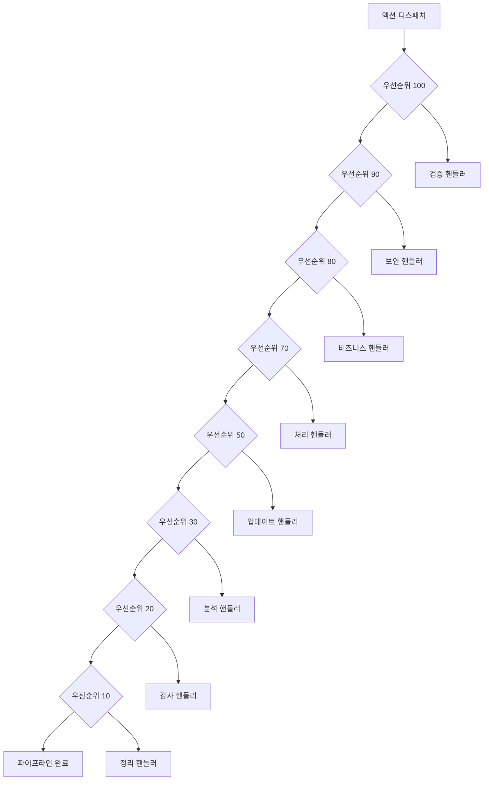

# 우선순위 기반 핸들러 실행

적절한 비즈니스 로직 플로우를 위해 핸들러가 올바른 순서로 실행되도록 하는 우선순위 기반 실행.

## 기본 우선순위 시스템

### 우선순위 레벨

핸들러는 **내림차순 우선순위 순서**로 실행됩니다 (높은 숫자 먼저):

```typescript
actionRegister.register('authenticate', validateInput, { priority: 100 });  // 1번째 실행
actionRegister.register('authenticate', checkRateLimit, { priority: 90 });  // 2번째 실행  
actionRegister.register('authenticate', performAuth, { priority: 80 });     // 3번째 실행
actionRegister.register('authenticate', logAudit, { priority: 70 });        // 4번째 실행
```

### 기본 우선순위

우선순위를 지정하지 않으면 핸들러는 기본적으로 우선순위 `50`을 가집니다:

```typescript
// 이 핸들러들은 우선순위 50을 가지며 등록 순서대로 실행됩니다
actionRegister.register('processData', handlerA);
actionRegister.register('processData', handlerB);
actionRegister.register('processData', handlerC);
```

## 우선순위 카테고리

### 높은 우선순위 (90-100): 시스템 중요
- 입력 검증
- 보안 검사
- 속도 제한
- 인증

```typescript
// 중요한 검사가 먼저 오는 인증 파이프라인
actionRegister.register('authenticate', validateCredentials, { priority: 100 });
actionRegister.register('authenticate', checkSecurityPolicy, { priority: 95 });
actionRegister.register('authenticate', rateLimitCheck, { priority: 90 });
```

### 중간 우선순위 (50-89): 비즈니스 로직
- 데이터 처리
- 비즈니스 규칙 검증
- 외부 API 호출
- 상태 업데이트

```typescript
// 비즈니스 로직을 사용한 데이터 처리
actionRegister.register('processOrder', validateBusinessRules, { priority: 80 });
actionRegister.register('processOrder', calculatePricing, { priority: 70 });
actionRegister.register('processOrder', updateInventory, { priority: 60 });
actionRegister.register('processOrder', sendConfirmation, { priority: 50 });
```

### 낮은 우선순위 (10-49): 로깅 및 분석
- 감사 로깅
- 분석 추적
- 성능 모니터링
- 정리 작업

```typescript
// 로깅과 분석은 마지막에
actionRegister.register('userAction', processAction, { priority: 80 });
actionRegister.register('userAction', trackAnalytics, { priority: 30 });
actionRegister.register('userAction', auditLog, { priority: 20 });
actionRegister.register('userAction', cleanup, { priority: 10 });
```

## 우선순위 실행 예제

### 예제 1: 인증 플로우

```typescript
interface AuthActions extends ActionPayloadMap {
  login: { username: string; password: string };
}

const authRegister = new ActionRegister<AuthActions>();

// 우선순위 100: 중요한 검증
authRegister.register('login', (payload, controller) => {
  if (!payload.username || !payload.password) {
    controller.abort('인증 정보 누락');
    return;
  }
  
  controller.setResult({ step: 'validation', valid: true });
  return { step: 'input-validation', success: true };
}, { priority: 100, id: 'input-validator' });

// 우선순위 90: 보안 검사
authRegister.register('login', async (payload, controller) => {
  const isSuspicious = await checkSuspiciousActivity(payload.username);
  
  if (isSuspicious) {
    controller.abort('의심스러운 활동 감지');
    return;
  }
  
  controller.setResult({ step: 'security', cleared: true });
  return { step: 'security-check', success: true };
}, { priority: 90, id: 'security-checker' });

// 우선순위 80: 속도 제한
authRegister.register('login', (payload, controller) => {
  const rateLimiter = getRateLimiter(payload.username);
  
  if (!rateLimiter.isAllowed()) {
    controller.abort('속도 제한 초과');
    return;
  }
  
  rateLimiter.consume();
  controller.setResult({ step: 'rate-limit', consumed: true });
  return { step: 'rate-limiting', success: true };
}, { priority: 80, id: 'rate-limiter' });

// 우선순위 70: 인증
authRegister.register('login', async (payload) => {
  const user = await authenticateUser(payload.username, payload.password);
  const token = generateJWT(user);
  
  return { 
    step: 'authentication', 
    success: true,
    user: { id: user.id, username: user.username },
    token 
  };
}, { priority: 70, id: 'authenticator' });

// 우선순위 30: 분석 (낮은 우선순위)
authRegister.register('login', (payload) => {
  analytics.track('login_attempt', {
    username: payload.username,
    timestamp: Date.now()
  });
  
  return { step: 'analytics', tracked: true };
}, { priority: 30, id: 'analytics-tracker' });

// 우선순위 10: 감사 로깅 (가장 낮은 우선순위)
authRegister.register('login', (payload, controller) => {
  const results = controller.getResults();
  const authResult = results.find(r => r.step === 'authentication');
  
  auditLogger.log({
    action: 'login',
    username: payload.username,
    success: authResult?.success || false,
    timestamp: Date.now()
  });
  
  return { step: 'audit', logged: true };
}, { priority: 10, id: 'audit-logger' });
```

### 예제 2: 데이터 처리 파이프라인

```typescript
interface DataActions extends ActionPayloadMap {
  processData: { data: any; options?: ProcessingOptions };
}

const dataRegister = new ActionRegister<DataActions>();

// 우선순위 100: 입력 살균
dataRegister.register('processData', (payload, controller) => {
  const sanitized = sanitizeInput(payload.data);
  
  controller.modifyPayload(current => ({
    ...current,
    data: sanitized,
    sanitized: true
  }));
  
  return { step: 'sanitization', success: true };
}, { priority: 100, id: 'sanitizer' });

// 우선순위 90: 스키마 검증
dataRegister.register('processData', (payload, controller) => {
  const isValid = validateSchema(payload.data);
  
  if (!isValid) {
    controller.abort('스키마 검증 실패');
    return;
  }
  
  controller.setResult({ step: 'validation', schema: 'valid' });
  return { step: 'schema-validation', success: true };
}, { priority: 90, id: 'schema-validator' });

// 우선순위 80: 비즈니스 규칙
dataRegister.register('processData', (payload, controller) => {
  const violations = checkBusinessRules(payload.data);
  
  if (violations.length > 0) {
    controller.abort(`비즈니스 규칙 위반: ${violations.join(', ')}`);
    return;
  }
  
  return { step: 'business-validation', success: true };
}, { priority: 80, id: 'business-validator' });

// 우선순위 70: 데이터 변환
dataRegister.register('processData', (payload) => {
  const transformed = transformData(payload.data, payload.options);
  
  return { 
    step: 'transformation', 
    success: true,
    data: transformed,
    originalSize: JSON.stringify(payload.data).length,
    transformedSize: JSON.stringify(transformed).length
  };
}, { priority: 70, id: 'transformer' });

// 우선순위 60: 데이터베이스 저장
dataRegister.register('processData', async (payload, controller) => {
  const results = controller.getResults();
  const transformed = results.find(r => r.step === 'transformation')?.data;
  
  const savedId = await database.save(transformed);
  
  return { 
    step: 'persistence', 
    success: true,
    id: savedId,
    timestamp: Date.now()
  };
}, { priority: 60, id: 'persister' });

// 우선순위 20: 성능 모니터링
dataRegister.register('processData', (payload, controller) => {
  const results = controller.getResults();
  const duration = Date.now() - (results[0]?.timestamp || Date.now());
  
  performanceMonitor.track('data_processing', {
    duration,
    dataSize: JSON.stringify(payload.data).length,
    handlersExecuted: results.length
  });
  
  return { step: 'monitoring', tracked: true, duration };
}, { priority: 20, id: 'monitor' });
```

## 우선순위 모범 사례

### 1. 표준 우선순위 범위 사용

```typescript
// 시스템 중요: 90-100
const PRIORITY_CRITICAL = 100;
const PRIORITY_SECURITY = 95;
const PRIORITY_VALIDATION = 90;

// 비즈니스 로직: 50-89
const PRIORITY_BUSINESS_HIGH = 80;
const PRIORITY_BUSINESS_MEDIUM = 70;
const PRIORITY_BUSINESS_LOW = 60;
const PRIORITY_PROCESSING = 50;

// 모니터링/로깅: 10-49
const PRIORITY_ANALYTICS = 30;
const PRIORITY_AUDIT = 20;
const PRIORITY_CLEANUP = 10;
```

### 2. 관련 핸들러 그룹화

```typescript
// 인증 그룹 (90-100)
authRegister.register('login', inputValidator, { priority: 100 });
authRegister.register('login', securityChecker, { priority: 95 });
authRegister.register('login', rateLimiter, { priority: 90 });

// 비즈니스 로직 그룹 (70-80)  
authRegister.register('login', authenticator, { priority: 80 });
authRegister.register('login', sessionManager, { priority: 70 });

// 모니터링 그룹 (10-30)
authRegister.register('login', analyticsTracker, { priority: 30 });
authRegister.register('login', auditLogger, { priority: 20 });
```

### 3. 우선순위 간격 유지

```typescript
// ✅ 좋음 - 기존 핸들러 사이에 핸들러를 삽입할 수 있음
actionRegister.register('process', handlerA, { priority: 100 });
actionRegister.register('process', handlerB, { priority: 80 });  // 20의 간격
actionRegister.register('process', handlerC, { priority: 60 });  // 20의 간격

// ❌ 피해야 할 것 - 새 핸들러를 위한 공간이 없음
actionRegister.register('process', handlerA, { priority: 100 });
actionRegister.register('process', handlerB, { priority: 99 });  // 너무 가까움
actionRegister.register('process', handlerC, { priority: 98 });  // 너무 가까움
```

### 4. 우선순위 근거 문서화

```typescript
// 주석에 명확한 우선순위 근거
actionRegister.register('uploadFile', validateFile, { 
  priority: 100,  // 모든 처리 전에 검증해야 함
  id: 'file-validator' 
});

actionRegister.register('uploadFile', scanVirus, { 
  priority: 95,   // 검증 후 보안 스캔
  id: 'virus-scanner' 
});

actionRegister.register('uploadFile', processFile, { 
  priority: 80,   // 보안 허가 후에만 처리
  id: 'file-processor' 
});
```

## 우선순위 시각화



## 실제 예제: 우선순위 성능 데모

[우선순위 성능 데모](https://mineclover.github.io/context-action/example/actionguard/priority-performance)에서 우선순위 기반 실행의 실제 구현을 확인하세요:

```typescript
// 높은 우선순위 검증 (100) - 높은 숫자 = 높은 우선순위
useActionHandler('executeHighPriority', handler, { priority: 100 });

// 중간 우선순위 비즈니스 로직 (80)
useActionHandler('executeMediumPriority', handler, { priority: 80 });

// 낮은 우선순위 분석 (30)
useActionHandler('executeLowPriority', handler, { priority: 30 });
```

이 예제는 우선순위가 실제 시나리오에서 실행 순서에 어떻게 영향을 주는지 보여주는 타이밍 측정과 함께 성능 추적을 보여줍니다.

## 관련 문서

- **[차단 작업](./blocking.md)** - 차단으로 실행 플로우 제어
- **[중단 메커니즘](./abort.md)** - 필요시 파이프라인 실행 중지
- **[결과 처리](./result-handling.md)** - 핸들러 결과 수집과 사용
- **[디스패치 메서드](./dispatch.md)** - 파이프라인을 트리거하는 다양한 방법