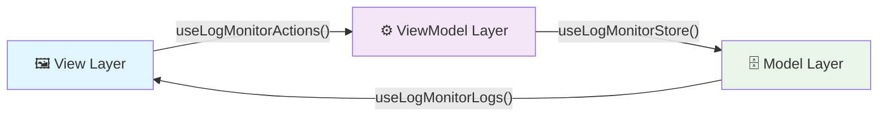

# LogMonitor MVVM Architecture Implementation

LogMonitor 컴포넌트에 MVVM(Model-View-ViewModel) 아키텍처 패턴을 적용한 구현 가이드입니다.

## 🏗️ Architecture Overview

LogMonitor는 Context-Action 프레임워크의 세 가지 핵심 패턴을 사용하여 완벽한 레이어 분리를 구현합니다:

- **Model Layer**: Store Only Pattern (반응형 상태 관리)
- **ViewModel Layer**: Action Only Pattern (비즈니스 로직 및 조정)
- **View Layer**: Pure React components (UI 표현)

## 📁 File Structure

```
src/components/LogMonitor/
├── context.tsx          # MVVM 컨텍스트 및 프로바이더
├── hooks.tsx           # 액션 로거 훅들
├── LogMonitor.tsx      # View Layer 컴포넌트
├── store-registry.ts   # 스토어 레지스트리 (레거시)
├── types.ts            # 타입 정의
├── utils.ts            # 유틸리티 함수들
├── index.ts            # 메인 export
└── MVVM_ARCHITECTURE.md # 이 문서
```

## 🗄️ Model Layer (Store Only Pattern)

### Store Context 생성

```typescript
// context.tsx
const {
  Provider: LogMonitorStoreProvider,
  useStore: useLogMonitorStore,
  useStoreManager: useLogMonitorStoreManager
} = createStoreContext<LogMonitorStores>('LogMonitor', {
  logs: { initialValue: [] as Array<LogEntry> },
  logLevel: { initialValue: LogLevel.DEBUG },
  config: { 
    initialValue: {
      maxLogs: 50,
      defaultLogLevel: LogLevel.DEBUG,
      enableToast: true,
      enableAutoCleanup: true,
    } as LogMonitorConfig 
  }
});
```

### 데이터 구독 훅들

```typescript
// Model Layer - 데이터 구독 훅들
export function useLogMonitorLogs() {
  const logsStore = useLogMonitorStore('logs');
  const logs = useStoreValue(logsStore);
  
  return {
    logs,
    logCount: logs.length,
    hasLogs: logs.length > 0,
    latestLog: logs[logs.length - 1],
    getLogsByLevel: (level: LogLevel) => logs.filter(log => log.level === level)
  };
}

export function useLogMonitorConfig() {
  const logLevelStore = useLogMonitorStore('logLevel');
  const configStore = useLogMonitorStore('config');
  
  const logLevel = useStoreValue(logLevelStore);
  const config = useStoreValue(configStore);
  
  return {
    logLevel,
    config,
    isDebugMode: logLevel === LogLevel.DEBUG,
    isToastEnabled: config.enableToast
  };
}
```

## ⚙️ ViewModel Layer (Action Only Pattern)

### Action Context 생성

```typescript
// context.tsx
const {
  Provider: LogMonitorActionProvider,
  useActionDispatch: useLogMonitorAction,
  useActionHandler: useLogMonitorActionHandler
} = createActionContext<LogMonitorActions>('LogMonitor');
```

### 액션 타입 정의

```typescript
export interface LogMonitorActions extends ActionPayloadMap {
  addLog: { entry: Omit<LogEntry, 'id' | 'timestamp'> };
  clearLogs: void;
  setLogLevel: { level: LogLevel };
  updateConfig: { configUpdate: Partial<LogMonitorConfig> };
  log: { message: string; data?: unknown };
}
```

### 액션 디스패치 훅

```typescript
// ViewModel Layer - 액션 디스패치 훅
export function useLogMonitorActions() {
  const dispatch = useLogMonitorAction();
  
  return {
    addLog: (entry: Omit<LogEntry, 'id' | 'timestamp'>) => dispatch('addLog', { entry }),
    clearLogs: () => dispatch('clearLogs'),
    setLogLevel: (level: LogLevel) => dispatch('setLogLevel', { level }),
    updateConfig: (configUpdate: Partial<LogMonitorConfig>) => dispatch('updateConfig', { configUpdate }),
    log: (message: string, data?: unknown) => dispatch('log', { message, data }),
  };
}
```

### 액션 핸들러들

```typescript
/**
 * ViewModel Layer - 액션 핸들러들
 */
function LogMonitorActionHandlers({ 
  pageId, 
  fallbackConfig 
}: { 
  pageId: string;
  fallbackConfig: LogMonitorConfig;
}) {
  const storeManager = useLogMonitorStoreManager();
  
  // addLog 핸들러 - 로그 추가
  useLogMonitorActionHandler('addLog', React.useCallback(async (payload) => {
    const logEntry = createLogEntry(pageId, payload.entry);
    const logsStore = storeManager.getStore('logs');
    const currentLogs = logsStore.getValue();
    const updatedLogs = maintainMaxLogs(
      currentLogs,
      logEntry,
      fallbackConfig.maxLogs
    );
    logsStore.setValue(updatedLogs);
  }, [pageId, storeManager, fallbackConfig.maxLogs]));

  // clearLogs 핸들러 - 로그 클리어
  useLogMonitorActionHandler('clearLogs', React.useCallback(async () => {
    const logsStore = storeManager.getStore('logs');
    logsStore.setValue([]);
  }, [storeManager]));

  // setLogLevel 핸들러 - 로그 레벨 설정
  useLogMonitorActionHandler('setLogLevel', React.useCallback(async (payload) => {
    const logLevelStore = storeManager.getStore('logLevel');
    logLevelStore.setValue(payload.level);
  }, [storeManager]));

  // updateConfig 핸들러 - 설정 업데이트
  useLogMonitorActionHandler('updateConfig', React.useCallback(async (payload) => {
    const configStore = storeManager.getStore('config');
    const currentConfig = configStore.getValue();
    const newConfig = { ...currentConfig, ...payload.configUpdate };
    configStore.setValue(newConfig);
  }, [storeManager]));

  // log 핸들러 - 시스템 로그
  useLogMonitorActionHandler('log', React.useCallback(async (payload) => {
    const logEntry = createLogEntry(pageId, {
      level: LogLevel.INFO,
      type: 'system',
      message: payload.message,
      details: payload.data,
    });
    const logsStore = storeManager.getStore('logs');
    const currentLogs = logsStore.getValue();
    const updatedLogs = maintainMaxLogs(
      currentLogs,
      logEntry,
      fallbackConfig.maxLogs
    );
    logsStore.setValue(updatedLogs);
  }, [pageId, storeManager, fallbackConfig.maxLogs]));

  return null;
}
```

## 🖼️ View Layer (React Components)

### Provider 구성

```typescript
/**
 * LogMonitor Provider 컴포넌트
 */
export function LogMonitorProvider({
  children,
  pageId,
  initialLogLevel = LogLevel.DEBUG,
  initialConfig = {},
}: LogMonitorProviderProps) {
  const fallbackConfig = useMemo(
    () =>
      ({
        maxLogs: 50,
        defaultLogLevel: initialLogLevel,
        enableToast: true,
        enableAutoCleanup: true,
        ...initialConfig,
      }) as LogMonitorConfig,
    [initialLogLevel, initialConfig]
  );

  return (
    <LogMonitorStoreProvider>
      <LogMonitorActionProvider>
        <LogMonitorActionHandlers 
          pageId={pageId}
          fallbackConfig={fallbackConfig}
        />
        {children}
      </LogMonitorActionProvider>
    </LogMonitorStoreProvider>
  );
}
```

### 사용 예시

```typescript
// 다른 컴포넌트에서 사용
export function useChildACounterActions() {
  const storeManager = useChildAStoreManager();
  const childDispatch = useChildAActionDispatch();
  const parentDispatch = useParentActionDispatch();
  const { addLog } = useLogMonitorActions(); // ViewModel Layer 사용

  const childId = 'child-a-counter';

  const incrementCounterHandler = useCallback(async (payload: { amount: number }, controller: any) => {
    const { amount } = payload;
    const counterStore = storeManager.getStore('counter');
    const currentValue = counterStore.getValue();
    const newValue = currentValue + amount;
    
    counterStore.setValue(newValue);
    
    // 로그 모니터에 직접 데이터 전송
    addLog({
      level: LogLevel.INFO,
      type: 'action',
      message: `ChildA 카운터 증가: ${newValue}`,
      details: {
        counter: newValue,
        action: 'increment',
        amount,
        context: 'Child A Component'
      }
    });
  }, [storeManager, childDispatch, parentDispatch, childId, addLog]);

  // ... 나머지 구현
}
```

## 🔄 Data Flow



## 📦 Export Structure

```typescript
// index.ts
export {
  // 컨텍스트 및 프로바이더
  LogMonitorProvider,
  PageWithLogMonitor,
  useLogMonitorContext,
  
  // MVVM 레이어별 훅들
  useLogMonitorActions,    // ViewModel Layer
  useLogMonitorLogs,       // Model Layer
  useLogMonitorConfig,     // Model Layer
  
  // 기존 호환성 훅들
  useActionLogger,
  useActionLoggerWithToast,
  useLogMonitor,
  
  // 메인 컴포넌트
  LogMonitor,
  
  // 타입 정의
  type LogEntry,
  type LogMonitorConfig,
  // ... 기타 타입들
} from './context';
```

## ✅ Benefits

### 1. 명확한 레이어 분리
- **Model Layer**: 순수한 데이터 관리
- **ViewModel Layer**: 비즈니스 로직 처리
- **View Layer**: UI 표현만 담당

### 2. 컨텍스트 공유
- `createStoreContext`와 `createActionContext`로 생성된 훅을 재사용
- 동일한 컨텍스트 인스턴스를 여러 컴포넌트에서 공유

### 3. 타입 안전성
- 각 레이어별로 명확한 타입 정의
- 컴파일 타임에 타입 오류 감지

### 4. 재사용성
- 각 레이어의 훅들을 독립적으로 사용 가능
- 점진적 마이그레이션 지원

### 5. 성능 최적화
- 필요한 데이터만 구독
- 불필요한 리렌더링 방지

## 🔧 Migration Guide

### 기존 코드에서 MVVM 패턴으로 마이그레이션

#### Before (기존 방식)
```typescript
const { addLog } = useLogMonitorContext();
```

#### After (MVVM 방식)
```typescript
// ViewModel Layer 사용
const { addLog } = useLogMonitorActions();

// Model Layer 사용 (필요시)
const { logs, logCount } = useLogMonitorLogs();
const { logLevel, config } = useLogMonitorConfig();
```

### 점진적 마이그레이션
- 기존 `useLogMonitorContext`는 호환성을 위해 유지
- 새로운 MVVM 훅들로 점진적 전환 가능

## 🚀 Best Practices

### 1. 레이어별 책임 분리
- Model Layer: 데이터 구독만
- ViewModel Layer: 액션 디스패치만
- View Layer: UI 로직만

### 2. 훅 사용 가이드
- 데이터가 필요한 경우: `useLogMonitorLogs()`, `useLogMonitorConfig()`
- 액션을 디스패치해야 하는 경우: `useLogMonitorActions()`
- 전체 컨텍스트가 필요한 경우: `useLogMonitorContext()`

### 3. 성능 최적화
- 필요한 데이터만 구독
- `useCallback`으로 핸들러 메모이제이션
- 불필요한 리렌더링 방지

## 📚 Related Documentation

- [MVVM Architecture Pattern](../../../docs/en/guide/patterns/architecture/mvvm.md)
- [Store Only Pattern](../../../docs/en/guide/patterns/store/basic-usage.md)
- [Action Only Pattern](../../../docs/en/guide/patterns/action/basic-usage.md)
- [Context-Action Framework](../../../docs/en/guide/getting-started.md)
